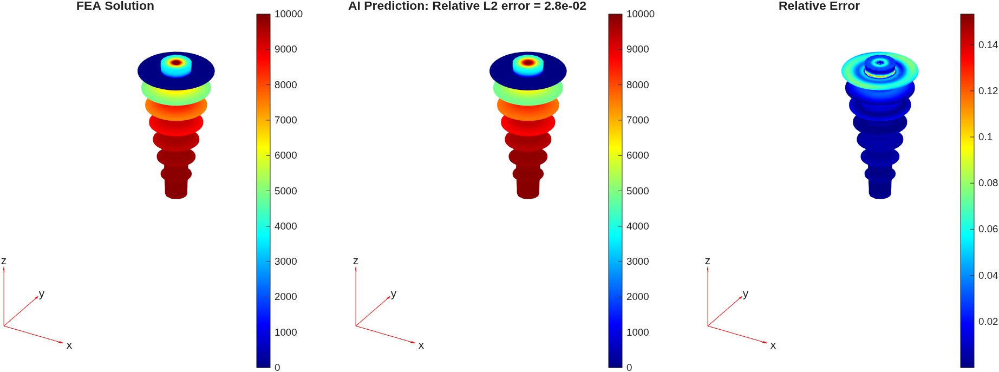
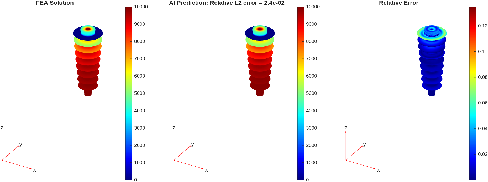
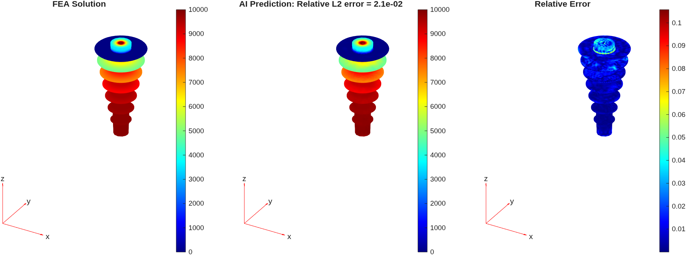
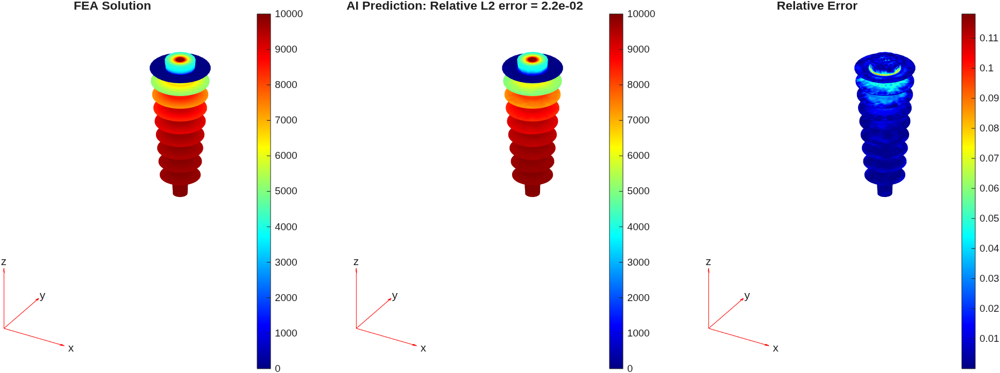

# Rapid Design Exploration with Neural PDE Surrogates

This demo shows how neural partial differential equation (PDE) surrogates can accelerate design exploration for a 3D electrostatics problem. 
The goal is to predict the electric potential field throughout a transformer bushing insulator, 
a cylindrical component with fins that provides electrical insulation between a high-voltage conductor and a grounded enclosure, 
for varying bushing geometries. Two deep learning architectures are trained on finite element analysis (FEA) simulations to learn this mapping directly from geometry, enabling rapid evaluation of new designs without running a full simulation.

## Architectures

Two neural PDE surrogate architectures are demonstrated:

- **Transolver** [\[1\]](README.md#references) — A transformer-based architecture for learning PDE solutions on unstructured meshes. Rather than applying attention across all mesh nodes, Transolver learns to group nodes into a small number of physics slices and applies attention across these slices, reducing the quadratic cost of global attention. Inputs are the 3D coordinates and material properties (relative permittivity) at each mesh node.

- **MeshGraphNet** [\[2\]](README.md#references) — A graph neural network that represents the FEA mesh as a graph (nodes = mesh nodes, edges = element connectivity). Through message-passing layers, the network learns how information propagates through the geometry. Inputs are the 3D coordinates of the mesh nodes within the bushing insulator.

Both architectures output the electric potential at every input node.

## Training Data
The problem setup follows the documentation example [Electrostatic Analysis of Transformer Bushing Insulator](https://www.mathworks.com/help/pde/ug/electrostatic-analysis-of-transformer-bushing-insulator.html). 
Boundary conditions are held fixed; only the transformer bushing insulator geometry varies between samples.

The training dataset consists of 75 electrostatic simulations, each on a different procedurally generated transformer bushing geometry. For each simulation, we extract:
- FEA mesh nodes and element connectivity
- Material properties (relative permittivity at each node)
- Electric potential at each node
- Electric field at each node (for optional gradient regularization)

## Results

Below are example predictions from two trained models on two geometries.

**Transolver** predictions:

**MeshGraphNet** predictions:

# Getting Started

**Setup:**
- Run [startup.m](startup.m) to set the MATLAB path. This also creates the `data/`, `STL/`, and `results/` subdirectories.

**Data generation:**
- Run [generate\_data.m](generate_data.m) to generate the training dataset (~5 minutes with 8 parallel workers). This saves simulation results to `data/` and STL geometry files to `STL/`.

**Training:**
- **Transolver:** Run [transolver\_script.m](transolver_script.m) (includes optional gradient regularization fine-tuning).
- **MeshGraphNet:** Run [meshgraphnet\_script.m](meshgraphnet_script.m).
- Set `doTrain = true` to train from scratch (GPU recommended). The trained model is saved to `results/`.
- Set `doTrain = false` and specify a filename in `loadFile` to load a pretrained model.
- Set `doFinetune = true` to finetune a trained model with gradient regularization. This adds a loss term that penalizes discrepancies between the predicted electric field $-\nabla V$ and the reference FEA electric field, where the spatial gradients are computed via automatic differentiation. This encourages spatially smooth predictions and improves derived electric field accuracy (Transolver only).

**Inference app:**
- Type `NeuralPDEInferenceApp` in the Command Window.
- Click "Load AI Model" and select a model from the `results/` subdirectory.
- Click "Load Geometry" and choose an STL file from the `STL/` folder.
- Click "Predict!" to display the predicted electric potential.
- Toggle the switch to view electric field magnitude, which is numerically derived from the predicted potential.

# Required Products
- MATLAB&reg; (tested on R2026a)
- PDE Toolbox&trade;
- Deep Learning Toolbox&trade;
- Parallel Computing Toolbox&trade;
- Statistics and Machine Learning Toolbox&trade;

# References
1. Wu, Haixu, Huakun Luo, Haowen Wang, Jianmin Wang, and Mingsheng Long. "Transolver: A Fast Transformer Solver for PDEs on General Geometries." arXiv, June 1, 2024. https://arxiv.org/abs/2402.02366. 
2. Pfaff, Tobias, Meire Fortunato, Alvaro Sanchez-Gonzalez, and Peter W. Battaglia. "Learning Mesh-Based Simulation with Graph Networks."  arXiv, June 18, 2021. https://arxiv.org/abs/2010.03409. 
