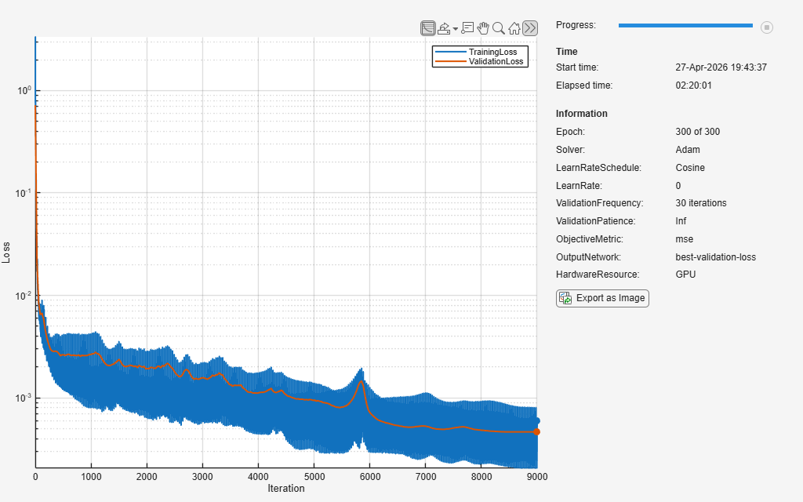
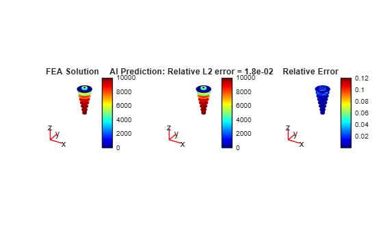
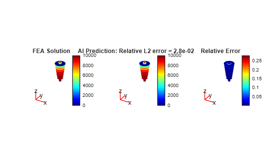
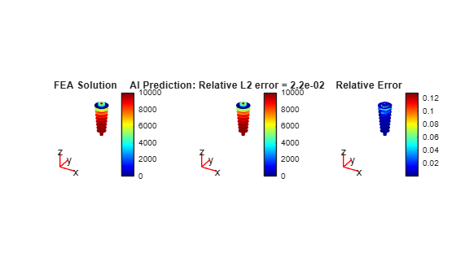
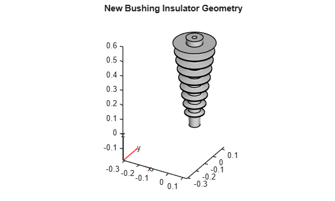
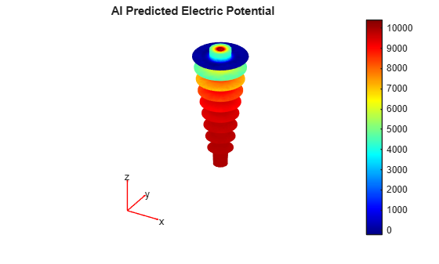
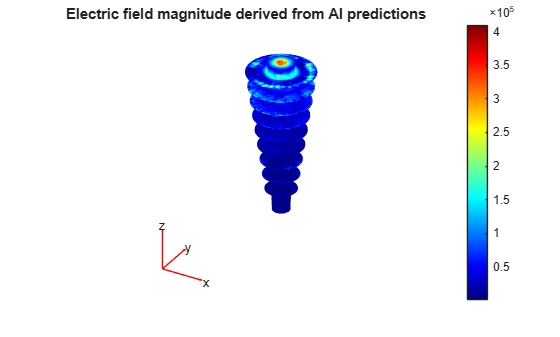

<a id="TMP_909c"></a>

# Rapid Design Exploration for a 3D Electrostatics Problem Using MeshGraphNet

Accurately solving three\-dimensional electrostatic problems is central to the design and analysis of many electrical and electromechanical systems, including transformer bushings, high\-voltage insulation, and power electronics. While finite element analysis (FEA) provides high\-fidelity solutions, repeatedly solving these problems across varying geometries can be computationally expensive, limiting its practicality for rapid design exploration, optimization, and real\-time workflows.

This demo demonstrates how deep learning can be used to enable fast, full\-field solutions of 3D electrostatic partial differential equations (PDEs). Using simulation data generated with MATLAB® PDE Toolbox™, we train a neural network to predict the electric potential field directly from mesh geometry. The geometries vary across samples and are discretized with different node counts, making the problem particularly challenging for conventional neural network architectures that assume fixed grids or inputs.

To address this challenge, we use **MeshGraphNet** \[[1](#M_5694)\], a graph neural network architecture designed for learning PDE solutions on unstructured meshes. MeshGraphNet represents the finite element mesh as a graph, where each mesh node becomes a graph node and edges are defined by the mesh connectivity. In this demo, each node is represented by its 3D coordinates. Through a sequence of message\-passing layers, the network learns how information propagates locally through the geometry, enabling it to approximate the solution of the underlying PDE. The network outputs the electric potential at every node. Unlike Transolver, which models the full simulation domain (bushing and surrounding air) and uses material properties as additional input features, this MeshGraphNet example operates only on the bushing insulator mesh.

We apply MeshGraphNet to a 3D electrostatics problem involving a transformer bushing insulator embedded in air. The trained model is evaluated on unseen geometries, and its predictions are compared against FEA solutions.


<!-- Begin Toc -->

## Table of Contents
&#8195;[Load Data](#TMP_9a6e)
 
&#8195;[Preprocess Data](#TMP_8ec4)
 
&#8195;[Define Network Architecture](#TMP_46f7)
 
&#8195;[Define the Model Loss Function](#TMP_3e8e)
 
&#8195;[Train the Network](#TMP_7502)
 
&#8195;[Test the Network](#TMP_243b)
 
&#8195;[Make Inference on New Design](#TMP_1599)
 
&#8195;[Derive the Electric Field from the Predicted Potential](#TMP_22a0)
 
<!-- End Toc -->

<a id="TMP_4ac9"></a>
**Experiment Settings**

The function [`canUseGPU`](https://www.mathworks.com/help/releases/R2026a/matlab/ref/canusegpu.html) is used here to detect and enable GPU acceleration for training and inference. Set `doTrain` to `true` to train a new model; otherwise, specify the name of a pretrained model to load.  

```matlab
useGpu = canUseGPU; % use GPU if one is available
doTrain = true; % set to 1 if you would like to train the model from scratch, or 0 if you want to load in a pre-trained network
if doTrain
    ts = string(datetime("now",Format="uuuuMMdd'T'HHmmss")); % specify timestamp to uniquely name results file
else
    loadFile = "MeshGraphNet_XXXXXXXXXXXXXXX"; % name of results file (if loading a pretrained model)
end
projectRoot = findProjectRoot("startup.m");
outdir = fullfile(projectRoot,"results");
```

<a id="TMP_9a6e"></a>

# Load Data

Load simulation data generated using PDE Toolbox. The simulation data was generated by varying a parameterized geometry inspired by the one in the documentation example [Electrostatic Analysis of Transformer Bushing Insulator](https://www.mathworks.com/help/pde/ug/electrostatic-analysis-of-transformer-bushing-insulator.html). Data files are expected to be located in the `data/` subdirectory within the parent directory of this script. 

Each file contains a struct with FEA data for that particular observation. The struct includes the following fields:

- `Coord`: 3 x $N$ array of node coordinates in the FEA mesh. Used as model input.
- `Potential`: $N$ x 1 array of electric potential values at each node. Used as training targets.
- `Mesh`: [FEMesh](https://www.mathworks.com/help/pde/ug/pde.femesh.html) object representing the FEA mesh. Used for graph construction and visualization.

Note that $N$ (number of nodes) varies between samples, as each simulation uses a different geometry and therefore mesh. 

```matlab
if doTrain
    datadir = fullfile("data");
    data = io.loadAllData(datadir);
else
    % Skip data loading when loading a pretrained model
end
```

<a id="TMP_8ec4"></a>

# Preprocess Data

Preprocess the finite element data into the graph\-based representation required by MeshGraphNet. 

For each training sample, construct:

- Node features (`Xs`): per\-node input features, based on mesh node coordinates within the transformer bushing insulator
- Edge features (`Xes`): per\-edge features derived from mesh connectivity
- Node targets (`Ys`): ground\-truth field values (e.g. electric potential) at each mesh node
- Adjacency matrices (`As`): node\-to\-node connectivity defining the graph
- Node\-edge adjacency matrices (`Bs`): mappings between nodes and edges

This representation allows MGN to operate directly on the finite element mesh and learn local physical interactions through message passing. 

```matlab
if doTrain
    % Number of training samples
    numObs = numel(data);
    % Preallocate cell arrays for graph data
    Xs = cell(numObs,1);
    Xes = cell(numObs,1);
    Ys = cell(numObs,1);
    As = cell(numObs,1);
    Bs = cell(numObs,1);


    % Iterate over samples and construct graph representations
    for i = 1:numObs
        bushing = findNodes(data(i).Mesh,"region",Cell=2);
        [Xs{i},Xes{i},Ys{i},As{i},Bs{i}] = meshgraphnet.preprocessData(data(i),bushing);
    end
    clear data % free memory once raw data is no longer needed
```

Split the dataset into 80% training and 20% validation subsets. 

```matlab
    [idxTrain,idxVal] = utils.trainTestSplit(numObs,0.8);
    cfg.IdxVal = idxVal; % Save validation indices for later evaluation
    XTrain = Xs(idxTrain);
    XVal = Xs(idxVal);
    XeTrain = Xes(idxTrain);
    XeVal = Xes(idxVal);
    YTrain = Ys(idxTrain);
    YVal = Ys(idxVal);
    ATrain = As(idxTrain);
    AVal = As(idxVal);
    BTrain = Bs(idxTrain);
    BVal = Bs(idxVal);
```

Normalize node features, edge features, and targets. Normalize inputs and targets using statistics computed from the training data only. Different normalization ranges are used for inputs and outputs: Node features (`X`) and edge features (`Xe`) are scaled to \[\-1, 1\], while target values are scaled to \[0,1\]. Scaling is applied feature\-wise using linear min–max normalization.

```matlab
    [inputOffset,inputScale] = utils.computeScaleStats(XTrain,'[-1,1]');
    [edgeOffset,edgeScale] = utils.computeScaleStats(XeTrain,'[-1,1]');
    [outputOffset,outputScale] = utils.computeScaleStats(YTrain,'[0,1]');
    normalizedXTrain = utils.applyScale(XTrain,inputOffset,inputScale);
    normalizedXVal = utils.applyScale(XVal,inputOffset,inputScale);
    normalizedXeTrain = utils.applyScale(XeTrain,edgeOffset,edgeScale);
    normalizedXeVal = utils.applyScale(XeVal,edgeOffset,edgeScale);
    normalizedYTrain = utils.applyScale(YTrain,outputOffset,outputScale);
    normalizedYVal = utils.applyScale(YVal,outputOffset,outputScale);
```

Save the normalization parameters (`inputOffset`, `inputScale`, `edgeOffset`, `edgeScale`, `outputOffset`, `outputScale`) for use during inference.  

```matlab
    cfg.InputOffset = inputOffset; cfg.InputScale = inputScale;
    cfg.EdgeOffset = edgeOffset; cfg.EdgeScale = edgeScale;
    cfg.OutputOffset = outputOffset; cfg.OutputScale = outputScale;
else
    % Skip preprocessing when loading a pretrained model
end
```

<a id="TMP_46f7"></a>

# Define Network Architecture

Define the MeshGraphNet architecture and initialize the learnable parameters. 

MGN is a graph neural network designed to learn solutions on unstructured meshes by performing message\-passing over the mesh connectivity. 

Conceptually, the architecture follows an Encoder $\to$ Message\-Passing Processors $\to$ Decoder pipeline. The encoder maps raw node and edge features into a latent feature space. The processor blocks iteratively update node/edge representations using graph connectivity (adjacency / node\-edge adjacency matrices). The decoder maps the final latent node features to the target field values (one scalar per node in this example).

The key hyperparameters of MGN are: 

- `HiddenSize`: latent feature dimension,
- `NumLayersEncoder`: depth of the encoder MLP(s)
- `NumProcessors`: number of message\-passing blocks
- `NumLayersProcessor`: depth of processor MLP(s)
- `NumLayersDecoder`: depth of the decoder MLP(s)
- `MaxFreq`: (optional) frequency/embedding parameter used in this implementation

```matlab
if doTrain
    cfg.ModelName = "MeshGraphNet"; % save relevant information in configuration struct
    cfg.NodeInputSize = size(normalizedXTrain{1},1);
    cfg.EdgeInputSize = size(normalizedXeTrain{1},1);
    cfg.OutputSize = 1; 
    cfg.HiddenSize = 128; 
    cfg.NumLayersEncoder = 2;
    cfg.NumProcessors = 3; 
    cfg.NumLayersProcessor = 3; 
    cfg.NumLayersDecoder = 3;
    cfg.MaxFreq = 2; 
    cfg.Notes = "Predict 3D electric potential from electrostatic FEA data. Geometry varies across samples; other simulation settings (e.g. boundary conditions) are held fixed.";
    % Initialize learnable parameters
    p = meshgraphnet.initialize(cfg);
    % Demonstration model forward pass
    % z = meshgraphnet.meshgraphnet(p,dlarray(normalizedXTrain{1}),dlarray(normalizedXeTrain{1}),BTrain{1},cfg);
else
    % Skip network construction when loading pretrained model
end
```

<a id="TMP_3e8e"></a>

# Define the Model Loss Function

Define the loss function used to train the MeshGraphNet model. 

This function computes a mean squared error (MSE) loss between the predicted and true field values at each mesh node. The loss is averaged over all nodes in the graph. 

During training, the loss is differentiated with respect to the model parameters using automatic differentiation.

```matlab
function [loss,grad] = modelLoss(p,x,xe,B,y,cfg)
    % A mean squared error loss.
    z = meshgraphnet.meshgraphnet(p,x,xe,B,cfg);
    loss = mean((z - y).^2,"all");
    grad = dlgradient(loss,p);
end
```

<a id="TMP_7502"></a>

# Train the Network

Train the MeshGraphNet model using a custom training loop using the ADAM optimizer. Training is performed on either a GPU or CPU, depending on availability, and the model parameters that achieve the best validation performance are retained.

MeshGraphNet training differs slightly from standard deep learning workflows because each training sample corresponds to a graph with a variable number of nodes and edges. As a result, we construct custom minibatches and explicitly manage the forward pass, loss computation, and parameter updates.

```matlab
if doTrain
```

Before training, intitialize the model parameters and configure optimization and bookkeeping settings. 

```matlab
    % Initialize model parameters
    if useGpu
        gpuDevice(1).reset();
        p = meshgraphnet.initialize(cfg);
        p = dlupdate(@gpuArray,p);
    end
    % Training hyperparameters
    epochs = 300;
    mbSize = 2;
    lr = 1e-3;
    % ADAM optimizer state
    avgG = [];
    avgSqG = [];
    % Training set size
    nobsTrain = numel(normalizedXTrain);
    mbPerEpoch = ceil(nobsTrain/mbSize);
    totalIters = epochs*mbPerEpoch;
    iter = 0;
    % Capture loss function used
    myFun = @modelLoss; cfg.LossName = "MSE";
    % Preallocate arrays to track training and validation loss 
    trainIter = zeros(totalIters,1);
    trainEpoch = zeros(totalIters,1);
    trainLR = zeros(totalIters,1);
    trainLoss = zeros(totalIters,1);
    valIter = zeros(epochs,1);
    valLoss = zeros(epochs,1);
```

Create a single batched representation of the validation set to efficiently evaluate validation loss at the end of each epoch. 

```matlab
    [Xvb,Xevb,Bvb,Yvb] = meshgraphnet.createMiniBatch(normalizedXVal,...
                normalizedXeVal,BVal,normalizedYVal,useGpu);
```

Track the best\-performing model parameters based on validation loss. 

```matlab
    bestValLoss = inf;
    pBest = p;
    % Training progress monitor
    monitor = trainingProgressMonitor( ...
        Metrics=["TrainingLoss","ValidationLoss"], ...
        Info=["Epoch","Solver","LearnRateSchedule","LearnRate", ...
              "ValidationFrequency","ValidationPatience", ...
              "ObjectiveMetric","OutputNetwork","HardwareResource"], ...
        XLabel="Iteration");
    groupSubPlot(monitor, "Loss", ["TrainingLoss","ValidationLoss"]);
    yscale(monitor, "Loss", "log");
    if useGpu, hw = "GPU"; else, hw = "CPU"; end
    updateInfo(monitor, Solver="Adam", LearnRateSchedule="Cosine", ...
        ValidationFrequency=string(mbPerEpoch) + " iterations", ...
        ValidationPatience="Inf", ObjectiveMetric="mse", ...
        OutputNetwork="best-validation-loss", HardwareResource=hw);
    % Record initial validation loss before training begins
    valPred0 = meshgraphnet.meshgraphnet(p,Xvb,Xevb,Bvb,cfg);
    recordMetrics(monitor, 0, ValidationLoss=double(extractdata(gather(mean((valPred0-Yvb).^2,"all")))));
```

Train the network. The network is trained over multiple epochs. In each epoch, the training data is shuffled and processed in minibatches. For each minibatch, the loss and gradients are computed, and the model parameters are updated using the ADAM optimizer. We also apply random data augmentation (rotation around the Z\-axis and reflection across X) to exploit the axial symmetry of the bushing insulator geometry and increase the effective training set size.

```matlab
    for epoch = 1:epochs
        % Shuffle training samples
        idx = randperm(nobsTrain);
        for i = 1:mbPerEpoch        
            iter = iter+1;
            % Minibatch indices
            mbidx = (i-1)*(mbSize) + (1:mbSize);
            mbidx(mbidx>nobsTrain) = [];
            % Apply random augmentation
            augX = normalizedXTrain(mbidx);
            augXe = normalizedXeTrain(mbidx);
            for s = 1:numel(augX)
                % Random rotation around Z-axis (valid for axisymmetric geometry)
                theta = 360*rand();
                ct = cosd(theta); st = sind(theta);
                R = [ct -st 0; st ct 0; 0 0 1];
                augX{s} = R * augX{s};
                augXe{s}(1:3,:) = R * augXe{s}(1:3,:); % rotate displacement vectors; length (row 4) unchanged
                % Random x-reflection (valid for axisymmetric geometry)
                if rand() > 0.5
                    augX{s}(1,:) = -augX{s}(1,:);
                    augXe{s}(1,:) = -augXe{s}(1,:);
                end
            end
            % Contruct minibatch
            [Xb,Xeb,Bb,Yb] = meshgraphnet.createMiniBatch(augX,...
                augXe, ...
                BTrain(mbidx),...
                normalizedYTrain(mbidx),...
                useGpu);
            % Evaluate loss and gradients
            [loss,grad] = dlfeval(myFun,p,Xb,Xeb,Bb,Yb,cfg);
            % Cosine learning rate schedule
            currentLR = lr * 0.5 * (1 + cos(pi * iter / totalIters));
            % Update parameters using ADAM
            [p,avgG,avgSqG] = adamupdate(p,grad,avgG,avgSqG,iter,currentLR);
            % Log training history
            trainIter(iter) = iter;
            trainEpoch(iter) = epoch;
            trainLR(iter) = currentLR;
            trainLoss(iter) = gather(extractdata(loss));
            recordMetrics(monitor, iter, TrainingLoss=trainLoss(iter));
            monitor.Progress = 100 * iter / totalIters;
            % Console report
            fprintf("Iter: %d, Epoch: %d, Loss: %.4f\n",...
                i,epoch,extractdata(gather(loss)));
        end
        % Compute and log validation loss
        valPred = meshgraphnet.meshgraphnet(p,Xvb,Xevb,Bvb,cfg);
        valLoss(epoch) = double(extractdata(gather(mean((valPred-Yvb).^2,"all"))));
        valIter(epoch) = iter;
        recordMetrics(monitor, iter, ValidationLoss=valLoss(epoch));
        fprintf(">> Epoch %d validation loss: %.4f\n", epoch, valLoss(epoch));
        % Track best params by validation loss
        if valLoss(epoch) < bestValLoss
            bestValLoss = valLoss(epoch);
            pBest = p;
        end
        updateInfo(monitor, Epoch=epoch + " of " + epochs, LearnRate=currentLR);
        if monitor.Stop, break; end
    end
```

After training, store the training and validation histories and save the model parameters corresponding to the best validation performance. 

```matlab
% Build tables to store the training and validation info
    TrainingHistory = table(trainIter,trainEpoch,trainLR,trainLoss,...
        VariableNames={'Iteration','Epoch','LearnRate','Loss'});
    ValidationHistory = table(valIter,valLoss,...
        VariableNames={'Iteration','Loss'});
    info = struct();
    info.TrainingHistory = TrainingHistory;
    info.ValidationHistory = ValidationHistory;
    cfg.TrainingInfo = info;
    % Save best parameters by validation loss
    p = pBest;
    % Save the network and informational struct cfg
    mName = cfg.ModelName;
    baseName = strjoin([mName, ts], "_");
    outpath = fullfile(outdir,baseName + ".mat");
    save(outpath,"p","cfg");
else
    % Skip training when loading pretrained model
end
```

```matlabTextOutput
Iter: 1, Epoch: 1, Loss: 0.7690
Iter: 2, Epoch: 1, Loss: 3.3390
Iter: 3, Epoch: 1, Loss: 0.3615
Iter: 4, Epoch: 1, Loss: 0.6648
Iter: 5, Epoch: 1, Loss: 0.7819
Iter: 6, Epoch: 1, Loss: 0.6871
Iter: 7, Epoch: 1, Loss: 0.4630
Iter: 8, Epoch: 1, Loss: 0.2442
Iter: 9, Epoch: 1, Loss: 0.3812
Iter: 10, Epoch: 1, Loss: 0.3051
Iter: 11, Epoch: 1, Loss: 0.1136
Iter: 12, Epoch: 1, Loss: 0.1054
Iter: 13, Epoch: 1, Loss: 0.1158
Iter: 14, Epoch: 1, Loss: 0.1308
Iter: 15, Epoch: 1, Loss: 0.1340
Iter: 16, Epoch: 1, Loss: 0.1182
Iter: 17, Epoch: 1, Loss: 0.0935
Iter: 18, Epoch: 1, Loss: 0.0733
Iter: 19, Epoch: 1, Loss: 0.0586
Iter: 20, Epoch: 1, Loss: 0.0457
Iter: 21, Epoch: 1, Loss: 0.0431
Iter: 22, Epoch: 1, Loss: 0.0490
Iter: 23, Epoch: 1, Loss: 0.0497
Iter: 24, Epoch: 1, Loss: 0.0491
Iter: 25, Epoch: 1, Loss: 0.0378
Iter: 26, Epoch: 1, Loss: 0.0358
Iter: 27, Epoch: 1, Loss: 0.0384
Iter: 28, Epoch: 1, Loss: 0.0338
Iter: 29, Epoch: 1, Loss: 0.0326
Iter: 30, Epoch: 1, Loss: 0.0231
>> Epoch 1 validation loss: 0.0214
Iter: 1, Epoch: 2, Loss: 0.0226
Iter: 2, Epoch: 2, Loss: 0.0175
Iter: 3, Epoch: 2, Loss: 0.0170
Iter: 4, Epoch: 2, Loss: 0.0225
Iter: 5, Epoch: 2, Loss: 0.0220
Iter: 6, Epoch: 2, Loss: 0.0228
Iter: 7, Epoch: 2, Loss: 0.0192
Iter: 8, Epoch: 2, Loss: 0.0221
Iter: 9, Epoch: 2, Loss: 0.0140
Iter: 10, Epoch: 2, Loss: 0.0172
Iter: 11, Epoch: 2, Loss: 0.0128
Iter: 12, Epoch: 2, Loss: 0.0135
Iter: 13, Epoch: 2, Loss: 0.0113
Iter: 14, Epoch: 2, Loss: 0.0149
Iter: 15, Epoch: 2, Loss: 0.0137
Iter: 16, Epoch: 2, Loss: 0.0139
Iter: 17, Epoch: 2, Loss: 0.0098
Iter: 18, Epoch: 2, Loss: 0.0122
Iter: 19, Epoch: 2, Loss: 0.0129
Iter: 20, Epoch: 2, Loss: 0.0107
Iter: 21, Epoch: 2, Loss: 0.0092
Iter: 22, Epoch: 2, Loss: 0.0095
Iter: 23, Epoch: 2, Loss: 0.0111
Iter: 24, Epoch: 2, Loss: 0.0097
Iter: 25, Epoch: 2, Loss: 0.0078
Iter: 26, Epoch: 2, Loss: 0.0085
Iter: 27, Epoch: 2, Loss: 0.0088
Iter: 28, Epoch: 2, Loss: 0.0088
Iter: 29, Epoch: 2, Loss: 0.0077
Iter: 30, Epoch: 2, Loss: 0.0071
>> Epoch 2 validation loss: 0.0085
Iter: 1, Epoch: 3, Loss: 0.0097
Iter: 2, Epoch: 3, Loss: 0.0070
Iter: 3, Epoch: 3, Loss: 0.0063
Iter: 4, Epoch: 3, Loss: 0.0090
Iter: 5, Epoch: 3, Loss: 0.0067
Iter: 6, Epoch: 3, Loss: 0.0074
Iter: 7, Epoch: 3, Loss: 0.0061
Iter: 8, Epoch: 3, Loss: 0.0086
Iter: 9, Epoch: 3, Loss: 0.0057
Iter: 10, Epoch: 3, Loss: 0.0070
Iter: 11, Epoch: 3, Loss: 0.0062
Iter: 12, Epoch: 3, Loss: 0.0075
Iter: 13, Epoch: 3, Loss: 0.0065
Iter: 14, Epoch: 3, Loss: 0.0082
Iter: 15, Epoch: 3, Loss: 0.0066
Iter: 16, Epoch: 3, Loss: 0.0082
Iter: 17, Epoch: 3, Loss: 0.0058
Iter: 18, Epoch: 3, Loss: 0.0067
Iter: 19, Epoch: 3, Loss: 0.0073
Iter: 20, Epoch: 3, Loss: 0.0061
Iter: 21, Epoch: 3, Loss: 0.0052
Iter: 22, Epoch: 3, Loss: 0.0055
Iter: 23, Epoch: 3, Loss: 0.0065
Iter: 24, Epoch: 3, Loss: 0.0065
Iter: 25, Epoch: 3, Loss: 0.0054
Iter: 26, Epoch: 3, Loss: 0.0059
Iter: 27, Epoch: 3, Loss: 0.0057
Iter: 28, Epoch: 3, Loss: 0.0067
Iter: 29, Epoch: 3, Loss: 0.0065
Iter: 30, Epoch: 3, Loss: 0.0046
>> Epoch 3 validation loss: 0.0065
Iter: 1, Epoch: 4, Loss: 0.0082
Iter: 2, Epoch: 4, Loss: 0.0054
Iter: 3, Epoch: 4, Loss: 0.0044
Iter: 4, Epoch: 4, Loss: 0.0066
Iter: 5, Epoch: 4, Loss: 0.0052
Iter: 6, Epoch: 4, Loss: 0.0053
Iter: 7, Epoch: 4, Loss: 0.0043
Iter: 8, Epoch: 4, Loss: 0.0072
Iter: 9, Epoch: 4, Loss: 0.0040
Iter: 10, Epoch: 4, Loss: 0.0056
Iter: 11, Epoch: 4, Loss: 0.0045
Iter: 12, Epoch: 4, Loss: 0.0059
Iter: 13, Epoch: 4, Loss: 0.0059
Iter: 14, Epoch: 4, Loss: 0.0062
Iter: 15, Epoch: 4, Loss: 0.0052
Iter: 16, Epoch: 4, Loss: 0.0069
Iter: 17, Epoch: 4, Loss: 0.0053
Iter: 18, Epoch: 4, Loss: 0.0052
Iter: 19, Epoch: 4, Loss: 0.0068
Iter: 20, Epoch: 4, Loss: 0.0054
Iter: 21, Epoch: 4, Loss: 0.0041
Iter: 22, Epoch: 4, Loss: 0.0041
Iter: 23, Epoch: 4, Loss: 0.0059
Iter: 24, Epoch: 4, Loss: 0.0057
Iter: 25, Epoch: 4, Loss: 0.0041
Iter: 26, Epoch: 4, Loss: 0.0046
Iter: 27, Epoch: 4, Loss: 0.0049
Iter: 28, Epoch: 4, Loss: 0.0059
Iter: 29, Epoch: 4, Loss: 0.0048
Iter: 30, Epoch: 4, Loss: 0.0038
>> Epoch 4 validation loss: 0.0067
Iter: 1, Epoch: 5, Loss: 0.0090
Iter: 2, Epoch: 5, Loss: 0.0045
Iter: 3, Epoch: 5, Loss: 0.0034
Iter: 4, Epoch: 5, Loss: 0.0068
Iter: 5, Epoch: 5, Loss: 0.0049
Iter: 6, Epoch: 5, Loss: 0.0041
Iter: 7, Epoch: 5, Loss: 0.0035
Iter: 8, Epoch: 5, Loss: 0.0079
Iter: 9, Epoch: 5, Loss: 0.0034
Iter: 10, Epoch: 5, Loss: 0.0042
Iter: 11, Epoch: 5, Loss: 0.0045
Iter: 12, Epoch: 5, Loss: 0.0054
Iter: 13, Epoch: 5, Loss: 0.0048
Iter: 14, Epoch: 5, Loss: 0.0050
Iter: 15, Epoch: 5, Loss: 0.0052
Iter: 16, Epoch: 5, Loss: 0.0063
Iter: 17, Epoch: 5, Loss: 0.0041
Iter: 18, Epoch: 5, Loss: 0.0047
Iter: 19, Epoch: 5, Loss: 0.0072
Iter: 20, Epoch: 5, Loss: 0.0045
Iter: 21, Epoch: 5, Loss: 0.0035
Iter: 22, Epoch: 5, Loss: 0.0036
Iter: 23, Epoch: 5, Loss: 0.0057
Iter: 24, Epoch: 5, Loss: 0.0047
Iter: 25, Epoch: 5, Loss: 0.0031
Iter: 26, Epoch: 5, Loss: 0.0042
Iter: 27, Epoch: 5, Loss: 0.0043
Iter: 28, Epoch: 5, Loss: 0.0044
Iter: 29, Epoch: 5, Loss: 0.0035
Iter: 30, Epoch: 5, Loss: 0.0036
>> Epoch 5 validation loss: 0.0058
Iter: 1, Epoch: 6, Loss: 0.0080
Iter: 2, Epoch: 6, Loss: 0.0034
Iter: 3, Epoch: 6, Loss: 0.0033
Iter: 4, Epoch: 6, Loss: 0.0065
Iter: 5, Epoch: 6, Loss: 0.0038
Iter: 6, Epoch: 6, Loss: 0.0035
Iter: 7, Epoch: 6, Loss: 0.0033
Iter: 8, Epoch: 6, Loss: 0.0073
Iter: 9, Epoch: 6, Loss: 0.0030
Iter: 10, Epoch: 6, Loss: 0.0036
Iter: 11, Epoch: 6, Loss: 0.0042
Iter: 12, Epoch: 6, Loss: 0.0043
Iter: 13, Epoch: 6, Loss: 0.0037
Iter: 14, Epoch: 6, Loss: 0.0045
Iter: 15, Epoch: 6, Loss: 0.0047
Iter: 16, Epoch: 6, Loss: 0.0049
Iter: 17, Epoch: 6, Loss: 0.0031
Iter: 18, Epoch: 6, Loss: 0.0046
Iter: 19, Epoch: 6, Loss: 0.0058
Iter: 20, Epoch: 6, Loss: 0.0035
Iter: 21, Epoch: 6, Loss: 0.0032
Iter: 22, Epoch: 6, Loss: 0.0033
Iter: 23, Epoch: 6, Loss: 0.0047
Iter: 24, Epoch: 6, Loss: 0.0038
Iter: 25, Epoch: 6, Loss: 0.0026
Iter: 26, Epoch: 6, Loss: 0.0036
Iter: 27, Epoch: 6, Loss: 0.0034
Iter: 28, Epoch: 6, Loss: 0.0035
Iter: 29, Epoch: 6, Loss: 0.0030
Iter: 30, Epoch: 6, Loss: 0.0029
>> Epoch 6 validation loss: 0.0046
Iter: 1, Epoch: 7, Loss: 0.0061
Iter: 2, Epoch: 7, Loss: 0.0028
Iter: 3, Epoch: 7, Loss: 0.0029
Iter: 4, Epoch: 7, Loss: 0.0053
Iter: 5, Epoch: 7, Loss: 0.0029
Iter: 6, Epoch: 7, Loss: 0.0032
Iter: 7, Epoch: 7, Loss: 0.0029
Iter: 8, Epoch: 7, Loss: 0.0061
Iter: 9, Epoch: 7, Loss: 0.0027
Iter: 10, Epoch: 7, Loss: 0.0030
Iter: 11, Epoch: 7, Loss: 0.0034
Iter: 12, Epoch: 7, Loss: 0.0035
Iter: 13, Epoch: 7, Loss: 0.0033
Iter: 14, Epoch: 7, Loss: 0.0040
Iter: 15, Epoch: 7, Loss: 0.0037
Iter: 16, Epoch: 7, Loss: 0.0038
Iter: 17, Epoch: 7, Loss: 0.0029
Iter: 18, Epoch: 7, Loss: 0.0041
Iter: 19, Epoch: 7, Loss: 0.0045
Iter: 20, Epoch: 7, Loss: 0.0029
Iter: 21, Epoch: 7, Loss: 0.0029
Iter: 22, Epoch: 7, Loss: 0.0032
Iter: 23, Epoch: 7, Loss: 0.0040
Iter: 24, Epoch: 7, Loss: 0.0031
Iter: 25, Epoch: 7, Loss: 0.0023
Iter: 26, Epoch: 7, Loss: 0.0032
Iter: 27, Epoch: 7, Loss: 0.0030
Iter: 28, Epoch: 7, Loss: 0.0029
Iter: 29, Epoch: 7, Loss: 0.0027
Iter: 30, Epoch: 7, Loss: 0.0025
>> Epoch 7 validation loss: 0.0038
Iter: 1, Epoch: 8, Loss: 0.0048
Iter: 2, Epoch: 8, Loss: 0.0025
Iter: 3, Epoch: 8, Loss: 0.0025
Iter: 4, Epoch: 8, Loss: 0.0041
Iter: 5, Epoch: 8, Loss: 0.0023
Iter: 6, Epoch: 8, Loss: 0.0029
Iter: 7, Epoch: 8, Loss: 0.0025
Iter: 8, Epoch: 8, Loss: 0.0050
Iter: 9, Epoch: 8, Loss: 0.0025
Iter: 10, Epoch: 8, Loss: 0.0024
Iter: 11, Epoch: 8, Loss: 0.0027
Iter: 12, Epoch: 8, Loss: 0.0030
Iter: 13, Epoch: 8, Loss: 0.0028
Iter: 14, Epoch: 8, Loss: 0.0033
Iter: 15, Epoch: 8, Loss: 0.0029
Iter: 16, Epoch: 8, Loss: 0.0033
Iter: 17, Epoch: 8, Loss: 0.0028
Iter: 18, Epoch: 8, Loss: 0.0033
Iter: 19, Epoch: 8, Loss: 0.0037
Iter: 20, Epoch: 8, Loss: 0.0026
Iter: 21, Epoch: 8, Loss: 0.0027
Iter: 22, Epoch: 8, Loss: 0.0030
Iter: 23, Epoch: 8, Loss: 0.0032
Iter: 24, Epoch: 8, Loss: 0.0025
Iter: 25, Epoch: 8, Loss: 0.0022
Iter: 26, Epoch: 8, Loss: 0.0031
Iter: 27, Epoch: 8, Loss: 0.0027
Iter: 28, Epoch: 8, Loss: 0.0025
Iter: 29, Epoch: 8, Loss: 0.0027
Iter: 30, Epoch: 8, Loss: 0.0024
>> Epoch 8 validation loss: 0.0033
Iter: 1, Epoch: 9, Loss: 0.0041
Iter: 2, Epoch: 9, Loss: 0.0021
Iter: 3, Epoch: 9, Loss: 0.0021
Iter: 4, Epoch: 9, Loss: 0.0033
Iter: 5, Epoch: 9, Loss: 0.0020
Iter: 6, Epoch: 9, Loss: 0.0025
Iter: 7, Epoch: 9, Loss: 0.0020
Iter: 8, Epoch: 9, Loss: 0.0042
Iter: 9, Epoch: 9, Loss: 0.0025
Iter: 10, Epoch: 9, Loss: 0.0020
Iter: 11, Epoch: 9, Loss: 0.0023
Iter: 12, Epoch: 9, Loss: 0.0024
Iter: 13, Epoch: 9, Loss: 0.0022
Iter: 14, Epoch: 9, Loss: 0.0027
Iter: 15, Epoch: 9, Loss: 0.0025
Iter: 16, Epoch: 9, Loss: 0.0028
Iter: 17, Epoch: 9, Loss: 0.0024
Iter: 18, Epoch: 9, Loss: 0.0027
Iter: 19, Epoch: 9, Loss: 0.0034
Iter: 20, Epoch: 9, Loss: 0.0024
Iter: 21, Epoch: 9, Loss: 0.0024
Iter: 22, Epoch: 9, Loss: 0.0026
Iter: 23, Epoch: 9, Loss: 0.0026
Iter: 24, Epoch: 9, Loss: 0.0021
Iter: 25, Epoch: 9, Loss: 0.0021
Iter: 26, Epoch: 9, Loss: 0.0027
Iter: 27, Epoch: 9, Loss: 0.0022
Iter: 28, Epoch: 9, Loss: 0.0022
Iter: 29, Epoch: 9, Loss: 0.0028
Iter: 30, Epoch: 9, Loss: 0.0022
>> Epoch 9 validation loss: 0.0030
Iter: 1, Epoch: 10, Loss: 0.0039
Iter: 2, Epoch: 10, Loss: 0.0019
Iter: 3, Epoch: 10, Loss: 0.0019
Iter: 4, Epoch: 10, Loss: 0.0029
Iter: 5, Epoch: 10, Loss: 0.0018
Iter: 6, Epoch: 10, Loss: 0.0022
Iter: 7, Epoch: 10, Loss: 0.0018
Iter: 8, Epoch: 10, Loss: 0.0037
Iter: 9, Epoch: 10, Loss: 0.0025
Iter: 10, Epoch: 10, Loss: 0.0018
Iter: 11, Epoch: 10, Loss: 0.0019
Iter: 12, Epoch: 10, Loss: 0.0020
Iter: 13, Epoch: 10, Loss: 0.0019
Iter: 14, Epoch: 10, Loss: 0.0024
Iter: 15, Epoch: 10, Loss: 0.0021
Iter: 16, Epoch: 10, Loss: 0.0024
Iter: 17, Epoch: 10, Loss: 0.0021
Iter: 18, Epoch: 10, Loss: 0.0023
Iter: 19, Epoch: 10, Loss: 0.0030
Iter: 20, Epoch: 10, Loss: 0.0022
Iter: 21, Epoch: 10, Loss: 0.0022
Iter: 22, Epoch: 10, Loss: 0.0024
Iter: 23, Epoch: 10, Loss: 0.0023
Iter: 24, Epoch: 10, Loss: 0.0019
Iter: 25, Epoch: 10, Loss: 0.0020
Iter: 26, Epoch: 10, Loss: 0.0024
Iter: 27, Epoch: 10, Loss: 0.0020
Iter: 28, Epoch: 10, Loss: 0.0021
Iter: 29, Epoch: 10, Loss: 0.0028
Iter: 30, Epoch: 10, Loss: 0.0020
>> Epoch 10 validation loss: 0.0029
Iter: 1, Epoch: 11, Loss: 0.0039
Iter: 2, Epoch: 11, Loss: 0.0017
Iter: 3, Epoch: 11, Loss: 0.0018
Iter: 4, Epoch: 11, Loss: 0.0027
Iter: 5, Epoch: 11, Loss: 0.0016
Iter: 6, Epoch: 11, Loss: 0.0020
Iter: 7, Epoch: 11, Loss: 0.0016
Iter: 8, Epoch: 11, Loss: 0.0034
Iter: 9, Epoch: 11, Loss: 0.0024
Iter: 10, Epoch: 11, Loss: 0.0017
Iter: 11, Epoch: 11, Loss: 0.0017
Iter: 12, Epoch: 11, Loss: 0.0018
Iter: 13, Epoch: 11, Loss: 0.0017
Iter: 14, Epoch: 11, Loss: 0.0022
Iter: 15, Epoch: 11, Loss: 0.0018
Iter: 16, Epoch: 11, Loss: 0.0021
Iter: 17, Epoch: 11, Loss: 0.0019
Iter: 18, Epoch: 11, Loss: 0.0020
Iter: 19, Epoch: 11, Loss: 0.0027
Iter: 20, Epoch: 11, Loss: 0.0020
Iter: 21, Epoch: 11, Loss: 0.0021
Iter: 22, Epoch: 11, Loss: 0.0022
Iter: 23, Epoch: 11, Loss: 0.0021
Iter: 24, Epoch: 11, Loss: 0.0017
Iter: 25, Epoch: 11, Loss: 0.0019
Iter: 26, Epoch: 11, Loss: 0.0023
Iter: 27, Epoch: 11, Loss: 0.0018
Iter: 28, Epoch: 11, Loss: 0.0020
Iter: 29, Epoch: 11, Loss: 0.0028
Iter: 30, Epoch: 11, Loss: 0.0019
>> Epoch 11 validation loss: 0.0028
Iter: 1, Epoch: 12, Loss: 0.0040
Iter: 2, Epoch: 12, Loss: 0.0016
Iter: 3, Epoch: 12, Loss: 0.0018
Iter: 4, Epoch: 12, Loss: 0.0026
Iter: 5, Epoch: 12, Loss: 0.0015
Iter: 6, Epoch: 12, Loss: 0.0019
Iter: 7, Epoch: 12, Loss: 0.0015
Iter: 8, Epoch: 12, Loss: 0.0031
Iter: 9, Epoch: 12, Loss: 0.0024
Iter: 10, Epoch: 12, Loss: 0.0017
Iter: 11, Epoch: 12, Loss: 0.0015
Iter: 12, Epoch: 12, Loss: 0.0017
Iter: 13, Epoch: 12, Loss: 0.0016
Iter: 14, Epoch: 12, Loss: 0.0020
Iter: 15, Epoch: 12, Loss: 0.0017
Iter: 16, Epoch: 12, Loss: 0.0019
Iter: 17, Epoch: 12, Loss: 0.0019
Iter: 18, Epoch: 12, Loss: 0.0019
Iter: 19, Epoch: 12, Loss: 0.0025
Iter: 20, Epoch: 12, Loss: 0.0019
Iter: 21, Epoch: 12, Loss: 0.0020
Iter: 22, Epoch: 12, Loss: 0.0022
Iter: 23, Epoch: 12, Loss: 0.0020
Iter: 24, Epoch: 12, Loss: 0.0016
Iter: 25, Epoch: 12, Loss: 0.0019
Iter: 26, Epoch: 12, Loss: 0.0021
Iter: 27, Epoch: 12, Loss: 0.0016
Iter: 28, Epoch: 12, Loss: 0.0020
Iter: 29, Epoch: 12, Loss: 0.0027
Iter: 30, Epoch: 12, Loss: 0.0018
>> Epoch 12 validation loss: 0.0029
Iter: 1, Epoch: 13, Loss: 0.0042
Iter: 2, Epoch: 13, Loss: 0.0016
Iter: 3, Epoch: 13, Loss: 0.0018
Iter: 4, Epoch: 13, Loss: 0.0025
Iter: 5, Epoch: 13, Loss: 0.0014
Iter: 6, Epoch: 13, Loss: 0.0019
Iter: 7, Epoch: 13, Loss: 0.0015
Iter: 8, Epoch: 13, Loss: 0.0029
Iter: 9, Epoch: 13, Loss: 0.0025
Iter: 10, Epoch: 13, Loss: 0.0017
Iter: 11, Epoch: 13, Loss: 0.0014
Iter: 12, Epoch: 13, Loss: 0.0016
Iter: 13, Epoch: 13, Loss: 0.0016
Iter: 14, Epoch: 13, Loss: 0.0020
Iter: 15, Epoch: 13, Loss: 0.0015
Iter: 16, Epoch: 13, Loss: 0.0018
Iter: 17, Epoch: 13, Loss: 0.0019
Iter: 18, Epoch: 13, Loss: 0.0019
Iter: 19, Epoch: 13, Loss: 0.0023
Iter: 20, Epoch: 13, Loss: 0.0018
Iter: 21, Epoch: 13, Loss: 0.0019
Iter: 22, Epoch: 13, Loss: 0.0021
Iter: 23, Epoch: 13, Loss: 0.0019
Iter: 24, Epoch: 13, Loss: 0.0015
Iter: 25, Epoch: 13, Loss: 0.0019
Iter: 26, Epoch: 13, Loss: 0.0021
Iter: 27, Epoch: 13, Loss: 0.0015
Iter: 28, Epoch: 13, Loss: 0.0020
Iter: 29, Epoch: 13, Loss: 0.0027
Iter: 30, Epoch: 13, Loss: 0.0017
>> Epoch 13 validation loss: 0.0028
Iter: 1, Epoch: 14, Loss: 0.0042
Iter: 2, Epoch: 14, Loss: 0.0016
Iter: 3, Epoch: 14, Loss: 0.0020
Iter: 4, Epoch: 14, Loss: 0.0023
Iter: 5, Epoch: 14, Loss: 0.0014
Iter: 6, Epoch: 14, Loss: 0.0020
Iter: 7, Epoch: 14, Loss: 0.0015
Iter: 8, Epoch: 14, Loss: 0.0027
Iter: 9, Epoch: 14, Loss: 0.0024
Iter: 10, Epoch: 14, Loss: 0.0016
Iter: 11, Epoch: 14, Loss: 0.0013
Iter: 12, Epoch: 14, Loss: 0.0016
Iter: 13, Epoch: 14, Loss: 0.0016
Iter: 14, Epoch: 14, Loss: 0.0019
Iter: 15, Epoch: 14, Loss: 0.0014
Iter: 16, Epoch: 14, Loss: 0.0017
Iter: 17, Epoch: 14, Loss: 0.0020
Iter: 18, Epoch: 14, Loss: 0.0018
Iter: 19, Epoch: 14, Loss: 0.0023
Iter: 20, Epoch: 14, Loss: 0.0017
Iter: 21, Epoch: 14, Loss: 0.0019
Iter: 22, Epoch: 14, Loss: 0.0020
Iter: 23, Epoch: 14, Loss: 0.0018
Iter: 24, Epoch: 14, Loss: 0.0015
Iter: 25, Epoch: 14, Loss: 0.0019
Iter: 26, Epoch: 14, Loss: 0.0019
Iter: 27, Epoch: 14, Loss: 0.0014
Iter: 28, Epoch: 14, Loss: 0.0019
Iter: 29, Epoch: 14, Loss: 0.0025
Iter: 30, Epoch: 14, Loss: 0.0017
>> Epoch 14 validation loss: 0.0027
Iter: 1, Epoch: 15, Loss: 0.0041
Iter: 2, Epoch: 15, Loss: 0.0016
Iter: 3, Epoch: 15, Loss: 0.0019
Iter: 4, Epoch: 15, Loss: 0.0021
Iter: 5, Epoch: 15, Loss: 0.0013
Iter: 6, Epoch: 15, Loss: 0.0020
Iter: 7, Epoch: 15, Loss: 0.0014
Iter: 8, Epoch: 15, Loss: 0.0025
Iter: 9, Epoch: 15, Loss: 0.0024
Iter: 10, Epoch: 15, Loss: 0.0016
Iter: 11, Epoch: 15, Loss: 0.0013
Iter: 12, Epoch: 15, Loss: 0.0015
Iter: 13, Epoch: 15, Loss: 0.0016
Iter: 14, Epoch: 15, Loss: 0.0018
Iter: 15, Epoch: 15, Loss: 0.0014
Iter: 16, Epoch: 15, Loss: 0.0017
Iter: 17, Epoch: 15, Loss: 0.0020
Iter: 18, Epoch: 15, Loss: 0.0018
Iter: 19, Epoch: 15, Loss: 0.0024
Iter: 20, Epoch: 15, Loss: 0.0016
Iter: 21, Epoch: 15, Loss: 0.0020
Iter: 22, Epoch: 15, Loss: 0.0019
Iter: 23, Epoch: 15, Loss: 0.0018
Iter: 24, Epoch: 15, Loss: 0.0014
Iter: 25, Epoch: 15, Loss: 0.0019
Iter: 26, Epoch: 15, Loss: 0.0019
Iter: 27, Epoch: 15, Loss: 0.0013
Iter: 28, Epoch: 15, Loss: 0.0019
Iter: 29, Epoch: 15, Loss: 0.0025
Iter: 30, Epoch: 15, Loss: 0.0016
>> Epoch 15 validation loss: 0.0026
Iter: 1, Epoch: 16, Loss: 0.0040
Iter: 2, Epoch: 16, Loss: 0.0016
Iter: 3, Epoch: 16, Loss: 0.0019
Iter: 4, Epoch: 16, Loss: 0.0020
Iter: 5, Epoch: 16, Loss: 0.0013
Iter: 6, Epoch: 16, Loss: 0.0019
Iter: 7, Epoch: 16, Loss: 0.0013
Iter: 8, Epoch: 16, Loss: 0.0024
Iter: 9, Epoch: 16, Loss: 0.0023
Iter: 10, Epoch: 16, Loss: 0.0015
Iter: 11, Epoch: 16, Loss: 0.0013
Iter: 12, Epoch: 16, Loss: 0.0014
Iter: 13, Epoch: 16, Loss: 0.0015
Iter: 14, Epoch: 16, Loss: 0.0018
Iter: 15, Epoch: 16, Loss: 0.0013
Iter: 16, Epoch: 16, Loss: 0.0016
Iter: 17, Epoch: 16, Loss: 0.0020
Iter: 18, Epoch: 16, Loss: 0.0018
Iter: 19, Epoch: 16, Loss: 0.0024
Iter: 20, Epoch: 16, Loss: 0.0016
Iter: 21, Epoch: 16, Loss: 0.0021
Iter: 22, Epoch: 16, Loss: 0.0018
Iter: 23, Epoch: 16, Loss: 0.0017
Iter: 24, Epoch: 16, Loss: 0.0014
Iter: 25, Epoch: 16, Loss: 0.0018
Iter: 26, Epoch: 16, Loss: 0.0018
Iter: 27, Epoch: 16, Loss: 0.0012
Iter: 28, Epoch: 16, Loss: 0.0019
Iter: 29, Epoch: 16, Loss: 0.0025
Iter: 30, Epoch: 16, Loss: 0.0015
>> Epoch 16 validation loss: 0.0026
Iter: 1, Epoch: 17, Loss: 0.0041
Iter: 2, Epoch: 17, Loss: 0.0015
Iter: 3, Epoch: 17, Loss: 0.0018
Iter: 4, Epoch: 17, Loss: 0.0019
Iter: 5, Epoch: 17, Loss: 0.0013
Iter: 6, Epoch: 17, Loss: 0.0019
Iter: 7, Epoch: 17, Loss: 0.0012
Iter: 8, Epoch: 17, Loss: 0.0023
Iter: 9, Epoch: 17, Loss: 0.0023
Iter: 10, Epoch: 17, Loss: 0.0015
Iter: 11, Epoch: 17, Loss: 0.0012
Iter: 12, Epoch: 17, Loss: 0.0014
Iter: 13, Epoch: 17, Loss: 0.0015
Iter: 14, Epoch: 17, Loss: 0.0018
Iter: 15, Epoch: 17, Loss: 0.0013
Iter: 16, Epoch: 17, Loss: 0.0016
Iter: 17, Epoch: 17, Loss: 0.0021
Iter: 18, Epoch: 17, Loss: 0.0017
Iter: 19, Epoch: 17, Loss: 0.0024
Iter: 20, Epoch: 17, Loss: 0.0016
Iter: 21, Epoch: 17, Loss: 0.0022
Iter: 22, Epoch: 17, Loss: 0.0017
Iter: 23, Epoch: 17, Loss: 0.0017
Iter: 24, Epoch: 17, Loss: 0.0015
Iter: 25, Epoch: 17, Loss: 0.0018
Iter: 26, Epoch: 17, Loss: 0.0017
Iter: 27, Epoch: 17, Loss: 0.0012
Iter: 28, Epoch: 17, Loss: 0.0019
Iter: 29, Epoch: 17, Loss: 0.0025
Iter: 30, Epoch: 17, Loss: 0.0014
>> Epoch 17 validation loss: 0.0026
Iter: 1, Epoch: 18, Loss: 0.0042
Iter: 2, Epoch: 18, Loss: 0.0015
Iter: 3, Epoch: 18, Loss: 0.0017
Iter: 4, Epoch: 18, Loss: 0.0019
Iter: 5, Epoch: 18, Loss: 0.0013
Iter: 6, Epoch: 18, Loss: 0.0019
Iter: 7, Epoch: 18, Loss: 0.0012
Iter: 8, Epoch: 18, Loss: 0.0022
Iter: 9, Epoch: 18, Loss: 0.0023
Iter: 10, Epoch: 18, Loss: 0.0015
Iter: 11, Epoch: 18, Loss: 0.0012
Iter: 12, Epoch: 18, Loss: 0.0013
Iter: 13, Epoch: 18, Loss: 0.0015
Iter: 14, Epoch: 18, Loss: 0.0018
Iter: 15, Epoch: 18, Loss: 0.0013
Iter: 16, Epoch: 18, Loss: 0.0016
Iter: 17, Epoch: 18, Loss: 0.0021
Iter: 18, Epoch: 18, Loss: 0.0017
Iter: 19, Epoch: 18, Loss: 0.0024
Iter: 20, Epoch: 18, Loss: 0.0016
Iter: 21, Epoch: 18, Loss: 0.0022
Iter: 22, Epoch: 18, Loss: 0.0017
Iter: 23, Epoch: 18, Loss: 0.0017
Iter: 24, Epoch: 18, Loss: 0.0015
Iter: 25, Epoch: 18, Loss: 0.0018
Iter: 26, Epoch: 18, Loss: 0.0016
Iter: 27, Epoch: 18, Loss: 0.0012
Iter: 28, Epoch: 18, Loss: 0.0019
Iter: 29, Epoch: 18, Loss: 0.0025
Iter: 30, Epoch: 18, Loss: 0.0014
>> Epoch 18 validation loss: 0.0026
Iter: 1, Epoch: 19, Loss: 0.0041
Iter: 2, Epoch: 19, Loss: 0.0014
Iter: 3, Epoch: 19, Loss: 0.0017
Iter: 4, Epoch: 19, Loss: 0.0018
Iter: 5, Epoch: 19, Loss: 0.0013
Iter: 6, Epoch: 19, Loss: 0.0018
Iter: 7, Epoch: 19, Loss: 0.0012
Iter: 8, Epoch: 19, Loss: 0.0021
Iter: 9, Epoch: 19, Loss: 0.0023
Iter: 10, Epoch: 19, Loss: 0.0014
Iter: 11, Epoch: 19, Loss: 0.0012
Iter: 12, Epoch: 19, Loss: 0.0013
Iter: 13, Epoch: 19, Loss: 0.0015
Iter: 14, Epoch: 19, Loss: 0.0018
Iter: 15, Epoch: 19, Loss: 0.0012
Iter: 16, Epoch: 19, Loss: 0.0016
Iter: 17, Epoch: 19, Loss: 0.0020
Iter: 18, Epoch: 19, Loss: 0.0017
Iter: 19, Epoch: 19, Loss: 0.0023
Iter: 20, Epoch: 19, Loss: 0.0016
Iter: 21, Epoch: 19, Loss: 0.0022
Iter: 22, Epoch: 19, Loss: 0.0017
Iter: 23, Epoch: 19, Loss: 0.0017
Iter: 24, Epoch: 19, Loss: 0.0015
Iter: 25, Epoch: 19, Loss: 0.0017
Iter: 26, Epoch: 19, Loss: 0.0016
Iter: 27, Epoch: 19, Loss: 0.0011
Iter: 28, Epoch: 19, Loss: 0.0019
Iter: 29, Epoch: 19, Loss: 0.0025
Iter: 30, Epoch: 19, Loss: 0.0014
>> Epoch 19 validation loss: 0.0026
Iter: 1, Epoch: 20, Loss: 0.0042
Iter: 2, Epoch: 20, Loss: 0.0014
Iter: 3, Epoch: 20, Loss: 0.0017
Iter: 4, Epoch: 20, Loss: 0.0018
Iter: 5, Epoch: 20, Loss: 0.0013
Iter: 6, Epoch: 20, Loss: 0.0018
Iter: 7, Epoch: 20, Loss: 0.0012
Iter: 8, Epoch: 20, Loss: 0.0021
Iter: 9, Epoch: 20, Loss: 0.0023
Iter: 10, Epoch: 20, Loss: 0.0014
Iter: 11, Epoch: 20, Loss: 0.0011
Iter: 12, Epoch: 20, Loss: 0.0013
Iter: 13, Epoch: 20, Loss: 0.0015
Iter: 14, Epoch: 20, Loss: 0.0017
Iter: 15, Epoch: 20, Loss: 0.0012
Iter: 16, Epoch: 20, Loss: 0.0016
Iter: 17, Epoch: 20, Loss: 0.0020
Iter: 18, Epoch: 20, Loss: 0.0016
Iter: 19, Epoch: 20, Loss: 0.0023
Iter: 20, Epoch: 20, Loss: 0.0016
Iter: 21, Epoch: 20, Loss: 0.0021
Iter: 22, Epoch: 20, Loss: 0.0016
Iter: 23, Epoch: 20, Loss: 0.0017
Iter: 24, Epoch: 20, Loss: 0.0015
Iter: 25, Epoch: 20, Loss: 0.0016
Iter: 26, Epoch: 20, Loss: 0.0016
Iter: 27, Epoch: 20, Loss: 0.0011
Iter: 28, Epoch: 20, Loss: 0.0018
Iter: 29, Epoch: 20, Loss: 0.0025
Iter: 30, Epoch: 20, Loss: 0.0013
>> Epoch 20 validation loss: 0.0027
Iter: 1, Epoch: 21, Loss: 0.0043
Iter: 2, Epoch: 21, Loss: 0.0014
Iter: 3, Epoch: 21, Loss: 0.0017
Iter: 4, Epoch: 21, Loss: 0.0018
Iter: 5, Epoch: 21, Loss: 0.0013
Iter: 6, Epoch: 21, Loss: 0.0018
Iter: 7, Epoch: 21, Loss: 0.0011
Iter: 8, Epoch: 21, Loss: 0.0020
Iter: 9, Epoch: 21, Loss: 0.0023
Iter: 10, Epoch: 21, Loss: 0.0014
Iter: 11, Epoch: 21, Loss: 0.0011
Iter: 12, Epoch: 21, Loss: 0.0012
Iter: 13, Epoch: 21, Loss: 0.0015
Iter: 14, Epoch: 21, Loss: 0.0017
Iter: 15, Epoch: 21, Loss: 0.0011
Iter: 16, Epoch: 21, Loss: 0.0015
Iter: 17, Epoch: 21, Loss: 0.0019
Iter: 18, Epoch: 21, Loss: 0.0016
Iter: 19, Epoch: 21, Loss: 0.0022
Iter: 20, Epoch: 21, Loss: 0.0015
Iter: 21, Epoch: 21, Loss: 0.0021
Iter: 22, Epoch: 21, Loss: 0.0016
Iter: 23, Epoch: 21, Loss: 0.0017
Iter: 24, Epoch: 21, Loss: 0.0014
Iter: 25, Epoch: 21, Loss: 0.0016
Iter: 26, Epoch: 21, Loss: 0.0016
Iter: 27, Epoch: 21, Loss: 0.0011
Iter: 28, Epoch: 21, Loss: 0.0018
Iter: 29, Epoch: 21, Loss: 0.0025
Iter: 30, Epoch: 21, Loss: 0.0013
>> Epoch 21 validation loss: 0.0026
Iter: 1, Epoch: 22, Loss: 0.0042
Iter: 2, Epoch: 22, Loss: 0.0014
Iter: 3, Epoch: 22, Loss: 0.0017
Iter: 4, Epoch: 22, Loss: 0.0017
Iter: 5, Epoch: 22, Loss: 0.0013
Iter: 6, Epoch: 22, Loss: 0.0018
Iter: 7, Epoch: 22, Loss: 0.0012
Iter: 8, Epoch: 22, Loss: 0.0020
Iter: 9, Epoch: 22, Loss: 0.0022
Iter: 10, Epoch: 22, Loss: 0.0014
Iter: 11, Epoch: 22, Loss: 0.0011
Iter: 12, Epoch: 22, Loss: 0.0012
Iter: 13, Epoch: 22, Loss: 0.0015
Iter: 14, Epoch: 22, Loss: 0.0017
Iter: 15, Epoch: 22, Loss: 0.0011
Iter: 16, Epoch: 22, Loss: 0.0015
Iter: 17, Epoch: 22, Loss: 0.0019
Iter: 18, Epoch: 22, Loss: 0.0016
Iter: 19, Epoch: 22, Loss: 0.0022
Iter: 20, Epoch: 22, Loss: 0.0015
Iter: 21, Epoch: 22, Loss: 0.0020
Iter: 22, Epoch: 22, Loss: 0.0016
Iter: 23, Epoch: 22, Loss: 0.0018
Iter: 24, Epoch: 22, Loss: 0.0014
Iter: 25, Epoch: 22, Loss: 0.0016
Iter: 26, Epoch: 22, Loss: 0.0016
Iter: 27, Epoch: 22, Loss: 0.0011
Iter: 28, Epoch: 22, Loss: 0.0018
Iter: 29, Epoch: 22, Loss: 0.0025
Iter: 30, Epoch: 22, Loss: 0.0013
>> Epoch 22 validation loss: 0.0026
Iter: 1, Epoch: 23, Loss: 0.0042
Iter: 2, Epoch: 23, Loss: 0.0014
Iter: 3, Epoch: 23, Loss: 0.0016
Iter: 4, Epoch: 23, Loss: 0.0017
Iter: 5, Epoch: 23, Loss: 0.0013
Iter: 6, Epoch: 23, Loss: 0.0018
Iter: 7, Epoch: 23, Loss: 0.0012
Iter: 8, Epoch: 23, Loss: 0.0019
Iter: 9, Epoch: 23, Loss: 0.0022
Iter: 10, Epoch: 23, Loss: 0.0014
Iter: 11, Epoch: 23, Loss: 0.0011
Iter: 12, Epoch: 23, Loss: 0.0012
Iter: 13, Epoch: 23, Loss: 0.0015
Iter: 14, Epoch: 23, Loss: 0.0016
Iter: 15, Epoch: 23, Loss: 0.0011
Iter: 16, Epoch: 23, Loss: 0.0015
Iter: 17, Epoch: 23, Loss: 0.0018
Iter: 18, Epoch: 23, Loss: 0.0016
Iter: 19, Epoch: 23, Loss: 0.0021
Iter: 20, Epoch: 23, Loss: 0.0015
Iter: 21, Epoch: 23, Loss: 0.0020
Iter: 22, Epoch: 23, Loss: 0.0016
Iter: 23, Epoch: 23, Loss: 0.0017
Iter: 24, Epoch: 23, Loss: 0.0014
Iter: 25, Epoch: 23, Loss: 0.0015
Iter: 26, Epoch: 23, Loss: 0.0016
Iter: 27, Epoch: 23, Loss: 0.0010
Iter: 28, Epoch: 23, Loss: 0.0017
Iter: 29, Epoch: 23, Loss: 0.0024
Iter: 30, Epoch: 23, Loss: 0.0012
>> Epoch 23 validation loss: 0.0026
Iter: 1, Epoch: 24, Loss: 0.0042
Iter: 2, Epoch: 24, Loss: 0.0014
Iter: 3, Epoch: 24, Loss: 0.0016
Iter: 4, Epoch: 24, Loss: 0.0017
Iter: 5, Epoch: 24, Loss: 0.0012
Iter: 6, Epoch: 24, Loss: 0.0018
Iter: 7, Epoch: 24, Loss: 0.0012
Iter: 8, Epoch: 24, Loss: 0.0019
Iter: 9, Epoch: 24, Loss: 0.0022
Iter: 10, Epoch: 24, Loss: 0.0014
Iter: 11, Epoch: 24, Loss: 0.0011
Iter: 12, Epoch: 24, Loss: 0.0011
Iter: 13, Epoch: 24, Loss: 0.0015
Iter: 14, Epoch: 24, Loss: 0.0016
Iter: 15, Epoch: 24, Loss: 0.0011
Iter: 16, Epoch: 24, Loss: 0.0014
Iter: 17, Epoch: 24, Loss: 0.0018
Iter: 18, Epoch: 24, Loss: 0.0016
Iter: 19, Epoch: 24, Loss: 0.0021
Iter: 20, Epoch: 24, Loss: 0.0015
Iter: 21, Epoch: 24, Loss: 0.0019
Iter: 22, Epoch: 24, Loss: 0.0016
Iter: 23, Epoch: 24, Loss: 0.0017
Iter: 24, Epoch: 24, Loss: 0.0013
Iter: 25, Epoch: 24, Loss: 0.0015
Iter: 26, Epoch: 24, Loss: 0.0016
Iter: 27, Epoch: 24, Loss: 0.0010
Iter: 28, Epoch: 24, Loss: 0.0017
Iter: 29, Epoch: 24, Loss: 0.0024
Iter: 30, Epoch: 24, Loss: 0.0012
>> Epoch 24 validation loss: 0.0026
Iter: 1, Epoch: 25, Loss: 0.0042
Iter: 2, Epoch: 25, Loss: 0.0014
Iter: 3, Epoch: 25, Loss: 0.0017
Iter: 4, Epoch: 25, Loss: 0.0016
Iter: 5, Epoch: 25, Loss: 0.0012
Iter: 6, Epoch: 25, Loss: 0.0017
Iter: 7, Epoch: 25, Loss: 0.0011
Iter: 8, Epoch: 25, Loss: 0.0019
Iter: 9, Epoch: 25, Loss: 0.0021
Iter: 10, Epoch: 25, Loss: 0.0013
Iter: 11, Epoch: 25, Loss: 0.0011
Iter: 12, Epoch: 25, Loss: 0.0011
Iter: 13, Epoch: 25, Loss: 0.0015
Iter: 14, Epoch: 25, Loss: 0.0016
Iter: 15, Epoch: 25, Loss: 0.0011
Iter: 16, Epoch: 25, Loss: 0.0014
Iter: 17, Epoch: 25, Loss: 0.0018
Iter: 18, Epoch: 25, Loss: 0.0015
Iter: 19, Epoch: 25, Loss: 0.0021
Iter: 20, Epoch: 25, Loss: 0.0014
Iter: 21, Epoch: 25, Loss: 0.0019
Iter: 22, Epoch: 25, Loss: 0.0015
Iter: 23, Epoch: 25, Loss: 0.0018
Iter: 24, Epoch: 25, Loss: 0.0013
Iter: 25, Epoch: 25, Loss: 0.0014
Iter: 26, Epoch: 25, Loss: 0.0015
Iter: 27, Epoch: 25, Loss: 0.0010
Iter: 28, Epoch: 25, Loss: 0.0017
Iter: 29, Epoch: 25, Loss: 0.0024
Iter: 30, Epoch: 25, Loss: 0.0012
>> Epoch 25 validation loss: 0.0026
Iter: 1, Epoch: 26, Loss: 0.0042
Iter: 2, Epoch: 26, Loss: 0.0013
Iter: 3, Epoch: 26, Loss: 0.0016
Iter: 4, Epoch: 26, Loss: 0.0016
Iter: 5, Epoch: 26, Loss: 0.0012
Iter: 6, Epoch: 26, Loss: 0.0017
Iter: 7, Epoch: 26, Loss: 0.0011
Iter: 8, Epoch: 26, Loss: 0.0019
Iter: 9, Epoch: 26, Loss: 0.0021
Iter: 10, Epoch: 26, Loss: 0.0013
Iter: 11, Epoch: 26, Loss: 0.0011
Iter: 12, Epoch: 26, Loss: 0.0011
Iter: 13, Epoch: 26, Loss: 0.0014
Iter: 14, Epoch: 26, Loss: 0.0016
Iter: 15, Epoch: 26, Loss: 0.0010
Iter: 16, Epoch: 26, Loss: 0.0014
Iter: 17, Epoch: 26, Loss: 0.0017
Iter: 18, Epoch: 26, Loss: 0.0015
Iter: 19, Epoch: 26, Loss: 0.0020
Iter: 20, Epoch: 26, Loss: 0.0014
Iter: 21, Epoch: 26, Loss: 0.0018
Iter: 22, Epoch: 26, Loss: 0.0015
Iter: 23, Epoch: 26, Loss: 0.0018
Iter: 24, Epoch: 26, Loss: 0.0013
Iter: 25, Epoch: 26, Loss: 0.0014
Iter: 26, Epoch: 26, Loss: 0.0016
Iter: 27, Epoch: 26, Loss: 0.0009
Iter: 28, Epoch: 26, Loss: 0.0017
Iter: 29, Epoch: 26, Loss: 0.0023
Iter: 30, Epoch: 26, Loss: 0.0012
>> Epoch 26 validation loss: 0.0026
Iter: 1, Epoch: 27, Loss: 0.0042
Iter: 2, Epoch: 27, Loss: 0.0013
Iter: 3, Epoch: 27, Loss: 0.0016
Iter: 4, Epoch: 27, Loss: 0.0016
Iter: 5, Epoch: 27, Loss: 0.0012
Iter: 6, Epoch: 27, Loss: 0.0017
Iter: 7, Epoch: 27, Loss: 0.0011
Iter: 8, Epoch: 27, Loss: 0.0018
Iter: 9, Epoch: 27, Loss: 0.0021
Iter: 10, Epoch: 27, Loss: 0.0013
Iter: 11, Epoch: 27, Loss: 0.0011
Iter: 12, Epoch: 27, Loss: 0.0011
Iter: 13, Epoch: 27, Loss: 0.0014
Iter: 14, Epoch: 27, Loss: 0.0016
Iter: 15, Epoch: 27, Loss: 0.0010
Iter: 16, Epoch: 27, Loss: 0.0014
Iter: 17, Epoch: 27, Loss: 0.0017
Iter: 18, Epoch: 27, Loss: 0.0015
Iter: 19, Epoch: 27, Loss: 0.0020
Iter: 20, Epoch: 27, Loss: 0.0014
Iter: 21, Epoch: 27, Loss: 0.0018
Iter: 22, Epoch: 27, Loss: 0.0015
Iter: 23, Epoch: 27, Loss: 0.0018
Iter: 24, Epoch: 27, Loss: 0.0012
Iter: 25, Epoch: 27, Loss: 0.0013
Iter: 26, Epoch: 27, Loss: 0.0015
Iter: 27, Epoch: 27, Loss: 0.0009
Iter: 28, Epoch: 27, Loss: 0.0016
Iter: 29, Epoch: 27, Loss: 0.0023
Iter: 30, Epoch: 27, Loss: 0.0011
>> Epoch 27 validation loss: 0.0025
Iter: 1, Epoch: 28, Loss: 0.0041
Iter: 2, Epoch: 28, Loss: 0.0013
Iter: 3, Epoch: 28, Loss: 0.0016
Iter: 4, Epoch: 28, Loss: 0.0016
Iter: 5, Epoch: 28, Loss: 0.0012
Iter: 6, Epoch: 28, Loss: 0.0017
Iter: 7, Epoch: 28, Loss: 0.0011
Iter: 8, Epoch: 28, Loss: 0.0018
Iter: 9, Epoch: 28, Loss: 0.0021
Iter: 10, Epoch: 28, Loss: 0.0013
Iter: 11, Epoch: 28, Loss: 0.0011
Iter: 12, Epoch: 28, Loss: 0.0011
Iter: 13, Epoch: 28, Loss: 0.0014
Iter: 14, Epoch: 28, Loss: 0.0015
Iter: 15, Epoch: 28, Loss: 0.0010
Iter: 16, Epoch: 28, Loss: 0.0013
Iter: 17, Epoch: 28, Loss: 0.0017
Iter: 18, Epoch: 28, Loss: 0.0015
Iter: 19, Epoch: 28, Loss: 0.0020
Iter: 20, Epoch: 28, Loss: 0.0014
Iter: 21, Epoch: 28, Loss: 0.0017
Iter: 22, Epoch: 28, Loss: 0.0014
Iter: 23, Epoch: 28, Loss: 0.0018
Iter: 24, Epoch: 28, Loss: 0.0012
Iter: 25, Epoch: 28, Loss: 0.0013
Iter: 26, Epoch: 28, Loss: 0.0015
Iter: 27, Epoch: 28, Loss: 0.0009
Iter: 28, Epoch: 28, Loss: 0.0016
Iter: 29, Epoch: 28, Loss: 0.0022
Iter: 30, Epoch: 28, Loss: 0.0011
>> Epoch 28 validation loss: 0.0026
Iter: 1, Epoch: 29, Loss: 0.0042
Iter: 2, Epoch: 29, Loss: 0.0013
Iter: 3, Epoch: 29, Loss: 0.0016
Iter: 4, Epoch: 29, Loss: 0.0016
Iter: 5, Epoch: 29, Loss: 0.0012
Iter: 6, Epoch: 29, Loss: 0.0017
Iter: 7, Epoch: 29, Loss: 0.0011
Iter: 8, Epoch: 29, Loss: 0.0018
Iter: 9, Epoch: 29, Loss: 0.0021
Iter: 10, Epoch: 29, Loss: 0.0013
Iter: 11, Epoch: 29, Loss: 0.0011
Iter: 12, Epoch: 29, Loss: 0.0011
Iter: 13, Epoch: 29, Loss: 0.0014
Iter: 14, Epoch: 29, Loss: 0.0015
Iter: 15, Epoch: 29, Loss: 0.0010
Iter: 16, Epoch: 29, Loss: 0.0013
Iter: 17, Epoch: 29, Loss: 0.0016
Iter: 18, Epoch: 29, Loss: 0.0015
Iter: 19, Epoch: 29, Loss: 0.0020
Iter: 20, Epoch: 29, Loss: 0.0013
Iter: 21, Epoch: 29, Loss: 0.0017
Iter: 22, Epoch: 29, Loss: 0.0015
Iter: 23, Epoch: 29, Loss: 0.0018
Iter: 24, Epoch: 29, Loss: 0.0012
Iter: 25, Epoch: 29, Loss: 0.0013
Iter: 26, Epoch: 29, Loss: 0.0015
Iter: 27, Epoch: 29, Loss: 0.0008
Iter: 28, Epoch: 29, Loss: 0.0016
Iter: 29, Epoch: 29, Loss: 0.0022
Iter: 30, Epoch: 29, Loss: 0.0011
>> Epoch 29 validation loss: 0.0026
Iter: 1, Epoch: 30, Loss: 0.0042
Iter: 2, Epoch: 30, Loss: 0.0013
Iter: 3, Epoch: 30, Loss: 0.0016
Iter: 4, Epoch: 30, Loss: 0.0016
Iter: 5, Epoch: 30, Loss: 0.0012
Iter: 6, Epoch: 30, Loss: 0.0017
Iter: 7, Epoch: 30, Loss: 0.0011
Iter: 8, Epoch: 30, Loss: 0.0018
Iter: 9, Epoch: 30, Loss: 0.0020
Iter: 10, Epoch: 30, Loss: 0.0012
Iter: 11, Epoch: 30, Loss: 0.0011
Iter: 12, Epoch: 30, Loss: 0.0010
Iter: 13, Epoch: 30, Loss: 0.0014
Iter: 14, Epoch: 30, Loss: 0.0015
Iter: 15, Epoch: 30, Loss: 0.0010
Iter: 16, Epoch: 30, Loss: 0.0013
Iter: 17, Epoch: 30, Loss: 0.0016
Iter: 18, Epoch: 30, Loss: 0.0015
Iter: 19, Epoch: 30, Loss: 0.0020
Iter: 20, Epoch: 30, Loss: 0.0013
Iter: 21, Epoch: 30, Loss: 0.0016
Iter: 22, Epoch: 30, Loss: 0.0015
Iter: 23, Epoch: 30, Loss: 0.0018
Iter: 24, Epoch: 30, Loss: 0.0012
Iter: 25, Epoch: 30, Loss: 0.0012
Iter: 26, Epoch: 30, Loss: 0.0015
Iter: 27, Epoch: 30, Loss: 0.0008
Iter: 28, Epoch: 30, Loss: 0.0016
Iter: 29, Epoch: 30, Loss: 0.0022
Iter: 30, Epoch: 30, Loss: 0.0011
>> Epoch 30 validation loss: 0.0026
Iter: 1, Epoch: 31, Loss: 0.0041
Iter: 2, Epoch: 31, Loss: 0.0013
Iter: 3, Epoch: 31, Loss: 0.0016
Iter: 4, Epoch: 31, Loss: 0.0016
Iter: 5, Epoch: 31, Loss: 0.0011
Iter: 6, Epoch: 31, Loss: 0.0017
Iter: 7, Epoch: 31, Loss: 0.0011
Iter: 8, Epoch: 31, Loss: 0.0017
Iter: 9, Epoch: 31, Loss: 0.0020
Iter: 10, Epoch: 31, Loss: 0.0012
Iter: 11, Epoch: 31, Loss: 0.0011
Iter: 12, Epoch: 31, Loss: 0.0010
Iter: 13, Epoch: 31, Loss: 0.0014
Iter: 14, Epoch: 31, Loss: 0.0015
Iter: 15, Epoch: 31, Loss: 0.0010
Iter: 16, Epoch: 31, Loss: 0.0013
Iter: 17, Epoch: 31, Loss: 0.0016
Iter: 18, Epoch: 31, Loss: 0.0014
Iter: 19, Epoch: 31, Loss: 0.0020
Iter: 20, Epoch: 31, Loss: 0.0013
Iter: 21, Epoch: 31, Loss: 0.0016
Iter: 22, Epoch: 31, Loss: 0.0014
Iter: 23, Epoch: 31, Loss: 0.0018
Iter: 24, Epoch: 31, Loss: 0.0011
Iter: 25, Epoch: 31, Loss: 0.0012
Iter: 26, Epoch: 31, Loss: 0.0015
Iter: 27, Epoch: 31, Loss: 0.0008
Iter: 28, Epoch: 31, Loss: 0.0015
Iter: 29, Epoch: 31, Loss: 0.0021
Iter: 30, Epoch: 31, Loss: 0.0010
>> Epoch 31 validation loss: 0.0026
Iter: 1, Epoch: 32, Loss: 0.0041
Iter: 2, Epoch: 32, Loss: 0.0012
Iter: 3, Epoch: 32, Loss: 0.0016
Iter: 4, Epoch: 32, Loss: 0.0016
Iter: 5, Epoch: 32, Loss: 0.0011
Iter: 6, Epoch: 32, Loss: 0.0017
Iter: 7, Epoch: 32, Loss: 0.0011
Iter: 8, Epoch: 32, Loss: 0.0017
Iter: 9, Epoch: 32, Loss: 0.0020
Iter: 10, Epoch: 32, Loss: 0.0012
Iter: 11, Epoch: 32, Loss: 0.0011
Iter: 12, Epoch: 32, Loss: 0.0010
Iter: 13, Epoch: 32, Loss: 0.0014
Iter: 14, Epoch: 32, Loss: 0.0015
Iter: 15, Epoch: 32, Loss: 0.0010
Iter: 16, Epoch: 32, Loss: 0.0013
Iter: 17, Epoch: 32, Loss: 0.0015
Iter: 18, Epoch: 32, Loss: 0.0014
Iter: 19, Epoch: 32, Loss: 0.0020
Iter: 20, Epoch: 32, Loss: 0.0013
Iter: 21, Epoch: 32, Loss: 0.0016
Iter: 22, Epoch: 32, Loss: 0.0014
Iter: 23, Epoch: 32, Loss: 0.0018
Iter: 24, Epoch: 32, Loss: 0.0012
Iter: 25, Epoch: 32, Loss: 0.0012
Iter: 26, Epoch: 32, Loss: 0.0015
Iter: 27, Epoch: 32, Loss: 0.0008
Iter: 28, Epoch: 32, Loss: 0.0015
Iter: 29, Epoch: 32, Loss: 0.0021
Iter: 30, Epoch: 32, Loss: 0.0010
>> Epoch 32 validation loss: 0.0026
Iter: 1, Epoch: 33, Loss: 0.0042
Iter: 2, Epoch: 33, Loss: 0.0012
Iter: 3, Epoch: 33, Loss: 0.0015
Iter: 4, Epoch: 33, Loss: 0.0016
Iter: 5, Epoch: 33, Loss: 0.0011
Iter: 6, Epoch: 33, Loss: 0.0017
Iter: 7, Epoch: 33, Loss: 0.0011
Iter: 8, Epoch: 33, Loss: 0.0018
Iter: 9, Epoch: 33, Loss: 0.0020
Iter: 10, Epoch: 33, Loss: 0.0012
Iter: 11, Epoch: 33, Loss: 0.0011
Iter: 12, Epoch: 33, Loss: 0.0010
Iter: 13, Epoch: 33, Loss: 0.0013
Iter: 14, Epoch: 33, Loss: 0.0014
Iter: 15, Epoch: 33, Loss: 0.0010
Iter: 16, Epoch: 33, Loss: 0.0013
Iter: 17, Epoch: 33, Loss: 0.0015
Iter: 18, Epoch: 33, Loss: 0.0014
Iter: 19, Epoch: 33, Loss: 0.0020
Iter: 20, Epoch: 33, Loss: 0.0013
Iter: 21, Epoch: 33, Loss: 0.0015
Iter: 22, Epoch: 33, Loss: 0.0014
Iter: 23, Epoch: 33, Loss: 0.0018
Iter: 24, Epoch: 33, Loss: 0.0011
Iter: 25, Epoch: 33, Loss: 0.0012
Iter: 26, Epoch: 33, Loss: 0.0015
Iter: 27, Epoch: 33, Loss: 0.0008
Iter: 28, Epoch: 33, Loss: 0.0015
Iter: 29, Epoch: 33, Loss: 0.0021
Iter: 30, Epoch: 33, Loss: 0.0010
>> Epoch 33 validation loss: 0.0026
Iter: 1, Epoch: 34, Loss: 0.0042
Iter: 2, Epoch: 34, Loss: 0.0012
Iter: 3, Epoch: 34, Loss: 0.0016
Iter: 4, Epoch: 34, Loss: 0.0016
Iter: 5, Epoch: 34, Loss: 0.0011
Iter: 6, Epoch: 34, Loss: 0.0017
Iter: 7, Epoch: 34, Loss: 0.0011
Iter: 8, Epoch: 34, Loss: 0.0018
Iter: 9, Epoch: 34, Loss: 0.0020
Iter: 10, Epoch: 34, Loss: 0.0012
Iter: 11, Epoch: 34, Loss: 0.0011
Iter: 12, Epoch: 34, Loss: 0.0010
Iter: 13, Epoch: 34, Loss: 0.0013
Iter: 14, Epoch: 34, Loss: 0.0014
Iter: 15, Epoch: 34, Loss: 0.0010
Iter: 16, Epoch: 34, Loss: 0.0013
Iter: 17, Epoch: 34, Loss: 0.0015
Iter: 18, Epoch: 34, Loss: 0.0014
Iter: 19, Epoch: 34, Loss: 0.0020
Iter: 20, Epoch: 34, Loss: 0.0013
Iter: 21, Epoch: 34, Loss: 0.0015
Iter: 22, Epoch: 34, Loss: 0.0013
Iter: 23, Epoch: 34, Loss: 0.0019
Iter: 24, Epoch: 34, Loss: 0.0012
Iter: 25, Epoch: 34, Loss: 0.0011
Iter: 26, Epoch: 34, Loss: 0.0015
Iter: 27, Epoch: 34, Loss: 0.0008
Iter: 28, Epoch: 34, Loss: 0.0015
Iter: 29, Epoch: 34, Loss: 0.0020
Iter: 30, Epoch: 34, Loss: 0.0010
>> Epoch 34 validation loss: 0.0027
Iter: 1, Epoch: 35, Loss: 0.0043
Iter: 2, Epoch: 35, Loss: 0.0011
Iter: 3, Epoch: 35, Loss: 0.0015
Iter: 4, Epoch: 35, Loss: 0.0017
Iter: 5, Epoch: 35, Loss: 0.0012
Iter: 6, Epoch: 35, Loss: 0.0016
Iter: 7, Epoch: 35, Loss: 0.0011
Iter: 8, Epoch: 35, Loss: 0.0018
Iter: 9, Epoch: 35, Loss: 0.0019
Iter: 10, Epoch: 35, Loss: 0.0011
Iter: 11, Epoch: 35, Loss: 0.0011
Iter: 12, Epoch: 35, Loss: 0.0011
Iter: 13, Epoch: 35, Loss: 0.0013
Iter: 14, Epoch: 35, Loss: 0.0014
Iter: 15, Epoch: 35, Loss: 0.0010
Iter: 16, Epoch: 35, Loss: 0.0013
Iter: 17, Epoch: 35, Loss: 0.0015
Iter: 18, Epoch: 35, Loss: 0.0014
Iter: 19, Epoch: 35, Loss: 0.0020
Iter: 20, Epoch: 35, Loss: 0.0013
Iter: 21, Epoch: 35, Loss: 0.0015
Iter: 22, Epoch: 35, Loss: 0.0013
Iter: 23, Epoch: 35, Loss: 0.0019
Iter: 24, Epoch: 35, Loss: 0.0012
Iter: 25, Epoch: 35, Loss: 0.0011
Iter: 26, Epoch: 35, Loss: 0.0014
Iter: 27, Epoch: 35, Loss: 0.0008
Iter: 28, Epoch: 35, Loss: 0.0016
Iter: 29, Epoch: 35, Loss: 0.0020
Iter: 30, Epoch: 35, Loss: 0.0010
>> Epoch 35 validation loss: 0.0027
Iter: 1, Epoch: 36, Loss: 0.0043
Iter: 2, Epoch: 36, Loss: 0.0011
Iter: 3, Epoch: 36, Loss: 0.0015
Iter: 4, Epoch: 36, Loss: 0.0016
Iter: 5, Epoch: 36, Loss: 0.0012
Iter: 6, Epoch: 36, Loss: 0.0016
Iter: 7, Epoch: 36, Loss: 0.0010
Iter: 8, Epoch: 36, Loss: 0.0018
Iter: 9, Epoch: 36, Loss: 0.0019
Iter: 10, Epoch: 36, Loss: 0.0011
Iter: 11, Epoch: 36, Loss: 0.0011
Iter: 12, Epoch: 36, Loss: 0.0010
Iter: 13, Epoch: 36, Loss: 0.0014
Iter: 14, Epoch: 36, Loss: 0.0014
Iter: 15, Epoch: 36, Loss: 0.0010
Iter: 16, Epoch: 36, Loss: 0.0014
Iter: 17, Epoch: 36, Loss: 0.0016
Iter: 18, Epoch: 36, Loss: 0.0014
Iter: 19, Epoch: 36, Loss: 0.0020
Iter: 20, Epoch: 36, Loss: 0.0013
Iter: 21, Epoch: 36, Loss: 0.0016
Iter: 22, Epoch: 36, Loss: 0.0013
Iter: 23, Epoch: 36, Loss: 0.0019
Iter: 24, Epoch: 36, Loss: 0.0012
Iter: 25, Epoch: 36, Loss: 0.0011
Iter: 26, Epoch: 36, Loss: 0.0014
Iter: 27, Epoch: 36, Loss: 0.0008
Iter: 28, Epoch: 36, Loss: 0.0016
Iter: 29, Epoch: 36, Loss: 0.0019
Iter: 30, Epoch: 36, Loss: 0.0010
>> Epoch 36 validation loss: 0.0028
Iter: 1, Epoch: 37, Loss: 0.0044
Iter: 2, Epoch: 37, Loss: 0.0011
Iter: 3, Epoch: 37, Loss: 0.0015
Iter: 4, Epoch: 37, Loss: 0.0016
Iter: 5, Epoch: 37, Loss: 0.0012
Iter: 6, Epoch: 37, Loss: 0.0016
Iter: 7, Epoch: 37, Loss: 0.0010
Iter: 8, Epoch: 37, Loss: 0.0018
Iter: 9, Epoch: 37, Loss: 0.0019
Iter: 10, Epoch: 37, Loss: 0.0011
Iter: 11, Epoch: 37, Loss: 0.0011
Iter: 12, Epoch: 37, Loss: 0.0011
Iter: 13, Epoch: 37, Loss: 0.0014
Iter: 14, Epoch: 37, Loss: 0.0014
Iter: 15, Epoch: 37, Loss: 0.0009
Iter: 16, Epoch: 37, Loss: 0.0014
Iter: 17, Epoch: 37, Loss: 0.0017
Iter: 18, Epoch: 37, Loss: 0.0014
Iter: 19, Epoch: 37, Loss: 0.0020
Iter: 20, Epoch: 37, Loss: 0.0013
Iter: 21, Epoch: 37, Loss: 0.0017
Iter: 22, Epoch: 37, Loss: 0.0013
Iter: 23, Epoch: 37, Loss: 0.0019
Iter: 24, Epoch: 37, Loss: 0.0012
Iter: 25, Epoch: 37, Loss: 0.0012
Iter: 26, Epoch: 37, Loss: 0.0014
Iter: 27, Epoch: 37, Loss: 0.0008
Iter: 28, Epoch: 37, Loss: 0.0017
Iter: 29, Epoch: 37, Loss: 0.0020
Iter: 30, Epoch: 37, Loss: 0.0009
>> Epoch 37 validation loss: 0.0027
Iter: 1, Epoch: 38, Loss: 0.0043
Iter: 2, Epoch: 38, Loss: 0.0011
Iter: 3, Epoch: 38, Loss: 0.0015
Iter: 4, Epoch: 38, Loss: 0.0015
Iter: 5, Epoch: 38, Loss: 0.0012
Iter: 6, Epoch: 38, Loss: 0.0016
Iter: 7, Epoch: 38, Loss: 0.0010
Iter: 8, Epoch: 38, Loss: 0.0018
Iter: 9, Epoch: 38, Loss: 0.0020
Iter: 10, Epoch: 38, Loss: 0.0012
Iter: 11, Epoch: 38, Loss: 0.0010
Iter: 12, Epoch: 38, Loss: 0.0011
Iter: 13, Epoch: 38, Loss: 0.0014
Iter: 14, Epoch: 38, Loss: 0.0014
Iter: 15, Epoch: 38, Loss: 0.0009
Iter: 16, Epoch: 38, Loss: 0.0013
Iter: 17, Epoch: 38, Loss: 0.0017
Iter: 18, Epoch: 38, Loss: 0.0013
Iter: 19, Epoch: 38, Loss: 0.0020
Iter: 20, Epoch: 38, Loss: 0.0013
Iter: 21, Epoch: 38, Loss: 0.0017
Iter: 22, Epoch: 38, Loss: 0.0014
Iter: 23, Epoch: 38, Loss: 0.0018
Iter: 24, Epoch: 38, Loss: 0.0013
Iter: 25, Epoch: 38, Loss: 0.0012
Iter: 26, Epoch: 38, Loss: 0.0014
Iter: 27, Epoch: 38, Loss: 0.0008
Iter: 28, Epoch: 38, Loss: 0.0017
Iter: 29, Epoch: 38, Loss: 0.0020
Iter: 30, Epoch: 38, Loss: 0.0009
>> Epoch 38 validation loss: 0.0027
Iter: 1, Epoch: 39, Loss: 0.0042
Iter: 2, Epoch: 39, Loss: 0.0010
Iter: 3, Epoch: 39, Loss: 0.0015
Iter: 4, Epoch: 39, Loss: 0.0015
Iter: 5, Epoch: 39, Loss: 0.0012
Iter: 6, Epoch: 39, Loss: 0.0016
Iter: 7, Epoch: 39, Loss: 0.0010
Iter: 8, Epoch: 39, Loss: 0.0017
Iter: 9, Epoch: 39, Loss: 0.0020
Iter: 10, Epoch: 39, Loss: 0.0012
Iter: 11, Epoch: 39, Loss: 0.0010
Iter: 12, Epoch: 39, Loss: 0.0010
Iter: 13, Epoch: 39, Loss: 0.0014
Iter: 14, Epoch: 39, Loss: 0.0015
Iter: 15, Epoch: 39, Loss: 0.0008
Iter: 16, Epoch: 39, Loss: 0.0013
Iter: 17, Epoch: 39, Loss: 0.0018
Iter: 18, Epoch: 39, Loss: 0.0014
Iter: 19, Epoch: 39, Loss: 0.0019
Iter: 20, Epoch: 39, Loss: 0.0013
Iter: 21, Epoch: 39, Loss: 0.0018
Iter: 22, Epoch: 39, Loss: 0.0014
Iter: 23, Epoch: 39, Loss: 0.0018
Iter: 24, Epoch: 39, Loss: 0.0013
Iter: 25, Epoch: 39, Loss: 0.0013
Iter: 26, Epoch: 39, Loss: 0.0014
Iter: 27, Epoch: 39, Loss: 0.0008
Iter: 28, Epoch: 39, Loss: 0.0017
Iter: 29, Epoch: 39, Loss: 0.0021
Iter: 30, Epoch: 39, Loss: 0.0010
>> Epoch 39 validation loss: 0.0025
Iter: 1, Epoch: 40, Loss: 0.0040
Iter: 2, Epoch: 40, Loss: 0.0010
Iter: 3, Epoch: 40, Loss: 0.0016
Iter: 4, Epoch: 40, Loss: 0.0014
Iter: 5, Epoch: 40, Loss: 0.0011
Iter: 6, Epoch: 40, Loss: 0.0016
Iter: 7, Epoch: 40, Loss: 0.0011
Iter: 8, Epoch: 40, Loss: 0.0016
Iter: 9, Epoch: 40, Loss: 0.0019
Iter: 10, Epoch: 40, Loss: 0.0013
Iter: 11, Epoch: 40, Loss: 0.0010
Iter: 12, Epoch: 40, Loss: 0.0010
Iter: 13, Epoch: 40, Loss: 0.0013
Iter: 14, Epoch: 40, Loss: 0.0015
Iter: 15, Epoch: 40, Loss: 0.0008
Iter: 16, Epoch: 40, Loss: 0.0012
Iter: 17, Epoch: 40, Loss: 0.0018
Iter: 18, Epoch: 40, Loss: 0.0014
Iter: 19, Epoch: 40, Loss: 0.0017
Iter: 20, Epoch: 40, Loss: 0.0012
Iter: 21, Epoch: 40, Loss: 0.0019
Iter: 22, Epoch: 40, Loss: 0.0014
Iter: 23, Epoch: 40, Loss: 0.0016
Iter: 24, Epoch: 40, Loss: 0.0012
Iter: 25, Epoch: 40, Loss: 0.0013
Iter: 26, Epoch: 40, Loss: 0.0014
Iter: 27, Epoch: 40, Loss: 0.0007
Iter: 28, Epoch: 40, Loss: 0.0017
Iter: 29, Epoch: 40, Loss: 0.0022
Iter: 30, Epoch: 40, Loss: 0.0010
>> Epoch 40 validation loss: 0.0024
Iter: 1, Epoch: 41, Loss: 0.0037
Iter: 2, Epoch: 41, Loss: 0.0010
Iter: 3, Epoch: 41, Loss: 0.0016
Iter: 4, Epoch: 41, Loss: 0.0013
Iter: 5, Epoch: 41, Loss: 0.0010
Iter: 6, Epoch: 41, Loss: 0.0016
Iter: 7, Epoch: 41, Loss: 0.0011
Iter: 8, Epoch: 41, Loss: 0.0016
Iter: 9, Epoch: 41, Loss: 0.0019
Iter: 10, Epoch: 41, Loss: 0.0013
Iter: 11, Epoch: 41, Loss: 0.0010
Iter: 12, Epoch: 41, Loss: 0.0009
Iter: 13, Epoch: 41, Loss: 0.0012
Iter: 14, Epoch: 41, Loss: 0.0016
Iter: 15, Epoch: 41, Loss: 0.0008
Iter: 16, Epoch: 41, Loss: 0.0011
Iter: 17, Epoch: 41, Loss: 0.0017
Iter: 18, Epoch: 41, Loss: 0.0015
Iter: 19, Epoch: 41, Loss: 0.0016
Iter: 20, Epoch: 41, Loss: 0.0012
Iter: 21, Epoch: 41, Loss: 0.0019
Iter: 22, Epoch: 41, Loss: 0.0015
Iter: 23, Epoch: 41, Loss: 0.0015
Iter: 24, Epoch: 41, Loss: 0.0011
Iter: 25, Epoch: 41, Loss: 0.0014
Iter: 26, Epoch: 41, Loss: 0.0014
Iter: 27, Epoch: 41, Loss: 0.0007
Iter: 28, Epoch: 41, Loss: 0.0016
Iter: 29, Epoch: 41, Loss: 0.0022
Iter: 30, Epoch: 41, Loss: 0.0010
>> Epoch 41 validation loss: 0.0022
Iter: 1, Epoch: 42, Loss: 0.0034
Iter: 2, Epoch: 42, Loss: 0.0009
Iter: 3, Epoch: 42, Loss: 0.0017
Iter: 4, Epoch: 42, Loss: 0.0014
Iter: 5, Epoch: 42, Loss: 0.0009
Iter: 6, Epoch: 42, Loss: 0.0016
Iter: 7, Epoch: 42, Loss: 0.0012
Iter: 8, Epoch: 42, Loss: 0.0015
Iter: 9, Epoch: 42, Loss: 0.0019
Iter: 10, Epoch: 42, Loss: 0.0013
Iter: 11, Epoch: 42, Loss: 0.0010
Iter: 12, Epoch: 42, Loss: 0.0009
Iter: 13, Epoch: 42, Loss: 0.0011
Iter: 14, Epoch: 42, Loss: 0.0016
Iter: 15, Epoch: 42, Loss: 0.0008
Iter: 16, Epoch: 42, Loss: 0.0010
Iter: 17, Epoch: 42, Loss: 0.0016
Iter: 18, Epoch: 42, Loss: 0.0015
Iter: 19, Epoch: 42, Loss: 0.0016
Iter: 20, Epoch: 42, Loss: 0.0011
Iter: 21, Epoch: 42, Loss: 0.0019
Iter: 22, Epoch: 42, Loss: 0.0016
Iter: 23, Epoch: 42, Loss: 0.0014
Iter: 24, Epoch: 42, Loss: 0.0011
Iter: 25, Epoch: 42, Loss: 0.0013
Iter: 26, Epoch: 42, Loss: 0.0014
Iter: 27, Epoch: 42, Loss: 0.0008
Iter: 28, Epoch: 42, Loss: 0.0015
Iter: 29, Epoch: 42, Loss: 0.0021
Iter: 30, Epoch: 42, Loss: 0.0011
>> Epoch 42 validation loss: 0.0021
Iter: 1, Epoch: 43, Loss: 0.0032
Iter: 2, Epoch: 43, Loss: 0.0009
Iter: 3, Epoch: 43, Loss: 0.0017
Iter: 4, Epoch: 43, Loss: 0.0014
Iter: 5, Epoch: 43, Loss: 0.0009
Iter: 6, Epoch: 43, Loss: 0.0015
Iter: 7, Epoch: 43, Loss: 0.0012
Iter: 8, Epoch: 43, Loss: 0.0016
Iter: 9, Epoch: 43, Loss: 0.0018
Iter: 10, Epoch: 43, Loss: 0.0013
Iter: 11, Epoch: 43, Loss: 0.0010
Iter: 12, Epoch: 43, Loss: 0.0009
Iter: 13, Epoch: 43, Loss: 0.0010
Iter: 14, Epoch: 43, Loss: 0.0015
Iter: 15, Epoch: 43, Loss: 0.0008
Iter: 16, Epoch: 43, Loss: 0.0010
Iter: 17, Epoch: 43, Loss: 0.0015
Iter: 18, Epoch: 43, Loss: 0.0015
Iter: 19, Epoch: 43, Loss: 0.0016
Iter: 20, Epoch: 43, Loss: 0.0011
Iter: 21, Epoch: 43, Loss: 0.0018
Iter: 22, Epoch: 43, Loss: 0.0015
Iter: 23, Epoch: 43, Loss: 0.0015
Iter: 24, Epoch: 43, Loss: 0.0010
Iter: 25, Epoch: 43, Loss: 0.0013
Iter: 26, Epoch: 43, Loss: 0.0014
Iter: 27, Epoch: 43, Loss: 0.0008
Iter: 28, Epoch: 43, Loss: 0.0013
Iter: 29, Epoch: 43, Loss: 0.0020
Iter: 30, Epoch: 43, Loss: 0.0011
>> Epoch 43 validation loss: 0.0021
Iter: 1, Epoch: 44, Loss: 0.0030
Iter: 2, Epoch: 44, Loss: 0.0008
Iter: 3, Epoch: 44, Loss: 0.0016
Iter: 4, Epoch: 44, Loss: 0.0014
Iter: 5, Epoch: 44, Loss: 0.0008
Iter: 6, Epoch: 44, Loss: 0.0015
Iter: 7, Epoch: 44, Loss: 0.0012
Iter: 8, Epoch: 44, Loss: 0.0016
Iter: 9, Epoch: 44, Loss: 0.0017
Iter: 10, Epoch: 44, Loss: 0.0012
Iter: 11, Epoch: 44, Loss: 0.0010
Iter: 12, Epoch: 44, Loss: 0.0009
Iter: 13, Epoch: 44, Loss: 0.0010
Iter: 14, Epoch: 44, Loss: 0.0015
Iter: 15, Epoch: 44, Loss: 0.0009
Iter: 16, Epoch: 44, Loss: 0.0010
Iter: 17, Epoch: 44, Loss: 0.0014
Iter: 18, Epoch: 44, Loss: 0.0015
Iter: 19, Epoch: 44, Loss: 0.0017
Iter: 20, Epoch: 44, Loss: 0.0010
Iter: 21, Epoch: 44, Loss: 0.0018
Iter: 22, Epoch: 44, Loss: 0.0015
Iter: 23, Epoch: 44, Loss: 0.0014
Iter: 24, Epoch: 44, Loss: 0.0009
Iter: 25, Epoch: 44, Loss: 0.0013
Iter: 26, Epoch: 44, Loss: 0.0014
Iter: 27, Epoch: 44, Loss: 0.0009
Iter: 28, Epoch: 44, Loss: 0.0013
Iter: 29, Epoch: 44, Loss: 0.0020
Iter: 30, Epoch: 44, Loss: 0.0011
>> Epoch 44 validation loss: 0.0021
Iter: 1, Epoch: 45, Loss: 0.0030
Iter: 2, Epoch: 45, Loss: 0.0008
Iter: 3, Epoch: 45, Loss: 0.0016
Iter: 4, Epoch: 45, Loss: 0.0015
Iter: 5, Epoch: 45, Loss: 0.0008
Iter: 6, Epoch: 45, Loss: 0.0014
Iter: 7, Epoch: 45, Loss: 0.0012
Iter: 8, Epoch: 45, Loss: 0.0017
Iter: 9, Epoch: 45, Loss: 0.0017
Iter: 10, Epoch: 45, Loss: 0.0012
Iter: 11, Epoch: 45, Loss: 0.0010
Iter: 12, Epoch: 45, Loss: 0.0009
Iter: 13, Epoch: 45, Loss: 0.0009
Iter: 14, Epoch: 45, Loss: 0.0014
Iter: 15, Epoch: 45, Loss: 0.0009
Iter: 16, Epoch: 45, Loss: 0.0009
Iter: 17, Epoch: 45, Loss: 0.0013
Iter: 18, Epoch: 45, Loss: 0.0014
Iter: 19, Epoch: 45, Loss: 0.0017
Iter: 20, Epoch: 45, Loss: 0.0010
Iter: 21, Epoch: 45, Loss: 0.0017
Iter: 22, Epoch: 45, Loss: 0.0015
Iter: 23, Epoch: 45, Loss: 0.0015
Iter: 24, Epoch: 45, Loss: 0.0009
Iter: 25, Epoch: 45, Loss: 0.0012
Iter: 26, Epoch: 45, Loss: 0.0014
Iter: 27, Epoch: 45, Loss: 0.0009
Iter: 28, Epoch: 45, Loss: 0.0012
Iter: 29, Epoch: 45, Loss: 0.0018
Iter: 30, Epoch: 45, Loss: 0.0011
>> Epoch 45 validation loss: 0.0021
Iter: 1, Epoch: 46, Loss: 0.0030
Iter: 2, Epoch: 46, Loss: 0.0008
Iter: 3, Epoch: 46, Loss: 0.0015
Iter: 4, Epoch: 46, Loss: 0.0016
Iter: 5, Epoch: 46, Loss: 0.0008
Iter: 6, Epoch: 46, Loss: 0.0013
Iter: 7, Epoch: 46, Loss: 0.0012
Iter: 8, Epoch: 46, Loss: 0.0017
Iter: 9, Epoch: 46, Loss: 0.0016
Iter: 10, Epoch: 46, Loss: 0.0011
Iter: 11, Epoch: 46, Loss: 0.0010
Iter: 12, Epoch: 46, Loss: 0.0009
Iter: 13, Epoch: 46, Loss: 0.0009
Iter: 14, Epoch: 46, Loss: 0.0013
Iter: 15, Epoch: 46, Loss: 0.0009
Iter: 16, Epoch: 46, Loss: 0.0010
Iter: 17, Epoch: 46, Loss: 0.0013
Iter: 18, Epoch: 46, Loss: 0.0014
Iter: 19, Epoch: 46, Loss: 0.0019
Iter: 20, Epoch: 46, Loss: 0.0010
Iter: 21, Epoch: 46, Loss: 0.0017
Iter: 22, Epoch: 46, Loss: 0.0015
Iter: 23, Epoch: 46, Loss: 0.0015
Iter: 24, Epoch: 46, Loss: 0.0009
Iter: 25, Epoch: 46, Loss: 0.0012
Iter: 26, Epoch: 46, Loss: 0.0014
Iter: 27, Epoch: 46, Loss: 0.0009
Iter: 28, Epoch: 46, Loss: 0.0012
Iter: 29, Epoch: 46, Loss: 0.0018
Iter: 30, Epoch: 46, Loss: 0.0011
>> Epoch 46 validation loss: 0.0021
Iter: 1, Epoch: 47, Loss: 0.0030
Iter: 2, Epoch: 47, Loss: 0.0007
Iter: 3, Epoch: 47, Loss: 0.0014
Iter: 4, Epoch: 47, Loss: 0.0016
Iter: 5, Epoch: 47, Loss: 0.0008
Iter: 6, Epoch: 47, Loss: 0.0013
Iter: 7, Epoch: 47, Loss: 0.0012
Iter: 8, Epoch: 47, Loss: 0.0018
Iter: 9, Epoch: 47, Loss: 0.0016
Iter: 10, Epoch: 47, Loss: 0.0011
Iter: 11, Epoch: 47, Loss: 0.0010
Iter: 12, Epoch: 47, Loss: 0.0009
Iter: 13, Epoch: 47, Loss: 0.0009
Iter: 14, Epoch: 47, Loss: 0.0013
Iter: 15, Epoch: 47, Loss: 0.0010
Iter: 16, Epoch: 47, Loss: 0.0010
Iter: 17, Epoch: 47, Loss: 0.0013
Iter: 18, Epoch: 47, Loss: 0.0014
Iter: 19, Epoch: 47, Loss: 0.0020
Iter: 20, Epoch: 47, Loss: 0.0010
Iter: 21, Epoch: 47, Loss: 0.0016
Iter: 22, Epoch: 47, Loss: 0.0014
Iter: 23, Epoch: 47, Loss: 0.0016
Iter: 24, Epoch: 47, Loss: 0.0010
Iter: 25, Epoch: 47, Loss: 0.0011
Iter: 26, Epoch: 47, Loss: 0.0014
Iter: 27, Epoch: 47, Loss: 0.0010
Iter: 28, Epoch: 47, Loss: 0.0012
Iter: 29, Epoch: 47, Loss: 0.0017
Iter: 30, Epoch: 47, Loss: 0.0010
>> Epoch 47 validation loss: 0.0021
Iter: 1, Epoch: 48, Loss: 0.0031
Iter: 2, Epoch: 48, Loss: 0.0008
Iter: 3, Epoch: 48, Loss: 0.0014
Iter: 4, Epoch: 48, Loss: 0.0016
Iter: 5, Epoch: 48, Loss: 0.0008
Iter: 6, Epoch: 48, Loss: 0.0012
Iter: 7, Epoch: 48, Loss: 0.0011
Iter: 8, Epoch: 48, Loss: 0.0019
Iter: 9, Epoch: 48, Loss: 0.0015
Iter: 10, Epoch: 48, Loss: 0.0010
Iter: 11, Epoch: 48, Loss: 0.0010
Iter: 12, Epoch: 48, Loss: 0.0009
Iter: 13, Epoch: 48, Loss: 0.0010
Iter: 14, Epoch: 48, Loss: 0.0012
Iter: 15, Epoch: 48, Loss: 0.0009
Iter: 16, Epoch: 48, Loss: 0.0010
Iter: 17, Epoch: 48, Loss: 0.0013
Iter: 18, Epoch: 48, Loss: 0.0013
Iter: 19, Epoch: 48, Loss: 0.0021
Iter: 20, Epoch: 48, Loss: 0.0010
Iter: 21, Epoch: 48, Loss: 0.0016
Iter: 22, Epoch: 48, Loss: 0.0014
Iter: 23, Epoch: 48, Loss: 0.0016
Iter: 24, Epoch: 48, Loss: 0.0010
Iter: 25, Epoch: 48, Loss: 0.0011
Iter: 26, Epoch: 48, Loss: 0.0013
Iter: 27, Epoch: 48, Loss: 0.0010
Iter: 28, Epoch: 48, Loss: 0.0012
Iter: 29, Epoch: 48, Loss: 0.0016
Iter: 30, Epoch: 48, Loss: 0.0010
>> Epoch 48 validation loss: 0.0022
Iter: 1, Epoch: 49, Loss: 0.0032
Iter: 2, Epoch: 49, Loss: 0.0008
Iter: 3, Epoch: 49, Loss: 0.0013
Iter: 4, Epoch: 49, Loss: 0.0016
Iter: 5, Epoch: 49, Loss: 0.0009
Iter: 6, Epoch: 49, Loss: 0.0012
Iter: 7, Epoch: 49, Loss: 0.0011
Iter: 8, Epoch: 49, Loss: 0.0019
Iter: 9, Epoch: 49, Loss: 0.0015
Iter: 10, Epoch: 49, Loss: 0.0010
Iter: 11, Epoch: 49, Loss: 0.0009
Iter: 12, Epoch: 49, Loss: 0.0009
Iter: 13, Epoch: 49, Loss: 0.0010
Iter: 14, Epoch: 49, Loss: 0.0011
Iter: 15, Epoch: 49, Loss: 0.0009
Iter: 16, Epoch: 49, Loss: 0.0011
Iter: 17, Epoch: 49, Loss: 0.0014
Iter: 18, Epoch: 49, Loss: 0.0013
Iter: 19, Epoch: 49, Loss: 0.0021
Iter: 20, Epoch: 49, Loss: 0.0010
Iter: 21, Epoch: 49, Loss: 0.0015
Iter: 22, Epoch: 49, Loss: 0.0014
Iter: 23, Epoch: 49, Loss: 0.0017
Iter: 24, Epoch: 49, Loss: 0.0011
Iter: 25, Epoch: 49, Loss: 0.0010
Iter: 26, Epoch: 49, Loss: 0.0013
Iter: 27, Epoch: 49, Loss: 0.0010
Iter: 28, Epoch: 49, Loss: 0.0012
Iter: 29, Epoch: 49, Loss: 0.0016
Iter: 30, Epoch: 49, Loss: 0.0010
>> Epoch 49 validation loss: 0.0023
Iter: 1, Epoch: 50, Loss: 0.0033
Iter: 2, Epoch: 50, Loss: 0.0009
Iter: 3, Epoch: 50, Loss: 0.0013
Iter: 4, Epoch: 50, Loss: 0.0015
Iter: 5, Epoch: 50, Loss: 0.0010
Iter: 6, Epoch: 50, Loss: 0.0012
Iter: 7, Epoch: 50, Loss: 0.0010
Iter: 8, Epoch: 50, Loss: 0.0019
Iter: 9, Epoch: 50, Loss: 0.0015
Iter: 10, Epoch: 50, Loss: 0.0011
Iter: 11, Epoch: 50, Loss: 0.0009
Iter: 12, Epoch: 50, Loss: 0.0009
Iter: 13, Epoch: 50, Loss: 0.0012
Iter: 14, Epoch: 50, Loss: 0.0011
Iter: 15, Epoch: 50, Loss: 0.0009
Iter: 16, Epoch: 50, Loss: 0.0011
Iter: 17, Epoch: 50, Loss: 0.0015
Iter: 18, Epoch: 50, Loss: 0.0013
Iter: 19, Epoch: 50, Loss: 0.0020
Iter: 20, Epoch: 50, Loss: 0.0010
Iter: 21, Epoch: 50, Loss: 0.0016
Iter: 22, Epoch: 50, Loss: 0.0013
Iter: 23, Epoch: 50, Loss: 0.0016
Iter: 24, Epoch: 50, Loss: 0.0012
Iter: 25, Epoch: 50, Loss: 0.0011
Iter: 26, Epoch: 50, Loss: 0.0012
Iter: 27, Epoch: 50, Loss: 0.0009
Iter: 28, Epoch: 50, Loss: 0.0014
Iter: 29, Epoch: 50, Loss: 0.0017
Iter: 30, Epoch: 50, Loss: 0.0009
>> Epoch 50 validation loss: 0.0024
Iter: 1, Epoch: 51, Loss: 0.0035
Iter: 2, Epoch: 51, Loss: 0.0010
Iter: 3, Epoch: 51, Loss: 0.0013
Iter: 4, Epoch: 51, Loss: 0.0014
Iter: 5, Epoch: 51, Loss: 0.0010
Iter: 6, Epoch: 51, Loss: 0.0012
Iter: 7, Epoch: 51, Loss: 0.0011
Iter: 8, Epoch: 51, Loss: 0.0018
Iter: 9, Epoch: 51, Loss: 0.0016
Iter: 10, Epoch: 51, Loss: 0.0012
Iter: 11, Epoch: 51, Loss: 0.0009
Iter: 12, Epoch: 51, Loss: 0.0009
Iter: 13, Epoch: 51, Loss: 0.0013
Iter: 14, Epoch: 51, Loss: 0.0012
Iter: 15, Epoch: 51, Loss: 0.0008
Iter: 16, Epoch: 51, Loss: 0.0011
Iter: 17, Epoch: 51, Loss: 0.0016
Iter: 18, Epoch: 51, Loss: 0.0013
Iter: 19, Epoch: 51, Loss: 0.0018
Iter: 20, Epoch: 51, Loss: 0.0010
Iter: 21, Epoch: 51, Loss: 0.0016
Iter: 22, Epoch: 51, Loss: 0.0013
Iter: 23, Epoch: 51, Loss: 0.0015
Iter: 24, Epoch: 51, Loss: 0.0012
Iter: 25, Epoch: 51, Loss: 0.0012
Iter: 26, Epoch: 51, Loss: 0.0012
Iter: 27, Epoch: 51, Loss: 0.0008
Iter: 28, Epoch: 51, Loss: 0.0014
Iter: 29, Epoch: 51, Loss: 0.0018
Iter: 30, Epoch: 51, Loss: 0.0009
>> Epoch 51 validation loss: 0.0023
Iter: 1, Epoch: 52, Loss: 0.0034
Iter: 2, Epoch: 52, Loss: 0.0009
Iter: 3, Epoch: 52, Loss: 0.0014
Iter: 4, Epoch: 52, Loss: 0.0013
Iter: 5, Epoch: 52, Loss: 0.0010
Iter: 6, Epoch: 52, Loss: 0.0013
Iter: 7, Epoch: 52, Loss: 0.0011
Iter: 8, Epoch: 52, Loss: 0.0017
Iter: 9, Epoch: 52, Loss: 0.0016
Iter: 10, Epoch: 52, Loss: 0.0012
Iter: 11, Epoch: 52, Loss: 0.0009
Iter: 12, Epoch: 52, Loss: 0.0008
Iter: 13, Epoch: 52, Loss: 0.0012
Iter: 14, Epoch: 52, Loss: 0.0013
Iter: 15, Epoch: 52, Loss: 0.0008
Iter: 16, Epoch: 52, Loss: 0.0010
Iter: 17, Epoch: 52, Loss: 0.0016
Iter: 18, Epoch: 52, Loss: 0.0014
Iter: 19, Epoch: 52, Loss: 0.0017
Iter: 20, Epoch: 52, Loss: 0.0010
Iter: 21, Epoch: 52, Loss: 0.0016
Iter: 22, Epoch: 52, Loss: 0.0014
Iter: 23, Epoch: 52, Loss: 0.0015
Iter: 24, Epoch: 52, Loss: 0.0011
Iter: 25, Epoch: 52, Loss: 0.0012
Iter: 26, Epoch: 52, Loss: 0.0012
Iter: 27, Epoch: 52, Loss: 0.0008
Iter: 28, Epoch: 52, Loss: 0.0014
Iter: 29, Epoch: 52, Loss: 0.0018
Iter: 30, Epoch: 52, Loss: 0.0009
>> Epoch 52 validation loss: 0.0021
Iter: 1, Epoch: 53, Loss: 0.0031
Iter: 2, Epoch: 53, Loss: 0.0009
Iter: 3, Epoch: 53, Loss: 0.0014
Iter: 4, Epoch: 53, Loss: 0.0013
Iter: 5, Epoch: 53, Loss: 0.0009
Iter: 6, Epoch: 53, Loss: 0.0012
Iter: 7, Epoch: 53, Loss: 0.0011
Iter: 8, Epoch: 53, Loss: 0.0017
Iter: 9, Epoch: 53, Loss: 0.0015
Iter: 10, Epoch: 53, Loss: 0.0012
Iter: 11, Epoch: 53, Loss: 0.0009
Iter: 12, Epoch: 53, Loss: 0.0008
Iter: 13, Epoch: 53, Loss: 0.0011
Iter: 14, Epoch: 53, Loss: 0.0013
Iter: 15, Epoch: 53, Loss: 0.0008
Iter: 16, Epoch: 53, Loss: 0.0010
Iter: 17, Epoch: 53, Loss: 0.0015
Iter: 18, Epoch: 53, Loss: 0.0014
Iter: 19, Epoch: 53, Loss: 0.0016
Iter: 20, Epoch: 53, Loss: 0.0009
Iter: 21, Epoch: 53, Loss: 0.0016
Iter: 22, Epoch: 53, Loss: 0.0014
Iter: 23, Epoch: 53, Loss: 0.0014
Iter: 24, Epoch: 53, Loss: 0.0010
Iter: 25, Epoch: 53, Loss: 0.0012
Iter: 26, Epoch: 53, Loss: 0.0012
Iter: 27, Epoch: 53, Loss: 0.0008
Iter: 28, Epoch: 53, Loss: 0.0013
Iter: 29, Epoch: 53, Loss: 0.0018
Iter: 30, Epoch: 53, Loss: 0.0009
>> Epoch 53 validation loss: 0.0020
Iter: 1, Epoch: 54, Loss: 0.0030
Iter: 2, Epoch: 54, Loss: 0.0009
Iter: 3, Epoch: 54, Loss: 0.0014
Iter: 4, Epoch: 54, Loss: 0.0013
Iter: 5, Epoch: 54, Loss: 0.0008
Iter: 6, Epoch: 54, Loss: 0.0013
Iter: 7, Epoch: 54, Loss: 0.0011
Iter: 8, Epoch: 54, Loss: 0.0016
Iter: 9, Epoch: 54, Loss: 0.0015
Iter: 10, Epoch: 54, Loss: 0.0012
Iter: 11, Epoch: 54, Loss: 0.0009
Iter: 12, Epoch: 54, Loss: 0.0008
Iter: 13, Epoch: 54, Loss: 0.0011
Iter: 14, Epoch: 54, Loss: 0.0013
Iter: 15, Epoch: 54, Loss: 0.0008
Iter: 16, Epoch: 54, Loss: 0.0009
Iter: 17, Epoch: 54, Loss: 0.0014
Iter: 18, Epoch: 54, Loss: 0.0014
Iter: 19, Epoch: 54, Loss: 0.0016
Iter: 20, Epoch: 54, Loss: 0.0009
Iter: 21, Epoch: 54, Loss: 0.0016
Iter: 22, Epoch: 54, Loss: 0.0014
Iter: 23, Epoch: 54, Loss: 0.0014
Iter: 24, Epoch: 54, Loss: 0.0010
Iter: 25, Epoch: 54, Loss: 0.0012
Iter: 26, Epoch: 54, Loss: 0.0012
Iter: 27, Epoch: 54, Loss: 0.0008
Iter: 28, Epoch: 54, Loss: 0.0012
Iter: 29, Epoch: 54, Loss: 0.0018
Iter: 30, Epoch: 54, Loss: 0.0009
>> Epoch 54 validation loss: 0.0020
Iter: 1, Epoch: 55, Loss: 0.0030
Iter: 2, Epoch: 55, Loss: 0.0009
Iter: 3, Epoch: 55, Loss: 0.0014
Iter: 4, Epoch: 55, Loss: 0.0013
Iter: 5, Epoch: 55, Loss: 0.0008
Iter: 6, Epoch: 55, Loss: 0.0012
Iter: 7, Epoch: 55, Loss: 0.0011
Iter: 8, Epoch: 55, Loss: 0.0016
Iter: 9, Epoch: 55, Loss: 0.0015
Iter: 10, Epoch: 55, Loss: 0.0011
Iter: 11, Epoch: 55, Loss: 0.0009
Iter: 12, Epoch: 55, Loss: 0.0008
Iter: 13, Epoch: 55, Loss: 0.0010
Iter: 14, Epoch: 55, Loss: 0.0012
Iter: 15, Epoch: 55, Loss: 0.0008
Iter: 16, Epoch: 55, Loss: 0.0009
Iter: 17, Epoch: 55, Loss: 0.0014
Iter: 18, Epoch: 55, Loss: 0.0013
Iter: 19, Epoch: 55, Loss: 0.0016
Iter: 20, Epoch: 55, Loss: 0.0009
Iter: 21, Epoch: 55, Loss: 0.0015
Iter: 22, Epoch: 55, Loss: 0.0014
Iter: 23, Epoch: 55, Loss: 0.0015
Iter: 24, Epoch: 55, Loss: 0.0010
Iter: 25, Epoch: 55, Loss: 0.0011
Iter: 26, Epoch: 55, Loss: 0.0012
Iter: 27, Epoch: 55, Loss: 0.0008
Iter: 28, Epoch: 55, Loss: 0.0012
Iter: 29, Epoch: 55, Loss: 0.0017
Iter: 30, Epoch: 55, Loss: 0.0009
>> Epoch 55 validation loss: 0.0020
Iter: 1, Epoch: 56, Loss: 0.0030
Iter: 2, Epoch: 56, Loss: 0.0008
Iter: 3, Epoch: 56, Loss: 0.0013
Iter: 4, Epoch: 56, Loss: 0.0012
Iter: 5, Epoch: 56, Loss: 0.0008
Iter: 6, Epoch: 56, Loss: 0.0012
Iter: 7, Epoch: 56, Loss: 0.0011
Iter: 8, Epoch: 56, Loss: 0.0016
Iter: 9, Epoch: 56, Loss: 0.0015
Iter: 10, Epoch: 56, Loss: 0.0011
Iter: 11, Epoch: 56, Loss: 0.0008
Iter: 12, Epoch: 56, Loss: 0.0007
Iter: 13, Epoch: 56, Loss: 0.0010
Iter: 14, Epoch: 56, Loss: 0.0012
Iter: 15, Epoch: 56, Loss: 0.0008
Iter: 16, Epoch: 56, Loss: 0.0009
Iter: 17, Epoch: 56, Loss: 0.0014
Iter: 18, Epoch: 56, Loss: 0.0013
Iter: 19, Epoch: 56, Loss: 0.0017
Iter: 20, Epoch: 56, Loss: 0.0009
Iter: 21, Epoch: 56, Loss: 0.0016
Iter: 22, Epoch: 56, Loss: 0.0014
Iter: 23, Epoch: 56, Loss: 0.0014
Iter: 24, Epoch: 56, Loss: 0.0010
Iter: 25, Epoch: 56, Loss: 0.0011
Iter: 26, Epoch: 56, Loss: 0.0012
Iter: 27, Epoch: 56, Loss: 0.0008
Iter: 28, Epoch: 56, Loss: 0.0012
Iter: 29, Epoch: 56, Loss: 0.0017
Iter: 30, Epoch: 56, Loss: 0.0009
>> Epoch 56 validation loss: 0.0021
Iter: 1, Epoch: 57, Loss: 0.0030
Iter: 2, Epoch: 57, Loss: 0.0008
Iter: 3, Epoch: 57, Loss: 0.0013
Iter: 4, Epoch: 57, Loss: 0.0012
Iter: 5, Epoch: 57, Loss: 0.0008
Iter: 6, Epoch: 57, Loss: 0.0012
Iter: 7, Epoch: 57, Loss: 0.0011
Iter: 8, Epoch: 57, Loss: 0.0016
Iter: 9, Epoch: 57, Loss: 0.0015
Iter: 10, Epoch: 57, Loss: 0.0011
Iter: 11, Epoch: 57, Loss: 0.0009
Iter: 12, Epoch: 57, Loss: 0.0007
Iter: 13, Epoch: 57, Loss: 0.0010
Iter: 14, Epoch: 57, Loss: 0.0012
Iter: 15, Epoch: 57, Loss: 0.0008
Iter: 16, Epoch: 57, Loss: 0.0009
Iter: 17, Epoch: 57, Loss: 0.0014
Iter: 18, Epoch: 57, Loss: 0.0013
Iter: 19, Epoch: 57, Loss: 0.0016
Iter: 20, Epoch: 57, Loss: 0.0008
Iter: 21, Epoch: 57, Loss: 0.0015
Iter: 22, Epoch: 57, Loss: 0.0014
Iter: 23, Epoch: 57, Loss: 0.0015
Iter: 24, Epoch: 57, Loss: 0.0010
Iter: 25, Epoch: 57, Loss: 0.0011
Iter: 26, Epoch: 57, Loss: 0.0012
Iter: 27, Epoch: 57, Loss: 0.0008
Iter: 28, Epoch: 57, Loss: 0.0012
Iter: 29, Epoch: 57, Loss: 0.0017
Iter: 30, Epoch: 57, Loss: 0.0009
>> Epoch 57 validation loss: 0.0021
Iter: 1, Epoch: 58, Loss: 0.0030
Iter: 2, Epoch: 58, Loss: 0.0008
Iter: 3, Epoch: 58, Loss: 0.0014
Iter: 4, Epoch: 58, Loss: 0.0013
Iter: 5, Epoch: 58, Loss: 0.0008
Iter: 6, Epoch: 58, Loss: 0.0012
Iter: 7, Epoch: 58, Loss: 0.0011
Iter: 8, Epoch: 58, Loss: 0.0016
Iter: 9, Epoch: 58, Loss: 0.0015
Iter: 10, Epoch: 58, Loss: 0.0011
Iter: 11, Epoch: 58, Loss: 0.0008
Iter: 12, Epoch: 58, Loss: 0.0007
Iter: 13, Epoch: 58, Loss: 0.0009
Iter: 14, Epoch: 58, Loss: 0.0011
Iter: 15, Epoch: 58, Loss: 0.0008
Iter: 16, Epoch: 58, Loss: 0.0009
Iter: 17, Epoch: 58, Loss: 0.0013
Iter: 18, Epoch: 58, Loss: 0.0013
Iter: 19, Epoch: 58, Loss: 0.0017
Iter: 20, Epoch: 58, Loss: 0.0008
Iter: 21, Epoch: 58, Loss: 0.0015
Iter: 22, Epoch: 58, Loss: 0.0014
Iter: 23, Epoch: 58, Loss: 0.0015
Iter: 24, Epoch: 58, Loss: 0.0009
Iter: 25, Epoch: 58, Loss: 0.0010
Iter: 26, Epoch: 58, Loss: 0.0012
Iter: 27, Epoch: 58, Loss: 0.0008
Iter: 28, Epoch: 58, Loss: 0.0011
Iter: 29, Epoch: 58, Loss: 0.0016
Iter: 30, Epoch: 58, Loss: 0.0009
>> Epoch 58 validation loss: 0.0021
Iter: 1, Epoch: 59, Loss: 0.0030
Iter: 2, Epoch: 59, Loss: 0.0008
Iter: 3, Epoch: 59, Loss: 0.0013
Iter: 4, Epoch: 59, Loss: 0.0012
Iter: 5, Epoch: 59, Loss: 0.0008
Iter: 6, Epoch: 59, Loss: 0.0012
Iter: 7, Epoch: 59, Loss: 0.0011
Iter: 8, Epoch: 59, Loss: 0.0016
Iter: 9, Epoch: 59, Loss: 0.0015
Iter: 10, Epoch: 59, Loss: 0.0011
Iter: 11, Epoch: 59, Loss: 0.0008
Iter: 12, Epoch: 59, Loss: 0.0007
Iter: 13, Epoch: 59, Loss: 0.0009
Iter: 14, Epoch: 59, Loss: 0.0011
Iter: 15, Epoch: 59, Loss: 0.0008
Iter: 16, Epoch: 59, Loss: 0.0009
Iter: 17, Epoch: 59, Loss: 0.0013
Iter: 18, Epoch: 59, Loss: 0.0012
Iter: 19, Epoch: 59, Loss: 0.0017
Iter: 20, Epoch: 59, Loss: 0.0008
Iter: 21, Epoch: 59, Loss: 0.0015
Iter: 22, Epoch: 59, Loss: 0.0013
Iter: 23, Epoch: 59, Loss: 0.0015
Iter: 24, Epoch: 59, Loss: 0.0010
Iter: 25, Epoch: 59, Loss: 0.0010
Iter: 26, Epoch: 59, Loss: 0.0011
Iter: 27, Epoch: 59, Loss: 0.0008
Iter: 28, Epoch: 59, Loss: 0.0012
Iter: 29, Epoch: 59, Loss: 0.0016
Iter: 30, Epoch: 59, Loss: 0.0009
>> Epoch 59 validation loss: 0.0020
Iter: 1, Epoch: 60, Loss: 0.0030
Iter: 2, Epoch: 60, Loss: 0.0008
Iter: 3, Epoch: 60, Loss: 0.0013
Iter: 4, Epoch: 60, Loss: 0.0012
Iter: 5, Epoch: 60, Loss: 0.0008
Iter: 6, Epoch: 60, Loss: 0.0011
Iter: 7, Epoch: 60, Loss: 0.0010
Iter: 8, Epoch: 60, Loss: 0.0016
Iter: 9, Epoch: 60, Loss: 0.0014
Iter: 10, Epoch: 60, Loss: 0.0011
Iter: 11, Epoch: 60, Loss: 0.0008
Iter: 12, Epoch: 60, Loss: 0.0007
Iter: 13, Epoch: 60, Loss: 0.0009
Iter: 14, Epoch: 60, Loss: 0.0011
Iter: 15, Epoch: 60, Loss: 0.0008
Iter: 16, Epoch: 60, Loss: 0.0009
Iter: 17, Epoch: 60, Loss: 0.0013
Iter: 18, Epoch: 60, Loss: 0.0012
Iter: 19, Epoch: 60, Loss: 0.0017
Iter: 20, Epoch: 60, Loss: 0.0008
Iter: 21, Epoch: 60, Loss: 0.0015
Iter: 22, Epoch: 60, Loss: 0.0013
Iter: 23, Epoch: 60, Loss: 0.0015
Iter: 24, Epoch: 60, Loss: 0.0009
Iter: 25, Epoch: 60, Loss: 0.0010
Iter: 26, Epoch: 60, Loss: 0.0011
Iter: 27, Epoch: 60, Loss: 0.0008
Iter: 28, Epoch: 60, Loss: 0.0011
Iter: 29, Epoch: 60, Loss: 0.0016
Iter: 30, Epoch: 60, Loss: 0.0009
>> Epoch 60 validation loss: 0.0020
Iter: 1, Epoch: 61, Loss: 0.0030
Iter: 2, Epoch: 61, Loss: 0.0008
Iter: 3, Epoch: 61, Loss: 0.0012
Iter: 4, Epoch: 61, Loss: 0.0012
Iter: 5, Epoch: 61, Loss: 0.0008
Iter: 6, Epoch: 61, Loss: 0.0011
Iter: 7, Epoch: 61, Loss: 0.0010
Iter: 8, Epoch: 61, Loss: 0.0016
Iter: 9, Epoch: 61, Loss: 0.0014
Iter: 10, Epoch: 61, Loss: 0.0010
Iter: 11, Epoch: 61, Loss: 0.0008
Iter: 12, Epoch: 61, Loss: 0.0007
Iter: 13, Epoch: 61, Loss: 0.0009
Iter: 14, Epoch: 61, Loss: 0.0011
Iter: 15, Epoch: 61, Loss: 0.0008
Iter: 16, Epoch: 61, Loss: 0.0009
Iter: 17, Epoch: 61, Loss: 0.0012
Iter: 18, Epoch: 61, Loss: 0.0012
Iter: 19, Epoch: 61, Loss: 0.0017
Iter: 20, Epoch: 61, Loss: 0.0008
Iter: 21, Epoch: 61, Loss: 0.0014
Iter: 22, Epoch: 61, Loss: 0.0013
Iter: 23, Epoch: 61, Loss: 0.0015
Iter: 24, Epoch: 61, Loss: 0.0009
Iter: 25, Epoch: 61, Loss: 0.0010
Iter: 26, Epoch: 61, Loss: 0.0012
Iter: 27, Epoch: 61, Loss: 0.0008
Iter: 28, Epoch: 61, Loss: 0.0011
Iter: 29, Epoch: 61, Loss: 0.0015
Iter: 30, Epoch: 61, Loss: 0.0009
>> Epoch 61 validation loss: 0.0020
Iter: 1, Epoch: 62, Loss: 0.0029
Iter: 2, Epoch: 62, Loss: 0.0008
Iter: 3, Epoch: 62, Loss: 0.0012
Iter: 4, Epoch: 62, Loss: 0.0011
Iter: 5, Epoch: 62, Loss: 0.0008
Iter: 6, Epoch: 62, Loss: 0.0011
Iter: 7, Epoch: 62, Loss: 0.0010
Iter: 8, Epoch: 62, Loss: 0.0016
Iter: 9, Epoch: 62, Loss: 0.0013
Iter: 10, Epoch: 62, Loss: 0.0010
Iter: 11, Epoch: 62, Loss: 0.0008
Iter: 12, Epoch: 62, Loss: 0.0007
Iter: 13, Epoch: 62, Loss: 0.0009
Iter: 14, Epoch: 62, Loss: 0.0010
Iter: 15, Epoch: 62, Loss: 0.0008
Iter: 16, Epoch: 62, Loss: 0.0009
Iter: 17, Epoch: 62, Loss: 0.0012
Iter: 18, Epoch: 62, Loss: 0.0012
Iter: 19, Epoch: 62, Loss: 0.0017
Iter: 20, Epoch: 62, Loss: 0.0008
Iter: 21, Epoch: 62, Loss: 0.0014
Iter: 22, Epoch: 62, Loss: 0.0013
Iter: 23, Epoch: 62, Loss: 0.0015
Iter: 24, Epoch: 62, Loss: 0.0009
Iter: 25, Epoch: 62, Loss: 0.0009
Iter: 26, Epoch: 62, Loss: 0.0011
Iter: 27, Epoch: 62, Loss: 0.0008
Iter: 28, Epoch: 62, Loss: 0.0011
Iter: 29, Epoch: 62, Loss: 0.0015
Iter: 30, Epoch: 62, Loss: 0.0008
>> Epoch 62 validation loss: 0.0021
Iter: 1, Epoch: 63, Loss: 0.0030
Iter: 2, Epoch: 63, Loss: 0.0008
Iter: 3, Epoch: 63, Loss: 0.0012
Iter: 4, Epoch: 63, Loss: 0.0012
Iter: 5, Epoch: 63, Loss: 0.0008
Iter: 6, Epoch: 63, Loss: 0.0011
Iter: 7, Epoch: 63, Loss: 0.0010
Iter: 8, Epoch: 63, Loss: 0.0016
Iter: 9, Epoch: 63, Loss: 0.0014
Iter: 10, Epoch: 63, Loss: 0.0010
Iter: 11, Epoch: 63, Loss: 0.0008
Iter: 12, Epoch: 63, Loss: 0.0007
Iter: 13, Epoch: 63, Loss: 0.0009
Iter: 14, Epoch: 63, Loss: 0.0011
Iter: 15, Epoch: 63, Loss: 0.0008
Iter: 16, Epoch: 63, Loss: 0.0009
Iter: 17, Epoch: 63, Loss: 0.0012
Iter: 18, Epoch: 63, Loss: 0.0012
Iter: 19, Epoch: 63, Loss: 0.0016
Iter: 20, Epoch: 63, Loss: 0.0008
Iter: 21, Epoch: 63, Loss: 0.0014
Iter: 22, Epoch: 63, Loss: 0.0013
Iter: 23, Epoch: 63, Loss: 0.0015
Iter: 24, Epoch: 63, Loss: 0.0009
Iter: 25, Epoch: 63, Loss: 0.0009
Iter: 26, Epoch: 63, Loss: 0.0011
Iter: 27, Epoch: 63, Loss: 0.0008
Iter: 28, Epoch: 63, Loss: 0.0011
Iter: 29, Epoch: 63, Loss: 0.0015
Iter: 30, Epoch: 63, Loss: 0.0008
>> Epoch 63 validation loss: 0.0020
Iter: 1, Epoch: 64, Loss: 0.0030
Iter: 2, Epoch: 64, Loss: 0.0008
Iter: 3, Epoch: 64, Loss: 0.0012
Iter: 4, Epoch: 64, Loss: 0.0011
Iter: 5, Epoch: 64, Loss: 0.0008
Iter: 6, Epoch: 64, Loss: 0.0011
Iter: 7, Epoch: 64, Loss: 0.0010
Iter: 8, Epoch: 64, Loss: 0.0016
Iter: 9, Epoch: 64, Loss: 0.0013
Iter: 10, Epoch: 64, Loss: 0.0010
Iter: 11, Epoch: 64, Loss: 0.0008
Iter: 12, Epoch: 64, Loss: 0.0007
Iter: 13, Epoch: 64, Loss: 0.0010
Iter: 14, Epoch: 64, Loss: 0.0011
Iter: 15, Epoch: 64, Loss: 0.0008
Iter: 16, Epoch: 64, Loss: 0.0008
Iter: 17, Epoch: 64, Loss: 0.0012
Iter: 18, Epoch: 64, Loss: 0.0012
Iter: 19, Epoch: 64, Loss: 0.0016
Iter: 20, Epoch: 64, Loss: 0.0008
Iter: 21, Epoch: 64, Loss: 0.0014
Iter: 22, Epoch: 64, Loss: 0.0013
Iter: 23, Epoch: 64, Loss: 0.0014
Iter: 24, Epoch: 64, Loss: 0.0009
Iter: 25, Epoch: 64, Loss: 0.0009
Iter: 26, Epoch: 64, Loss: 0.0011
Iter: 27, Epoch: 64, Loss: 0.0008
Iter: 28, Epoch: 64, Loss: 0.0011
Iter: 29, Epoch: 64, Loss: 0.0015
Iter: 30, Epoch: 64, Loss: 0.0008
>> Epoch 64 validation loss: 0.0020
Iter: 1, Epoch: 65, Loss: 0.0029
Iter: 2, Epoch: 65, Loss: 0.0008
Iter: 3, Epoch: 65, Loss: 0.0012
Iter: 4, Epoch: 65, Loss: 0.0011
Iter: 5, Epoch: 65, Loss: 0.0008
Iter: 6, Epoch: 65, Loss: 0.0011
Iter: 7, Epoch: 65, Loss: 0.0010
Iter: 8, Epoch: 65, Loss: 0.0016
Iter: 9, Epoch: 65, Loss: 0.0013
Iter: 10, Epoch: 65, Loss: 0.0010
Iter: 11, Epoch: 65, Loss: 0.0008
Iter: 12, Epoch: 65, Loss: 0.0007
Iter: 13, Epoch: 65, Loss: 0.0009
Iter: 14, Epoch: 65, Loss: 0.0010
Iter: 15, Epoch: 65, Loss: 0.0008
Iter: 16, Epoch: 65, Loss: 0.0009
Iter: 17, Epoch: 65, Loss: 0.0012
Iter: 18, Epoch: 65, Loss: 0.0011
Iter: 19, Epoch: 65, Loss: 0.0016
Iter: 20, Epoch: 65, Loss: 0.0008
Iter: 21, Epoch: 65, Loss: 0.0014
Iter: 22, Epoch: 65, Loss: 0.0013
Iter: 23, Epoch: 65, Loss: 0.0015
Iter: 24, Epoch: 65, Loss: 0.0009
Iter: 25, Epoch: 65, Loss: 0.0009
Iter: 26, Epoch: 65, Loss: 0.0011
Iter: 27, Epoch: 65, Loss: 0.0008
Iter: 28, Epoch: 65, Loss: 0.0011
Iter: 29, Epoch: 65, Loss: 0.0015
Iter: 30, Epoch: 65, Loss: 0.0008
>> Epoch 65 validation loss: 0.0020
Iter: 1, Epoch: 66, Loss: 0.0030
Iter: 2, Epoch: 66, Loss: 0.0008
Iter: 3, Epoch: 66, Loss: 0.0012
Iter: 4, Epoch: 66, Loss: 0.0011
Iter: 5, Epoch: 66, Loss: 0.0007
Iter: 6, Epoch: 66, Loss: 0.0011
Iter: 7, Epoch: 66, Loss: 0.0010
Iter: 8, Epoch: 66, Loss: 0.0016
Iter: 9, Epoch: 66, Loss: 0.0013
Iter: 10, Epoch: 66, Loss: 0.0010
Iter: 11, Epoch: 66, Loss: 0.0008
Iter: 12, Epoch: 66, Loss: 0.0006
Iter: 13, Epoch: 66, Loss: 0.0009
Iter: 14, Epoch: 66, Loss: 0.0010
Iter: 15, Epoch: 66, Loss: 0.0008
Iter: 16, Epoch: 66, Loss: 0.0008
Iter: 17, Epoch: 66, Loss: 0.0012
Iter: 18, Epoch: 66, Loss: 0.0011
Iter: 19, Epoch: 66, Loss: 0.0015
Iter: 20, Epoch: 66, Loss: 0.0008
Iter: 21, Epoch: 66, Loss: 0.0013
Iter: 22, Epoch: 66, Loss: 0.0012
Iter: 23, Epoch: 66, Loss: 0.0014
Iter: 24, Epoch: 66, Loss: 0.0009
Iter: 25, Epoch: 66, Loss: 0.0009
Iter: 26, Epoch: 66, Loss: 0.0011
Iter: 27, Epoch: 66, Loss: 0.0008
Iter: 28, Epoch: 66, Loss: 0.0011
Iter: 29, Epoch: 66, Loss: 0.0015
Iter: 30, Epoch: 66, Loss: 0.0008
>> Epoch 66 validation loss: 0.0019
Iter: 1, Epoch: 67, Loss: 0.0028
Iter: 2, Epoch: 67, Loss: 0.0008
Iter: 3, Epoch: 67, Loss: 0.0011
Iter: 4, Epoch: 67, Loss: 0.0010
Iter: 5, Epoch: 67, Loss: 0.0007
Iter: 6, Epoch: 67, Loss: 0.0010
Iter: 7, Epoch: 67, Loss: 0.0010
Iter: 8, Epoch: 67, Loss: 0.0015
Iter: 9, Epoch: 67, Loss: 0.0013
Iter: 10, Epoch: 67, Loss: 0.0010
Iter: 11, Epoch: 67, Loss: 0.0007
Iter: 12, Epoch: 67, Loss: 0.0006
Iter: 13, Epoch: 67, Loss: 0.0009
Iter: 14, Epoch: 67, Loss: 0.0010
Iter: 15, Epoch: 67, Loss: 0.0008
Iter: 16, Epoch: 67, Loss: 0.0008
Iter: 17, Epoch: 67, Loss: 0.0011
Iter: 18, Epoch: 67, Loss: 0.0011
Iter: 19, Epoch: 67, Loss: 0.0016
Iter: 20, Epoch: 67, Loss: 0.0008
Iter: 21, Epoch: 67, Loss: 0.0013
Iter: 22, Epoch: 67, Loss: 0.0013
Iter: 23, Epoch: 67, Loss: 0.0015
Iter: 24, Epoch: 67, Loss: 0.0008
Iter: 25, Epoch: 67, Loss: 0.0008
Iter: 26, Epoch: 67, Loss: 0.0011
Iter: 27, Epoch: 67, Loss: 0.0008
Iter: 28, Epoch: 67, Loss: 0.0010
Iter: 29, Epoch: 67, Loss: 0.0015
Iter: 30, Epoch: 67, Loss: 0.0008
>> Epoch 67 validation loss: 0.0019
Iter: 1, Epoch: 68, Loss: 0.0029
Iter: 2, Epoch: 68, Loss: 0.0008
Iter: 3, Epoch: 68, Loss: 0.0011
Iter: 4, Epoch: 68, Loss: 0.0011
Iter: 5, Epoch: 68, Loss: 0.0007
Iter: 6, Epoch: 68, Loss: 0.0010
Iter: 7, Epoch: 68, Loss: 0.0010
Iter: 8, Epoch: 68, Loss: 0.0015
Iter: 9, Epoch: 68, Loss: 0.0013
Iter: 10, Epoch: 68, Loss: 0.0010
Iter: 11, Epoch: 68, Loss: 0.0007
Iter: 12, Epoch: 68, Loss: 0.0006
Iter: 13, Epoch: 68, Loss: 0.0009
Iter: 14, Epoch: 68, Loss: 0.0010
Iter: 15, Epoch: 68, Loss: 0.0008
Iter: 16, Epoch: 68, Loss: 0.0008
Iter: 17, Epoch: 68, Loss: 0.0011
Iter: 18, Epoch: 68, Loss: 0.0011
Iter: 19, Epoch: 68, Loss: 0.0016
Iter: 20, Epoch: 68, Loss: 0.0008
Iter: 21, Epoch: 68, Loss: 0.0013
Iter: 22, Epoch: 68, Loss: 0.0012
Iter: 23, Epoch: 68, Loss: 0.0014
Iter: 24, Epoch: 68, Loss: 0.0008
Iter: 25, Epoch: 68, Loss: 0.0008
Iter: 26, Epoch: 68, Loss: 0.0011
Iter: 27, Epoch: 68, Loss: 0.0008
Iter: 28, Epoch: 68, Loss: 0.0010
Iter: 29, Epoch: 68, Loss: 0.0015
Iter: 30, Epoch: 68, Loss: 0.0008
>> Epoch 68 validation loss: 0.0019
Iter: 1, Epoch: 69, Loss: 0.0028
Iter: 2, Epoch: 69, Loss: 0.0008
Iter: 3, Epoch: 69, Loss: 0.0011
Iter: 4, Epoch: 69, Loss: 0.0011
Iter: 5, Epoch: 69, Loss: 0.0007
Iter: 6, Epoch: 69, Loss: 0.0010
Iter: 7, Epoch: 69, Loss: 0.0009
Iter: 8, Epoch: 69, Loss: 0.0015
Iter: 9, Epoch: 69, Loss: 0.0013
Iter: 10, Epoch: 69, Loss: 0.0010
Iter: 11, Epoch: 69, Loss: 0.0007
Iter: 12, Epoch: 69, Loss: 0.0006
Iter: 13, Epoch: 69, Loss: 0.0009
Iter: 14, Epoch: 69, Loss: 0.0010
Iter: 15, Epoch: 69, Loss: 0.0007
Iter: 16, Epoch: 69, Loss: 0.0008
Iter: 17, Epoch: 69, Loss: 0.0011
Iter: 18, Epoch: 69, Loss: 0.0011
Iter: 19, Epoch: 69, Loss: 0.0016
Iter: 20, Epoch: 69, Loss: 0.0008
Iter: 21, Epoch: 69, Loss: 0.0013
Iter: 22, Epoch: 69, Loss: 0.0012
Iter: 23, Epoch: 69, Loss: 0.0015
Iter: 24, Epoch: 69, Loss: 0.0008
Iter: 25, Epoch: 69, Loss: 0.0008
Iter: 26, Epoch: 69, Loss: 0.0011
Iter: 27, Epoch: 69, Loss: 0.0008
Iter: 28, Epoch: 69, Loss: 0.0010
Iter: 29, Epoch: 69, Loss: 0.0015
Iter: 30, Epoch: 69, Loss: 0.0008
>> Epoch 69 validation loss: 0.0020
Iter: 1, Epoch: 70, Loss: 0.0030
Iter: 2, Epoch: 70, Loss: 0.0008
Iter: 3, Epoch: 70, Loss: 0.0011
Iter: 4, Epoch: 70, Loss: 0.0011
Iter: 5, Epoch: 70, Loss: 0.0007
Iter: 6, Epoch: 70, Loss: 0.0010
Iter: 7, Epoch: 70, Loss: 0.0010
Iter: 8, Epoch: 70, Loss: 0.0016
Iter: 9, Epoch: 70, Loss: 0.0013
Iter: 10, Epoch: 70, Loss: 0.0010
Iter: 11, Epoch: 70, Loss: 0.0008
Iter: 12, Epoch: 70, Loss: 0.0006
Iter: 13, Epoch: 70, Loss: 0.0009
Iter: 14, Epoch: 70, Loss: 0.0010
Iter: 15, Epoch: 70, Loss: 0.0008
Iter: 16, Epoch: 70, Loss: 0.0008
Iter: 17, Epoch: 70, Loss: 0.0011
Iter: 18, Epoch: 70, Loss: 0.0010
Iter: 19, Epoch: 70, Loss: 0.0016
Iter: 20, Epoch: 70, Loss: 0.0007
Iter: 21, Epoch: 70, Loss: 0.0012
Iter: 22, Epoch: 70, Loss: 0.0012
Iter: 23, Epoch: 70, Loss: 0.0015
Iter: 24, Epoch: 70, Loss: 0.0008
Iter: 25, Epoch: 70, Loss: 0.0008
Iter: 26, Epoch: 70, Loss: 0.0011
Iter: 27, Epoch: 70, Loss: 0.0008
Iter: 28, Epoch: 70, Loss: 0.0010
Iter: 29, Epoch: 70, Loss: 0.0014
Iter: 30, Epoch: 70, Loss: 0.0008
>> Epoch 70 validation loss: 0.0020
Iter: 1, Epoch: 71, Loss: 0.0029
Iter: 2, Epoch: 71, Loss: 0.0008
Iter: 3, Epoch: 71, Loss: 0.0011
Iter: 4, Epoch: 71, Loss: 0.0011
Iter: 5, Epoch: 71, Loss: 0.0007
Iter: 6, Epoch: 71, Loss: 0.0010
Iter: 7, Epoch: 71, Loss: 0.0009
Iter: 8, Epoch: 71, Loss: 0.0015
Iter: 9, Epoch: 71, Loss: 0.0013
Iter: 10, Epoch: 71, Loss: 0.0010
Iter: 11, Epoch: 71, Loss: 0.0007
Iter: 12, Epoch: 71, Loss: 0.0006
Iter: 13, Epoch: 71, Loss: 0.0009
Iter: 14, Epoch: 71, Loss: 0.0009
Iter: 15, Epoch: 71, Loss: 0.0008
Iter: 16, Epoch: 71, Loss: 0.0008
Iter: 17, Epoch: 71, Loss: 0.0011
Iter: 18, Epoch: 71, Loss: 0.0010
Iter: 19, Epoch: 71, Loss: 0.0016
Iter: 20, Epoch: 71, Loss: 0.0008
Iter: 21, Epoch: 71, Loss: 0.0013
Iter: 22, Epoch: 71, Loss: 0.0012
Iter: 23, Epoch: 71, Loss: 0.0015
Iter: 24, Epoch: 71, Loss: 0.0008
Iter: 25, Epoch: 71, Loss: 0.0008
Iter: 26, Epoch: 71, Loss: 0.0011
Iter: 27, Epoch: 71, Loss: 0.0007
Iter: 28, Epoch: 71, Loss: 0.0010
Iter: 29, Epoch: 71, Loss: 0.0015
Iter: 30, Epoch: 71, Loss: 0.0008
>> Epoch 71 validation loss: 0.0019
Iter: 1, Epoch: 72, Loss: 0.0029
Iter: 2, Epoch: 72, Loss: 0.0008
Iter: 3, Epoch: 72, Loss: 0.0011
Iter: 4, Epoch: 72, Loss: 0.0011
Iter: 5, Epoch: 72, Loss: 0.0007
Iter: 6, Epoch: 72, Loss: 0.0010
Iter: 7, Epoch: 72, Loss: 0.0009
Iter: 8, Epoch: 72, Loss: 0.0015
Iter: 9, Epoch: 72, Loss: 0.0012
Iter: 10, Epoch: 72, Loss: 0.0009
Iter: 11, Epoch: 72, Loss: 0.0007
Iter: 12, Epoch: 72, Loss: 0.0006
Iter: 13, Epoch: 72, Loss: 0.0009
Iter: 14, Epoch: 72, Loss: 0.0009
Iter: 15, Epoch: 72, Loss: 0.0008
Iter: 16, Epoch: 72, Loss: 0.0009
Iter: 17, Epoch: 72, Loss: 0.0011
Iter: 18, Epoch: 72, Loss: 0.0010
Iter: 19, Epoch: 72, Loss: 0.0016
Iter: 20, Epoch: 72, Loss: 0.0008
Iter: 21, Epoch: 72, Loss: 0.0013
Iter: 22, Epoch: 72, Loss: 0.0011
Iter: 23, Epoch: 72, Loss: 0.0015
Iter: 24, Epoch: 72, Loss: 0.0008
Iter: 25, Epoch: 72, Loss: 0.0007
Iter: 26, Epoch: 72, Loss: 0.0011
Iter: 27, Epoch: 72, Loss: 0.0007
Iter: 28, Epoch: 72, Loss: 0.0010
Iter: 29, Epoch: 72, Loss: 0.0014
Iter: 30, Epoch: 72, Loss: 0.0008
>> Epoch 72 validation loss: 0.0019
Iter: 1, Epoch: 73, Loss: 0.0029
Iter: 2, Epoch: 73, Loss: 0.0008
Iter: 3, Epoch: 73, Loss: 0.0010
Iter: 4, Epoch: 73, Loss: 0.0011
Iter: 5, Epoch: 73, Loss: 0.0007
Iter: 6, Epoch: 73, Loss: 0.0010
Iter: 7, Epoch: 73, Loss: 0.0009
Iter: 8, Epoch: 73, Loss: 0.0016
Iter: 9, Epoch: 73, Loss: 0.0012
Iter: 10, Epoch: 73, Loss: 0.0010
Iter: 11, Epoch: 73, Loss: 0.0007
Iter: 12, Epoch: 73, Loss: 0.0006
Iter: 13, Epoch: 73, Loss: 0.0009
Iter: 14, Epoch: 73, Loss: 0.0009
Iter: 15, Epoch: 73, Loss: 0.0008
Iter: 16, Epoch: 73, Loss: 0.0008
Iter: 17, Epoch: 73, Loss: 0.0011
Iter: 18, Epoch: 73, Loss: 0.0010
Iter: 19, Epoch: 73, Loss: 0.0016
Iter: 20, Epoch: 73, Loss: 0.0008
Iter: 21, Epoch: 73, Loss: 0.0012
Iter: 22, Epoch: 73, Loss: 0.0012
Iter: 23, Epoch: 73, Loss: 0.0016
Iter: 24, Epoch: 73, Loss: 0.0008
Iter: 25, Epoch: 73, Loss: 0.0007
Iter: 26, Epoch: 73, Loss: 0.0011
Iter: 27, Epoch: 73, Loss: 0.0007
Iter: 28, Epoch: 73, Loss: 0.0010
Iter: 29, Epoch: 73, Loss: 0.0014
Iter: 30, Epoch: 73, Loss: 0.0008
>> Epoch 73 validation loss: 0.0020
Iter: 1, Epoch: 74, Loss: 0.0030
Iter: 2, Epoch: 74, Loss: 0.0008
Iter: 3, Epoch: 74, Loss: 0.0010
Iter: 4, Epoch: 74, Loss: 0.0011
Iter: 5, Epoch: 74, Loss: 0.0007
Iter: 6, Epoch: 74, Loss: 0.0010
Iter: 7, Epoch: 74, Loss: 0.0009
Iter: 8, Epoch: 74, Loss: 0.0015
Iter: 9, Epoch: 74, Loss: 0.0012
Iter: 10, Epoch: 74, Loss: 0.0009
Iter: 11, Epoch: 74, Loss: 0.0007
Iter: 12, Epoch: 74, Loss: 0.0007
Iter: 13, Epoch: 74, Loss: 0.0009
Iter: 14, Epoch: 74, Loss: 0.0009
Iter: 15, Epoch: 74, Loss: 0.0008
Iter: 16, Epoch: 74, Loss: 0.0009
Iter: 17, Epoch: 74, Loss: 0.0010
Iter: 18, Epoch: 74, Loss: 0.0010
Iter: 19, Epoch: 74, Loss: 0.0016
Iter: 20, Epoch: 74, Loss: 0.0008
Iter: 21, Epoch: 74, Loss: 0.0012
Iter: 22, Epoch: 74, Loss: 0.0011
Iter: 23, Epoch: 74, Loss: 0.0016
Iter: 24, Epoch: 74, Loss: 0.0008
Iter: 25, Epoch: 74, Loss: 0.0007
Iter: 26, Epoch: 74, Loss: 0.0011
Iter: 27, Epoch: 74, Loss: 0.0007
Iter: 28, Epoch: 74, Loss: 0.0010
Iter: 29, Epoch: 74, Loss: 0.0014
Iter: 30, Epoch: 74, Loss: 0.0008
>> Epoch 74 validation loss: 0.0020
Iter: 1, Epoch: 75, Loss: 0.0030
Iter: 2, Epoch: 75, Loss: 0.0008
Iter: 3, Epoch: 75, Loss: 0.0010
Iter: 4, Epoch: 75, Loss: 0.0011
Iter: 5, Epoch: 75, Loss: 0.0007
Iter: 6, Epoch: 75, Loss: 0.0010
Iter: 7, Epoch: 75, Loss: 0.0009
Iter: 8, Epoch: 75, Loss: 0.0015
Iter: 9, Epoch: 75, Loss: 0.0012
Iter: 10, Epoch: 75, Loss: 0.0009
Iter: 11, Epoch: 75, Loss: 0.0007
Iter: 12, Epoch: 75, Loss: 0.0006
Iter: 13, Epoch: 75, Loss: 0.0009
Iter: 14, Epoch: 75, Loss: 0.0009
Iter: 15, Epoch: 75, Loss: 0.0008
Iter: 16, Epoch: 75, Loss: 0.0009
Iter: 17, Epoch: 75, Loss: 0.0010
Iter: 18, Epoch: 75, Loss: 0.0010
Iter: 19, Epoch: 75, Loss: 0.0016
Iter: 20, Epoch: 75, Loss: 0.0008
Iter: 21, Epoch: 75, Loss: 0.0012
Iter: 22, Epoch: 75, Loss: 0.0012
Iter: 23, Epoch: 75, Loss: 0.0015
Iter: 24, Epoch: 75, Loss: 0.0008
Iter: 25, Epoch: 75, Loss: 0.0007
Iter: 26, Epoch: 75, Loss: 0.0010
Iter: 27, Epoch: 75, Loss: 0.0007
Iter: 28, Epoch: 75, Loss: 0.0010
Iter: 29, Epoch: 75, Loss: 0.0014
Iter: 30, Epoch: 75, Loss: 0.0008
>> Epoch 75 validation loss: 0.0020
Iter: 1, Epoch: 76, Loss: 0.0030
Iter: 2, Epoch: 76, Loss: 0.0008
Iter: 3, Epoch: 76, Loss: 0.0010
Iter: 4, Epoch: 76, Loss: 0.0011
Iter: 5, Epoch: 76, Loss: 0.0007
Iter: 6, Epoch: 76, Loss: 0.0010
Iter: 7, Epoch: 76, Loss: 0.0009
Iter: 8, Epoch: 76, Loss: 0.0015
Iter: 9, Epoch: 76, Loss: 0.0012
Iter: 10, Epoch: 76, Loss: 0.0009
Iter: 11, Epoch: 76, Loss: 0.0007
Iter: 12, Epoch: 76, Loss: 0.0007
Iter: 13, Epoch: 76, Loss: 0.0009
Iter: 14, Epoch: 76, Loss: 0.0009
Iter: 15, Epoch: 76, Loss: 0.0008
Iter: 16, Epoch: 76, Loss: 0.0009
Iter: 17, Epoch: 76, Loss: 0.0010
Iter: 18, Epoch: 76, Loss: 0.0009
Iter: 19, Epoch: 76, Loss: 0.0016
Iter: 20, Epoch: 76, Loss: 0.0008
Iter: 21, Epoch: 76, Loss: 0.0012
Iter: 22, Epoch: 76, Loss: 0.0011
Iter: 23, Epoch: 76, Loss: 0.0015
Iter: 24, Epoch: 76, Loss: 0.0008
Iter: 25, Epoch: 76, Loss: 0.0007
Iter: 26, Epoch: 76, Loss: 0.0010
Iter: 27, Epoch: 76, Loss: 0.0007
Iter: 28, Epoch: 76, Loss: 0.0010
Iter: 29, Epoch: 76, Loss: 0.0013
Iter: 30, Epoch: 76, Loss: 0.0008
>> Epoch 76 validation loss: 0.0021
Iter: 1, Epoch: 77, Loss: 0.0031
Iter: 2, Epoch: 77, Loss: 0.0008
Iter: 3, Epoch: 77, Loss: 0.0010
Iter: 4, Epoch: 77, Loss: 0.0011
Iter: 5, Epoch: 77, Loss: 0.0007
Iter: 6, Epoch: 77, Loss: 0.0009
Iter: 7, Epoch: 77, Loss: 0.0009
Iter: 8, Epoch: 77, Loss: 0.0016
Iter: 9, Epoch: 77, Loss: 0.0012
Iter: 10, Epoch: 77, Loss: 0.0009
Iter: 11, Epoch: 77, Loss: 0.0007
Iter: 12, Epoch: 77, Loss: 0.0007
Iter: 13, Epoch: 77, Loss: 0.0009
Iter: 14, Epoch: 77, Loss: 0.0009
Iter: 15, Epoch: 77, Loss: 0.0009
Iter: 16, Epoch: 77, Loss: 0.0009
Iter: 17, Epoch: 77, Loss: 0.0010
Iter: 18, Epoch: 77, Loss: 0.0009
Iter: 19, Epoch: 77, Loss: 0.0017
Iter: 20, Epoch: 77, Loss: 0.0008
Iter: 21, Epoch: 77, Loss: 0.0012
Iter: 22, Epoch: 77, Loss: 0.0011
Iter: 23, Epoch: 77, Loss: 0.0016
Iter: 24, Epoch: 77, Loss: 0.0008
Iter: 25, Epoch: 77, Loss: 0.0007
Iter: 26, Epoch: 77, Loss: 0.0010
Iter: 27, Epoch: 77, Loss: 0.0007
Iter: 28, Epoch: 77, Loss: 0.0010
Iter: 29, Epoch: 77, Loss: 0.0014
Iter: 30, Epoch: 77, Loss: 0.0007
>> Epoch 77 validation loss: 0.0020
Iter: 1, Epoch: 78, Loss: 0.0030
Iter: 2, Epoch: 78, Loss: 0.0008
Iter: 3, Epoch: 78, Loss: 0.0010
Iter: 4, Epoch: 78, Loss: 0.0011
Iter: 5, Epoch: 78, Loss: 0.0008
Iter: 6, Epoch: 78, Loss: 0.0010
Iter: 7, Epoch: 78, Loss: 0.0009
Iter: 8, Epoch: 78, Loss: 0.0016
Iter: 9, Epoch: 78, Loss: 0.0012
Iter: 10, Epoch: 78, Loss: 0.0009
Iter: 11, Epoch: 78, Loss: 0.0007
Iter: 12, Epoch: 78, Loss: 0.0007
Iter: 13, Epoch: 78, Loss: 0.0009
Iter: 14, Epoch: 78, Loss: 0.0009
Iter: 15, Epoch: 78, Loss: 0.0008
Iter: 16, Epoch: 78, Loss: 0.0010
Iter: 17, Epoch: 78, Loss: 0.0011
Iter: 18, Epoch: 78, Loss: 0.0009
Iter: 19, Epoch: 78, Loss: 0.0016
Iter: 20, Epoch: 78, Loss: 0.0009
Iter: 21, Epoch: 78, Loss: 0.0011
Iter: 22, Epoch: 78, Loss: 0.0011
Iter: 23, Epoch: 78, Loss: 0.0016
Iter: 24, Epoch: 78, Loss: 0.0009
Iter: 25, Epoch: 78, Loss: 0.0006
Iter: 26, Epoch: 78, Loss: 0.0010
Iter: 27, Epoch: 78, Loss: 0.0007
Iter: 28, Epoch: 78, Loss: 0.0011
Iter: 29, Epoch: 78, Loss: 0.0013
Iter: 30, Epoch: 78, Loss: 0.0007
>> Epoch 78 validation loss: 0.0021
Iter: 1, Epoch: 79, Loss: 0.0032
Iter: 2, Epoch: 79, Loss: 0.0008
Iter: 3, Epoch: 79, Loss: 0.0009
Iter: 4, Epoch: 79, Loss: 0.0011
Iter: 5, Epoch: 79, Loss: 0.0008
Iter: 6, Epoch: 79, Loss: 0.0009
Iter: 7, Epoch: 79, Loss: 0.0009
Iter: 8, Epoch: 79, Loss: 0.0016
Iter: 9, Epoch: 79, Loss: 0.0013
Iter: 10, Epoch: 79, Loss: 0.0009
Iter: 11, Epoch: 79, Loss: 0.0007
Iter: 12, Epoch: 79, Loss: 0.0007
Iter: 13, Epoch: 79, Loss: 0.0010
Iter: 14, Epoch: 79, Loss: 0.0009
Iter: 15, Epoch: 79, Loss: 0.0008
Iter: 16, Epoch: 79, Loss: 0.0010
Iter: 17, Epoch: 79, Loss: 0.0011
Iter: 18, Epoch: 79, Loss: 0.0008
Iter: 19, Epoch: 79, Loss: 0.0016
Iter: 20, Epoch: 79, Loss: 0.0009
Iter: 21, Epoch: 79, Loss: 0.0013
Iter: 22, Epoch: 79, Loss: 0.0011
Iter: 23, Epoch: 79, Loss: 0.0016
Iter: 24, Epoch: 79, Loss: 0.0009
Iter: 25, Epoch: 79, Loss: 0.0007
Iter: 26, Epoch: 79, Loss: 0.0010
Iter: 27, Epoch: 79, Loss: 0.0007
Iter: 28, Epoch: 79, Loss: 0.0012
Iter: 29, Epoch: 79, Loss: 0.0014
Iter: 30, Epoch: 79, Loss: 0.0007
>> Epoch 79 validation loss: 0.0022
Iter: 1, Epoch: 80, Loss: 0.0032
Iter: 2, Epoch: 80, Loss: 0.0008
Iter: 3, Epoch: 80, Loss: 0.0009
Iter: 4, Epoch: 80, Loss: 0.0011
Iter: 5, Epoch: 80, Loss: 0.0009
Iter: 6, Epoch: 80, Loss: 0.0010
Iter: 7, Epoch: 80, Loss: 0.0009
Iter: 8, Epoch: 80, Loss: 0.0016
Iter: 9, Epoch: 80, Loss: 0.0014
Iter: 10, Epoch: 80, Loss: 0.0010
Iter: 11, Epoch: 80, Loss: 0.0006
Iter: 12, Epoch: 80, Loss: 0.0008
Iter: 13, Epoch: 80, Loss: 0.0010
Iter: 14, Epoch: 80, Loss: 0.0009
Iter: 15, Epoch: 80, Loss: 0.0008
Iter: 16, Epoch: 80, Loss: 0.0010
Iter: 17, Epoch: 80, Loss: 0.0012
Iter: 18, Epoch: 80, Loss: 0.0008
Iter: 19, Epoch: 80, Loss: 0.0015
Iter: 20, Epoch: 80, Loss: 0.0009
Iter: 21, Epoch: 80, Loss: 0.0012
Iter: 22, Epoch: 80, Loss: 0.0011
Iter: 23, Epoch: 80, Loss: 0.0016
Iter: 24, Epoch: 80, Loss: 0.0009
Iter: 25, Epoch: 80, Loss: 0.0007
Iter: 26, Epoch: 80, Loss: 0.0010
Iter: 27, Epoch: 80, Loss: 0.0008
Iter: 28, Epoch: 80, Loss: 0.0012
Iter: 29, Epoch: 80, Loss: 0.0014
Iter: 30, Epoch: 80, Loss: 0.0007
>> Epoch 80 validation loss: 0.0021
Iter: 1, Epoch: 81, Loss: 0.0031
Iter: 2, Epoch: 81, Loss: 0.0008
Iter: 3, Epoch: 81, Loss: 0.0009
Iter: 4, Epoch: 81, Loss: 0.0011
Iter: 5, Epoch: 81, Loss: 0.0009
Iter: 6, Epoch: 81, Loss: 0.0010
Iter: 7, Epoch: 81, Loss: 0.0009
Iter: 8, Epoch: 81, Loss: 0.0015
Iter: 9, Epoch: 81, Loss: 0.0013
Iter: 10, Epoch: 81, Loss: 0.0010
Iter: 11, Epoch: 81, Loss: 0.0006
Iter: 12, Epoch: 81, Loss: 0.0007
Iter: 13, Epoch: 81, Loss: 0.0011
Iter: 14, Epoch: 81, Loss: 0.0009
Iter: 15, Epoch: 81, Loss: 0.0007
Iter: 16, Epoch: 81, Loss: 0.0010
Iter: 17, Epoch: 81, Loss: 0.0013
Iter: 18, Epoch: 81, Loss: 0.0008
Iter: 19, Epoch: 81, Loss: 0.0014
Iter: 20, Epoch: 81, Loss: 0.0010
Iter: 21, Epoch: 81, Loss: 0.0014
Iter: 22, Epoch: 81, Loss: 0.0011
Iter: 23, Epoch: 81, Loss: 0.0014
Iter: 24, Epoch: 81, Loss: 0.0010
Iter: 25, Epoch: 81, Loss: 0.0008
Iter: 26, Epoch: 81, Loss: 0.0010
Iter: 27, Epoch: 81, Loss: 0.0008
Iter: 28, Epoch: 81, Loss: 0.0013
Iter: 29, Epoch: 81, Loss: 0.0015
Iter: 30, Epoch: 81, Loss: 0.0007
>> Epoch 81 validation loss: 0.0020
Iter: 1, Epoch: 82, Loss: 0.0030
Iter: 2, Epoch: 82, Loss: 0.0008
Iter: 3, Epoch: 82, Loss: 0.0010
Iter: 4, Epoch: 82, Loss: 0.0010
Iter: 5, Epoch: 82, Loss: 0.0008
Iter: 6, Epoch: 82, Loss: 0.0011
Iter: 7, Epoch: 82, Loss: 0.0009
Iter: 8, Epoch: 82, Loss: 0.0014
Iter: 9, Epoch: 82, Loss: 0.0014
Iter: 10, Epoch: 82, Loss: 0.0011
Iter: 11, Epoch: 82, Loss: 0.0006
Iter: 12, Epoch: 82, Loss: 0.0007
Iter: 13, Epoch: 82, Loss: 0.0011
Iter: 14, Epoch: 82, Loss: 0.0010
Iter: 15, Epoch: 82, Loss: 0.0007
Iter: 16, Epoch: 82, Loss: 0.0010
Iter: 17, Epoch: 82, Loss: 0.0013
Iter: 18, Epoch: 82, Loss: 0.0009
Iter: 19, Epoch: 82, Loss: 0.0013
Iter: 20, Epoch: 82, Loss: 0.0010
Iter: 21, Epoch: 82, Loss: 0.0014
Iter: 22, Epoch: 82, Loss: 0.0011
Iter: 23, Epoch: 82, Loss: 0.0014
Iter: 24, Epoch: 82, Loss: 0.0010
Iter: 25, Epoch: 82, Loss: 0.0008
Iter: 26, Epoch: 82, Loss: 0.0009
Iter: 27, Epoch: 82, Loss: 0.0008
Iter: 28, Epoch: 82, Loss: 0.0013
Iter: 29, Epoch: 82, Loss: 0.0015
Iter: 30, Epoch: 82, Loss: 0.0007
>> Epoch 82 validation loss: 0.0019
Iter: 1, Epoch: 83, Loss: 0.0029
Iter: 2, Epoch: 83, Loss: 0.0008
Iter: 3, Epoch: 83, Loss: 0.0010
Iter: 4, Epoch: 83, Loss: 0.0009
Iter: 5, Epoch: 83, Loss: 0.0008
Iter: 6, Epoch: 83, Loss: 0.0011
Iter: 7, Epoch: 83, Loss: 0.0008
Iter: 8, Epoch: 83, Loss: 0.0014
Iter: 9, Epoch: 83, Loss: 0.0014
Iter: 10, Epoch: 83, Loss: 0.0011
Iter: 11, Epoch: 83, Loss: 0.0006
Iter: 12, Epoch: 83, Loss: 0.0006
Iter: 13, Epoch: 83, Loss: 0.0011
Iter: 14, Epoch: 83, Loss: 0.0011
Iter: 15, Epoch: 83, Loss: 0.0006
Iter: 16, Epoch: 83, Loss: 0.0009
Iter: 17, Epoch: 83, Loss: 0.0013
Iter: 18, Epoch: 83, Loss: 0.0009
Iter: 19, Epoch: 83, Loss: 0.0012
Iter: 20, Epoch: 83, Loss: 0.0010
Iter: 21, Epoch: 83, Loss: 0.0015
Iter: 22, Epoch: 83, Loss: 0.0012
Iter: 23, Epoch: 83, Loss: 0.0013
Iter: 24, Epoch: 83, Loss: 0.0009
Iter: 25, Epoch: 83, Loss: 0.0009
Iter: 26, Epoch: 83, Loss: 0.0010
Iter: 27, Epoch: 83, Loss: 0.0008
Iter: 28, Epoch: 83, Loss: 0.0012
Iter: 29, Epoch: 83, Loss: 0.0015
Iter: 30, Epoch: 83, Loss: 0.0007
>> Epoch 83 validation loss: 0.0018
Iter: 1, Epoch: 84, Loss: 0.0026
Iter: 2, Epoch: 84, Loss: 0.0008
Iter: 3, Epoch: 84, Loss: 0.0011
Iter: 4, Epoch: 84, Loss: 0.0010
Iter: 5, Epoch: 84, Loss: 0.0007
Iter: 6, Epoch: 84, Loss: 0.0011
Iter: 7, Epoch: 84, Loss: 0.0009
Iter: 8, Epoch: 84, Loss: 0.0013
Iter: 9, Epoch: 84, Loss: 0.0014
Iter: 10, Epoch: 84, Loss: 0.0012
Iter: 11, Epoch: 84, Loss: 0.0006
Iter: 12, Epoch: 84, Loss: 0.0006
Iter: 13, Epoch: 84, Loss: 0.0009
Iter: 14, Epoch: 84, Loss: 0.0011
Iter: 15, Epoch: 84, Loss: 0.0006
Iter: 16, Epoch: 84, Loss: 0.0008
Iter: 17, Epoch: 84, Loss: 0.0012
Iter: 18, Epoch: 84, Loss: 0.0010
Iter: 19, Epoch: 84, Loss: 0.0011
Iter: 20, Epoch: 84, Loss: 0.0009
Iter: 21, Epoch: 84, Loss: 0.0016
Iter: 22, Epoch: 84, Loss: 0.0012
Iter: 23, Epoch: 84, Loss: 0.0012
Iter: 24, Epoch: 84, Loss: 0.0009
Iter: 25, Epoch: 84, Loss: 0.0009
Iter: 26, Epoch: 84, Loss: 0.0010
Iter: 27, Epoch: 84, Loss: 0.0008
Iter: 28, Epoch: 84, Loss: 0.0012
Iter: 29, Epoch: 84, Loss: 0.0015
Iter: 30, Epoch: 84, Loss: 0.0007
>> Epoch 84 validation loss: 0.0017
Iter: 1, Epoch: 85, Loss: 0.0025
Iter: 2, Epoch: 85, Loss: 0.0008
Iter: 3, Epoch: 85, Loss: 0.0011
Iter: 4, Epoch: 85, Loss: 0.0010
Iter: 5, Epoch: 85, Loss: 0.0007
Iter: 6, Epoch: 85, Loss: 0.0011
Iter: 7, Epoch: 85, Loss: 0.0009
Iter: 8, Epoch: 85, Loss: 0.0014
Iter: 9, Epoch: 85, Loss: 0.0013
Iter: 10, Epoch: 85, Loss: 0.0011
Iter: 11, Epoch: 85, Loss: 0.0006
Iter: 12, Epoch: 85, Loss: 0.0006
Iter: 13, Epoch: 85, Loss: 0.0008
Iter: 14, Epoch: 85, Loss: 0.0011
Iter: 15, Epoch: 85, Loss: 0.0007
Iter: 16, Epoch: 85, Loss: 0.0007
Iter: 17, Epoch: 85, Loss: 0.0012
Iter: 18, Epoch: 85, Loss: 0.0011
Iter: 19, Epoch: 85, Loss: 0.0011
Iter: 20, Epoch: 85, Loss: 0.0008
Iter: 21, Epoch: 85, Loss: 0.0016
Iter: 22, Epoch: 85, Loss: 0.0012
Iter: 23, Epoch: 85, Loss: 0.0012
Iter: 24, Epoch: 85, Loss: 0.0008
Iter: 25, Epoch: 85, Loss: 0.0009
Iter: 26, Epoch: 85, Loss: 0.0011
Iter: 27, Epoch: 85, Loss: 0.0009
Iter: 28, Epoch: 85, Loss: 0.0010
Iter: 29, Epoch: 85, Loss: 0.0015
Iter: 30, Epoch: 85, Loss: 0.0008
>> Epoch 85 validation loss: 0.0017
Iter: 1, Epoch: 86, Loss: 0.0023
Iter: 2, Epoch: 86, Loss: 0.0007
Iter: 3, Epoch: 86, Loss: 0.0011
Iter: 4, Epoch: 86, Loss: 0.0010
Iter: 5, Epoch: 86, Loss: 0.0006
Iter: 6, Epoch: 86, Loss: 0.0010
Iter: 7, Epoch: 86, Loss: 0.0009
Iter: 8, Epoch: 86, Loss: 0.0014
Iter: 9, Epoch: 86, Loss: 0.0013
Iter: 10, Epoch: 86, Loss: 0.0010
Iter: 11, Epoch: 86, Loss: 0.0007
Iter: 12, Epoch: 86, Loss: 0.0006
Iter: 13, Epoch: 86, Loss: 0.0007
Iter: 14, Epoch: 86, Loss: 0.0011
Iter: 15, Epoch: 86, Loss: 0.0008
Iter: 16, Epoch: 86, Loss: 0.0007
Iter: 17, Epoch: 86, Loss: 0.0011
Iter: 18, Epoch: 86, Loss: 0.0011
Iter: 19, Epoch: 86, Loss: 0.0012
Iter: 20, Epoch: 86, Loss: 0.0007
Iter: 21, Epoch: 86, Loss: 0.0015
Iter: 22, Epoch: 86, Loss: 0.0013
Iter: 23, Epoch: 86, Loss: 0.0013
Iter: 24, Epoch: 86, Loss: 0.0007
Iter: 25, Epoch: 86, Loss: 0.0008
Iter: 26, Epoch: 86, Loss: 0.0011
Iter: 27, Epoch: 86, Loss: 0.0009
Iter: 28, Epoch: 86, Loss: 0.0009
Iter: 29, Epoch: 86, Loss: 0.0013
Iter: 30, Epoch: 86, Loss: 0.0008
>> Epoch 86 validation loss: 0.0016
Iter: 1, Epoch: 87, Loss: 0.0022
Iter: 2, Epoch: 87, Loss: 0.0007
Iter: 3, Epoch: 87, Loss: 0.0011
Iter: 4, Epoch: 87, Loss: 0.0010
Iter: 5, Epoch: 87, Loss: 0.0006
Iter: 6, Epoch: 87, Loss: 0.0010
Iter: 7, Epoch: 87, Loss: 0.0009
Iter: 8, Epoch: 87, Loss: 0.0015
Iter: 9, Epoch: 87, Loss: 0.0012
Iter: 10, Epoch: 87, Loss: 0.0010
Iter: 11, Epoch: 87, Loss: 0.0007
Iter: 12, Epoch: 87, Loss: 0.0007
Iter: 13, Epoch: 87, Loss: 0.0007
Iter: 14, Epoch: 87, Loss: 0.0010
Iter: 15, Epoch: 87, Loss: 0.0008
Iter: 16, Epoch: 87, Loss: 0.0007
Iter: 17, Epoch: 87, Loss: 0.0010
Iter: 18, Epoch: 87, Loss: 0.0011
Iter: 19, Epoch: 87, Loss: 0.0014
Iter: 20, Epoch: 87, Loss: 0.0007
Iter: 21, Epoch: 87, Loss: 0.0015
Iter: 22, Epoch: 87, Loss: 0.0012
Iter: 23, Epoch: 87, Loss: 0.0013
Iter: 24, Epoch: 87, Loss: 0.0007
Iter: 25, Epoch: 87, Loss: 0.0008
Iter: 26, Epoch: 87, Loss: 0.0011
Iter: 27, Epoch: 87, Loss: 0.0010
Iter: 28, Epoch: 87, Loss: 0.0009
Iter: 29, Epoch: 87, Loss: 0.0013
Iter: 30, Epoch: 87, Loss: 0.0008
>> Epoch 87 validation loss: 0.0016
Iter: 1, Epoch: 88, Loss: 0.0022
Iter: 2, Epoch: 88, Loss: 0.0007
Iter: 3, Epoch: 88, Loss: 0.0010
Iter: 4, Epoch: 88, Loss: 0.0011
Iter: 5, Epoch: 88, Loss: 0.0005
Iter: 6, Epoch: 88, Loss: 0.0009
Iter: 7, Epoch: 88, Loss: 0.0009
Iter: 8, Epoch: 88, Loss: 0.0016
Iter: 9, Epoch: 88, Loss: 0.0011
Iter: 10, Epoch: 88, Loss: 0.0009
Iter: 11, Epoch: 88, Loss: 0.0007
Iter: 12, Epoch: 88, Loss: 0.0007
Iter: 13, Epoch: 88, Loss: 0.0007
Iter: 14, Epoch: 88, Loss: 0.0010
Iter: 15, Epoch: 88, Loss: 0.0008
Iter: 16, Epoch: 88, Loss: 0.0007
Iter: 17, Epoch: 88, Loss: 0.0009
Iter: 18, Epoch: 88, Loss: 0.0011
Iter: 19, Epoch: 88, Loss: 0.0015
Iter: 20, Epoch: 88, Loss: 0.0006
Iter: 21, Epoch: 88, Loss: 0.0014
Iter: 22, Epoch: 88, Loss: 0.0012
Iter: 23, Epoch: 88, Loss: 0.0014
Iter: 24, Epoch: 88, Loss: 0.0007
Iter: 25, Epoch: 88, Loss: 0.0007
Iter: 26, Epoch: 88, Loss: 0.0011
Iter: 27, Epoch: 88, Loss: 0.0010
Iter: 28, Epoch: 88, Loss: 0.0008
Iter: 29, Epoch: 88, Loss: 0.0012
Iter: 30, Epoch: 88, Loss: 0.0008
>> Epoch 88 validation loss: 0.0017
Iter: 1, Epoch: 89, Loss: 0.0023
Iter: 2, Epoch: 89, Loss: 0.0007
Iter: 3, Epoch: 89, Loss: 0.0010
Iter: 4, Epoch: 89, Loss: 0.0011
Iter: 5, Epoch: 89, Loss: 0.0006
Iter: 6, Epoch: 89, Loss: 0.0008
Iter: 7, Epoch: 89, Loss: 0.0008
Iter: 8, Epoch: 89, Loss: 0.0016
Iter: 9, Epoch: 89, Loss: 0.0011
Iter: 10, Epoch: 89, Loss: 0.0008
Iter: 11, Epoch: 89, Loss: 0.0007
Iter: 12, Epoch: 89, Loss: 0.0007
Iter: 13, Epoch: 89, Loss: 0.0008
Iter: 14, Epoch: 89, Loss: 0.0009
Iter: 15, Epoch: 89, Loss: 0.0008
Iter: 16, Epoch: 89, Loss: 0.0008
Iter: 17, Epoch: 89, Loss: 0.0009
Iter: 18, Epoch: 89, Loss: 0.0010
Iter: 19, Epoch: 89, Loss: 0.0016
Iter: 20, Epoch: 89, Loss: 0.0006
Iter: 21, Epoch: 89, Loss: 0.0013
Iter: 22, Epoch: 89, Loss: 0.0011
Iter: 23, Epoch: 89, Loss: 0.0015
Iter: 24, Epoch: 89, Loss: 0.0007
Iter: 25, Epoch: 89, Loss: 0.0007
Iter: 26, Epoch: 89, Loss: 0.0011
Iter: 27, Epoch: 89, Loss: 0.0011
Iter: 28, Epoch: 89, Loss: 0.0009
Iter: 29, Epoch: 89, Loss: 0.0012
Iter: 30, Epoch: 89, Loss: 0.0007
>> Epoch 89 validation loss: 0.0018
Iter: 1, Epoch: 90, Loss: 0.0025
Iter: 2, Epoch: 90, Loss: 0.0007
Iter: 3, Epoch: 90, Loss: 0.0010
Iter: 4, Epoch: 90, Loss: 0.0011
Iter: 5, Epoch: 90, Loss: 0.0007
Iter: 6, Epoch: 90, Loss: 0.0008
Iter: 7, Epoch: 90, Loss: 0.0008
Iter: 8, Epoch: 90, Loss: 0.0017
Iter: 9, Epoch: 90, Loss: 0.0011
Iter: 10, Epoch: 90, Loss: 0.0009
Iter: 11, Epoch: 90, Loss: 0.0006
Iter: 12, Epoch: 90, Loss: 0.0007
Iter: 13, Epoch: 90, Loss: 0.0009
Iter: 14, Epoch: 90, Loss: 0.0008
Iter: 15, Epoch: 90, Loss: 0.0008
Iter: 16, Epoch: 90, Loss: 0.0008
Iter: 17, Epoch: 90, Loss: 0.0010
Iter: 18, Epoch: 90, Loss: 0.0009
Iter: 19, Epoch: 90, Loss: 0.0016
Iter: 20, Epoch: 90, Loss: 0.0007
Iter: 21, Epoch: 90, Loss: 0.0012
Iter: 22, Epoch: 90, Loss: 0.0011
Iter: 23, Epoch: 90, Loss: 0.0015
Iter: 24, Epoch: 90, Loss: 0.0008
Iter: 25, Epoch: 90, Loss: 0.0007
Iter: 26, Epoch: 90, Loss: 0.0010
Iter: 27, Epoch: 90, Loss: 0.0010
Iter: 28, Epoch: 90, Loss: 0.0010
Iter: 29, Epoch: 90, Loss: 0.0012
Iter: 30, Epoch: 90, Loss: 0.0007
>> Epoch 90 validation loss: 0.0019
Iter: 1, Epoch: 91, Loss: 0.0026
Iter: 2, Epoch: 91, Loss: 0.0008
Iter: 3, Epoch: 91, Loss: 0.0009
Iter: 4, Epoch: 91, Loss: 0.0010
Iter: 5, Epoch: 91, Loss: 0.0007
Iter: 6, Epoch: 91, Loss: 0.0009
Iter: 7, Epoch: 91, Loss: 0.0008
Iter: 8, Epoch: 91, Loss: 0.0016
Iter: 9, Epoch: 91, Loss: 0.0011
Iter: 10, Epoch: 91, Loss: 0.0010
Iter: 11, Epoch: 91, Loss: 0.0006
Iter: 12, Epoch: 91, Loss: 0.0007
Iter: 13, Epoch: 91, Loss: 0.0010
Iter: 14, Epoch: 91, Loss: 0.0008
Iter: 15, Epoch: 91, Loss: 0.0007
Iter: 16, Epoch: 91, Loss: 0.0008
Iter: 17, Epoch: 91, Loss: 0.0010
Iter: 18, Epoch: 91, Loss: 0.0009
Iter: 19, Epoch: 91, Loss: 0.0015
Iter: 20, Epoch: 91, Loss: 0.0008
Iter: 21, Epoch: 91, Loss: 0.0013
Iter: 22, Epoch: 91, Loss: 0.0011
Iter: 23, Epoch: 91, Loss: 0.0015
Iter: 24, Epoch: 91, Loss: 0.0009
Iter: 25, Epoch: 91, Loss: 0.0007
Iter: 26, Epoch: 91, Loss: 0.0010
Iter: 27, Epoch: 91, Loss: 0.0010
Iter: 28, Epoch: 91, Loss: 0.0011
Iter: 29, Epoch: 91, Loss: 0.0014
Iter: 30, Epoch: 91, Loss: 0.0007
>> Epoch 91 validation loss: 0.0019
Iter: 1, Epoch: 92, Loss: 0.0026
Iter: 2, Epoch: 92, Loss: 0.0009
Iter: 3, Epoch: 92, Loss: 0.0010
Iter: 4, Epoch: 92, Loss: 0.0009
Iter: 5, Epoch: 92, Loss: 0.0007
Iter: 6, Epoch: 92, Loss: 0.0010
Iter: 7, Epoch: 92, Loss: 0.0009
Iter: 8, Epoch: 92, Loss: 0.0014
Iter: 9, Epoch: 92, Loss: 0.0011
Iter: 10, Epoch: 92, Loss: 0.0011
Iter: 11, Epoch: 92, Loss: 0.0006
Iter: 12, Epoch: 92, Loss: 0.0006
Iter: 13, Epoch: 92, Loss: 0.0010
Iter: 14, Epoch: 92, Loss: 0.0009
Iter: 15, Epoch: 92, Loss: 0.0007
Iter: 16, Epoch: 92, Loss: 0.0008
Iter: 17, Epoch: 92, Loss: 0.0011
Iter: 18, Epoch: 92, Loss: 0.0010
Iter: 19, Epoch: 92, Loss: 0.0013
Iter: 20, Epoch: 92, Loss: 0.0008
Iter: 21, Epoch: 92, Loss: 0.0013
Iter: 22, Epoch: 92, Loss: 0.0011
Iter: 23, Epoch: 92, Loss: 0.0014
Iter: 24, Epoch: 92, Loss: 0.0008
Iter: 25, Epoch: 92, Loss: 0.0007
Iter: 26, Epoch: 92, Loss: 0.0010
Iter: 27, Epoch: 92, Loss: 0.0009
Iter: 28, Epoch: 92, Loss: 0.0011
Iter: 29, Epoch: 92, Loss: 0.0015
Iter: 30, Epoch: 92, Loss: 0.0007
>> Epoch 92 validation loss: 0.0018
Iter: 1, Epoch: 93, Loss: 0.0025
Iter: 2, Epoch: 93, Loss: 0.0008
Iter: 3, Epoch: 93, Loss: 0.0011
Iter: 4, Epoch: 93, Loss: 0.0009
Iter: 5, Epoch: 93, Loss: 0.0007
Iter: 6, Epoch: 93, Loss: 0.0010
Iter: 7, Epoch: 93, Loss: 0.0010
Iter: 8, Epoch: 93, Loss: 0.0014
Iter: 9, Epoch: 93, Loss: 0.0012
Iter: 10, Epoch: 93, Loss: 0.0012
Iter: 11, Epoch: 93, Loss: 0.0006
Iter: 12, Epoch: 93, Loss: 0.0006
Iter: 13, Epoch: 93, Loss: 0.0009
Iter: 14, Epoch: 93, Loss: 0.0009
Iter: 15, Epoch: 93, Loss: 0.0007
Iter: 16, Epoch: 93, Loss: 0.0007
Iter: 17, Epoch: 93, Loss: 0.0010
Iter: 18, Epoch: 93, Loss: 0.0010
Iter: 19, Epoch: 93, Loss: 0.0012
Iter: 20, Epoch: 93, Loss: 0.0007
Iter: 21, Epoch: 93, Loss: 0.0014
Iter: 22, Epoch: 93, Loss: 0.0011
Iter: 23, Epoch: 93, Loss: 0.0013
Iter: 24, Epoch: 93, Loss: 0.0008
Iter: 25, Epoch: 93, Loss: 0.0007
Iter: 26, Epoch: 93, Loss: 0.0010
Iter: 27, Epoch: 93, Loss: 0.0009
Iter: 28, Epoch: 93, Loss: 0.0010
Iter: 29, Epoch: 93, Loss: 0.0014
Iter: 30, Epoch: 93, Loss: 0.0007
>> Epoch 93 validation loss: 0.0017
Iter: 1, Epoch: 94, Loss: 0.0023
Iter: 2, Epoch: 94, Loss: 0.0008
Iter: 3, Epoch: 94, Loss: 0.0010
Iter: 4, Epoch: 94, Loss: 0.0009
Iter: 5, Epoch: 94, Loss: 0.0006
Iter: 6, Epoch: 94, Loss: 0.0009
Iter: 7, Epoch: 94, Loss: 0.0009
Iter: 8, Epoch: 94, Loss: 0.0014
Iter: 9, Epoch: 94, Loss: 0.0011
Iter: 10, Epoch: 94, Loss: 0.0011
Iter: 11, Epoch: 94, Loss: 0.0006
Iter: 12, Epoch: 94, Loss: 0.0006
Iter: 13, Epoch: 94, Loss: 0.0008
Iter: 14, Epoch: 94, Loss: 0.0010
Iter: 15, Epoch: 94, Loss: 0.0007
Iter: 16, Epoch: 94, Loss: 0.0007
Iter: 17, Epoch: 94, Loss: 0.0010
Iter: 18, Epoch: 94, Loss: 0.0010
Iter: 19, Epoch: 94, Loss: 0.0013
Iter: 20, Epoch: 94, Loss: 0.0007
Iter: 21, Epoch: 94, Loss: 0.0014
Iter: 22, Epoch: 94, Loss: 0.0012
Iter: 23, Epoch: 94, Loss: 0.0012
Iter: 24, Epoch: 94, Loss: 0.0008
Iter: 25, Epoch: 94, Loss: 0.0007
Iter: 26, Epoch: 94, Loss: 0.0009
Iter: 27, Epoch: 94, Loss: 0.0009
Iter: 28, Epoch: 94, Loss: 0.0010
Iter: 29, Epoch: 94, Loss: 0.0014
Iter: 30, Epoch: 94, Loss: 0.0008
>> Epoch 94 validation loss: 0.0016
Iter: 1, Epoch: 95, Loss: 0.0022
Iter: 2, Epoch: 95, Loss: 0.0007
Iter: 3, Epoch: 95, Loss: 0.0011
Iter: 4, Epoch: 95, Loss: 0.0009
Iter: 5, Epoch: 95, Loss: 0.0006
Iter: 6, Epoch: 95, Loss: 0.0009
Iter: 7, Epoch: 95, Loss: 0.0009
Iter: 8, Epoch: 95, Loss: 0.0014
Iter: 9, Epoch: 95, Loss: 0.0011
Iter: 10, Epoch: 95, Loss: 0.0011
Iter: 11, Epoch: 95, Loss: 0.0007
Iter: 12, Epoch: 95, Loss: 0.0006
Iter: 13, Epoch: 95, Loss: 0.0008
Iter: 14, Epoch: 95, Loss: 0.0010
Iter: 15, Epoch: 95, Loss: 0.0007
Iter: 16, Epoch: 95, Loss: 0.0006
Iter: 17, Epoch: 95, Loss: 0.0009
Iter: 18, Epoch: 95, Loss: 0.0010
Iter: 19, Epoch: 95, Loss: 0.0013
Iter: 20, Epoch: 95, Loss: 0.0006
Iter: 21, Epoch: 95, Loss: 0.0014
Iter: 22, Epoch: 95, Loss: 0.0012
Iter: 23, Epoch: 95, Loss: 0.0011
Iter: 24, Epoch: 95, Loss: 0.0007
Iter: 25, Epoch: 95, Loss: 0.0007
Iter: 26, Epoch: 95, Loss: 0.0009
Iter: 27, Epoch: 95, Loss: 0.0009
Iter: 28, Epoch: 95, Loss: 0.0009
Iter: 29, Epoch: 95, Loss: 0.0013
Iter: 30, Epoch: 95, Loss: 0.0007
>> Epoch 95 validation loss: 0.0015
Iter: 1, Epoch: 96, Loss: 0.0021
Iter: 2, Epoch: 96, Loss: 0.0007
Iter: 3, Epoch: 96, Loss: 0.0010
Iter: 4, Epoch: 96, Loss: 0.0009
Iter: 5, Epoch: 96, Loss: 0.0006
Iter: 6, Epoch: 96, Loss: 0.0008
Iter: 7, Epoch: 96, Loss: 0.0009
Iter: 8, Epoch: 96, Loss: 0.0014
Iter: 9, Epoch: 96, Loss: 0.0010
Iter: 10, Epoch: 96, Loss: 0.0010
Iter: 11, Epoch: 96, Loss: 0.0006
Iter: 12, Epoch: 96, Loss: 0.0006
Iter: 13, Epoch: 96, Loss: 0.0007
Iter: 14, Epoch: 96, Loss: 0.0009
Iter: 15, Epoch: 96, Loss: 0.0008
Iter: 16, Epoch: 96, Loss: 0.0007
Iter: 17, Epoch: 96, Loss: 0.0009
Iter: 18, Epoch: 96, Loss: 0.0010
Iter: 19, Epoch: 96, Loss: 0.0015
Iter: 20, Epoch: 96, Loss: 0.0006
Iter: 21, Epoch: 96, Loss: 0.0014
Iter: 22, Epoch: 96, Loss: 0.0012
Iter: 23, Epoch: 96, Loss: 0.0012
Iter: 24, Epoch: 96, Loss: 0.0007
Iter: 25, Epoch: 96, Loss: 0.0007
Iter: 26, Epoch: 96, Loss: 0.0009
Iter: 27, Epoch: 96, Loss: 0.0009
Iter: 28, Epoch: 96, Loss: 0.0009
Iter: 29, Epoch: 96, Loss: 0.0013
Iter: 30, Epoch: 96, Loss: 0.0008
>> Epoch 96 validation loss: 0.0015
Iter: 1, Epoch: 97, Loss: 0.0022
Iter: 2, Epoch: 97, Loss: 0.0007
Iter: 3, Epoch: 97, Loss: 0.0010
Iter: 4, Epoch: 97, Loss: 0.0009
Iter: 5, Epoch: 97, Loss: 0.0006
Iter: 6, Epoch: 97, Loss: 0.0008
Iter: 7, Epoch: 97, Loss: 0.0009
Iter: 8, Epoch: 97, Loss: 0.0014
Iter: 9, Epoch: 97, Loss: 0.0010
Iter: 10, Epoch: 97, Loss: 0.0010
Iter: 11, Epoch: 97, Loss: 0.0006
Iter: 12, Epoch: 97, Loss: 0.0006
Iter: 13, Epoch: 97, Loss: 0.0007
Iter: 14, Epoch: 97, Loss: 0.0009
Iter: 15, Epoch: 97, Loss: 0.0008
Iter: 16, Epoch: 97, Loss: 0.0007
Iter: 17, Epoch: 97, Loss: 0.0009
Iter: 18, Epoch: 97, Loss: 0.0010
Iter: 19, Epoch: 97, Loss: 0.0015
Iter: 20, Epoch: 97, Loss: 0.0006
Iter: 21, Epoch: 97, Loss: 0.0013
Iter: 22, Epoch: 97, Loss: 0.0012
Iter: 23, Epoch: 97, Loss: 0.0012
Iter: 24, Epoch: 97, Loss: 0.0007
Iter: 25, Epoch: 97, Loss: 0.0007
Iter: 26, Epoch: 97, Loss: 0.0009
Iter: 27, Epoch: 97, Loss: 0.0009
Iter: 28, Epoch: 97, Loss: 0.0008
Iter: 29, Epoch: 97, Loss: 0.0012
Iter: 30, Epoch: 97, Loss: 0.0008
>> Epoch 97 validation loss: 0.0015
Iter: 1, Epoch: 98, Loss: 0.0021
Iter: 2, Epoch: 98, Loss: 0.0007
Iter: 3, Epoch: 98, Loss: 0.0009
Iter: 4, Epoch: 98, Loss: 0.0009
Iter: 5, Epoch: 98, Loss: 0.0006
Iter: 6, Epoch: 98, Loss: 0.0008
Iter: 7, Epoch: 98, Loss: 0.0009
Iter: 8, Epoch: 98, Loss: 0.0015
Iter: 9, Epoch: 98, Loss: 0.0010
Iter: 10, Epoch: 98, Loss: 0.0009
Iter: 11, Epoch: 98, Loss: 0.0006
Iter: 12, Epoch: 98, Loss: 0.0006
Iter: 13, Epoch: 98, Loss: 0.0007
Iter: 14, Epoch: 98, Loss: 0.0009
Iter: 15, Epoch: 98, Loss: 0.0008
Iter: 16, Epoch: 98, Loss: 0.0007
Iter: 17, Epoch: 98, Loss: 0.0008
Iter: 18, Epoch: 98, Loss: 0.0010
Iter: 19, Epoch: 98, Loss: 0.0015
Iter: 20, Epoch: 98, Loss: 0.0006
Iter: 21, Epoch: 98, Loss: 0.0013
Iter: 22, Epoch: 98, Loss: 0.0012
Iter: 23, Epoch: 98, Loss: 0.0011
Iter: 24, Epoch: 98, Loss: 0.0006
Iter: 25, Epoch: 98, Loss: 0.0007
Iter: 26, Epoch: 98, Loss: 0.0009
Iter: 27, Epoch: 98, Loss: 0.0009
Iter: 28, Epoch: 98, Loss: 0.0008
Iter: 29, Epoch: 98, Loss: 0.0012
Iter: 30, Epoch: 98, Loss: 0.0007
>> Epoch 98 validation loss: 0.0015
Iter: 1, Epoch: 99, Loss: 0.0021
Iter: 2, Epoch: 99, Loss: 0.0007
Iter: 3, Epoch: 99, Loss: 0.0009
Iter: 4, Epoch: 99, Loss: 0.0009
Iter: 5, Epoch: 99, Loss: 0.0006
Iter: 6, Epoch: 99, Loss: 0.0008
Iter: 7, Epoch: 99, Loss: 0.0009
Iter: 8, Epoch: 99, Loss: 0.0015
Iter: 9, Epoch: 99, Loss: 0.0010
Iter: 10, Epoch: 99, Loss: 0.0009
Iter: 11, Epoch: 99, Loss: 0.0006
Iter: 12, Epoch: 99, Loss: 0.0006
Iter: 13, Epoch: 99, Loss: 0.0007
Iter: 14, Epoch: 99, Loss: 0.0009
Iter: 15, Epoch: 99, Loss: 0.0008
Iter: 16, Epoch: 99, Loss: 0.0007
Iter: 17, Epoch: 99, Loss: 0.0008
Iter: 18, Epoch: 99, Loss: 0.0010
Iter: 19, Epoch: 99, Loss: 0.0015
Iter: 20, Epoch: 99, Loss: 0.0006
Iter: 21, Epoch: 99, Loss: 0.0013
Iter: 22, Epoch: 99, Loss: 0.0011
Iter: 23, Epoch: 99, Loss: 0.0011
Iter: 24, Epoch: 99, Loss: 0.0007
Iter: 25, Epoch: 99, Loss: 0.0007
Iter: 26, Epoch: 99, Loss: 0.0009
Iter: 27, Epoch: 99, Loss: 0.0009
Iter: 28, Epoch: 99, Loss: 0.0008
Iter: 29, Epoch: 99, Loss: 0.0012
Iter: 30, Epoch: 99, Loss: 0.0007
>> Epoch 99 validation loss: 0.0016
Iter: 1, Epoch: 100, Loss: 0.0022
Iter: 2, Epoch: 100, Loss: 0.0007
Iter: 3, Epoch: 100, Loss: 0.0009
Iter: 4, Epoch: 100, Loss: 0.0009
Iter: 5, Epoch: 100, Loss: 0.0006
Iter: 6, Epoch: 100, Loss: 0.0008
Iter: 7, Epoch: 100, Loss: 0.0008
Iter: 8, Epoch: 100, Loss: 0.0015
Iter: 9, Epoch: 100, Loss: 0.0010
Iter: 10, Epoch: 100, Loss: 0.0009
Iter: 11, Epoch: 100, Loss: 0.0006
Iter: 12, Epoch: 100, Loss: 0.0006
Iter: 13, Epoch: 100, Loss: 0.0007
Iter: 14, Epoch: 100, Loss: 0.0008
Iter: 15, Epoch: 100, Loss: 0.0008
Iter: 16, Epoch: 100, Loss: 0.0007
Iter: 17, Epoch: 100, Loss: 0.0008
Iter: 18, Epoch: 100, Loss: 0.0009
Iter: 19, Epoch: 100, Loss: 0.0015
Iter: 20, Epoch: 100, Loss: 0.0006
Iter: 21, Epoch: 100, Loss: 0.0012
Iter: 22, Epoch: 100, Loss: 0.0011
Iter: 23, Epoch: 100, Loss: 0.0012
Iter: 24, Epoch: 100, Loss: 0.0006
Iter: 25, Epoch: 100, Loss: 0.0006
Iter: 26, Epoch: 100, Loss: 0.0009
Iter: 27, Epoch: 100, Loss: 0.0009
Iter: 28, Epoch: 100, Loss: 0.0008
Iter: 29, Epoch: 100, Loss: 0.0012
Iter: 30, Epoch: 100, Loss: 0.0007
>> Epoch 100 validation loss: 0.0016
Iter: 1, Epoch: 101, Loss: 0.0022
Iter: 2, Epoch: 101, Loss: 0.0007
Iter: 3, Epoch: 101, Loss: 0.0009
Iter: 4, Epoch: 101, Loss: 0.0009
Iter: 5, Epoch: 101, Loss: 0.0006
Iter: 6, Epoch: 101, Loss: 0.0008
Iter: 7, Epoch: 101, Loss: 0.0009
Iter: 8, Epoch: 101, Loss: 0.0015
Iter: 9, Epoch: 101, Loss: 0.0010
Iter: 10, Epoch: 101, Loss: 0.0009
Iter: 11, Epoch: 101, Loss: 0.0006
Iter: 12, Epoch: 101, Loss: 0.0006
Iter: 13, Epoch: 101, Loss: 0.0008
Iter: 14, Epoch: 101, Loss: 0.0008
Iter: 15, Epoch: 101, Loss: 0.0008
Iter: 16, Epoch: 101, Loss: 0.0007
Iter: 17, Epoch: 101, Loss: 0.0008
Iter: 18, Epoch: 101, Loss: 0.0009
Iter: 19, Epoch: 101, Loss: 0.0015
Iter: 20, Epoch: 101, Loss: 0.0006
Iter: 21, Epoch: 101, Loss: 0.0012
Iter: 22, Epoch: 101, Loss: 0.0011
Iter: 23, Epoch: 101, Loss: 0.0011
Iter: 24, Epoch: 101, Loss: 0.0006
Iter: 25, Epoch: 101, Loss: 0.0006
Iter: 26, Epoch: 101, Loss: 0.0008
Iter: 27, Epoch: 101, Loss: 0.0009
Iter: 28, Epoch: 101, Loss: 0.0008
Iter: 29, Epoch: 101, Loss: 0.0012
Iter: 30, Epoch: 101, Loss: 0.0007
>> Epoch 101 validation loss: 0.0016
Iter: 1, Epoch: 102, Loss: 0.0022
Iter: 2, Epoch: 102, Loss: 0.0007
Iter: 3, Epoch: 102, Loss: 0.0009
Iter: 4, Epoch: 102, Loss: 0.0009
Iter: 5, Epoch: 102, Loss: 0.0006
Iter: 6, Epoch: 102, Loss: 0.0008
Iter: 7, Epoch: 102, Loss: 0.0009
Iter: 8, Epoch: 102, Loss: 0.0015
Iter: 9, Epoch: 102, Loss: 0.0010
Iter: 10, Epoch: 102, Loss: 0.0009
Iter: 11, Epoch: 102, Loss: 0.0006
Iter: 12, Epoch: 102, Loss: 0.0006
Iter: 13, Epoch: 102, Loss: 0.0007
Iter: 14, Epoch: 102, Loss: 0.0008
Iter: 15, Epoch: 102, Loss: 0.0008
Iter: 16, Epoch: 102, Loss: 0.0007
Iter: 17, Epoch: 102, Loss: 0.0008
Iter: 18, Epoch: 102, Loss: 0.0009
Iter: 19, Epoch: 102, Loss: 0.0015
Iter: 20, Epoch: 102, Loss: 0.0006
Iter: 21, Epoch: 102, Loss: 0.0012
Iter: 22, Epoch: 102, Loss: 0.0011
Iter: 23, Epoch: 102, Loss: 0.0011
Iter: 24, Epoch: 102, Loss: 0.0006
Iter: 25, Epoch: 102, Loss: 0.0006
Iter: 26, Epoch: 102, Loss: 0.0008
Iter: 27, Epoch: 102, Loss: 0.0008
Iter: 28, Epoch: 102, Loss: 0.0008
Iter: 29, Epoch: 102, Loss: 0.0012
Iter: 30, Epoch: 102, Loss: 0.0007
>> Epoch 102 validation loss: 0.0015
Iter: 1, Epoch: 103, Loss: 0.0022
Iter: 2, Epoch: 103, Loss: 0.0007
Iter: 3, Epoch: 103, Loss: 0.0009
Iter: 4, Epoch: 103, Loss: 0.0009
Iter: 5, Epoch: 103, Loss: 0.0006
Iter: 6, Epoch: 103, Loss: 0.0008
Iter: 7, Epoch: 103, Loss: 0.0009
Iter: 8, Epoch: 103, Loss: 0.0015
Iter: 9, Epoch: 103, Loss: 0.0010
Iter: 10, Epoch: 103, Loss: 0.0009
Iter: 11, Epoch: 103, Loss: 0.0006
Iter: 12, Epoch: 103, Loss: 0.0006
Iter: 13, Epoch: 103, Loss: 0.0007
Iter: 14, Epoch: 103, Loss: 0.0008
Iter: 15, Epoch: 103, Loss: 0.0009
Iter: 16, Epoch: 103, Loss: 0.0007
Iter: 17, Epoch: 103, Loss: 0.0008
Iter: 18, Epoch: 103, Loss: 0.0009
Iter: 19, Epoch: 103, Loss: 0.0016
Iter: 20, Epoch: 103, Loss: 0.0006
Iter: 21, Epoch: 103, Loss: 0.0012
Iter: 22, Epoch: 103, Loss: 0.0011
Iter: 23, Epoch: 103, Loss: 0.0011
Iter: 24, Epoch: 103, Loss: 0.0006
Iter: 25, Epoch: 103, Loss: 0.0006
Iter: 26, Epoch: 103, Loss: 0.0008
Iter: 27, Epoch: 103, Loss: 0.0008
Iter: 28, Epoch: 103, Loss: 0.0008
Iter: 29, Epoch: 103, Loss: 0.0012
Iter: 30, Epoch: 103, Loss: 0.0007
>> Epoch 103 validation loss: 0.0015
Iter: 1, Epoch: 104, Loss: 0.0022
Iter: 2, Epoch: 104, Loss: 0.0007
Iter: 3, Epoch: 104, Loss: 0.0009
Iter: 4, Epoch: 104, Loss: 0.0009
Iter: 5, Epoch: 104, Loss: 0.0006
Iter: 6, Epoch: 104, Loss: 0.0008
Iter: 7, Epoch: 104, Loss: 0.0009
Iter: 8, Epoch: 104, Loss: 0.0015
Iter: 9, Epoch: 104, Loss: 0.0010
Iter: 10, Epoch: 104, Loss: 0.0009
Iter: 11, Epoch: 104, Loss: 0.0006
Iter: 12, Epoch: 104, Loss: 0.0006
Iter: 13, Epoch: 104, Loss: 0.0008
Iter: 14, Epoch: 104, Loss: 0.0008
Iter: 15, Epoch: 104, Loss: 0.0009
Iter: 16, Epoch: 104, Loss: 0.0008
Iter: 17, Epoch: 104, Loss: 0.0008
Iter: 18, Epoch: 104, Loss: 0.0009
Iter: 19, Epoch: 104, Loss: 0.0017
Iter: 20, Epoch: 104, Loss: 0.0006
Iter: 21, Epoch: 104, Loss: 0.0012
Iter: 22, Epoch: 104, Loss: 0.0011
Iter: 23, Epoch: 104, Loss: 0.0011
Iter: 24, Epoch: 104, Loss: 0.0006
Iter: 25, Epoch: 104, Loss: 0.0006
Iter: 26, Epoch: 104, Loss: 0.0008
Iter: 27, Epoch: 104, Loss: 0.0008
Iter: 28, Epoch: 104, Loss: 0.0008
Iter: 29, Epoch: 104, Loss: 0.0012
Iter: 30, Epoch: 104, Loss: 0.0007
>> Epoch 104 validation loss: 0.0016
Iter: 1, Epoch: 105, Loss: 0.0023
Iter: 2, Epoch: 105, Loss: 0.0007
Iter: 3, Epoch: 105, Loss: 0.0009
Iter: 4, Epoch: 105, Loss: 0.0010
Iter: 5, Epoch: 105, Loss: 0.0006
Iter: 6, Epoch: 105, Loss: 0.0007
Iter: 7, Epoch: 105, Loss: 0.0009
Iter: 8, Epoch: 105, Loss: 0.0015
Iter: 9, Epoch: 105, Loss: 0.0009
Iter: 10, Epoch: 105, Loss: 0.0009
Iter: 11, Epoch: 105, Loss: 0.0006
Iter: 12, Epoch: 105, Loss: 0.0007
Iter: 13, Epoch: 105, Loss: 0.0008
Iter: 14, Epoch: 105, Loss: 0.0008
Iter: 15, Epoch: 105, Loss: 0.0009
Iter: 16, Epoch: 105, Loss: 0.0008
Iter: 17, Epoch: 105, Loss: 0.0008
Iter: 18, Epoch: 105, Loss: 0.0009
Iter: 19, Epoch: 105, Loss: 0.0017
Iter: 20, Epoch: 105, Loss: 0.0006
Iter: 21, Epoch: 105, Loss: 0.0011
Iter: 22, Epoch: 105, Loss: 0.0011
Iter: 23, Epoch: 105, Loss: 0.0011
Iter: 24, Epoch: 105, Loss: 0.0006
Iter: 25, Epoch: 105, Loss: 0.0006
Iter: 26, Epoch: 105, Loss: 0.0008
Iter: 27, Epoch: 105, Loss: 0.0009
Iter: 28, Epoch: 105, Loss: 0.0008
Iter: 29, Epoch: 105, Loss: 0.0012
Iter: 30, Epoch: 105, Loss: 0.0007
>> Epoch 105 validation loss: 0.0016
Iter: 1, Epoch: 106, Loss: 0.0023
Iter: 2, Epoch: 106, Loss: 0.0007
Iter: 3, Epoch: 106, Loss: 0.0009
Iter: 4, Epoch: 106, Loss: 0.0010
Iter: 5, Epoch: 106, Loss: 0.0006
Iter: 6, Epoch: 106, Loss: 0.0007
Iter: 7, Epoch: 106, Loss: 0.0009
Iter: 8, Epoch: 106, Loss: 0.0015
Iter: 9, Epoch: 106, Loss: 0.0009
Iter: 10, Epoch: 106, Loss: 0.0009
Iter: 11, Epoch: 106, Loss: 0.0006
Iter: 12, Epoch: 106, Loss: 0.0007
Iter: 13, Epoch: 106, Loss: 0.0008
Iter: 14, Epoch: 106, Loss: 0.0008
Iter: 15, Epoch: 106, Loss: 0.0009
Iter: 16, Epoch: 106, Loss: 0.0008
Iter: 17, Epoch: 106, Loss: 0.0008
Iter: 18, Epoch: 106, Loss: 0.0009
Iter: 19, Epoch: 106, Loss: 0.0017
Iter: 20, Epoch: 106, Loss: 0.0006
Iter: 21, Epoch: 106, Loss: 0.0011
Iter: 22, Epoch: 106, Loss: 0.0011
Iter: 23, Epoch: 106, Loss: 0.0011
Iter: 24, Epoch: 106, Loss: 0.0006
Iter: 25, Epoch: 106, Loss: 0.0006
Iter: 26, Epoch: 106, Loss: 0.0008
Iter: 27, Epoch: 106, Loss: 0.0008
Iter: 28, Epoch: 106, Loss: 0.0009
Iter: 29, Epoch: 106, Loss: 0.0012
Iter: 30, Epoch: 106, Loss: 0.0007
>> Epoch 106 validation loss: 0.0017
Iter: 1, Epoch: 107, Loss: 0.0024
Iter: 2, Epoch: 107, Loss: 0.0007
Iter: 3, Epoch: 107, Loss: 0.0009
Iter: 4, Epoch: 107, Loss: 0.0010
Iter: 5, Epoch: 107, Loss: 0.0006
Iter: 6, Epoch: 107, Loss: 0.0007
Iter: 7, Epoch: 107, Loss: 0.0009
Iter: 8, Epoch: 107, Loss: 0.0015
Iter: 9, Epoch: 107, Loss: 0.0010
Iter: 10, Epoch: 107, Loss: 0.0009
Iter: 11, Epoch: 107, Loss: 0.0006
Iter: 12, Epoch: 107, Loss: 0.0007
Iter: 13, Epoch: 107, Loss: 0.0008
Iter: 14, Epoch: 107, Loss: 0.0008
Iter: 15, Epoch: 107, Loss: 0.0009
Iter: 16, Epoch: 107, Loss: 0.0008
Iter: 17, Epoch: 107, Loss: 0.0008
Iter: 18, Epoch: 107, Loss: 0.0009
Iter: 19, Epoch: 107, Loss: 0.0017
Iter: 20, Epoch: 107, Loss: 0.0007
Iter: 21, Epoch: 107, Loss: 0.0011
Iter: 22, Epoch: 107, Loss: 0.0011
Iter: 23, Epoch: 107, Loss: 0.0011
Iter: 24, Epoch: 107, Loss: 0.0007
Iter: 25, Epoch: 107, Loss: 0.0006
Iter: 26, Epoch: 107, Loss: 0.0008
Iter: 27, Epoch: 107, Loss: 0.0008
Iter: 28, Epoch: 107, Loss: 0.0009
Iter: 29, Epoch: 107, Loss: 0.0012
Iter: 30, Epoch: 107, Loss: 0.0007
>> Epoch 107 validation loss: 0.0016
Iter: 1, Epoch: 108, Loss: 0.0024
Iter: 2, Epoch: 108, Loss: 0.0007
Iter: 3, Epoch: 108, Loss: 0.0009
Iter: 4, Epoch: 108, Loss: 0.0010
Iter: 5, Epoch: 108, Loss: 0.0006
Iter: 6, Epoch: 108, Loss: 0.0008
Iter: 7, Epoch: 108, Loss: 0.0009
Iter: 8, Epoch: 108, Loss: 0.0015
Iter: 9, Epoch: 108, Loss: 0.0010
Iter: 10, Epoch: 108, Loss: 0.0009
Iter: 11, Epoch: 108, Loss: 0.0006
Iter: 12, Epoch: 108, Loss: 0.0007
Iter: 13, Epoch: 108, Loss: 0.0008
Iter: 14, Epoch: 108, Loss: 0.0008
Iter: 15, Epoch: 108, Loss: 0.0009
Iter: 16, Epoch: 108, Loss: 0.0008
Iter: 17, Epoch: 108, Loss: 0.0008
Iter: 18, Epoch: 108, Loss: 0.0009
Iter: 19, Epoch: 108, Loss: 0.0017
Iter: 20, Epoch: 108, Loss: 0.0007
Iter: 21, Epoch: 108, Loss: 0.0011
Iter: 22, Epoch: 108, Loss: 0.0011
Iter: 23, Epoch: 108, Loss: 0.0011
Iter: 24, Epoch: 108, Loss: 0.0007
Iter: 25, Epoch: 108, Loss: 0.0006
Iter: 26, Epoch: 108, Loss: 0.0008
Iter: 27, Epoch: 108, Loss: 0.0008
Iter: 28, Epoch: 108, Loss: 0.0009
Iter: 29, Epoch: 108, Loss: 0.0012
Iter: 30, Epoch: 108, Loss: 0.0007
>> Epoch 108 validation loss: 0.0017
Iter: 1, Epoch: 109, Loss: 0.0025
Iter: 2, Epoch: 109, Loss: 0.0007
Iter: 3, Epoch: 109, Loss: 0.0009
Iter: 4, Epoch: 109, Loss: 0.0010
Iter: 5, Epoch: 109, Loss: 0.0006
Iter: 6, Epoch: 109, Loss: 0.0007
Iter: 7, Epoch: 109, Loss: 0.0009
Iter: 8, Epoch: 109, Loss: 0.0015
Iter: 9, Epoch: 109, Loss: 0.0010
Iter: 10, Epoch: 109, Loss: 0.0009
Iter: 11, Epoch: 109, Loss: 0.0006
Iter: 12, Epoch: 109, Loss: 0.0007
Iter: 13, Epoch: 109, Loss: 0.0009
Iter: 14, Epoch: 109, Loss: 0.0008
Iter: 15, Epoch: 109, Loss: 0.0009
Iter: 16, Epoch: 109, Loss: 0.0008
Iter: 17, Epoch: 109, Loss: 0.0009
Iter: 18, Epoch: 109, Loss: 0.0008
Iter: 19, Epoch: 109, Loss: 0.0017
Iter: 20, Epoch: 109, Loss: 0.0007
Iter: 21, Epoch: 109, Loss: 0.0010
Iter: 22, Epoch: 109, Loss: 0.0011
Iter: 23, Epoch: 109, Loss: 0.0011
Iter: 24, Epoch: 109, Loss: 0.0007
Iter: 25, Epoch: 109, Loss: 0.0006
Iter: 26, Epoch: 109, Loss: 0.0008
Iter: 27, Epoch: 109, Loss: 0.0009
Iter: 28, Epoch: 109, Loss: 0.0010
Iter: 29, Epoch: 109, Loss: 0.0012
Iter: 30, Epoch: 109, Loss: 0.0007
>> Epoch 109 validation loss: 0.0017
Iter: 1, Epoch: 110, Loss: 0.0025
Iter: 2, Epoch: 110, Loss: 0.0008
Iter: 3, Epoch: 110, Loss: 0.0009
Iter: 4, Epoch: 110, Loss: 0.0010
Iter: 5, Epoch: 110, Loss: 0.0007
Iter: 6, Epoch: 110, Loss: 0.0007
Iter: 7, Epoch: 110, Loss: 0.0009
Iter: 8, Epoch: 110, Loss: 0.0016
Iter: 9, Epoch: 110, Loss: 0.0010
Iter: 10, Epoch: 110, Loss: 0.0009
Iter: 11, Epoch: 110, Loss: 0.0006
Iter: 12, Epoch: 110, Loss: 0.0008
Iter: 13, Epoch: 110, Loss: 0.0009
Iter: 14, Epoch: 110, Loss: 0.0008
Iter: 15, Epoch: 110, Loss: 0.0009
Iter: 16, Epoch: 110, Loss: 0.0009
Iter: 17, Epoch: 110, Loss: 0.0009
Iter: 18, Epoch: 110, Loss: 0.0008
Iter: 19, Epoch: 110, Loss: 0.0017
Iter: 20, Epoch: 110, Loss: 0.0007
Iter: 21, Epoch: 110, Loss: 0.0010
Iter: 22, Epoch: 110, Loss: 0.0011
Iter: 23, Epoch: 110, Loss: 0.0011
Iter: 24, Epoch: 110, Loss: 0.0008
Iter: 25, Epoch: 110, Loss: 0.0006
Iter: 26, Epoch: 110, Loss: 0.0008
Iter: 27, Epoch: 110, Loss: 0.0009
Iter: 28, Epoch: 110, Loss: 0.0011
Iter: 29, Epoch: 110, Loss: 0.0012
Iter: 30, Epoch: 110, Loss: 0.0007
>> Epoch 110 validation loss: 0.0017
Iter: 1, Epoch: 111, Loss: 0.0025
Iter: 2, Epoch: 111, Loss: 0.0008
Iter: 3, Epoch: 111, Loss: 0.0008
Iter: 4, Epoch: 111, Loss: 0.0011
Iter: 5, Epoch: 111, Loss: 0.0007
Iter: 6, Epoch: 111, Loss: 0.0008
Iter: 7, Epoch: 111, Loss: 0.0008
Iter: 8, Epoch: 111, Loss: 0.0016
Iter: 9, Epoch: 111, Loss: 0.0011
Iter: 10, Epoch: 111, Loss: 0.0010
Iter: 11, Epoch: 111, Loss: 0.0006
Iter: 12, Epoch: 111, Loss: 0.0008
Iter: 13, Epoch: 111, Loss: 0.0010
Iter: 14, Epoch: 111, Loss: 0.0008
Iter: 15, Epoch: 111, Loss: 0.0009
Iter: 16, Epoch: 111, Loss: 0.0009
Iter: 17, Epoch: 111, Loss: 0.0010
Iter: 18, Epoch: 111, Loss: 0.0008
Iter: 19, Epoch: 111, Loss: 0.0016
Iter: 20, Epoch: 111, Loss: 0.0008
Iter: 21, Epoch: 111, Loss: 0.0010
Iter: 22, Epoch: 111, Loss: 0.0011
Iter: 23, Epoch: 111, Loss: 0.0011
Iter: 24, Epoch: 111, Loss: 0.0008
Iter: 25, Epoch: 111, Loss: 0.0006
Iter: 26, Epoch: 111, Loss: 0.0008
Iter: 27, Epoch: 111, Loss: 0.0010
Iter: 28, Epoch: 111, Loss: 0.0011
Iter: 29, Epoch: 111, Loss: 0.0013
Iter: 30, Epoch: 111, Loss: 0.0007
>> Epoch 111 validation loss: 0.0017
Iter: 1, Epoch: 112, Loss: 0.0025
Iter: 2, Epoch: 112, Loss: 0.0008
Iter: 3, Epoch: 112, Loss: 0.0008
Iter: 4, Epoch: 112, Loss: 0.0010
Iter: 5, Epoch: 112, Loss: 0.0008
Iter: 6, Epoch: 112, Loss: 0.0008
Iter: 7, Epoch: 112, Loss: 0.0008
Iter: 8, Epoch: 112, Loss: 0.0015
Iter: 9, Epoch: 112, Loss: 0.0011
Iter: 10, Epoch: 112, Loss: 0.0010
Iter: 11, Epoch: 112, Loss: 0.0006
Iter: 12, Epoch: 112, Loss: 0.0007
Iter: 13, Epoch: 112, Loss: 0.0011
Iter: 14, Epoch: 112, Loss: 0.0008
Iter: 15, Epoch: 112, Loss: 0.0008
Iter: 16, Epoch: 112, Loss: 0.0009
Iter: 17, Epoch: 112, Loss: 0.0010
Iter: 18, Epoch: 112, Loss: 0.0008
Iter: 19, Epoch: 112, Loss: 0.0014
Iter: 20, Epoch: 112, Loss: 0.0008
Iter: 21, Epoch: 112, Loss: 0.0010
Iter: 22, Epoch: 112, Loss: 0.0011
Iter: 23, Epoch: 112, Loss: 0.0011
Iter: 24, Epoch: 112, Loss: 0.0009
Iter: 25, Epoch: 112, Loss: 0.0007
Iter: 26, Epoch: 112, Loss: 0.0008
Iter: 27, Epoch: 112, Loss: 0.0010
Iter: 28, Epoch: 112, Loss: 0.0012
Iter: 29, Epoch: 112, Loss: 0.0013
Iter: 30, Epoch: 112, Loss: 0.0007
>> Epoch 112 validation loss: 0.0017
Iter: 1, Epoch: 113, Loss: 0.0025
Iter: 2, Epoch: 113, Loss: 0.0009
Iter: 3, Epoch: 113, Loss: 0.0008
Iter: 4, Epoch: 113, Loss: 0.0010
Iter: 5, Epoch: 113, Loss: 0.0008
Iter: 6, Epoch: 113, Loss: 0.0008
Iter: 7, Epoch: 113, Loss: 0.0008
Iter: 8, Epoch: 113, Loss: 0.0014
Iter: 9, Epoch: 113, Loss: 0.0012
Iter: 10, Epoch: 113, Loss: 0.0011
Iter: 11, Epoch: 113, Loss: 0.0005
Iter: 12, Epoch: 113, Loss: 0.0007
Iter: 13, Epoch: 113, Loss: 0.0011
Iter: 14, Epoch: 113, Loss: 0.0009
Iter: 15, Epoch: 113, Loss: 0.0008
Iter: 16, Epoch: 113, Loss: 0.0008
Iter: 17, Epoch: 113, Loss: 0.0010
Iter: 18, Epoch: 113, Loss: 0.0009
Iter: 19, Epoch: 113, Loss: 0.0013
Iter: 20, Epoch: 113, Loss: 0.0007
Iter: 21, Epoch: 113, Loss: 0.0010
Iter: 22, Epoch: 113, Loss: 0.0011
Iter: 23, Epoch: 113, Loss: 0.0011
Iter: 24, Epoch: 113, Loss: 0.0008
Iter: 25, Epoch: 113, Loss: 0.0008
Iter: 26, Epoch: 113, Loss: 0.0008
Iter: 27, Epoch: 113, Loss: 0.0010
Iter: 28, Epoch: 113, Loss: 0.0012
Iter: 29, Epoch: 113, Loss: 0.0014
Iter: 30, Epoch: 113, Loss: 0.0007
>> Epoch 113 validation loss: 0.0015
Iter: 1, Epoch: 114, Loss: 0.0023
Iter: 2, Epoch: 114, Loss: 0.0009
Iter: 3, Epoch: 114, Loss: 0.0008
Iter: 4, Epoch: 114, Loss: 0.0009
Iter: 5, Epoch: 114, Loss: 0.0007
Iter: 6, Epoch: 114, Loss: 0.0008
Iter: 7, Epoch: 114, Loss: 0.0008
Iter: 8, Epoch: 114, Loss: 0.0014
Iter: 9, Epoch: 114, Loss: 0.0011
Iter: 10, Epoch: 114, Loss: 0.0011
Iter: 11, Epoch: 114, Loss: 0.0005
Iter: 12, Epoch: 114, Loss: 0.0007
Iter: 13, Epoch: 114, Loss: 0.0011
Iter: 14, Epoch: 114, Loss: 0.0009
Iter: 15, Epoch: 114, Loss: 0.0007
Iter: 16, Epoch: 114, Loss: 0.0008
Iter: 17, Epoch: 114, Loss: 0.0010
Iter: 18, Epoch: 114, Loss: 0.0009
Iter: 19, Epoch: 114, Loss: 0.0012
Iter: 20, Epoch: 114, Loss: 0.0007
Iter: 21, Epoch: 114, Loss: 0.0010
Iter: 22, Epoch: 114, Loss: 0.0011
Iter: 23, Epoch: 114, Loss: 0.0011
Iter: 24, Epoch: 114, Loss: 0.0008
Iter: 25, Epoch: 114, Loss: 0.0008
Iter: 26, Epoch: 114, Loss: 0.0008
Iter: 27, Epoch: 114, Loss: 0.0010
Iter: 28, Epoch: 114, Loss: 0.0011
Iter: 29, Epoch: 114, Loss: 0.0014
Iter: 30, Epoch: 114, Loss: 0.0007
>> Epoch 114 validation loss: 0.0015
Iter: 1, Epoch: 115, Loss: 0.0022
Iter: 2, Epoch: 115, Loss: 0.0009
Iter: 3, Epoch: 115, Loss: 0.0008
Iter: 4, Epoch: 115, Loss: 0.0009
Iter: 5, Epoch: 115, Loss: 0.0007
Iter: 6, Epoch: 115, Loss: 0.0008
Iter: 7, Epoch: 115, Loss: 0.0008
Iter: 8, Epoch: 115, Loss: 0.0013
Iter: 9, Epoch: 115, Loss: 0.0011
Iter: 10, Epoch: 115, Loss: 0.0011
Iter: 11, Epoch: 115, Loss: 0.0005
Iter: 12, Epoch: 115, Loss: 0.0006
Iter: 13, Epoch: 115, Loss: 0.0011
Iter: 14, Epoch: 115, Loss: 0.0009
Iter: 15, Epoch: 115, Loss: 0.0007
Iter: 16, Epoch: 115, Loss: 0.0008
Iter: 17, Epoch: 115, Loss: 0.0010
Iter: 18, Epoch: 115, Loss: 0.0009
Iter: 19, Epoch: 115, Loss: 0.0011
Iter: 20, Epoch: 115, Loss: 0.0007
Iter: 21, Epoch: 115, Loss: 0.0010
Iter: 22, Epoch: 115, Loss: 0.0011
Iter: 23, Epoch: 115, Loss: 0.0011
Iter: 24, Epoch: 115, Loss: 0.0008
Iter: 25, Epoch: 115, Loss: 0.0008
Iter: 26, Epoch: 115, Loss: 0.0008
Iter: 27, Epoch: 115, Loss: 0.0009
Iter: 28, Epoch: 115, Loss: 0.0011
Iter: 29, Epoch: 115, Loss: 0.0014
Iter: 30, Epoch: 115, Loss: 0.0006
>> Epoch 115 validation loss: 0.0014
Iter: 1, Epoch: 116, Loss: 0.0021
Iter: 2, Epoch: 116, Loss: 0.0009
Iter: 3, Epoch: 116, Loss: 0.0008
Iter: 4, Epoch: 116, Loss: 0.0008
Iter: 5, Epoch: 116, Loss: 0.0006
Iter: 6, Epoch: 116, Loss: 0.0009
Iter: 7, Epoch: 116, Loss: 0.0008
Iter: 8, Epoch: 116, Loss: 0.0013
Iter: 9, Epoch: 116, Loss: 0.0011
Iter: 10, Epoch: 116, Loss: 0.0011
Iter: 11, Epoch: 116, Loss: 0.0005
Iter: 12, Epoch: 116, Loss: 0.0006
Iter: 13, Epoch: 116, Loss: 0.0010
Iter: 14, Epoch: 116, Loss: 0.0010
Iter: 15, Epoch: 116, Loss: 0.0006
Iter: 16, Epoch: 116, Loss: 0.0007
Iter: 17, Epoch: 116, Loss: 0.0010
Iter: 18, Epoch: 116, Loss: 0.0009
Iter: 19, Epoch: 116, Loss: 0.0010
Iter: 20, Epoch: 116, Loss: 0.0006
Iter: 21, Epoch: 116, Loss: 0.0010
Iter: 22, Epoch: 116, Loss: 0.0011
Iter: 23, Epoch: 116, Loss: 0.0011
Iter: 24, Epoch: 116, Loss: 0.0007
Iter: 25, Epoch: 116, Loss: 0.0008
Iter: 26, Epoch: 116, Loss: 0.0008
Iter: 27, Epoch: 116, Loss: 0.0009
Iter: 28, Epoch: 116, Loss: 0.0010
Iter: 29, Epoch: 116, Loss: 0.0013
Iter: 30, Epoch: 116, Loss: 0.0006
>> Epoch 116 validation loss: 0.0013
Iter: 1, Epoch: 117, Loss: 0.0020
Iter: 2, Epoch: 117, Loss: 0.0008
Iter: 3, Epoch: 117, Loss: 0.0008
Iter: 4, Epoch: 117, Loss: 0.0008
Iter: 5, Epoch: 117, Loss: 0.0006
Iter: 6, Epoch: 117, Loss: 0.0008
Iter: 7, Epoch: 117, Loss: 0.0008
Iter: 8, Epoch: 117, Loss: 0.0013
Iter: 9, Epoch: 117, Loss: 0.0010
Iter: 10, Epoch: 117, Loss: 0.0010
Iter: 11, Epoch: 117, Loss: 0.0005
Iter: 12, Epoch: 117, Loss: 0.0006
Iter: 13, Epoch: 117, Loss: 0.0009
Iter: 14, Epoch: 117, Loss: 0.0009
Iter: 15, Epoch: 117, Loss: 0.0006
Iter: 16, Epoch: 117, Loss: 0.0007
Iter: 17, Epoch: 117, Loss: 0.0009
Iter: 18, Epoch: 117, Loss: 0.0009
Iter: 19, Epoch: 117, Loss: 0.0010
Iter: 20, Epoch: 117, Loss: 0.0006
Iter: 21, Epoch: 117, Loss: 0.0009
Iter: 22, Epoch: 117, Loss: 0.0011
Iter: 23, Epoch: 117, Loss: 0.0011
Iter: 24, Epoch: 117, Loss: 0.0007
Iter: 25, Epoch: 117, Loss: 0.0008
Iter: 26, Epoch: 117, Loss: 0.0008
Iter: 27, Epoch: 117, Loss: 0.0008
Iter: 28, Epoch: 117, Loss: 0.0010
Iter: 29, Epoch: 117, Loss: 0.0014
Iter: 30, Epoch: 117, Loss: 0.0006
>> Epoch 117 validation loss: 0.0013
Iter: 1, Epoch: 118, Loss: 0.0020
Iter: 2, Epoch: 118, Loss: 0.0008
Iter: 3, Epoch: 118, Loss: 0.0008
Iter: 4, Epoch: 118, Loss: 0.0008
Iter: 5, Epoch: 118, Loss: 0.0006
Iter: 6, Epoch: 118, Loss: 0.0008
Iter: 7, Epoch: 118, Loss: 0.0008
Iter: 8, Epoch: 118, Loss: 0.0013
Iter: 9, Epoch: 118, Loss: 0.0010
Iter: 10, Epoch: 118, Loss: 0.0010
Iter: 11, Epoch: 118, Loss: 0.0005
Iter: 12, Epoch: 118, Loss: 0.0006
Iter: 13, Epoch: 118, Loss: 0.0009
Iter: 14, Epoch: 118, Loss: 0.0009
Iter: 15, Epoch: 118, Loss: 0.0006
Iter: 16, Epoch: 118, Loss: 0.0007
Iter: 17, Epoch: 118, Loss: 0.0009
Iter: 18, Epoch: 118, Loss: 0.0009
Iter: 19, Epoch: 118, Loss: 0.0010
Iter: 20, Epoch: 118, Loss: 0.0006
Iter: 21, Epoch: 118, Loss: 0.0009
Iter: 22, Epoch: 118, Loss: 0.0011
Iter: 23, Epoch: 118, Loss: 0.0011
Iter: 24, Epoch: 118, Loss: 0.0006
Iter: 25, Epoch: 118, Loss: 0.0007
Iter: 26, Epoch: 118, Loss: 0.0008
Iter: 27, Epoch: 118, Loss: 0.0008
Iter: 28, Epoch: 118, Loss: 0.0009
Iter: 29, Epoch: 118, Loss: 0.0013
Iter: 30, Epoch: 118, Loss: 0.0006
>> Epoch 118 validation loss: 0.0013
Iter: 1, Epoch: 119, Loss: 0.0020
Iter: 2, Epoch: 119, Loss: 0.0007
Iter: 3, Epoch: 119, Loss: 0.0008
Iter: 4, Epoch: 119, Loss: 0.0008
Iter: 5, Epoch: 119, Loss: 0.0005
Iter: 6, Epoch: 119, Loss: 0.0008
Iter: 7, Epoch: 119, Loss: 0.0008
Iter: 8, Epoch: 119, Loss: 0.0013
Iter: 9, Epoch: 119, Loss: 0.0009
Iter: 10, Epoch: 119, Loss: 0.0010
Iter: 11, Epoch: 119, Loss: 0.0005
Iter: 12, Epoch: 119, Loss: 0.0006
Iter: 13, Epoch: 119, Loss: 0.0008
Iter: 14, Epoch: 119, Loss: 0.0009
Iter: 15, Epoch: 119, Loss: 0.0006
Iter: 16, Epoch: 119, Loss: 0.0007
Iter: 17, Epoch: 119, Loss: 0.0008
Iter: 18, Epoch: 119, Loss: 0.0008
Iter: 19, Epoch: 119, Loss: 0.0011
Iter: 20, Epoch: 119, Loss: 0.0006
Iter: 21, Epoch: 119, Loss: 0.0009
Iter: 22, Epoch: 119, Loss: 0.0011
Iter: 23, Epoch: 119, Loss: 0.0012
Iter: 24, Epoch: 119, Loss: 0.0006
Iter: 25, Epoch: 119, Loss: 0.0007
Iter: 26, Epoch: 119, Loss: 0.0008
Iter: 27, Epoch: 119, Loss: 0.0008
Iter: 28, Epoch: 119, Loss: 0.0009
Iter: 29, Epoch: 119, Loss: 0.0012
Iter: 30, Epoch: 119, Loss: 0.0006
>> Epoch 119 validation loss: 0.0013
Iter: 1, Epoch: 120, Loss: 0.0020
Iter: 2, Epoch: 120, Loss: 0.0007
Iter: 3, Epoch: 120, Loss: 0.0008
Iter: 4, Epoch: 120, Loss: 0.0008
Iter: 5, Epoch: 120, Loss: 0.0005
Iter: 6, Epoch: 120, Loss: 0.0008
Iter: 7, Epoch: 120, Loss: 0.0008
Iter: 8, Epoch: 120, Loss: 0.0013
Iter: 9, Epoch: 120, Loss: 0.0010
Iter: 10, Epoch: 120, Loss: 0.0010
Iter: 11, Epoch: 120, Loss: 0.0005
Iter: 12, Epoch: 120, Loss: 0.0006
Iter: 13, Epoch: 120, Loss: 0.0008
Iter: 14, Epoch: 120, Loss: 0.0009
Iter: 15, Epoch: 120, Loss: 0.0006
Iter: 16, Epoch: 120, Loss: 0.0007
Iter: 17, Epoch: 120, Loss: 0.0008
Iter: 18, Epoch: 120, Loss: 0.0008
Iter: 19, Epoch: 120, Loss: 0.0010
Iter: 20, Epoch: 120, Loss: 0.0006
Iter: 21, Epoch: 120, Loss: 0.0008
Iter: 22, Epoch: 120, Loss: 0.0010
Iter: 23, Epoch: 120, Loss: 0.0012
Iter: 24, Epoch: 120, Loss: 0.0006
Iter: 25, Epoch: 120, Loss: 0.0007
Iter: 26, Epoch: 120, Loss: 0.0008
Iter: 27, Epoch: 120, Loss: 0.0008
Iter: 28, Epoch: 120, Loss: 0.0008
Iter: 29, Epoch: 120, Loss: 0.0012
Iter: 30, Epoch: 120, Loss: 0.0006
>> Epoch 120 validation loss: 0.0013
Iter: 1, Epoch: 121, Loss: 0.0020
Iter: 2, Epoch: 121, Loss: 0.0007
Iter: 3, Epoch: 121, Loss: 0.0008
Iter: 4, Epoch: 121, Loss: 0.0008
Iter: 5, Epoch: 121, Loss: 0.0005
Iter: 6, Epoch: 121, Loss: 0.0007
Iter: 7, Epoch: 121, Loss: 0.0008
Iter: 8, Epoch: 121, Loss: 0.0013
Iter: 9, Epoch: 121, Loss: 0.0009
Iter: 10, Epoch: 121, Loss: 0.0010
Iter: 11, Epoch: 121, Loss: 0.0006
Iter: 12, Epoch: 121, Loss: 0.0006
Iter: 13, Epoch: 121, Loss: 0.0008
Iter: 14, Epoch: 121, Loss: 0.0008
Iter: 15, Epoch: 121, Loss: 0.0006
Iter: 16, Epoch: 121, Loss: 0.0007
Iter: 17, Epoch: 121, Loss: 0.0008
Iter: 18, Epoch: 121, Loss: 0.0008
Iter: 19, Epoch: 121, Loss: 0.0011
Iter: 20, Epoch: 121, Loss: 0.0006
Iter: 21, Epoch: 121, Loss: 0.0008
Iter: 22, Epoch: 121, Loss: 0.0010
Iter: 23, Epoch: 121, Loss: 0.0012
Iter: 24, Epoch: 121, Loss: 0.0006
Iter: 25, Epoch: 121, Loss: 0.0007
Iter: 26, Epoch: 121, Loss: 0.0008
Iter: 27, Epoch: 121, Loss: 0.0008
Iter: 28, Epoch: 121, Loss: 0.0008
Iter: 29, Epoch: 121, Loss: 0.0012
Iter: 30, Epoch: 121, Loss: 0.0006
>> Epoch 121 validation loss: 0.0013
Iter: 1, Epoch: 122, Loss: 0.0020
Iter: 2, Epoch: 122, Loss: 0.0007
Iter: 3, Epoch: 122, Loss: 0.0008
Iter: 4, Epoch: 122, Loss: 0.0008
Iter: 5, Epoch: 122, Loss: 0.0005
Iter: 6, Epoch: 122, Loss: 0.0007
Iter: 7, Epoch: 122, Loss: 0.0008
Iter: 8, Epoch: 122, Loss: 0.0013
Iter: 9, Epoch: 122, Loss: 0.0009
Iter: 10, Epoch: 122, Loss: 0.0009
Iter: 11, Epoch: 122, Loss: 0.0005
Iter: 12, Epoch: 122, Loss: 0.0006
Iter: 13, Epoch: 122, Loss: 0.0008
Iter: 14, Epoch: 122, Loss: 0.0008
Iter: 15, Epoch: 122, Loss: 0.0006
Iter: 16, Epoch: 122, Loss: 0.0007
Iter: 17, Epoch: 122, Loss: 0.0008
Iter: 18, Epoch: 122, Loss: 0.0008
Iter: 19, Epoch: 122, Loss: 0.0010
Iter: 20, Epoch: 122, Loss: 0.0006
Iter: 21, Epoch: 122, Loss: 0.0008
Iter: 22, Epoch: 122, Loss: 0.0010
Iter: 23, Epoch: 122, Loss: 0.0013
Iter: 24, Epoch: 122, Loss: 0.0007
Iter: 25, Epoch: 122, Loss: 0.0007
Iter: 26, Epoch: 122, Loss: 0.0008
Iter: 27, Epoch: 122, Loss: 0.0008
Iter: 28, Epoch: 122, Loss: 0.0008
Iter: 29, Epoch: 122, Loss: 0.0013
Iter: 30, Epoch: 122, Loss: 0.0006
>> Epoch 122 validation loss: 0.0013
Iter: 1, Epoch: 123, Loss: 0.0020
Iter: 2, Epoch: 123, Loss: 0.0007
Iter: 3, Epoch: 123, Loss: 0.0008
Iter: 4, Epoch: 123, Loss: 0.0008
Iter: 5, Epoch: 123, Loss: 0.0006
Iter: 6, Epoch: 123, Loss: 0.0008
Iter: 7, Epoch: 123, Loss: 0.0008
Iter: 8, Epoch: 123, Loss: 0.0013
Iter: 9, Epoch: 123, Loss: 0.0009
Iter: 10, Epoch: 123, Loss: 0.0010
Iter: 11, Epoch: 123, Loss: 0.0005
Iter: 12, Epoch: 123, Loss: 0.0005
Iter: 13, Epoch: 123, Loss: 0.0009
Iter: 14, Epoch: 123, Loss: 0.0008
Iter: 15, Epoch: 123, Loss: 0.0006
Iter: 16, Epoch: 123, Loss: 0.0007
Iter: 17, Epoch: 123, Loss: 0.0008
Iter: 18, Epoch: 123, Loss: 0.0008
Iter: 19, Epoch: 123, Loss: 0.0010
Iter: 20, Epoch: 123, Loss: 0.0006
Iter: 21, Epoch: 123, Loss: 0.0008
Iter: 22, Epoch: 123, Loss: 0.0011
Iter: 23, Epoch: 123, Loss: 0.0013
Iter: 24, Epoch: 123, Loss: 0.0007
Iter: 25, Epoch: 123, Loss: 0.0007
Iter: 26, Epoch: 123, Loss: 0.0009
Iter: 27, Epoch: 123, Loss: 0.0008
Iter: 28, Epoch: 123, Loss: 0.0008
Iter: 29, Epoch: 123, Loss: 0.0013
Iter: 30, Epoch: 123, Loss: 0.0006
>> Epoch 123 validation loss: 0.0013
Iter: 1, Epoch: 124, Loss: 0.0020
Iter: 2, Epoch: 124, Loss: 0.0007
Iter: 3, Epoch: 124, Loss: 0.0008
Iter: 4, Epoch: 124, Loss: 0.0008
Iter: 5, Epoch: 124, Loss: 0.0006
Iter: 6, Epoch: 124, Loss: 0.0008
Iter: 7, Epoch: 124, Loss: 0.0008
Iter: 8, Epoch: 124, Loss: 0.0013
Iter: 9, Epoch: 124, Loss: 0.0009
Iter: 10, Epoch: 124, Loss: 0.0010
Iter: 11, Epoch: 124, Loss: 0.0005
Iter: 12, Epoch: 124, Loss: 0.0006
Iter: 13, Epoch: 124, Loss: 0.0008
Iter: 14, Epoch: 124, Loss: 0.0008
Iter: 15, Epoch: 124, Loss: 0.0005
Iter: 16, Epoch: 124, Loss: 0.0006
Iter: 17, Epoch: 124, Loss: 0.0008
Iter: 18, Epoch: 124, Loss: 0.0008
Iter: 19, Epoch: 124, Loss: 0.0009
Iter: 20, Epoch: 124, Loss: 0.0006
Iter: 21, Epoch: 124, Loss: 0.0008
Iter: 22, Epoch: 124, Loss: 0.0011
Iter: 23, Epoch: 124, Loss: 0.0013
Iter: 24, Epoch: 124, Loss: 0.0007
Iter: 25, Epoch: 124, Loss: 0.0007
Iter: 26, Epoch: 124, Loss: 0.0008
Iter: 27, Epoch: 124, Loss: 0.0008
Iter: 28, Epoch: 124, Loss: 0.0008
Iter: 29, Epoch: 124, Loss: 0.0013
Iter: 30, Epoch: 124, Loss: 0.0006
>> Epoch 124 validation loss: 0.0013
Iter: 1, Epoch: 125, Loss: 0.0019
Iter: 2, Epoch: 125, Loss: 0.0007
Iter: 3, Epoch: 125, Loss: 0.0008
Iter: 4, Epoch: 125, Loss: 0.0007
Iter: 5, Epoch: 125, Loss: 0.0005
Iter: 6, Epoch: 125, Loss: 0.0008
Iter: 7, Epoch: 125, Loss: 0.0009
Iter: 8, Epoch: 125, Loss: 0.0012
Iter: 9, Epoch: 125, Loss: 0.0009
Iter: 10, Epoch: 125, Loss: 0.0010
Iter: 11, Epoch: 125, Loss: 0.0005
Iter: 12, Epoch: 125, Loss: 0.0005
Iter: 13, Epoch: 125, Loss: 0.0008
Iter: 14, Epoch: 125, Loss: 0.0008
Iter: 15, Epoch: 125, Loss: 0.0005
Iter: 16, Epoch: 125, Loss: 0.0006
Iter: 17, Epoch: 125, Loss: 0.0007
Iter: 18, Epoch: 125, Loss: 0.0008
Iter: 19, Epoch: 125, Loss: 0.0009
Iter: 20, Epoch: 125, Loss: 0.0006
Iter: 21, Epoch: 125, Loss: 0.0008
Iter: 22, Epoch: 125, Loss: 0.0011
Iter: 23, Epoch: 125, Loss: 0.0012
Iter: 24, Epoch: 125, Loss: 0.0006
Iter: 25, Epoch: 125, Loss: 0.0006
Iter: 26, Epoch: 125, Loss: 0.0008
Iter: 27, Epoch: 125, Loss: 0.0008
Iter: 28, Epoch: 125, Loss: 0.0008
Iter: 29, Epoch: 125, Loss: 0.0013
Iter: 30, Epoch: 125, Loss: 0.0007
>> Epoch 125 validation loss: 0.0012
Iter: 1, Epoch: 126, Loss: 0.0018
Iter: 2, Epoch: 126, Loss: 0.0006
Iter: 3, Epoch: 126, Loss: 0.0008
Iter: 4, Epoch: 126, Loss: 0.0007
Iter: 5, Epoch: 126, Loss: 0.0005
Iter: 6, Epoch: 126, Loss: 0.0008
Iter: 7, Epoch: 126, Loss: 0.0009
Iter: 8, Epoch: 126, Loss: 0.0011
Iter: 9, Epoch: 126, Loss: 0.0009
Iter: 10, Epoch: 126, Loss: 0.0009
Iter: 11, Epoch: 126, Loss: 0.0005
Iter: 12, Epoch: 126, Loss: 0.0005
Iter: 13, Epoch: 126, Loss: 0.0007
Iter: 14, Epoch: 126, Loss: 0.0008
Iter: 15, Epoch: 126, Loss: 0.0005
Iter: 16, Epoch: 126, Loss: 0.0006
Iter: 17, Epoch: 126, Loss: 0.0007
Iter: 18, Epoch: 126, Loss: 0.0008
Iter: 19, Epoch: 126, Loss: 0.0009
Iter: 20, Epoch: 126, Loss: 0.0006
Iter: 21, Epoch: 126, Loss: 0.0008
Iter: 22, Epoch: 126, Loss: 0.0011
Iter: 23, Epoch: 126, Loss: 0.0011
Iter: 24, Epoch: 126, Loss: 0.0006
Iter: 25, Epoch: 126, Loss: 0.0006
Iter: 26, Epoch: 126, Loss: 0.0008
Iter: 27, Epoch: 126, Loss: 0.0008
Iter: 28, Epoch: 126, Loss: 0.0007
Iter: 29, Epoch: 126, Loss: 0.0012
Iter: 30, Epoch: 126, Loss: 0.0006
>> Epoch 126 validation loss: 0.0012
Iter: 1, Epoch: 127, Loss: 0.0018
Iter: 2, Epoch: 127, Loss: 0.0006
Iter: 3, Epoch: 127, Loss: 0.0008
Iter: 4, Epoch: 127, Loss: 0.0007
Iter: 5, Epoch: 127, Loss: 0.0005
Iter: 6, Epoch: 127, Loss: 0.0008
Iter: 7, Epoch: 127, Loss: 0.0009
Iter: 8, Epoch: 127, Loss: 0.0011
Iter: 9, Epoch: 127, Loss: 0.0009
Iter: 10, Epoch: 127, Loss: 0.0009
Iter: 11, Epoch: 127, Loss: 0.0005
Iter: 12, Epoch: 127, Loss: 0.0005
Iter: 13, Epoch: 127, Loss: 0.0007
Iter: 14, Epoch: 127, Loss: 0.0008
Iter: 15, Epoch: 127, Loss: 0.0005
Iter: 16, Epoch: 127, Loss: 0.0006
Iter: 17, Epoch: 127, Loss: 0.0007
Iter: 18, Epoch: 127, Loss: 0.0007
Iter: 19, Epoch: 127, Loss: 0.0009
Iter: 20, Epoch: 127, Loss: 0.0005
Iter: 21, Epoch: 127, Loss: 0.0008
Iter: 22, Epoch: 127, Loss: 0.0011
Iter: 23, Epoch: 127, Loss: 0.0011
Iter: 24, Epoch: 127, Loss: 0.0006
Iter: 25, Epoch: 127, Loss: 0.0006
Iter: 26, Epoch: 127, Loss: 0.0008
Iter: 27, Epoch: 127, Loss: 0.0007
Iter: 28, Epoch: 127, Loss: 0.0007
Iter: 29, Epoch: 127, Loss: 0.0012
Iter: 30, Epoch: 127, Loss: 0.0006
>> Epoch 127 validation loss: 0.0011
Iter: 1, Epoch: 128, Loss: 0.0017
Iter: 2, Epoch: 128, Loss: 0.0006
Iter: 3, Epoch: 128, Loss: 0.0007
Iter: 4, Epoch: 128, Loss: 0.0007
Iter: 5, Epoch: 128, Loss: 0.0005
Iter: 6, Epoch: 128, Loss: 0.0007
Iter: 7, Epoch: 128, Loss: 0.0008
Iter: 8, Epoch: 128, Loss: 0.0012
Iter: 9, Epoch: 128, Loss: 0.0009
Iter: 10, Epoch: 128, Loss: 0.0009
Iter: 11, Epoch: 128, Loss: 0.0005
Iter: 12, Epoch: 128, Loss: 0.0005
Iter: 13, Epoch: 128, Loss: 0.0007
Iter: 14, Epoch: 128, Loss: 0.0007
Iter: 15, Epoch: 128, Loss: 0.0005
Iter: 16, Epoch: 128, Loss: 0.0006
Iter: 17, Epoch: 128, Loss: 0.0007
Iter: 18, Epoch: 128, Loss: 0.0007
Iter: 19, Epoch: 128, Loss: 0.0009
Iter: 20, Epoch: 128, Loss: 0.0005
Iter: 21, Epoch: 128, Loss: 0.0008
Iter: 22, Epoch: 128, Loss: 0.0010
Iter: 23, Epoch: 128, Loss: 0.0011
Iter: 24, Epoch: 128, Loss: 0.0006
Iter: 25, Epoch: 128, Loss: 0.0006
Iter: 26, Epoch: 128, Loss: 0.0008
Iter: 27, Epoch: 128, Loss: 0.0007
Iter: 28, Epoch: 128, Loss: 0.0007
Iter: 29, Epoch: 128, Loss: 0.0012
Iter: 30, Epoch: 128, Loss: 0.0006
>> Epoch 128 validation loss: 0.0011
Iter: 1, Epoch: 129, Loss: 0.0017
Iter: 2, Epoch: 129, Loss: 0.0006
Iter: 3, Epoch: 129, Loss: 0.0007
Iter: 4, Epoch: 129, Loss: 0.0007
Iter: 5, Epoch: 129, Loss: 0.0005
Iter: 6, Epoch: 129, Loss: 0.0007
Iter: 7, Epoch: 129, Loss: 0.0008
Iter: 8, Epoch: 129, Loss: 0.0011
Iter: 9, Epoch: 129, Loss: 0.0009
Iter: 10, Epoch: 129, Loss: 0.0009
Iter: 11, Epoch: 129, Loss: 0.0005
Iter: 12, Epoch: 129, Loss: 0.0005
Iter: 13, Epoch: 129, Loss: 0.0006
Iter: 14, Epoch: 129, Loss: 0.0007
Iter: 15, Epoch: 129, Loss: 0.0005
Iter: 16, Epoch: 129, Loss: 0.0006
Iter: 17, Epoch: 129, Loss: 0.0007
Iter: 18, Epoch: 129, Loss: 0.0007
Iter: 19, Epoch: 129, Loss: 0.0009
Iter: 20, Epoch: 129, Loss: 0.0005
Iter: 21, Epoch: 129, Loss: 0.0008
Iter: 22, Epoch: 129, Loss: 0.0010
Iter: 23, Epoch: 129, Loss: 0.0011
Iter: 24, Epoch: 129, Loss: 0.0006
Iter: 25, Epoch: 129, Loss: 0.0006
Iter: 26, Epoch: 129, Loss: 0.0007
Iter: 27, Epoch: 129, Loss: 0.0007
Iter: 28, Epoch: 129, Loss: 0.0007
Iter: 29, Epoch: 129, Loss: 0.0011
Iter: 30, Epoch: 129, Loss: 0.0006
>> Epoch 129 validation loss: 0.0011
Iter: 1, Epoch: 130, Loss: 0.0017
Iter: 2, Epoch: 130, Loss: 0.0006
Iter: 3, Epoch: 130, Loss: 0.0007
Iter: 4, Epoch: 130, Loss: 0.0007
Iter: 5, Epoch: 130, Loss: 0.0005
Iter: 6, Epoch: 130, Loss: 0.0007
Iter: 7, Epoch: 130, Loss: 0.0008
Iter: 8, Epoch: 130, Loss: 0.0012
Iter: 9, Epoch: 130, Loss: 0.0009
Iter: 10, Epoch: 130, Loss: 0.0009
Iter: 11, Epoch: 130, Loss: 0.0005
Iter: 12, Epoch: 130, Loss: 0.0005
Iter: 13, Epoch: 130, Loss: 0.0006
Iter: 14, Epoch: 130, Loss: 0.0007
Iter: 15, Epoch: 130, Loss: 0.0005
Iter: 16, Epoch: 130, Loss: 0.0006
Iter: 17, Epoch: 130, Loss: 0.0007
Iter: 18, Epoch: 130, Loss: 0.0007
Iter: 19, Epoch: 130, Loss: 0.0009
Iter: 20, Epoch: 130, Loss: 0.0005
Iter: 21, Epoch: 130, Loss: 0.0008
Iter: 22, Epoch: 130, Loss: 0.0010
Iter: 23, Epoch: 130, Loss: 0.0011
Iter: 24, Epoch: 130, Loss: 0.0006
Iter: 25, Epoch: 130, Loss: 0.0006
Iter: 26, Epoch: 130, Loss: 0.0007
Iter: 27, Epoch: 130, Loss: 0.0007
Iter: 28, Epoch: 130, Loss: 0.0007
Iter: 29, Epoch: 130, Loss: 0.0011
Iter: 30, Epoch: 130, Loss: 0.0006
>> Epoch 130 validation loss: 0.0011
Iter: 1, Epoch: 131, Loss: 0.0017
Iter: 2, Epoch: 131, Loss: 0.0006
Iter: 3, Epoch: 131, Loss: 0.0007
Iter: 4, Epoch: 131, Loss: 0.0007
Iter: 5, Epoch: 131, Loss: 0.0004
Iter: 6, Epoch: 131, Loss: 0.0007
Iter: 7, Epoch: 131, Loss: 0.0008
Iter: 8, Epoch: 131, Loss: 0.0012
Iter: 9, Epoch: 131, Loss: 0.0009
Iter: 10, Epoch: 131, Loss: 0.0009
Iter: 11, Epoch: 131, Loss: 0.0005
Iter: 12, Epoch: 131, Loss: 0.0005
Iter: 13, Epoch: 131, Loss: 0.0006
Iter: 14, Epoch: 131, Loss: 0.0007
Iter: 15, Epoch: 131, Loss: 0.0005
Iter: 16, Epoch: 131, Loss: 0.0006
Iter: 17, Epoch: 131, Loss: 0.0007
Iter: 18, Epoch: 131, Loss: 0.0007
Iter: 19, Epoch: 131, Loss: 0.0009
Iter: 20, Epoch: 131, Loss: 0.0005
Iter: 21, Epoch: 131, Loss: 0.0008
Iter: 22, Epoch: 131, Loss: 0.0010
Iter: 23, Epoch: 131, Loss: 0.0011
Iter: 24, Epoch: 131, Loss: 0.0005
Iter: 25, Epoch: 131, Loss: 0.0006
Iter: 26, Epoch: 131, Loss: 0.0007
Iter: 27, Epoch: 131, Loss: 0.0007
Iter: 28, Epoch: 131, Loss: 0.0007
Iter: 29, Epoch: 131, Loss: 0.0011
Iter: 30, Epoch: 131, Loss: 0.0006
>> Epoch 131 validation loss: 0.0011
Iter: 1, Epoch: 132, Loss: 0.0017
Iter: 2, Epoch: 132, Loss: 0.0006
Iter: 3, Epoch: 132, Loss: 0.0007
Iter: 4, Epoch: 132, Loss: 0.0007
Iter: 5, Epoch: 132, Loss: 0.0004
Iter: 6, Epoch: 132, Loss: 0.0007
Iter: 7, Epoch: 132, Loss: 0.0008
Iter: 8, Epoch: 132, Loss: 0.0012
Iter: 9, Epoch: 132, Loss: 0.0009
Iter: 10, Epoch: 132, Loss: 0.0009
Iter: 11, Epoch: 132, Loss: 0.0005
Iter: 12, Epoch: 132, Loss: 0.0005
Iter: 13, Epoch: 132, Loss: 0.0006
Iter: 14, Epoch: 132, Loss: 0.0007
Iter: 15, Epoch: 132, Loss: 0.0005
Iter: 16, Epoch: 132, Loss: 0.0006
Iter: 17, Epoch: 132, Loss: 0.0007
Iter: 18, Epoch: 132, Loss: 0.0007
Iter: 19, Epoch: 132, Loss: 0.0009
Iter: 20, Epoch: 132, Loss: 0.0005
Iter: 21, Epoch: 132, Loss: 0.0008
Iter: 22, Epoch: 132, Loss: 0.0010
Iter: 23, Epoch: 132, Loss: 0.0010
Iter: 24, Epoch: 132, Loss: 0.0005
Iter: 25, Epoch: 132, Loss: 0.0006
Iter: 26, Epoch: 132, Loss: 0.0007
Iter: 27, Epoch: 132, Loss: 0.0006
Iter: 28, Epoch: 132, Loss: 0.0007
Iter: 29, Epoch: 132, Loss: 0.0011
Iter: 30, Epoch: 132, Loss: 0.0006
>> Epoch 132 validation loss: 0.0011
Iter: 1, Epoch: 133, Loss: 0.0017
Iter: 2, Epoch: 133, Loss: 0.0006
Iter: 3, Epoch: 133, Loss: 0.0007
Iter: 4, Epoch: 133, Loss: 0.0007
Iter: 5, Epoch: 133, Loss: 0.0004
Iter: 6, Epoch: 133, Loss: 0.0007
Iter: 7, Epoch: 133, Loss: 0.0008
Iter: 8, Epoch: 133, Loss: 0.0012
Iter: 9, Epoch: 133, Loss: 0.0009
Iter: 10, Epoch: 133, Loss: 0.0009
Iter: 11, Epoch: 133, Loss: 0.0005
Iter: 12, Epoch: 133, Loss: 0.0005
Iter: 13, Epoch: 133, Loss: 0.0006
Iter: 14, Epoch: 133, Loss: 0.0007
Iter: 15, Epoch: 133, Loss: 0.0005
Iter: 16, Epoch: 133, Loss: 0.0006
Iter: 17, Epoch: 133, Loss: 0.0007
Iter: 18, Epoch: 133, Loss: 0.0007
Iter: 19, Epoch: 133, Loss: 0.0009
Iter: 20, Epoch: 133, Loss: 0.0005
Iter: 21, Epoch: 133, Loss: 0.0008
Iter: 22, Epoch: 133, Loss: 0.0010
Iter: 23, Epoch: 133, Loss: 0.0010
Iter: 24, Epoch: 133, Loss: 0.0005
Iter: 25, Epoch: 133, Loss: 0.0006
Iter: 26, Epoch: 133, Loss: 0.0007
Iter: 27, Epoch: 133, Loss: 0.0006
Iter: 28, Epoch: 133, Loss: 0.0007
Iter: 29, Epoch: 133, Loss: 0.0011
Iter: 30, Epoch: 133, Loss: 0.0006
>> Epoch 133 validation loss: 0.0011
Iter: 1, Epoch: 134, Loss: 0.0017
Iter: 2, Epoch: 134, Loss: 0.0006
Iter: 3, Epoch: 134, Loss: 0.0007
Iter: 4, Epoch: 134, Loss: 0.0007
Iter: 5, Epoch: 134, Loss: 0.0004
Iter: 6, Epoch: 134, Loss: 0.0007
Iter: 7, Epoch: 134, Loss: 0.0008
Iter: 8, Epoch: 134, Loss: 0.0012
Iter: 9, Epoch: 134, Loss: 0.0009
Iter: 10, Epoch: 134, Loss: 0.0008
Iter: 11, Epoch: 134, Loss: 0.0005
Iter: 12, Epoch: 134, Loss: 0.0005
Iter: 13, Epoch: 134, Loss: 0.0006
Iter: 14, Epoch: 134, Loss: 0.0007
Iter: 15, Epoch: 134, Loss: 0.0005
Iter: 16, Epoch: 134, Loss: 0.0006
Iter: 17, Epoch: 134, Loss: 0.0007
Iter: 18, Epoch: 134, Loss: 0.0007
Iter: 19, Epoch: 134, Loss: 0.0009
Iter: 20, Epoch: 134, Loss: 0.0005
Iter: 21, Epoch: 134, Loss: 0.0008
Iter: 22, Epoch: 134, Loss: 0.0010
Iter: 23, Epoch: 134, Loss: 0.0010
Iter: 24, Epoch: 134, Loss: 0.0005
Iter: 25, Epoch: 134, Loss: 0.0006
Iter: 26, Epoch: 134, Loss: 0.0007
Iter: 27, Epoch: 134, Loss: 0.0006
Iter: 28, Epoch: 134, Loss: 0.0007
Iter: 29, Epoch: 134, Loss: 0.0011
Iter: 30, Epoch: 134, Loss: 0.0006
>> Epoch 134 validation loss: 0.0011
Iter: 1, Epoch: 135, Loss: 0.0018
Iter: 2, Epoch: 135, Loss: 0.0006
Iter: 3, Epoch: 135, Loss: 0.0007
Iter: 4, Epoch: 135, Loss: 0.0007
Iter: 5, Epoch: 135, Loss: 0.0004
Iter: 6, Epoch: 135, Loss: 0.0007
Iter: 7, Epoch: 135, Loss: 0.0008
Iter: 8, Epoch: 135, Loss: 0.0012
Iter: 9, Epoch: 135, Loss: 0.0009
Iter: 10, Epoch: 135, Loss: 0.0008
Iter: 11, Epoch: 135, Loss: 0.0005
Iter: 12, Epoch: 135, Loss: 0.0005
Iter: 13, Epoch: 135, Loss: 0.0006
Iter: 14, Epoch: 135, Loss: 0.0007
Iter: 15, Epoch: 135, Loss: 0.0005
Iter: 16, Epoch: 135, Loss: 0.0006
Iter: 17, Epoch: 135, Loss: 0.0007
Iter: 18, Epoch: 135, Loss: 0.0007
Iter: 19, Epoch: 135, Loss: 0.0009
Iter: 20, Epoch: 135, Loss: 0.0005
Iter: 21, Epoch: 135, Loss: 0.0008
Iter: 22, Epoch: 135, Loss: 0.0010
Iter: 23, Epoch: 135, Loss: 0.0011
Iter: 24, Epoch: 135, Loss: 0.0005
Iter: 25, Epoch: 135, Loss: 0.0006
Iter: 26, Epoch: 135, Loss: 0.0007
Iter: 27, Epoch: 135, Loss: 0.0006
Iter: 28, Epoch: 135, Loss: 0.0007
Iter: 29, Epoch: 135, Loss: 0.0011
Iter: 30, Epoch: 135, Loss: 0.0006
>> Epoch 135 validation loss: 0.0011
Iter: 1, Epoch: 136, Loss: 0.0018
Iter: 2, Epoch: 136, Loss: 0.0006
Iter: 3, Epoch: 136, Loss: 0.0008
Iter: 4, Epoch: 136, Loss: 0.0007
Iter: 5, Epoch: 136, Loss: 0.0004
Iter: 6, Epoch: 136, Loss: 0.0007
Iter: 7, Epoch: 136, Loss: 0.0008
Iter: 8, Epoch: 136, Loss: 0.0012
Iter: 9, Epoch: 136, Loss: 0.0009
Iter: 10, Epoch: 136, Loss: 0.0008
Iter: 11, Epoch: 136, Loss: 0.0005
Iter: 12, Epoch: 136, Loss: 0.0005
Iter: 13, Epoch: 136, Loss: 0.0006
Iter: 14, Epoch: 136, Loss: 0.0006
Iter: 15, Epoch: 136, Loss: 0.0005
Iter: 16, Epoch: 136, Loss: 0.0006
Iter: 17, Epoch: 136, Loss: 0.0007
Iter: 18, Epoch: 136, Loss: 0.0007
Iter: 19, Epoch: 136, Loss: 0.0009
Iter: 20, Epoch: 136, Loss: 0.0005
Iter: 21, Epoch: 136, Loss: 0.0008
Iter: 22, Epoch: 136, Loss: 0.0010
Iter: 23, Epoch: 136, Loss: 0.0011
Iter: 24, Epoch: 136, Loss: 0.0006
Iter: 25, Epoch: 136, Loss: 0.0006
Iter: 26, Epoch: 136, Loss: 0.0007
Iter: 27, Epoch: 136, Loss: 0.0006
Iter: 28, Epoch: 136, Loss: 0.0007
Iter: 29, Epoch: 136, Loss: 0.0011
Iter: 30, Epoch: 136, Loss: 0.0006
>> Epoch 136 validation loss: 0.0011
Iter: 1, Epoch: 137, Loss: 0.0018
Iter: 2, Epoch: 137, Loss: 0.0006
Iter: 3, Epoch: 137, Loss: 0.0008
Iter: 4, Epoch: 137, Loss: 0.0007
Iter: 5, Epoch: 137, Loss: 0.0004
Iter: 6, Epoch: 137, Loss: 0.0007
Iter: 7, Epoch: 137, Loss: 0.0008
Iter: 8, Epoch: 137, Loss: 0.0013
Iter: 9, Epoch: 137, Loss: 0.0009
Iter: 10, Epoch: 137, Loss: 0.0008
Iter: 11, Epoch: 137, Loss: 0.0005
Iter: 12, Epoch: 137, Loss: 0.0005
Iter: 13, Epoch: 137, Loss: 0.0006
Iter: 14, Epoch: 137, Loss: 0.0006
Iter: 15, Epoch: 137, Loss: 0.0005
Iter: 16, Epoch: 137, Loss: 0.0006
Iter: 17, Epoch: 137, Loss: 0.0007
Iter: 18, Epoch: 137, Loss: 0.0007
Iter: 19, Epoch: 137, Loss: 0.0009
Iter: 20, Epoch: 137, Loss: 0.0005
Iter: 21, Epoch: 137, Loss: 0.0008
Iter: 22, Epoch: 137, Loss: 0.0010
Iter: 23, Epoch: 137, Loss: 0.0011
Iter: 24, Epoch: 137, Loss: 0.0006
Iter: 25, Epoch: 137, Loss: 0.0006
Iter: 26, Epoch: 137, Loss: 0.0007
Iter: 27, Epoch: 137, Loss: 0.0006
Iter: 28, Epoch: 137, Loss: 0.0007
Iter: 29, Epoch: 137, Loss: 0.0011
Iter: 30, Epoch: 137, Loss: 0.0006
>> Epoch 137 validation loss: 0.0011
Iter: 1, Epoch: 138, Loss: 0.0018
Iter: 2, Epoch: 138, Loss: 0.0006
Iter: 3, Epoch: 138, Loss: 0.0008
Iter: 4, Epoch: 138, Loss: 0.0007
Iter: 5, Epoch: 138, Loss: 0.0004
Iter: 6, Epoch: 138, Loss: 0.0007
Iter: 7, Epoch: 138, Loss: 0.0008
Iter: 8, Epoch: 138, Loss: 0.0013
Iter: 9, Epoch: 138, Loss: 0.0009
Iter: 10, Epoch: 138, Loss: 0.0008
Iter: 11, Epoch: 138, Loss: 0.0005
Iter: 12, Epoch: 138, Loss: 0.0005
Iter: 13, Epoch: 138, Loss: 0.0006
Iter: 14, Epoch: 138, Loss: 0.0006
Iter: 15, Epoch: 138, Loss: 0.0005
Iter: 16, Epoch: 138, Loss: 0.0006
Iter: 17, Epoch: 138, Loss: 0.0007
Iter: 18, Epoch: 138, Loss: 0.0007
Iter: 19, Epoch: 138, Loss: 0.0009
Iter: 20, Epoch: 138, Loss: 0.0005
Iter: 21, Epoch: 138, Loss: 0.0008
Iter: 22, Epoch: 138, Loss: 0.0010
Iter: 23, Epoch: 138, Loss: 0.0011
Iter: 24, Epoch: 138, Loss: 0.0006
Iter: 25, Epoch: 138, Loss: 0.0006
Iter: 26, Epoch: 138, Loss: 0.0007
Iter: 27, Epoch: 138, Loss: 0.0006
Iter: 28, Epoch: 138, Loss: 0.0007
Iter: 29, Epoch: 138, Loss: 0.0011
Iter: 30, Epoch: 138, Loss: 0.0006
>> Epoch 138 validation loss: 0.0012
Iter: 1, Epoch: 139, Loss: 0.0018
Iter: 2, Epoch: 139, Loss: 0.0006
Iter: 3, Epoch: 139, Loss: 0.0008
Iter: 4, Epoch: 139, Loss: 0.0007
Iter: 5, Epoch: 139, Loss: 0.0004
Iter: 6, Epoch: 139, Loss: 0.0007
Iter: 7, Epoch: 139, Loss: 0.0009
Iter: 8, Epoch: 139, Loss: 0.0013
Iter: 9, Epoch: 139, Loss: 0.0009
Iter: 10, Epoch: 139, Loss: 0.0008
Iter: 11, Epoch: 139, Loss: 0.0005
Iter: 12, Epoch: 139, Loss: 0.0005
Iter: 13, Epoch: 139, Loss: 0.0006
Iter: 14, Epoch: 139, Loss: 0.0006
Iter: 15, Epoch: 139, Loss: 0.0005
Iter: 16, Epoch: 139, Loss: 0.0006
Iter: 17, Epoch: 139, Loss: 0.0007
Iter: 18, Epoch: 139, Loss: 0.0008
Iter: 19, Epoch: 139, Loss: 0.0009
Iter: 20, Epoch: 139, Loss: 0.0005
Iter: 21, Epoch: 139, Loss: 0.0008
Iter: 22, Epoch: 139, Loss: 0.0010
Iter: 23, Epoch: 139, Loss: 0.0011
Iter: 24, Epoch: 139, Loss: 0.0006
Iter: 25, Epoch: 139, Loss: 0.0006
Iter: 26, Epoch: 139, Loss: 0.0007
Iter: 27, Epoch: 139, Loss: 0.0005
Iter: 28, Epoch: 139, Loss: 0.0007
Iter: 29, Epoch: 139, Loss: 0.0011
Iter: 30, Epoch: 139, Loss: 0.0006
>> Epoch 139 validation loss: 0.0012
Iter: 1, Epoch: 140, Loss: 0.0019
Iter: 2, Epoch: 140, Loss: 0.0006
Iter: 3, Epoch: 140, Loss: 0.0008
Iter: 4, Epoch: 140, Loss: 0.0007
Iter: 5, Epoch: 140, Loss: 0.0004
Iter: 6, Epoch: 140, Loss: 0.0007
Iter: 7, Epoch: 140, Loss: 0.0009
Iter: 8, Epoch: 140, Loss: 0.0013
Iter: 9, Epoch: 140, Loss: 0.0009
Iter: 10, Epoch: 140, Loss: 0.0009
Iter: 11, Epoch: 140, Loss: 0.0005
Iter: 12, Epoch: 140, Loss: 0.0004
Iter: 13, Epoch: 140, Loss: 0.0006
Iter: 14, Epoch: 140, Loss: 0.0006
Iter: 15, Epoch: 140, Loss: 0.0005
Iter: 16, Epoch: 140, Loss: 0.0006
Iter: 17, Epoch: 140, Loss: 0.0008
Iter: 18, Epoch: 140, Loss: 0.0008
Iter: 19, Epoch: 140, Loss: 0.0010
Iter: 20, Epoch: 140, Loss: 0.0005
Iter: 21, Epoch: 140, Loss: 0.0008
Iter: 22, Epoch: 140, Loss: 0.0010
Iter: 23, Epoch: 140, Loss: 0.0012
Iter: 24, Epoch: 140, Loss: 0.0007
Iter: 25, Epoch: 140, Loss: 0.0007
Iter: 26, Epoch: 140, Loss: 0.0008
Iter: 27, Epoch: 140, Loss: 0.0005
Iter: 28, Epoch: 140, Loss: 0.0007
Iter: 29, Epoch: 140, Loss: 0.0011
Iter: 30, Epoch: 140, Loss: 0.0006
>> Epoch 140 validation loss: 0.0012
Iter: 1, Epoch: 141, Loss: 0.0019
Iter: 2, Epoch: 141, Loss: 0.0006
Iter: 3, Epoch: 141, Loss: 0.0009
Iter: 4, Epoch: 141, Loss: 0.0008
Iter: 5, Epoch: 141, Loss: 0.0004
Iter: 6, Epoch: 141, Loss: 0.0007
Iter: 7, Epoch: 141, Loss: 0.0009
Iter: 8, Epoch: 141, Loss: 0.0014
Iter: 9, Epoch: 141, Loss: 0.0010
Iter: 10, Epoch: 141, Loss: 0.0009
Iter: 11, Epoch: 141, Loss: 0.0005
Iter: 12, Epoch: 141, Loss: 0.0005
Iter: 13, Epoch: 141, Loss: 0.0006
Iter: 14, Epoch: 141, Loss: 0.0007
Iter: 15, Epoch: 141, Loss: 0.0005
Iter: 16, Epoch: 141, Loss: 0.0006
Iter: 17, Epoch: 141, Loss: 0.0009
Iter: 18, Epoch: 141, Loss: 0.0009
Iter: 19, Epoch: 141, Loss: 0.0010
Iter: 20, Epoch: 141, Loss: 0.0006
Iter: 21, Epoch: 141, Loss: 0.0008
Iter: 22, Epoch: 141, Loss: 0.0011
Iter: 23, Epoch: 141, Loss: 0.0012
Iter: 24, Epoch: 141, Loss: 0.0007
Iter: 25, Epoch: 141, Loss: 0.0007
Iter: 26, Epoch: 141, Loss: 0.0009
Iter: 27, Epoch: 141, Loss: 0.0005
Iter: 28, Epoch: 141, Loss: 0.0008
Iter: 29, Epoch: 141, Loss: 0.0011
Iter: 30, Epoch: 141, Loss: 0.0006
>> Epoch 141 validation loss: 0.0012
Iter: 1, Epoch: 142, Loss: 0.0020
Iter: 2, Epoch: 142, Loss: 0.0006
Iter: 3, Epoch: 142, Loss: 0.0010
Iter: 4, Epoch: 142, Loss: 0.0009
Iter: 5, Epoch: 142, Loss: 0.0005
Iter: 6, Epoch: 142, Loss: 0.0007
Iter: 7, Epoch: 142, Loss: 0.0009
Iter: 8, Epoch: 142, Loss: 0.0014
Iter: 9, Epoch: 142, Loss: 0.0010
Iter: 10, Epoch: 142, Loss: 0.0010
Iter: 11, Epoch: 142, Loss: 0.0006
Iter: 12, Epoch: 142, Loss: 0.0005
Iter: 13, Epoch: 142, Loss: 0.0007
Iter: 14, Epoch: 142, Loss: 0.0007
Iter: 15, Epoch: 142, Loss: 0.0005
Iter: 16, Epoch: 142, Loss: 0.0006
Iter: 17, Epoch: 142, Loss: 0.0009
Iter: 18, Epoch: 142, Loss: 0.0011
Iter: 19, Epoch: 142, Loss: 0.0011
Iter: 20, Epoch: 142, Loss: 0.0006
Iter: 21, Epoch: 142, Loss: 0.0008
Iter: 22, Epoch: 142, Loss: 0.0010
Iter: 23, Epoch: 142, Loss: 0.0012
Iter: 24, Epoch: 142, Loss: 0.0007
Iter: 25, Epoch: 142, Loss: 0.0007
Iter: 26, Epoch: 142, Loss: 0.0009
Iter: 27, Epoch: 142, Loss: 0.0005
Iter: 28, Epoch: 142, Loss: 0.0009
Iter: 29, Epoch: 142, Loss: 0.0011
Iter: 30, Epoch: 142, Loss: 0.0006
>> Epoch 142 validation loss: 0.0012
Iter: 1, Epoch: 143, Loss: 0.0019
Iter: 2, Epoch: 143, Loss: 0.0006
Iter: 3, Epoch: 143, Loss: 0.0011
Iter: 4, Epoch: 143, Loss: 0.0010
Iter: 5, Epoch: 143, Loss: 0.0005
Iter: 6, Epoch: 143, Loss: 0.0006
Iter: 7, Epoch: 143, Loss: 0.0008
Iter: 8, Epoch: 143, Loss: 0.0013
Iter: 9, Epoch: 143, Loss: 0.0010
Iter: 10, Epoch: 143, Loss: 0.0009
Iter: 11, Epoch: 143, Loss: 0.0006
Iter: 12, Epoch: 143, Loss: 0.0005
Iter: 13, Epoch: 143, Loss: 0.0007
Iter: 14, Epoch: 143, Loss: 0.0008
Iter: 15, Epoch: 143, Loss: 0.0005
Iter: 16, Epoch: 143, Loss: 0.0006
Iter: 17, Epoch: 143, Loss: 0.0009
Iter: 18, Epoch: 143, Loss: 0.0011
Iter: 19, Epoch: 143, Loss: 0.0012
Iter: 20, Epoch: 143, Loss: 0.0008
Iter: 21, Epoch: 143, Loss: 0.0007
Iter: 22, Epoch: 143, Loss: 0.0009
Iter: 23, Epoch: 143, Loss: 0.0011
Iter: 24, Epoch: 143, Loss: 0.0007
Iter: 25, Epoch: 143, Loss: 0.0007
Iter: 26, Epoch: 143, Loss: 0.0009
Iter: 27, Epoch: 143, Loss: 0.0005
Iter: 28, Epoch: 143, Loss: 0.0009
Iter: 29, Epoch: 143, Loss: 0.0011
Iter: 30, Epoch: 143, Loss: 0.0006
>> Epoch 143 validation loss: 0.0011
Iter: 1, Epoch: 144, Loss: 0.0018
Iter: 2, Epoch: 144, Loss: 0.0006
Iter: 3, Epoch: 144, Loss: 0.0010
Iter: 4, Epoch: 144, Loss: 0.0010
Iter: 5, Epoch: 144, Loss: 0.0005
Iter: 6, Epoch: 144, Loss: 0.0006
Iter: 7, Epoch: 144, Loss: 0.0008
Iter: 8, Epoch: 144, Loss: 0.0013
Iter: 9, Epoch: 144, Loss: 0.0010
Iter: 10, Epoch: 144, Loss: 0.0009
Iter: 11, Epoch: 144, Loss: 0.0006
Iter: 12, Epoch: 144, Loss: 0.0005
Iter: 13, Epoch: 144, Loss: 0.0007
Iter: 14, Epoch: 144, Loss: 0.0008
Iter: 15, Epoch: 144, Loss: 0.0006
Iter: 16, Epoch: 144, Loss: 0.0006
Iter: 17, Epoch: 144, Loss: 0.0008
Iter: 18, Epoch: 144, Loss: 0.0010
Iter: 19, Epoch: 144, Loss: 0.0012
Iter: 20, Epoch: 144, Loss: 0.0008
Iter: 21, Epoch: 144, Loss: 0.0007
Iter: 22, Epoch: 144, Loss: 0.0009
Iter: 23, Epoch: 144, Loss: 0.0011
Iter: 24, Epoch: 144, Loss: 0.0006
Iter: 25, Epoch: 144, Loss: 0.0006
Iter: 26, Epoch: 144, Loss: 0.0009
Iter: 27, Epoch: 144, Loss: 0.0004
Iter: 28, Epoch: 144, Loss: 0.0009
Iter: 29, Epoch: 144, Loss: 0.0011
Iter: 30, Epoch: 144, Loss: 0.0006
>> Epoch 144 validation loss: 0.0011
Iter: 1, Epoch: 145, Loss: 0.0017
Iter: 2, Epoch: 145, Loss: 0.0006
Iter: 3, Epoch: 145, Loss: 0.0009
Iter: 4, Epoch: 145, Loss: 0.0010
Iter: 5, Epoch: 145, Loss: 0.0005
Iter: 6, Epoch: 145, Loss: 0.0006
Iter: 7, Epoch: 145, Loss: 0.0008
Iter: 8, Epoch: 145, Loss: 0.0013
Iter: 9, Epoch: 145, Loss: 0.0009
Iter: 10, Epoch: 145, Loss: 0.0008
Iter: 11, Epoch: 145, Loss: 0.0006
Iter: 12, Epoch: 145, Loss: 0.0005
Iter: 13, Epoch: 145, Loss: 0.0008
Iter: 14, Epoch: 145, Loss: 0.0008
Iter: 15, Epoch: 145, Loss: 0.0006
Iter: 16, Epoch: 145, Loss: 0.0006
Iter: 17, Epoch: 145, Loss: 0.0008
Iter: 18, Epoch: 145, Loss: 0.0010
Iter: 19, Epoch: 145, Loss: 0.0012
Iter: 20, Epoch: 145, Loss: 0.0008
Iter: 21, Epoch: 145, Loss: 0.0006
Iter: 22, Epoch: 145, Loss: 0.0009
Iter: 23, Epoch: 145, Loss: 0.0011
Iter: 24, Epoch: 145, Loss: 0.0006
Iter: 25, Epoch: 145, Loss: 0.0006
Iter: 26, Epoch: 145, Loss: 0.0008
Iter: 27, Epoch: 145, Loss: 0.0004
Iter: 28, Epoch: 145, Loss: 0.0009
Iter: 29, Epoch: 145, Loss: 0.0011
Iter: 30, Epoch: 145, Loss: 0.0006
>> Epoch 145 validation loss: 0.0011
Iter: 1, Epoch: 146, Loss: 0.0018
Iter: 2, Epoch: 146, Loss: 0.0006
Iter: 3, Epoch: 146, Loss: 0.0009
Iter: 4, Epoch: 146, Loss: 0.0010
Iter: 5, Epoch: 146, Loss: 0.0005
Iter: 6, Epoch: 146, Loss: 0.0006
Iter: 7, Epoch: 146, Loss: 0.0008
Iter: 8, Epoch: 146, Loss: 0.0013
Iter: 9, Epoch: 146, Loss: 0.0009
Iter: 10, Epoch: 146, Loss: 0.0008
Iter: 11, Epoch: 146, Loss: 0.0006
Iter: 12, Epoch: 146, Loss: 0.0005
Iter: 13, Epoch: 146, Loss: 0.0008
Iter: 14, Epoch: 146, Loss: 0.0008
Iter: 15, Epoch: 146, Loss: 0.0006
Iter: 16, Epoch: 146, Loss: 0.0007
Iter: 17, Epoch: 146, Loss: 0.0008
Iter: 18, Epoch: 146, Loss: 0.0009
Iter: 19, Epoch: 146, Loss: 0.0012
Iter: 20, Epoch: 146, Loss: 0.0008
Iter: 21, Epoch: 146, Loss: 0.0006
Iter: 22, Epoch: 146, Loss: 0.0009
Iter: 23, Epoch: 146, Loss: 0.0012
Iter: 24, Epoch: 146, Loss: 0.0006
Iter: 25, Epoch: 146, Loss: 0.0006
Iter: 26, Epoch: 146, Loss: 0.0008
Iter: 27, Epoch: 146, Loss: 0.0005
Iter: 28, Epoch: 146, Loss: 0.0009
Iter: 29, Epoch: 146, Loss: 0.0011
Iter: 30, Epoch: 146, Loss: 0.0006
>> Epoch 146 validation loss: 0.0012
Iter: 1, Epoch: 147, Loss: 0.0018
Iter: 2, Epoch: 147, Loss: 0.0006
Iter: 3, Epoch: 147, Loss: 0.0009
Iter: 4, Epoch: 147, Loss: 0.0009
Iter: 5, Epoch: 147, Loss: 0.0005
Iter: 6, Epoch: 147, Loss: 0.0006
Iter: 7, Epoch: 147, Loss: 0.0007
Iter: 8, Epoch: 147, Loss: 0.0013
Iter: 9, Epoch: 147, Loss: 0.0009
Iter: 10, Epoch: 147, Loss: 0.0008
Iter: 11, Epoch: 147, Loss: 0.0005
Iter: 12, Epoch: 147, Loss: 0.0005
Iter: 13, Epoch: 147, Loss: 0.0008
Iter: 14, Epoch: 147, Loss: 0.0008
Iter: 15, Epoch: 147, Loss: 0.0005
Iter: 16, Epoch: 147, Loss: 0.0007
Iter: 17, Epoch: 147, Loss: 0.0008
Iter: 18, Epoch: 147, Loss: 0.0009
Iter: 19, Epoch: 147, Loss: 0.0012
Iter: 20, Epoch: 147, Loss: 0.0008
Iter: 21, Epoch: 147, Loss: 0.0006
Iter: 22, Epoch: 147, Loss: 0.0009
Iter: 23, Epoch: 147, Loss: 0.0012
Iter: 24, Epoch: 147, Loss: 0.0006
Iter: 25, Epoch: 147, Loss: 0.0005
Iter: 26, Epoch: 147, Loss: 0.0008
Iter: 27, Epoch: 147, Loss: 0.0005
Iter: 28, Epoch: 147, Loss: 0.0009
Iter: 29, Epoch: 147, Loss: 0.0011
Iter: 30, Epoch: 147, Loss: 0.0006
>> Epoch 147 validation loss: 0.0012
Iter: 1, Epoch: 148, Loss: 0.0018
Iter: 2, Epoch: 148, Loss: 0.0006
Iter: 3, Epoch: 148, Loss: 0.0008
Iter: 4, Epoch: 148, Loss: 0.0009
Iter: 5, Epoch: 148, Loss: 0.0006
Iter: 6, Epoch: 148, Loss: 0.0006
Iter: 7, Epoch: 148, Loss: 0.0007
Iter: 8, Epoch: 148, Loss: 0.0012
Iter: 9, Epoch: 148, Loss: 0.0009
Iter: 10, Epoch: 148, Loss: 0.0008
Iter: 11, Epoch: 148, Loss: 0.0005
Iter: 12, Epoch: 148, Loss: 0.0005
Iter: 13, Epoch: 148, Loss: 0.0008
Iter: 14, Epoch: 148, Loss: 0.0008
Iter: 15, Epoch: 148, Loss: 0.0005
Iter: 16, Epoch: 148, Loss: 0.0007
Iter: 17, Epoch: 148, Loss: 0.0008
Iter: 18, Epoch: 148, Loss: 0.0009
Iter: 19, Epoch: 148, Loss: 0.0011
Iter: 20, Epoch: 148, Loss: 0.0008
Iter: 21, Epoch: 148, Loss: 0.0006
Iter: 22, Epoch: 148, Loss: 0.0009
Iter: 23, Epoch: 148, Loss: 0.0011
Iter: 24, Epoch: 148, Loss: 0.0006
Iter: 25, Epoch: 148, Loss: 0.0005
Iter: 26, Epoch: 148, Loss: 0.0008
Iter: 27, Epoch: 148, Loss: 0.0005
Iter: 28, Epoch: 148, Loss: 0.0009
Iter: 29, Epoch: 148, Loss: 0.0011
Iter: 30, Epoch: 148, Loss: 0.0006
>> Epoch 148 validation loss: 0.0012
Iter: 1, Epoch: 149, Loss: 0.0017
Iter: 2, Epoch: 149, Loss: 0.0006
Iter: 3, Epoch: 149, Loss: 0.0008
Iter: 4, Epoch: 149, Loss: 0.0009
Iter: 5, Epoch: 149, Loss: 0.0005
Iter: 6, Epoch: 149, Loss: 0.0006
Iter: 7, Epoch: 149, Loss: 0.0008
Iter: 8, Epoch: 149, Loss: 0.0012
Iter: 9, Epoch: 149, Loss: 0.0009
Iter: 10, Epoch: 149, Loss: 0.0008
Iter: 11, Epoch: 149, Loss: 0.0005
Iter: 12, Epoch: 149, Loss: 0.0005
Iter: 13, Epoch: 149, Loss: 0.0008
Iter: 14, Epoch: 149, Loss: 0.0008
Iter: 15, Epoch: 149, Loss: 0.0005
Iter: 16, Epoch: 149, Loss: 0.0006
Iter: 17, Epoch: 149, Loss: 0.0007
Iter: 18, Epoch: 149, Loss: 0.0009
Iter: 19, Epoch: 149, Loss: 0.0010
Iter: 20, Epoch: 149, Loss: 0.0008
Iter: 21, Epoch: 149, Loss: 0.0006
Iter: 22, Epoch: 149, Loss: 0.0009
Iter: 23, Epoch: 149, Loss: 0.0011
Iter: 24, Epoch: 149, Loss: 0.0006
Iter: 25, Epoch: 149, Loss: 0.0005
Iter: 26, Epoch: 149, Loss: 0.0008
Iter: 27, Epoch: 149, Loss: 0.0004
Iter: 28, Epoch: 149, Loss: 0.0008
Iter: 29, Epoch: 149, Loss: 0.0011
Iter: 30, Epoch: 149, Loss: 0.0006
>> Epoch 149 validation loss: 0.0011
Iter: 1, Epoch: 150, Loss: 0.0016
Iter: 2, Epoch: 150, Loss: 0.0006
Iter: 3, Epoch: 150, Loss: 0.0009
Iter: 4, Epoch: 150, Loss: 0.0009
Iter: 5, Epoch: 150, Loss: 0.0005
Iter: 6, Epoch: 150, Loss: 0.0006
Iter: 7, Epoch: 150, Loss: 0.0008
Iter: 8, Epoch: 150, Loss: 0.0011
Iter: 9, Epoch: 150, Loss: 0.0009
Iter: 10, Epoch: 150, Loss: 0.0008
Iter: 11, Epoch: 150, Loss: 0.0005
Iter: 12, Epoch: 150, Loss: 0.0004
Iter: 13, Epoch: 150, Loss: 0.0007
Iter: 14, Epoch: 150, Loss: 0.0008
Iter: 15, Epoch: 150, Loss: 0.0005
Iter: 16, Epoch: 150, Loss: 0.0006
Iter: 17, Epoch: 150, Loss: 0.0007
Iter: 18, Epoch: 150, Loss: 0.0009
Iter: 19, Epoch: 150, Loss: 0.0010
Iter: 20, Epoch: 150, Loss: 0.0008
Iter: 21, Epoch: 150, Loss: 0.0006
Iter: 22, Epoch: 150, Loss: 0.0009
Iter: 23, Epoch: 150, Loss: 0.0010
Iter: 24, Epoch: 150, Loss: 0.0006
Iter: 25, Epoch: 150, Loss: 0.0005
Iter: 26, Epoch: 150, Loss: 0.0008
Iter: 27, Epoch: 150, Loss: 0.0004
Iter: 28, Epoch: 150, Loss: 0.0008
Iter: 29, Epoch: 150, Loss: 0.0011
Iter: 30, Epoch: 150, Loss: 0.0006
>> Epoch 150 validation loss: 0.0011
Iter: 1, Epoch: 151, Loss: 0.0016
Iter: 2, Epoch: 151, Loss: 0.0006
Iter: 3, Epoch: 151, Loss: 0.0008
Iter: 4, Epoch: 151, Loss: 0.0009
Iter: 5, Epoch: 151, Loss: 0.0005
Iter: 6, Epoch: 151, Loss: 0.0006
Iter: 7, Epoch: 151, Loss: 0.0008
Iter: 8, Epoch: 151, Loss: 0.0011
Iter: 9, Epoch: 151, Loss: 0.0009
Iter: 10, Epoch: 151, Loss: 0.0008
Iter: 11, Epoch: 151, Loss: 0.0005
Iter: 12, Epoch: 151, Loss: 0.0004
Iter: 13, Epoch: 151, Loss: 0.0007
Iter: 14, Epoch: 151, Loss: 0.0008
Iter: 15, Epoch: 151, Loss: 0.0005
Iter: 16, Epoch: 151, Loss: 0.0006
Iter: 17, Epoch: 151, Loss: 0.0007
Iter: 18, Epoch: 151, Loss: 0.0009
Iter: 19, Epoch: 151, Loss: 0.0010
Iter: 20, Epoch: 151, Loss: 0.0008
Iter: 21, Epoch: 151, Loss: 0.0006
Iter: 22, Epoch: 151, Loss: 0.0009
Iter: 23, Epoch: 151, Loss: 0.0010
Iter: 24, Epoch: 151, Loss: 0.0005
Iter: 25, Epoch: 151, Loss: 0.0005
Iter: 26, Epoch: 151, Loss: 0.0007
Iter: 27, Epoch: 151, Loss: 0.0004
Iter: 28, Epoch: 151, Loss: 0.0008
Iter: 29, Epoch: 151, Loss: 0.0011
Iter: 30, Epoch: 151, Loss: 0.0006
>> Epoch 151 validation loss: 0.0010
Iter: 1, Epoch: 152, Loss: 0.0016
Iter: 2, Epoch: 152, Loss: 0.0005
Iter: 3, Epoch: 152, Loss: 0.0008
Iter: 4, Epoch: 152, Loss: 0.0008
Iter: 5, Epoch: 152, Loss: 0.0005
Iter: 6, Epoch: 152, Loss: 0.0006
Iter: 7, Epoch: 152, Loss: 0.0008
Iter: 8, Epoch: 152, Loss: 0.0011
Iter: 9, Epoch: 152, Loss: 0.0009
Iter: 10, Epoch: 152, Loss: 0.0008
Iter: 11, Epoch: 152, Loss: 0.0005
Iter: 12, Epoch: 152, Loss: 0.0004
Iter: 13, Epoch: 152, Loss: 0.0007
Iter: 14, Epoch: 152, Loss: 0.0008
Iter: 15, Epoch: 152, Loss: 0.0005
Iter: 16, Epoch: 152, Loss: 0.0006
Iter: 17, Epoch: 152, Loss: 0.0007
Iter: 18, Epoch: 152, Loss: 0.0008
Iter: 19, Epoch: 152, Loss: 0.0010
Iter: 20, Epoch: 152, Loss: 0.0007
Iter: 21, Epoch: 152, Loss: 0.0006
Iter: 22, Epoch: 152, Loss: 0.0009
Iter: 23, Epoch: 152, Loss: 0.0009
Iter: 24, Epoch: 152, Loss: 0.0005
Iter: 25, Epoch: 152, Loss: 0.0005
Iter: 26, Epoch: 152, Loss: 0.0007
Iter: 27, Epoch: 152, Loss: 0.0004
Iter: 28, Epoch: 152, Loss: 0.0008
Iter: 29, Epoch: 152, Loss: 0.0011
Iter: 30, Epoch: 152, Loss: 0.0006
>> Epoch 152 validation loss: 0.0010
Iter: 1, Epoch: 153, Loss: 0.0016
Iter: 2, Epoch: 153, Loss: 0.0005
Iter: 3, Epoch: 153, Loss: 0.0008
Iter: 4, Epoch: 153, Loss: 0.0008
Iter: 5, Epoch: 153, Loss: 0.0005
Iter: 6, Epoch: 153, Loss: 0.0006
Iter: 7, Epoch: 153, Loss: 0.0007
Iter: 8, Epoch: 153, Loss: 0.0011
Iter: 9, Epoch: 153, Loss: 0.0009
Iter: 10, Epoch: 153, Loss: 0.0008
Iter: 11, Epoch: 153, Loss: 0.0005
Iter: 12, Epoch: 153, Loss: 0.0004
Iter: 13, Epoch: 153, Loss: 0.0006
Iter: 14, Epoch: 153, Loss: 0.0008
Iter: 15, Epoch: 153, Loss: 0.0005
Iter: 16, Epoch: 153, Loss: 0.0006
Iter: 17, Epoch: 153, Loss: 0.0007
Iter: 18, Epoch: 153, Loss: 0.0008
Iter: 19, Epoch: 153, Loss: 0.0010
Iter: 20, Epoch: 153, Loss: 0.0007
Iter: 21, Epoch: 153, Loss: 0.0006
Iter: 22, Epoch: 153, Loss: 0.0009
Iter: 23, Epoch: 153, Loss: 0.0009
Iter: 24, Epoch: 153, Loss: 0.0005
Iter: 25, Epoch: 153, Loss: 0.0005
Iter: 26, Epoch: 153, Loss: 0.0007
Iter: 27, Epoch: 153, Loss: 0.0003
Iter: 28, Epoch: 153, Loss: 0.0008
Iter: 29, Epoch: 153, Loss: 0.0011
Iter: 30, Epoch: 153, Loss: 0.0006
>> Epoch 153 validation loss: 0.0010
Iter: 1, Epoch: 154, Loss: 0.0015
Iter: 2, Epoch: 154, Loss: 0.0005
Iter: 3, Epoch: 154, Loss: 0.0008
Iter: 4, Epoch: 154, Loss: 0.0008
Iter: 5, Epoch: 154, Loss: 0.0005
Iter: 6, Epoch: 154, Loss: 0.0006
Iter: 7, Epoch: 154, Loss: 0.0007
Iter: 8, Epoch: 154, Loss: 0.0011
Iter: 9, Epoch: 154, Loss: 0.0009
Iter: 10, Epoch: 154, Loss: 0.0007
Iter: 11, Epoch: 154, Loss: 0.0005
Iter: 12, Epoch: 154, Loss: 0.0004
Iter: 13, Epoch: 154, Loss: 0.0006
Iter: 14, Epoch: 154, Loss: 0.0008
Iter: 15, Epoch: 154, Loss: 0.0005
Iter: 16, Epoch: 154, Loss: 0.0006
Iter: 17, Epoch: 154, Loss: 0.0006
Iter: 18, Epoch: 154, Loss: 0.0008
Iter: 19, Epoch: 154, Loss: 0.0010
Iter: 20, Epoch: 154, Loss: 0.0007
Iter: 21, Epoch: 154, Loss: 0.0006
Iter: 22, Epoch: 154, Loss: 0.0009
Iter: 23, Epoch: 154, Loss: 0.0009
Iter: 24, Epoch: 154, Loss: 0.0005
Iter: 25, Epoch: 154, Loss: 0.0005
Iter: 26, Epoch: 154, Loss: 0.0007
Iter: 27, Epoch: 154, Loss: 0.0003
Iter: 28, Epoch: 154, Loss: 0.0008
Iter: 29, Epoch: 154, Loss: 0.0011
Iter: 30, Epoch: 154, Loss: 0.0006
>> Epoch 154 validation loss: 0.0010
Iter: 1, Epoch: 155, Loss: 0.0015
Iter: 2, Epoch: 155, Loss: 0.0005
Iter: 3, Epoch: 155, Loss: 0.0008
Iter: 4, Epoch: 155, Loss: 0.0008
Iter: 5, Epoch: 155, Loss: 0.0005
Iter: 6, Epoch: 155, Loss: 0.0006
Iter: 7, Epoch: 155, Loss: 0.0007
Iter: 8, Epoch: 155, Loss: 0.0011
Iter: 9, Epoch: 155, Loss: 0.0009
Iter: 10, Epoch: 155, Loss: 0.0007
Iter: 11, Epoch: 155, Loss: 0.0005
Iter: 12, Epoch: 155, Loss: 0.0004
Iter: 13, Epoch: 155, Loss: 0.0006
Iter: 14, Epoch: 155, Loss: 0.0008
Iter: 15, Epoch: 155, Loss: 0.0005
Iter: 16, Epoch: 155, Loss: 0.0006
Iter: 17, Epoch: 155, Loss: 0.0006
Iter: 18, Epoch: 155, Loss: 0.0008
Iter: 19, Epoch: 155, Loss: 0.0010
Iter: 20, Epoch: 155, Loss: 0.0007
Iter: 21, Epoch: 155, Loss: 0.0006
Iter: 22, Epoch: 155, Loss: 0.0009
Iter: 23, Epoch: 155, Loss: 0.0009
Iter: 24, Epoch: 155, Loss: 0.0005
Iter: 25, Epoch: 155, Loss: 0.0005
Iter: 26, Epoch: 155, Loss: 0.0007
Iter: 27, Epoch: 155, Loss: 0.0003
Iter: 28, Epoch: 155, Loss: 0.0008
Iter: 29, Epoch: 155, Loss: 0.0011
Iter: 30, Epoch: 155, Loss: 0.0007
>> Epoch 155 validation loss: 0.0010
Iter: 1, Epoch: 156, Loss: 0.0015
Iter: 2, Epoch: 156, Loss: 0.0005
Iter: 3, Epoch: 156, Loss: 0.0008
Iter: 4, Epoch: 156, Loss: 0.0008
Iter: 5, Epoch: 156, Loss: 0.0005
Iter: 6, Epoch: 156, Loss: 0.0006
Iter: 7, Epoch: 156, Loss: 0.0007
Iter: 8, Epoch: 156, Loss: 0.0011
Iter: 9, Epoch: 156, Loss: 0.0009
Iter: 10, Epoch: 156, Loss: 0.0007
Iter: 11, Epoch: 156, Loss: 0.0005
Iter: 12, Epoch: 156, Loss: 0.0004
Iter: 13, Epoch: 156, Loss: 0.0006
Iter: 14, Epoch: 156, Loss: 0.0008
Iter: 15, Epoch: 156, Loss: 0.0005
Iter: 16, Epoch: 156, Loss: 0.0006
Iter: 17, Epoch: 156, Loss: 0.0006
Iter: 18, Epoch: 156, Loss: 0.0008
Iter: 19, Epoch: 156, Loss: 0.0010
Iter: 20, Epoch: 156, Loss: 0.0007
Iter: 21, Epoch: 156, Loss: 0.0006
Iter: 22, Epoch: 156, Loss: 0.0008
Iter: 23, Epoch: 156, Loss: 0.0009
Iter: 24, Epoch: 156, Loss: 0.0004
Iter: 25, Epoch: 156, Loss: 0.0005
Iter: 26, Epoch: 156, Loss: 0.0007
Iter: 27, Epoch: 156, Loss: 0.0003
Iter: 28, Epoch: 156, Loss: 0.0008
Iter: 29, Epoch: 156, Loss: 0.0010
Iter: 30, Epoch: 156, Loss: 0.0007
>> Epoch 156 validation loss: 0.0010
Iter: 1, Epoch: 157, Loss: 0.0015
Iter: 2, Epoch: 157, Loss: 0.0005
Iter: 3, Epoch: 157, Loss: 0.0008
Iter: 4, Epoch: 157, Loss: 0.0008
Iter: 5, Epoch: 157, Loss: 0.0004
Iter: 6, Epoch: 157, Loss: 0.0006
Iter: 7, Epoch: 157, Loss: 0.0007
Iter: 8, Epoch: 157, Loss: 0.0011
Iter: 9, Epoch: 157, Loss: 0.0009
Iter: 10, Epoch: 157, Loss: 0.0007
Iter: 11, Epoch: 157, Loss: 0.0005
Iter: 12, Epoch: 157, Loss: 0.0004
Iter: 13, Epoch: 157, Loss: 0.0006
Iter: 14, Epoch: 157, Loss: 0.0008
Iter: 15, Epoch: 157, Loss: 0.0005
Iter: 16, Epoch: 157, Loss: 0.0006
Iter: 17, Epoch: 157, Loss: 0.0006
Iter: 18, Epoch: 157, Loss: 0.0008
Iter: 19, Epoch: 157, Loss: 0.0010
Iter: 20, Epoch: 157, Loss: 0.0007
Iter: 21, Epoch: 157, Loss: 0.0005
Iter: 22, Epoch: 157, Loss: 0.0008
Iter: 23, Epoch: 157, Loss: 0.0009
Iter: 24, Epoch: 157, Loss: 0.0004
Iter: 25, Epoch: 157, Loss: 0.0005
Iter: 26, Epoch: 157, Loss: 0.0007
Iter: 27, Epoch: 157, Loss: 0.0003
Iter: 28, Epoch: 157, Loss: 0.0008
Iter: 29, Epoch: 157, Loss: 0.0010
Iter: 30, Epoch: 157, Loss: 0.0007
>> Epoch 157 validation loss: 0.0010
Iter: 1, Epoch: 158, Loss: 0.0015
Iter: 2, Epoch: 158, Loss: 0.0005
Iter: 3, Epoch: 158, Loss: 0.0007
Iter: 4, Epoch: 158, Loss: 0.0008
Iter: 5, Epoch: 158, Loss: 0.0004
Iter: 6, Epoch: 158, Loss: 0.0005
Iter: 7, Epoch: 158, Loss: 0.0007
Iter: 8, Epoch: 158, Loss: 0.0011
Iter: 9, Epoch: 158, Loss: 0.0009
Iter: 10, Epoch: 158, Loss: 0.0007
Iter: 11, Epoch: 158, Loss: 0.0005
Iter: 12, Epoch: 158, Loss: 0.0004
Iter: 13, Epoch: 158, Loss: 0.0006
Iter: 14, Epoch: 158, Loss: 0.0008
Iter: 15, Epoch: 158, Loss: 0.0005
Iter: 16, Epoch: 158, Loss: 0.0006
Iter: 17, Epoch: 158, Loss: 0.0006
Iter: 18, Epoch: 158, Loss: 0.0007
Iter: 19, Epoch: 158, Loss: 0.0010
Iter: 20, Epoch: 158, Loss: 0.0007
Iter: 21, Epoch: 158, Loss: 0.0005
Iter: 22, Epoch: 158, Loss: 0.0008
Iter: 23, Epoch: 158, Loss: 0.0009
Iter: 24, Epoch: 158, Loss: 0.0004
Iter: 25, Epoch: 158, Loss: 0.0005
Iter: 26, Epoch: 158, Loss: 0.0007
Iter: 27, Epoch: 158, Loss: 0.0003
Iter: 28, Epoch: 158, Loss: 0.0007
Iter: 29, Epoch: 158, Loss: 0.0010
Iter: 30, Epoch: 158, Loss: 0.0007
>> Epoch 158 validation loss: 0.0010
Iter: 1, Epoch: 159, Loss: 0.0015
Iter: 2, Epoch: 159, Loss: 0.0005
Iter: 3, Epoch: 159, Loss: 0.0007
Iter: 4, Epoch: 159, Loss: 0.0008
Iter: 5, Epoch: 159, Loss: 0.0004
Iter: 6, Epoch: 159, Loss: 0.0005
Iter: 7, Epoch: 159, Loss: 0.0007
Iter: 8, Epoch: 159, Loss: 0.0011
Iter: 9, Epoch: 159, Loss: 0.0009
Iter: 10, Epoch: 159, Loss: 0.0007
Iter: 11, Epoch: 159, Loss: 0.0005
Iter: 12, Epoch: 159, Loss: 0.0004
Iter: 13, Epoch: 159, Loss: 0.0006
Iter: 14, Epoch: 159, Loss: 0.0007
Iter: 15, Epoch: 159, Loss: 0.0006
Iter: 16, Epoch: 159, Loss: 0.0006
Iter: 17, Epoch: 159, Loss: 0.0006
Iter: 18, Epoch: 159, Loss: 0.0007
Iter: 19, Epoch: 159, Loss: 0.0010
Iter: 20, Epoch: 159, Loss: 0.0007
Iter: 21, Epoch: 159, Loss: 0.0005
Iter: 22, Epoch: 159, Loss: 0.0008
Iter: 23, Epoch: 159, Loss: 0.0009
Iter: 24, Epoch: 159, Loss: 0.0004
Iter: 25, Epoch: 159, Loss: 0.0005
Iter: 26, Epoch: 159, Loss: 0.0007
Iter: 27, Epoch: 159, Loss: 0.0003
Iter: 28, Epoch: 159, Loss: 0.0007
Iter: 29, Epoch: 159, Loss: 0.0010
Iter: 30, Epoch: 159, Loss: 0.0007
>> Epoch 159 validation loss: 0.0010
Iter: 1, Epoch: 160, Loss: 0.0015
Iter: 2, Epoch: 160, Loss: 0.0005
Iter: 3, Epoch: 160, Loss: 0.0007
Iter: 4, Epoch: 160, Loss: 0.0008
Iter: 5, Epoch: 160, Loss: 0.0004
Iter: 6, Epoch: 160, Loss: 0.0005
Iter: 7, Epoch: 160, Loss: 0.0007
Iter: 8, Epoch: 160, Loss: 0.0011
Iter: 9, Epoch: 160, Loss: 0.0009
Iter: 10, Epoch: 160, Loss: 0.0007
Iter: 11, Epoch: 160, Loss: 0.0005
Iter: 12, Epoch: 160, Loss: 0.0004
Iter: 13, Epoch: 160, Loss: 0.0006
Iter: 14, Epoch: 160, Loss: 0.0007
Iter: 15, Epoch: 160, Loss: 0.0006
Iter: 16, Epoch: 160, Loss: 0.0006
Iter: 17, Epoch: 160, Loss: 0.0006
Iter: 18, Epoch: 160, Loss: 0.0007
Iter: 19, Epoch: 160, Loss: 0.0010
Iter: 20, Epoch: 160, Loss: 0.0007
Iter: 21, Epoch: 160, Loss: 0.0005
Iter: 22, Epoch: 160, Loss: 0.0008
Iter: 23, Epoch: 160, Loss: 0.0008
Iter: 24, Epoch: 160, Loss: 0.0004
Iter: 25, Epoch: 160, Loss: 0.0005
Iter: 26, Epoch: 160, Loss: 0.0007
Iter: 27, Epoch: 160, Loss: 0.0003
Iter: 28, Epoch: 160, Loss: 0.0008
Iter: 29, Epoch: 160, Loss: 0.0010
Iter: 30, Epoch: 160, Loss: 0.0007
>> Epoch 160 validation loss: 0.0010
Iter: 1, Epoch: 161, Loss: 0.0014
Iter: 2, Epoch: 161, Loss: 0.0005
Iter: 3, Epoch: 161, Loss: 0.0007
Iter: 4, Epoch: 161, Loss: 0.0008
Iter: 5, Epoch: 161, Loss: 0.0004
Iter: 6, Epoch: 161, Loss: 0.0005
Iter: 7, Epoch: 161, Loss: 0.0007
Iter: 8, Epoch: 161, Loss: 0.0011
Iter: 9, Epoch: 161, Loss: 0.0008
Iter: 10, Epoch: 161, Loss: 0.0007
Iter: 11, Epoch: 161, Loss: 0.0005
Iter: 12, Epoch: 161, Loss: 0.0004
Iter: 13, Epoch: 161, Loss: 0.0006
Iter: 14, Epoch: 161, Loss: 0.0007
Iter: 15, Epoch: 161, Loss: 0.0006
Iter: 16, Epoch: 161, Loss: 0.0006
Iter: 17, Epoch: 161, Loss: 0.0006
Iter: 18, Epoch: 161, Loss: 0.0007
Iter: 19, Epoch: 161, Loss: 0.0010
Iter: 20, Epoch: 161, Loss: 0.0007
Iter: 21, Epoch: 161, Loss: 0.0005
Iter: 22, Epoch: 161, Loss: 0.0008
Iter: 23, Epoch: 161, Loss: 0.0008
Iter: 24, Epoch: 161, Loss: 0.0004
Iter: 25, Epoch: 161, Loss: 0.0004
Iter: 26, Epoch: 161, Loss: 0.0007
Iter: 27, Epoch: 161, Loss: 0.0003
Iter: 28, Epoch: 161, Loss: 0.0007
Iter: 29, Epoch: 161, Loss: 0.0010
Iter: 30, Epoch: 161, Loss: 0.0007
>> Epoch 161 validation loss: 0.0010
Iter: 1, Epoch: 162, Loss: 0.0014
Iter: 2, Epoch: 162, Loss: 0.0005
Iter: 3, Epoch: 162, Loss: 0.0007
Iter: 4, Epoch: 162, Loss: 0.0008
Iter: 5, Epoch: 162, Loss: 0.0005
Iter: 6, Epoch: 162, Loss: 0.0005
Iter: 7, Epoch: 162, Loss: 0.0007
Iter: 8, Epoch: 162, Loss: 0.0011
Iter: 9, Epoch: 162, Loss: 0.0008
Iter: 10, Epoch: 162, Loss: 0.0007
Iter: 11, Epoch: 162, Loss: 0.0005
Iter: 12, Epoch: 162, Loss: 0.0004
Iter: 13, Epoch: 162, Loss: 0.0006
Iter: 14, Epoch: 162, Loss: 0.0007
Iter: 15, Epoch: 162, Loss: 0.0006
Iter: 16, Epoch: 162, Loss: 0.0006
Iter: 17, Epoch: 162, Loss: 0.0006
Iter: 18, Epoch: 162, Loss: 0.0007
Iter: 19, Epoch: 162, Loss: 0.0010
Iter: 20, Epoch: 162, Loss: 0.0007
Iter: 21, Epoch: 162, Loss: 0.0005
Iter: 22, Epoch: 162, Loss: 0.0008
Iter: 23, Epoch: 162, Loss: 0.0009
Iter: 24, Epoch: 162, Loss: 0.0004
Iter: 25, Epoch: 162, Loss: 0.0004
Iter: 26, Epoch: 162, Loss: 0.0007
Iter: 27, Epoch: 162, Loss: 0.0003
Iter: 28, Epoch: 162, Loss: 0.0008
Iter: 29, Epoch: 162, Loss: 0.0010
Iter: 30, Epoch: 162, Loss: 0.0007
>> Epoch 162 validation loss: 0.0010
Iter: 1, Epoch: 163, Loss: 0.0014
Iter: 2, Epoch: 163, Loss: 0.0005
Iter: 3, Epoch: 163, Loss: 0.0007
Iter: 4, Epoch: 163, Loss: 0.0008
Iter: 5, Epoch: 163, Loss: 0.0005
Iter: 6, Epoch: 163, Loss: 0.0005
Iter: 7, Epoch: 163, Loss: 0.0007
Iter: 8, Epoch: 163, Loss: 0.0011
Iter: 9, Epoch: 163, Loss: 0.0008
Iter: 10, Epoch: 163, Loss: 0.0007
Iter: 11, Epoch: 163, Loss: 0.0005
Iter: 12, Epoch: 163, Loss: 0.0004
Iter: 13, Epoch: 163, Loss: 0.0006
Iter: 14, Epoch: 163, Loss: 0.0007
Iter: 15, Epoch: 163, Loss: 0.0006
Iter: 16, Epoch: 163, Loss: 0.0006
Iter: 17, Epoch: 163, Loss: 0.0006
Iter: 18, Epoch: 163, Loss: 0.0007
Iter: 19, Epoch: 163, Loss: 0.0010
Iter: 20, Epoch: 163, Loss: 0.0007
Iter: 21, Epoch: 163, Loss: 0.0004
Iter: 22, Epoch: 163, Loss: 0.0008
Iter: 23, Epoch: 163, Loss: 0.0009
Iter: 24, Epoch: 163, Loss: 0.0004
Iter: 25, Epoch: 163, Loss: 0.0004
Iter: 26, Epoch: 163, Loss: 0.0006
Iter: 27, Epoch: 163, Loss: 0.0003
Iter: 28, Epoch: 163, Loss: 0.0008
Iter: 29, Epoch: 163, Loss: 0.0010
Iter: 30, Epoch: 163, Loss: 0.0007
>> Epoch 163 validation loss: 0.0010
Iter: 1, Epoch: 164, Loss: 0.0014
Iter: 2, Epoch: 164, Loss: 0.0005
Iter: 3, Epoch: 164, Loss: 0.0007
Iter: 4, Epoch: 164, Loss: 0.0008
Iter: 5, Epoch: 164, Loss: 0.0005
Iter: 6, Epoch: 164, Loss: 0.0005
Iter: 7, Epoch: 164, Loss: 0.0006
Iter: 8, Epoch: 164, Loss: 0.0011
Iter: 9, Epoch: 164, Loss: 0.0008
Iter: 10, Epoch: 164, Loss: 0.0006
Iter: 11, Epoch: 164, Loss: 0.0005
Iter: 12, Epoch: 164, Loss: 0.0004
Iter: 13, Epoch: 164, Loss: 0.0006
Iter: 14, Epoch: 164, Loss: 0.0007
Iter: 15, Epoch: 164, Loss: 0.0006
Iter: 16, Epoch: 164, Loss: 0.0006
Iter: 17, Epoch: 164, Loss: 0.0006
Iter: 18, Epoch: 164, Loss: 0.0007
Iter: 19, Epoch: 164, Loss: 0.0010
Iter: 20, Epoch: 164, Loss: 0.0007
Iter: 21, Epoch: 164, Loss: 0.0004
Iter: 22, Epoch: 164, Loss: 0.0008
Iter: 23, Epoch: 164, Loss: 0.0009
Iter: 24, Epoch: 164, Loss: 0.0004
Iter: 25, Epoch: 164, Loss: 0.0004
Iter: 26, Epoch: 164, Loss: 0.0006
Iter: 27, Epoch: 164, Loss: 0.0003
Iter: 28, Epoch: 164, Loss: 0.0008
Iter: 29, Epoch: 164, Loss: 0.0010
Iter: 30, Epoch: 164, Loss: 0.0007
>> Epoch 164 validation loss: 0.0010
Iter: 1, Epoch: 165, Loss: 0.0014
Iter: 2, Epoch: 165, Loss: 0.0006
Iter: 3, Epoch: 165, Loss: 0.0007
Iter: 4, Epoch: 165, Loss: 0.0008
Iter: 5, Epoch: 165, Loss: 0.0005
Iter: 6, Epoch: 165, Loss: 0.0005
Iter: 7, Epoch: 165, Loss: 0.0006
Iter: 8, Epoch: 165, Loss: 0.0011
Iter: 9, Epoch: 165, Loss: 0.0008
Iter: 10, Epoch: 165, Loss: 0.0006
Iter: 11, Epoch: 165, Loss: 0.0004
Iter: 12, Epoch: 165, Loss: 0.0004
Iter: 13, Epoch: 165, Loss: 0.0007
Iter: 14, Epoch: 165, Loss: 0.0007
Iter: 15, Epoch: 165, Loss: 0.0005
Iter: 16, Epoch: 165, Loss: 0.0006
Iter: 17, Epoch: 165, Loss: 0.0006
Iter: 18, Epoch: 165, Loss: 0.0007
Iter: 19, Epoch: 165, Loss: 0.0010
Iter: 20, Epoch: 165, Loss: 0.0007
Iter: 21, Epoch: 165, Loss: 0.0004
Iter: 22, Epoch: 165, Loss: 0.0008
Iter: 23, Epoch: 165, Loss: 0.0009
Iter: 24, Epoch: 165, Loss: 0.0004
Iter: 25, Epoch: 165, Loss: 0.0004
Iter: 26, Epoch: 165, Loss: 0.0007
Iter: 27, Epoch: 165, Loss: 0.0003
Iter: 28, Epoch: 165, Loss: 0.0008
Iter: 29, Epoch: 165, Loss: 0.0010
Iter: 30, Epoch: 165, Loss: 0.0007
>> Epoch 165 validation loss: 0.0010
Iter: 1, Epoch: 166, Loss: 0.0014
Iter: 2, Epoch: 166, Loss: 0.0005
Iter: 3, Epoch: 166, Loss: 0.0007
Iter: 4, Epoch: 166, Loss: 0.0008
Iter: 5, Epoch: 166, Loss: 0.0005
Iter: 6, Epoch: 166, Loss: 0.0005
Iter: 7, Epoch: 166, Loss: 0.0006
Iter: 8, Epoch: 166, Loss: 0.0011
Iter: 9, Epoch: 166, Loss: 0.0009
Iter: 10, Epoch: 166, Loss: 0.0006
Iter: 11, Epoch: 166, Loss: 0.0004
Iter: 12, Epoch: 166, Loss: 0.0004
Iter: 13, Epoch: 166, Loss: 0.0007
Iter: 14, Epoch: 166, Loss: 0.0007
Iter: 15, Epoch: 166, Loss: 0.0005
Iter: 16, Epoch: 166, Loss: 0.0006
Iter: 17, Epoch: 166, Loss: 0.0006
Iter: 18, Epoch: 166, Loss: 0.0007
Iter: 19, Epoch: 166, Loss: 0.0009
Iter: 20, Epoch: 166, Loss: 0.0007
Iter: 21, Epoch: 166, Loss: 0.0004
Iter: 22, Epoch: 166, Loss: 0.0008
Iter: 23, Epoch: 166, Loss: 0.0009
Iter: 24, Epoch: 166, Loss: 0.0004
Iter: 25, Epoch: 166, Loss: 0.0004
Iter: 26, Epoch: 166, Loss: 0.0007
Iter: 27, Epoch: 166, Loss: 0.0003
Iter: 28, Epoch: 166, Loss: 0.0008
Iter: 29, Epoch: 166, Loss: 0.0010
Iter: 30, Epoch: 166, Loss: 0.0007
>> Epoch 166 validation loss: 0.0009
Iter: 1, Epoch: 167, Loss: 0.0014
Iter: 2, Epoch: 167, Loss: 0.0005
Iter: 3, Epoch: 167, Loss: 0.0007
Iter: 4, Epoch: 167, Loss: 0.0007
Iter: 5, Epoch: 167, Loss: 0.0005
Iter: 6, Epoch: 167, Loss: 0.0005
Iter: 7, Epoch: 167, Loss: 0.0006
Iter: 8, Epoch: 167, Loss: 0.0011
Iter: 9, Epoch: 167, Loss: 0.0008
Iter: 10, Epoch: 167, Loss: 0.0006
Iter: 11, Epoch: 167, Loss: 0.0004
Iter: 12, Epoch: 167, Loss: 0.0004
Iter: 13, Epoch: 167, Loss: 0.0007
Iter: 14, Epoch: 167, Loss: 0.0008
Iter: 15, Epoch: 167, Loss: 0.0005
Iter: 16, Epoch: 167, Loss: 0.0006
Iter: 17, Epoch: 167, Loss: 0.0006
Iter: 18, Epoch: 167, Loss: 0.0006
Iter: 19, Epoch: 167, Loss: 0.0009
Iter: 20, Epoch: 167, Loss: 0.0007
Iter: 21, Epoch: 167, Loss: 0.0004
Iter: 22, Epoch: 167, Loss: 0.0008
Iter: 23, Epoch: 167, Loss: 0.0009
Iter: 24, Epoch: 167, Loss: 0.0004
Iter: 25, Epoch: 167, Loss: 0.0004
Iter: 26, Epoch: 167, Loss: 0.0007
Iter: 27, Epoch: 167, Loss: 0.0003
Iter: 28, Epoch: 167, Loss: 0.0008
Iter: 29, Epoch: 167, Loss: 0.0010
Iter: 30, Epoch: 167, Loss: 0.0007
>> Epoch 167 validation loss: 0.0009
Iter: 1, Epoch: 168, Loss: 0.0014
Iter: 2, Epoch: 168, Loss: 0.0006
Iter: 3, Epoch: 168, Loss: 0.0006
Iter: 4, Epoch: 168, Loss: 0.0007
Iter: 5, Epoch: 168, Loss: 0.0005
Iter: 6, Epoch: 168, Loss: 0.0005
Iter: 7, Epoch: 168, Loss: 0.0006
Iter: 8, Epoch: 168, Loss: 0.0011
Iter: 9, Epoch: 168, Loss: 0.0008
Iter: 10, Epoch: 168, Loss: 0.0006
Iter: 11, Epoch: 168, Loss: 0.0004
Iter: 12, Epoch: 168, Loss: 0.0004
Iter: 13, Epoch: 168, Loss: 0.0006
Iter: 14, Epoch: 168, Loss: 0.0007
Iter: 15, Epoch: 168, Loss: 0.0005
Iter: 16, Epoch: 168, Loss: 0.0006
Iter: 17, Epoch: 168, Loss: 0.0006
Iter: 18, Epoch: 168, Loss: 0.0006
Iter: 19, Epoch: 168, Loss: 0.0009
Iter: 20, Epoch: 168, Loss: 0.0007
Iter: 21, Epoch: 168, Loss: 0.0004
Iter: 22, Epoch: 168, Loss: 0.0008
Iter: 23, Epoch: 168, Loss: 0.0009
Iter: 24, Epoch: 168, Loss: 0.0004
Iter: 25, Epoch: 168, Loss: 0.0004
Iter: 26, Epoch: 168, Loss: 0.0006
Iter: 27, Epoch: 168, Loss: 0.0003
Iter: 28, Epoch: 168, Loss: 0.0007
Iter: 29, Epoch: 168, Loss: 0.0010
Iter: 30, Epoch: 168, Loss: 0.0007
>> Epoch 168 validation loss: 0.0009
Iter: 1, Epoch: 169, Loss: 0.0014
Iter: 2, Epoch: 169, Loss: 0.0006
Iter: 3, Epoch: 169, Loss: 0.0006
Iter: 4, Epoch: 169, Loss: 0.0007
Iter: 5, Epoch: 169, Loss: 0.0004
Iter: 6, Epoch: 169, Loss: 0.0005
Iter: 7, Epoch: 169, Loss: 0.0006
Iter: 8, Epoch: 169, Loss: 0.0011
Iter: 9, Epoch: 169, Loss: 0.0008
Iter: 10, Epoch: 169, Loss: 0.0006
Iter: 11, Epoch: 169, Loss: 0.0004
Iter: 12, Epoch: 169, Loss: 0.0004
Iter: 13, Epoch: 169, Loss: 0.0006
Iter: 14, Epoch: 169, Loss: 0.0008
Iter: 15, Epoch: 169, Loss: 0.0005
Iter: 16, Epoch: 169, Loss: 0.0006
Iter: 17, Epoch: 169, Loss: 0.0006
Iter: 18, Epoch: 169, Loss: 0.0006
Iter: 19, Epoch: 169, Loss: 0.0009
Iter: 20, Epoch: 169, Loss: 0.0007
Iter: 21, Epoch: 169, Loss: 0.0004
Iter: 22, Epoch: 169, Loss: 0.0008
Iter: 23, Epoch: 169, Loss: 0.0009
Iter: 24, Epoch: 169, Loss: 0.0004
Iter: 25, Epoch: 169, Loss: 0.0004
Iter: 26, Epoch: 169, Loss: 0.0006
Iter: 27, Epoch: 169, Loss: 0.0003
Iter: 28, Epoch: 169, Loss: 0.0007
Iter: 29, Epoch: 169, Loss: 0.0010
Iter: 30, Epoch: 169, Loss: 0.0007
>> Epoch 169 validation loss: 0.0009
Iter: 1, Epoch: 170, Loss: 0.0014
Iter: 2, Epoch: 170, Loss: 0.0005
Iter: 3, Epoch: 170, Loss: 0.0006
Iter: 4, Epoch: 170, Loss: 0.0007
Iter: 5, Epoch: 170, Loss: 0.0004
Iter: 6, Epoch: 170, Loss: 0.0005
Iter: 7, Epoch: 170, Loss: 0.0006
Iter: 8, Epoch: 170, Loss: 0.0011
Iter: 9, Epoch: 170, Loss: 0.0008
Iter: 10, Epoch: 170, Loss: 0.0006
Iter: 11, Epoch: 170, Loss: 0.0004
Iter: 12, Epoch: 170, Loss: 0.0004
Iter: 13, Epoch: 170, Loss: 0.0006
Iter: 14, Epoch: 170, Loss: 0.0008
Iter: 15, Epoch: 170, Loss: 0.0005
Iter: 16, Epoch: 170, Loss: 0.0006
Iter: 17, Epoch: 170, Loss: 0.0006
Iter: 18, Epoch: 170, Loss: 0.0006
Iter: 19, Epoch: 170, Loss: 0.0008
Iter: 20, Epoch: 170, Loss: 0.0007
Iter: 21, Epoch: 170, Loss: 0.0004
Iter: 22, Epoch: 170, Loss: 0.0008
Iter: 23, Epoch: 170, Loss: 0.0009
Iter: 24, Epoch: 170, Loss: 0.0004
Iter: 25, Epoch: 170, Loss: 0.0004
Iter: 26, Epoch: 170, Loss: 0.0006
Iter: 27, Epoch: 170, Loss: 0.0003
Iter: 28, Epoch: 170, Loss: 0.0007
Iter: 29, Epoch: 170, Loss: 0.0010
Iter: 30, Epoch: 170, Loss: 0.0007
>> Epoch 170 validation loss: 0.0009
Iter: 1, Epoch: 171, Loss: 0.0014
Iter: 2, Epoch: 171, Loss: 0.0005
Iter: 3, Epoch: 171, Loss: 0.0006
Iter: 4, Epoch: 171, Loss: 0.0007
Iter: 5, Epoch: 171, Loss: 0.0004
Iter: 6, Epoch: 171, Loss: 0.0005
Iter: 7, Epoch: 171, Loss: 0.0006
Iter: 8, Epoch: 171, Loss: 0.0011
Iter: 9, Epoch: 171, Loss: 0.0008
Iter: 10, Epoch: 171, Loss: 0.0006
Iter: 11, Epoch: 171, Loss: 0.0004
Iter: 12, Epoch: 171, Loss: 0.0004
Iter: 13, Epoch: 171, Loss: 0.0006
Iter: 14, Epoch: 171, Loss: 0.0008
Iter: 15, Epoch: 171, Loss: 0.0005
Iter: 16, Epoch: 171, Loss: 0.0006
Iter: 17, Epoch: 171, Loss: 0.0005
Iter: 18, Epoch: 171, Loss: 0.0006
Iter: 19, Epoch: 171, Loss: 0.0008
Iter: 20, Epoch: 171, Loss: 0.0007
Iter: 21, Epoch: 171, Loss: 0.0004
Iter: 22, Epoch: 171, Loss: 0.0007
Iter: 23, Epoch: 171, Loss: 0.0008
Iter: 24, Epoch: 171, Loss: 0.0004
Iter: 25, Epoch: 171, Loss: 0.0004
Iter: 26, Epoch: 171, Loss: 0.0006
Iter: 27, Epoch: 171, Loss: 0.0003
Iter: 28, Epoch: 171, Loss: 0.0007
Iter: 29, Epoch: 171, Loss: 0.0010
Iter: 30, Epoch: 171, Loss: 0.0007
>> Epoch 171 validation loss: 0.0009
Iter: 1, Epoch: 172, Loss: 0.0013
Iter: 2, Epoch: 172, Loss: 0.0005
Iter: 3, Epoch: 172, Loss: 0.0006
Iter: 4, Epoch: 172, Loss: 0.0007
Iter: 5, Epoch: 172, Loss: 0.0004
Iter: 6, Epoch: 172, Loss: 0.0005
Iter: 7, Epoch: 172, Loss: 0.0006
Iter: 8, Epoch: 172, Loss: 0.0011
Iter: 9, Epoch: 172, Loss: 0.0008
Iter: 10, Epoch: 172, Loss: 0.0006
Iter: 11, Epoch: 172, Loss: 0.0004
Iter: 12, Epoch: 172, Loss: 0.0003
Iter: 13, Epoch: 172, Loss: 0.0006
Iter: 14, Epoch: 172, Loss: 0.0008
Iter: 15, Epoch: 172, Loss: 0.0005
Iter: 16, Epoch: 172, Loss: 0.0006
Iter: 17, Epoch: 172, Loss: 0.0005
Iter: 18, Epoch: 172, Loss: 0.0006
Iter: 19, Epoch: 172, Loss: 0.0008
Iter: 20, Epoch: 172, Loss: 0.0007
Iter: 21, Epoch: 172, Loss: 0.0004
Iter: 22, Epoch: 172, Loss: 0.0008
Iter: 23, Epoch: 172, Loss: 0.0008
Iter: 24, Epoch: 172, Loss: 0.0004
Iter: 25, Epoch: 172, Loss: 0.0004
Iter: 26, Epoch: 172, Loss: 0.0006
Iter: 27, Epoch: 172, Loss: 0.0003
Iter: 28, Epoch: 172, Loss: 0.0007
Iter: 29, Epoch: 172, Loss: 0.0010
Iter: 30, Epoch: 172, Loss: 0.0007
>> Epoch 172 validation loss: 0.0009
Iter: 1, Epoch: 173, Loss: 0.0013
Iter: 2, Epoch: 173, Loss: 0.0005
Iter: 3, Epoch: 173, Loss: 0.0006
Iter: 4, Epoch: 173, Loss: 0.0007
Iter: 5, Epoch: 173, Loss: 0.0004
Iter: 6, Epoch: 173, Loss: 0.0005
Iter: 7, Epoch: 173, Loss: 0.0005
Iter: 8, Epoch: 173, Loss: 0.0011
Iter: 9, Epoch: 173, Loss: 0.0008
Iter: 10, Epoch: 173, Loss: 0.0006
Iter: 11, Epoch: 173, Loss: 0.0004
Iter: 12, Epoch: 173, Loss: 0.0003
Iter: 13, Epoch: 173, Loss: 0.0006
Iter: 14, Epoch: 173, Loss: 0.0008
Iter: 15, Epoch: 173, Loss: 0.0005
Iter: 16, Epoch: 173, Loss: 0.0006
Iter: 17, Epoch: 173, Loss: 0.0005
Iter: 18, Epoch: 173, Loss: 0.0006
Iter: 19, Epoch: 173, Loss: 0.0008
Iter: 20, Epoch: 173, Loss: 0.0007
Iter: 21, Epoch: 173, Loss: 0.0004
Iter: 22, Epoch: 173, Loss: 0.0007
Iter: 23, Epoch: 173, Loss: 0.0008
Iter: 24, Epoch: 173, Loss: 0.0004
Iter: 25, Epoch: 173, Loss: 0.0004
Iter: 26, Epoch: 173, Loss: 0.0006
Iter: 27, Epoch: 173, Loss: 0.0003
Iter: 28, Epoch: 173, Loss: 0.0007
Iter: 29, Epoch: 173, Loss: 0.0010
Iter: 30, Epoch: 173, Loss: 0.0007
>> Epoch 173 validation loss: 0.0009
Iter: 1, Epoch: 174, Loss: 0.0013
Iter: 2, Epoch: 174, Loss: 0.0005
Iter: 3, Epoch: 174, Loss: 0.0006
Iter: 4, Epoch: 174, Loss: 0.0007
Iter: 5, Epoch: 174, Loss: 0.0004
Iter: 6, Epoch: 174, Loss: 0.0005
Iter: 7, Epoch: 174, Loss: 0.0005
Iter: 8, Epoch: 174, Loss: 0.0011
Iter: 9, Epoch: 174, Loss: 0.0008
Iter: 10, Epoch: 174, Loss: 0.0006
Iter: 11, Epoch: 174, Loss: 0.0004
Iter: 12, Epoch: 174, Loss: 0.0003
Iter: 13, Epoch: 174, Loss: 0.0006
Iter: 14, Epoch: 174, Loss: 0.0008
Iter: 15, Epoch: 174, Loss: 0.0005
Iter: 16, Epoch: 174, Loss: 0.0006
Iter: 17, Epoch: 174, Loss: 0.0005
Iter: 18, Epoch: 174, Loss: 0.0006
Iter: 19, Epoch: 174, Loss: 0.0008
Iter: 20, Epoch: 174, Loss: 0.0007
Iter: 21, Epoch: 174, Loss: 0.0004
Iter: 22, Epoch: 174, Loss: 0.0007
Iter: 23, Epoch: 174, Loss: 0.0008
Iter: 24, Epoch: 174, Loss: 0.0004
Iter: 25, Epoch: 174, Loss: 0.0004
Iter: 26, Epoch: 174, Loss: 0.0006
Iter: 27, Epoch: 174, Loss: 0.0003
Iter: 28, Epoch: 174, Loss: 0.0007
Iter: 29, Epoch: 174, Loss: 0.0010
Iter: 30, Epoch: 174, Loss: 0.0007
>> Epoch 174 validation loss: 0.0009
Iter: 1, Epoch: 175, Loss: 0.0013
Iter: 2, Epoch: 175, Loss: 0.0005
Iter: 3, Epoch: 175, Loss: 0.0006
Iter: 4, Epoch: 175, Loss: 0.0007
Iter: 5, Epoch: 175, Loss: 0.0004
Iter: 6, Epoch: 175, Loss: 0.0005
Iter: 7, Epoch: 175, Loss: 0.0005
Iter: 8, Epoch: 175, Loss: 0.0012
Iter: 9, Epoch: 175, Loss: 0.0008
Iter: 10, Epoch: 175, Loss: 0.0006
Iter: 11, Epoch: 175, Loss: 0.0004
Iter: 12, Epoch: 175, Loss: 0.0003
Iter: 13, Epoch: 175, Loss: 0.0006
Iter: 14, Epoch: 175, Loss: 0.0008
Iter: 15, Epoch: 175, Loss: 0.0005
Iter: 16, Epoch: 175, Loss: 0.0006
Iter: 17, Epoch: 175, Loss: 0.0005
Iter: 18, Epoch: 175, Loss: 0.0006
Iter: 19, Epoch: 175, Loss: 0.0008
Iter: 20, Epoch: 175, Loss: 0.0007
Iter: 21, Epoch: 175, Loss: 0.0004
Iter: 22, Epoch: 175, Loss: 0.0007
Iter: 23, Epoch: 175, Loss: 0.0008
Iter: 24, Epoch: 175, Loss: 0.0003
Iter: 25, Epoch: 175, Loss: 0.0004
Iter: 26, Epoch: 175, Loss: 0.0006
Iter: 27, Epoch: 175, Loss: 0.0003
Iter: 28, Epoch: 175, Loss: 0.0007
Iter: 29, Epoch: 175, Loss: 0.0010
Iter: 30, Epoch: 175, Loss: 0.0007
>> Epoch 175 validation loss: 0.0009
Iter: 1, Epoch: 176, Loss: 0.0013
Iter: 2, Epoch: 176, Loss: 0.0005
Iter: 3, Epoch: 176, Loss: 0.0006
Iter: 4, Epoch: 176, Loss: 0.0007
Iter: 5, Epoch: 176, Loss: 0.0004
Iter: 6, Epoch: 176, Loss: 0.0005
Iter: 7, Epoch: 176, Loss: 0.0005
Iter: 8, Epoch: 176, Loss: 0.0012
Iter: 9, Epoch: 176, Loss: 0.0008
Iter: 10, Epoch: 176, Loss: 0.0006
Iter: 11, Epoch: 176, Loss: 0.0004
Iter: 12, Epoch: 176, Loss: 0.0003
Iter: 13, Epoch: 176, Loss: 0.0006
Iter: 14, Epoch: 176, Loss: 0.0008
Iter: 15, Epoch: 176, Loss: 0.0005
Iter: 16, Epoch: 176, Loss: 0.0006
Iter: 17, Epoch: 176, Loss: 0.0005
Iter: 18, Epoch: 176, Loss: 0.0006
Iter: 19, Epoch: 176, Loss: 0.0008
Iter: 20, Epoch: 176, Loss: 0.0007
Iter: 21, Epoch: 176, Loss: 0.0004
Iter: 22, Epoch: 176, Loss: 0.0007
Iter: 23, Epoch: 176, Loss: 0.0008
Iter: 24, Epoch: 176, Loss: 0.0003
Iter: 25, Epoch: 176, Loss: 0.0004
Iter: 26, Epoch: 176, Loss: 0.0007
Iter: 27, Epoch: 176, Loss: 0.0003
Iter: 28, Epoch: 176, Loss: 0.0007
Iter: 29, Epoch: 176, Loss: 0.0010
Iter: 30, Epoch: 176, Loss: 0.0007
>> Epoch 176 validation loss: 0.0009
Iter: 1, Epoch: 177, Loss: 0.0012
Iter: 2, Epoch: 177, Loss: 0.0005
Iter: 3, Epoch: 177, Loss: 0.0006
Iter: 4, Epoch: 177, Loss: 0.0007
Iter: 5, Epoch: 177, Loss: 0.0004
Iter: 6, Epoch: 177, Loss: 0.0005
Iter: 7, Epoch: 177, Loss: 0.0005
Iter: 8, Epoch: 177, Loss: 0.0012
Iter: 9, Epoch: 177, Loss: 0.0008
Iter: 10, Epoch: 177, Loss: 0.0006
Iter: 11, Epoch: 177, Loss: 0.0004
Iter: 12, Epoch: 177, Loss: 0.0003
Iter: 13, Epoch: 177, Loss: 0.0006
Iter: 14, Epoch: 177, Loss: 0.0008
Iter: 15, Epoch: 177, Loss: 0.0005
Iter: 16, Epoch: 177, Loss: 0.0006
Iter: 17, Epoch: 177, Loss: 0.0005
Iter: 18, Epoch: 177, Loss: 0.0006
Iter: 19, Epoch: 177, Loss: 0.0008
Iter: 20, Epoch: 177, Loss: 0.0007
Iter: 21, Epoch: 177, Loss: 0.0004
Iter: 22, Epoch: 177, Loss: 0.0007
Iter: 23, Epoch: 177, Loss: 0.0009
Iter: 24, Epoch: 177, Loss: 0.0003
Iter: 25, Epoch: 177, Loss: 0.0004
Iter: 26, Epoch: 177, Loss: 0.0007
Iter: 27, Epoch: 177, Loss: 0.0003
Iter: 28, Epoch: 177, Loss: 0.0007
Iter: 29, Epoch: 177, Loss: 0.0009
Iter: 30, Epoch: 177, Loss: 0.0007
>> Epoch 177 validation loss: 0.0008
Iter: 1, Epoch: 178, Loss: 0.0012
Iter: 2, Epoch: 178, Loss: 0.0005
Iter: 3, Epoch: 178, Loss: 0.0006
Iter: 4, Epoch: 178, Loss: 0.0007
Iter: 5, Epoch: 178, Loss: 0.0004
Iter: 6, Epoch: 178, Loss: 0.0005
Iter: 7, Epoch: 178, Loss: 0.0005
Iter: 8, Epoch: 178, Loss: 0.0012
Iter: 9, Epoch: 178, Loss: 0.0007
Iter: 10, Epoch: 178, Loss: 0.0006
Iter: 11, Epoch: 178, Loss: 0.0004
Iter: 12, Epoch: 178, Loss: 0.0003
Iter: 13, Epoch: 178, Loss: 0.0006
Iter: 14, Epoch: 178, Loss: 0.0008
Iter: 15, Epoch: 178, Loss: 0.0005
Iter: 16, Epoch: 178, Loss: 0.0006
Iter: 17, Epoch: 178, Loss: 0.0005
Iter: 18, Epoch: 178, Loss: 0.0006
Iter: 19, Epoch: 178, Loss: 0.0008
Iter: 20, Epoch: 178, Loss: 0.0007
Iter: 21, Epoch: 178, Loss: 0.0004
Iter: 22, Epoch: 178, Loss: 0.0007
Iter: 23, Epoch: 178, Loss: 0.0008
Iter: 24, Epoch: 178, Loss: 0.0003
Iter: 25, Epoch: 178, Loss: 0.0004
Iter: 26, Epoch: 178, Loss: 0.0007
Iter: 27, Epoch: 178, Loss: 0.0003
Iter: 28, Epoch: 178, Loss: 0.0006
Iter: 29, Epoch: 178, Loss: 0.0009
Iter: 30, Epoch: 178, Loss: 0.0007
>> Epoch 178 validation loss: 0.0008
Iter: 1, Epoch: 179, Loss: 0.0012
Iter: 2, Epoch: 179, Loss: 0.0005
Iter: 3, Epoch: 179, Loss: 0.0006
Iter: 4, Epoch: 179, Loss: 0.0007
Iter: 5, Epoch: 179, Loss: 0.0004
Iter: 6, Epoch: 179, Loss: 0.0005
Iter: 7, Epoch: 179, Loss: 0.0005
Iter: 8, Epoch: 179, Loss: 0.0012
Iter: 9, Epoch: 179, Loss: 0.0007
Iter: 10, Epoch: 179, Loss: 0.0006
Iter: 11, Epoch: 179, Loss: 0.0004
Iter: 12, Epoch: 179, Loss: 0.0003
Iter: 13, Epoch: 179, Loss: 0.0006
Iter: 14, Epoch: 179, Loss: 0.0008
Iter: 15, Epoch: 179, Loss: 0.0005
Iter: 16, Epoch: 179, Loss: 0.0006
Iter: 17, Epoch: 179, Loss: 0.0005
Iter: 18, Epoch: 179, Loss: 0.0006
Iter: 19, Epoch: 179, Loss: 0.0008
Iter: 20, Epoch: 179, Loss: 0.0007
Iter: 21, Epoch: 179, Loss: 0.0004
Iter: 22, Epoch: 179, Loss: 0.0007
Iter: 23, Epoch: 179, Loss: 0.0009
Iter: 24, Epoch: 179, Loss: 0.0003
Iter: 25, Epoch: 179, Loss: 0.0004
Iter: 26, Epoch: 179, Loss: 0.0007
Iter: 27, Epoch: 179, Loss: 0.0003
Iter: 28, Epoch: 179, Loss: 0.0006
Iter: 29, Epoch: 179, Loss: 0.0009
Iter: 30, Epoch: 179, Loss: 0.0007
>> Epoch 179 validation loss: 0.0008
Iter: 1, Epoch: 180, Loss: 0.0012
Iter: 2, Epoch: 180, Loss: 0.0005
Iter: 3, Epoch: 180, Loss: 0.0006
Iter: 4, Epoch: 180, Loss: 0.0006
Iter: 5, Epoch: 180, Loss: 0.0004
Iter: 6, Epoch: 180, Loss: 0.0005
Iter: 7, Epoch: 180, Loss: 0.0005
Iter: 8, Epoch: 180, Loss: 0.0012
Iter: 9, Epoch: 180, Loss: 0.0007
Iter: 10, Epoch: 180, Loss: 0.0006
Iter: 11, Epoch: 180, Loss: 0.0004
Iter: 12, Epoch: 180, Loss: 0.0003
Iter: 13, Epoch: 180, Loss: 0.0006
Iter: 14, Epoch: 180, Loss: 0.0007
Iter: 15, Epoch: 180, Loss: 0.0005
Iter: 16, Epoch: 180, Loss: 0.0006
Iter: 17, Epoch: 180, Loss: 0.0005
Iter: 18, Epoch: 180, Loss: 0.0006
Iter: 19, Epoch: 180, Loss: 0.0008
Iter: 20, Epoch: 180, Loss: 0.0007
Iter: 21, Epoch: 180, Loss: 0.0004
Iter: 22, Epoch: 180, Loss: 0.0007
Iter: 23, Epoch: 180, Loss: 0.0009
Iter: 24, Epoch: 180, Loss: 0.0003
Iter: 25, Epoch: 180, Loss: 0.0004
Iter: 26, Epoch: 180, Loss: 0.0007
Iter: 27, Epoch: 180, Loss: 0.0003
Iter: 28, Epoch: 180, Loss: 0.0006
Iter: 29, Epoch: 180, Loss: 0.0009
Iter: 30, Epoch: 180, Loss: 0.0007
>> Epoch 180 validation loss: 0.0008
Iter: 1, Epoch: 181, Loss: 0.0011
Iter: 2, Epoch: 181, Loss: 0.0005
Iter: 3, Epoch: 181, Loss: 0.0006
Iter: 4, Epoch: 181, Loss: 0.0006
Iter: 5, Epoch: 181, Loss: 0.0004
Iter: 6, Epoch: 181, Loss: 0.0005
Iter: 7, Epoch: 181, Loss: 0.0005
Iter: 8, Epoch: 181, Loss: 0.0012
Iter: 9, Epoch: 181, Loss: 0.0007
Iter: 10, Epoch: 181, Loss: 0.0006
Iter: 11, Epoch: 181, Loss: 0.0004
Iter: 12, Epoch: 181, Loss: 0.0003
Iter: 13, Epoch: 181, Loss: 0.0006
Iter: 14, Epoch: 181, Loss: 0.0007
Iter: 15, Epoch: 181, Loss: 0.0005
Iter: 16, Epoch: 181, Loss: 0.0006
Iter: 17, Epoch: 181, Loss: 0.0005
Iter: 18, Epoch: 181, Loss: 0.0007
Iter: 19, Epoch: 181, Loss: 0.0008
Iter: 20, Epoch: 181, Loss: 0.0006
Iter: 21, Epoch: 181, Loss: 0.0004
Iter: 22, Epoch: 181, Loss: 0.0007
Iter: 23, Epoch: 181, Loss: 0.0009
Iter: 24, Epoch: 181, Loss: 0.0003
Iter: 25, Epoch: 181, Loss: 0.0004
Iter: 26, Epoch: 181, Loss: 0.0007
Iter: 27, Epoch: 181, Loss: 0.0003
Iter: 28, Epoch: 181, Loss: 0.0006
Iter: 29, Epoch: 181, Loss: 0.0009
Iter: 30, Epoch: 181, Loss: 0.0007
>> Epoch 181 validation loss: 0.0008
Iter: 1, Epoch: 182, Loss: 0.0011
Iter: 2, Epoch: 182, Loss: 0.0005
Iter: 3, Epoch: 182, Loss: 0.0005
Iter: 4, Epoch: 182, Loss: 0.0006
Iter: 5, Epoch: 182, Loss: 0.0004
Iter: 6, Epoch: 182, Loss: 0.0005
Iter: 7, Epoch: 182, Loss: 0.0005
Iter: 8, Epoch: 182, Loss: 0.0012
Iter: 9, Epoch: 182, Loss: 0.0007
Iter: 10, Epoch: 182, Loss: 0.0006
Iter: 11, Epoch: 182, Loss: 0.0004
Iter: 12, Epoch: 182, Loss: 0.0003
Iter: 13, Epoch: 182, Loss: 0.0006
Iter: 14, Epoch: 182, Loss: 0.0007
Iter: 15, Epoch: 182, Loss: 0.0005
Iter: 16, Epoch: 182, Loss: 0.0006
Iter: 17, Epoch: 182, Loss: 0.0005
Iter: 18, Epoch: 182, Loss: 0.0007
Iter: 19, Epoch: 182, Loss: 0.0008
Iter: 20, Epoch: 182, Loss: 0.0007
Iter: 21, Epoch: 182, Loss: 0.0004
Iter: 22, Epoch: 182, Loss: 0.0007
Iter: 23, Epoch: 182, Loss: 0.0009
Iter: 24, Epoch: 182, Loss: 0.0003
Iter: 25, Epoch: 182, Loss: 0.0004
Iter: 26, Epoch: 182, Loss: 0.0007
Iter: 27, Epoch: 182, Loss: 0.0003
Iter: 28, Epoch: 182, Loss: 0.0006
Iter: 29, Epoch: 182, Loss: 0.0009
Iter: 30, Epoch: 182, Loss: 0.0007
>> Epoch 182 validation loss: 0.0008
Iter: 1, Epoch: 183, Loss: 0.0011
Iter: 2, Epoch: 183, Loss: 0.0005
Iter: 3, Epoch: 183, Loss: 0.0005
Iter: 4, Epoch: 183, Loss: 0.0006
Iter: 5, Epoch: 183, Loss: 0.0004
Iter: 6, Epoch: 183, Loss: 0.0005
Iter: 7, Epoch: 183, Loss: 0.0005
Iter: 8, Epoch: 183, Loss: 0.0012
Iter: 9, Epoch: 183, Loss: 0.0007
Iter: 10, Epoch: 183, Loss: 0.0005
Iter: 11, Epoch: 183, Loss: 0.0005
Iter: 12, Epoch: 183, Loss: 0.0003
Iter: 13, Epoch: 183, Loss: 0.0006
Iter: 14, Epoch: 183, Loss: 0.0007
Iter: 15, Epoch: 183, Loss: 0.0005
Iter: 16, Epoch: 183, Loss: 0.0006
Iter: 17, Epoch: 183, Loss: 0.0005
Iter: 18, Epoch: 183, Loss: 0.0007
Iter: 19, Epoch: 183, Loss: 0.0008
Iter: 20, Epoch: 183, Loss: 0.0006
Iter: 21, Epoch: 183, Loss: 0.0004
Iter: 22, Epoch: 183, Loss: 0.0007
Iter: 23, Epoch: 183, Loss: 0.0009
Iter: 24, Epoch: 183, Loss: 0.0003
Iter: 25, Epoch: 183, Loss: 0.0004
Iter: 26, Epoch: 183, Loss: 0.0007
Iter: 27, Epoch: 183, Loss: 0.0003
Iter: 28, Epoch: 183, Loss: 0.0006
Iter: 29, Epoch: 183, Loss: 0.0009
Iter: 30, Epoch: 183, Loss: 0.0007
>> Epoch 183 validation loss: 0.0008
Iter: 1, Epoch: 184, Loss: 0.0011
Iter: 2, Epoch: 184, Loss: 0.0005
Iter: 3, Epoch: 184, Loss: 0.0005
Iter: 4, Epoch: 184, Loss: 0.0006
Iter: 5, Epoch: 184, Loss: 0.0004
Iter: 6, Epoch: 184, Loss: 0.0005
Iter: 7, Epoch: 184, Loss: 0.0005
Iter: 8, Epoch: 184, Loss: 0.0012
Iter: 9, Epoch: 184, Loss: 0.0007
Iter: 10, Epoch: 184, Loss: 0.0005
Iter: 11, Epoch: 184, Loss: 0.0005
Iter: 12, Epoch: 184, Loss: 0.0003
Iter: 13, Epoch: 184, Loss: 0.0006
Iter: 14, Epoch: 184, Loss: 0.0007
Iter: 15, Epoch: 184, Loss: 0.0005
Iter: 16, Epoch: 184, Loss: 0.0006
Iter: 17, Epoch: 184, Loss: 0.0005
Iter: 18, Epoch: 184, Loss: 0.0007
Iter: 19, Epoch: 184, Loss: 0.0009
Iter: 20, Epoch: 184, Loss: 0.0006
Iter: 21, Epoch: 184, Loss: 0.0004
Iter: 22, Epoch: 184, Loss: 0.0007
Iter: 23, Epoch: 184, Loss: 0.0009
Iter: 24, Epoch: 184, Loss: 0.0003
Iter: 25, Epoch: 184, Loss: 0.0004
Iter: 26, Epoch: 184, Loss: 0.0007
Iter: 27, Epoch: 184, Loss: 0.0003
Iter: 28, Epoch: 184, Loss: 0.0006
Iter: 29, Epoch: 184, Loss: 0.0008
Iter: 30, Epoch: 184, Loss: 0.0007
>> Epoch 184 validation loss: 0.0008
Iter: 1, Epoch: 185, Loss: 0.0011
Iter: 2, Epoch: 185, Loss: 0.0005
Iter: 3, Epoch: 185, Loss: 0.0005
Iter: 4, Epoch: 185, Loss: 0.0006
Iter: 5, Epoch: 185, Loss: 0.0004
Iter: 6, Epoch: 185, Loss: 0.0005
Iter: 7, Epoch: 185, Loss: 0.0005
Iter: 8, Epoch: 185, Loss: 0.0012
Iter: 9, Epoch: 185, Loss: 0.0007
Iter: 10, Epoch: 185, Loss: 0.0005
Iter: 11, Epoch: 185, Loss: 0.0005
Iter: 12, Epoch: 185, Loss: 0.0003
Iter: 13, Epoch: 185, Loss: 0.0006
Iter: 14, Epoch: 185, Loss: 0.0007
Iter: 15, Epoch: 185, Loss: 0.0005
Iter: 16, Epoch: 185, Loss: 0.0006
Iter: 17, Epoch: 185, Loss: 0.0005
Iter: 18, Epoch: 185, Loss: 0.0007
Iter: 19, Epoch: 185, Loss: 0.0009
Iter: 20, Epoch: 185, Loss: 0.0006
Iter: 21, Epoch: 185, Loss: 0.0004
Iter: 22, Epoch: 185, Loss: 0.0007
Iter: 23, Epoch: 185, Loss: 0.0010
Iter: 24, Epoch: 185, Loss: 0.0003
Iter: 25, Epoch: 185, Loss: 0.0004
Iter: 26, Epoch: 185, Loss: 0.0007
Iter: 27, Epoch: 185, Loss: 0.0003
Iter: 28, Epoch: 185, Loss: 0.0006
Iter: 29, Epoch: 185, Loss: 0.0008
Iter: 30, Epoch: 185, Loss: 0.0007
>> Epoch 185 validation loss: 0.0008
Iter: 1, Epoch: 186, Loss: 0.0011
Iter: 2, Epoch: 186, Loss: 0.0005
Iter: 3, Epoch: 186, Loss: 0.0005
Iter: 4, Epoch: 186, Loss: 0.0006
Iter: 5, Epoch: 186, Loss: 0.0004
Iter: 6, Epoch: 186, Loss: 0.0005
Iter: 7, Epoch: 186, Loss: 0.0005
Iter: 8, Epoch: 186, Loss: 0.0013
Iter: 9, Epoch: 186, Loss: 0.0006
Iter: 10, Epoch: 186, Loss: 0.0005
Iter: 11, Epoch: 186, Loss: 0.0005
Iter: 12, Epoch: 186, Loss: 0.0003
Iter: 13, Epoch: 186, Loss: 0.0006
Iter: 14, Epoch: 186, Loss: 0.0007
Iter: 15, Epoch: 186, Loss: 0.0006
Iter: 16, Epoch: 186, Loss: 0.0006
Iter: 17, Epoch: 186, Loss: 0.0005
Iter: 18, Epoch: 186, Loss: 0.0007
Iter: 19, Epoch: 186, Loss: 0.0009
Iter: 20, Epoch: 186, Loss: 0.0006
Iter: 21, Epoch: 186, Loss: 0.0004
Iter: 22, Epoch: 186, Loss: 0.0007
Iter: 23, Epoch: 186, Loss: 0.0010
Iter: 24, Epoch: 186, Loss: 0.0003
Iter: 25, Epoch: 186, Loss: 0.0004
Iter: 26, Epoch: 186, Loss: 0.0007
Iter: 27, Epoch: 186, Loss: 0.0003
Iter: 28, Epoch: 186, Loss: 0.0006
Iter: 29, Epoch: 186, Loss: 0.0008
Iter: 30, Epoch: 186, Loss: 0.0007
>> Epoch 186 validation loss: 0.0008
Iter: 1, Epoch: 187, Loss: 0.0011
Iter: 2, Epoch: 187, Loss: 0.0005
Iter: 3, Epoch: 187, Loss: 0.0005
Iter: 4, Epoch: 187, Loss: 0.0007
Iter: 5, Epoch: 187, Loss: 0.0004
Iter: 6, Epoch: 187, Loss: 0.0005
Iter: 7, Epoch: 187, Loss: 0.0005
Iter: 8, Epoch: 187, Loss: 0.0013
Iter: 9, Epoch: 187, Loss: 0.0006
Iter: 10, Epoch: 187, Loss: 0.0005
Iter: 11, Epoch: 187, Loss: 0.0005
Iter: 12, Epoch: 187, Loss: 0.0003
Iter: 13, Epoch: 187, Loss: 0.0006
Iter: 14, Epoch: 187, Loss: 0.0007
Iter: 15, Epoch: 187, Loss: 0.0006
Iter: 16, Epoch: 187, Loss: 0.0006
Iter: 17, Epoch: 187, Loss: 0.0005
Iter: 18, Epoch: 187, Loss: 0.0007
Iter: 19, Epoch: 187, Loss: 0.0009
Iter: 20, Epoch: 187, Loss: 0.0006
Iter: 21, Epoch: 187, Loss: 0.0004
Iter: 22, Epoch: 187, Loss: 0.0007
Iter: 23, Epoch: 187, Loss: 0.0010
Iter: 24, Epoch: 187, Loss: 0.0003
Iter: 25, Epoch: 187, Loss: 0.0004
Iter: 26, Epoch: 187, Loss: 0.0007
Iter: 27, Epoch: 187, Loss: 0.0003
Iter: 28, Epoch: 187, Loss: 0.0006
Iter: 29, Epoch: 187, Loss: 0.0008
Iter: 30, Epoch: 187, Loss: 0.0007
>> Epoch 187 validation loss: 0.0009
Iter: 1, Epoch: 188, Loss: 0.0012
Iter: 2, Epoch: 188, Loss: 0.0005
Iter: 3, Epoch: 188, Loss: 0.0005
Iter: 4, Epoch: 188, Loss: 0.0007
Iter: 5, Epoch: 188, Loss: 0.0004
Iter: 6, Epoch: 188, Loss: 0.0005
Iter: 7, Epoch: 188, Loss: 0.0005
Iter: 8, Epoch: 188, Loss: 0.0013
Iter: 9, Epoch: 188, Loss: 0.0006
Iter: 10, Epoch: 188, Loss: 0.0005
Iter: 11, Epoch: 188, Loss: 0.0005
Iter: 12, Epoch: 188, Loss: 0.0003
Iter: 13, Epoch: 188, Loss: 0.0006
Iter: 14, Epoch: 188, Loss: 0.0007
Iter: 15, Epoch: 188, Loss: 0.0006
Iter: 16, Epoch: 188, Loss: 0.0006
Iter: 17, Epoch: 188, Loss: 0.0005
Iter: 18, Epoch: 188, Loss: 0.0007
Iter: 19, Epoch: 188, Loss: 0.0010
Iter: 20, Epoch: 188, Loss: 0.0006
Iter: 21, Epoch: 188, Loss: 0.0004
Iter: 22, Epoch: 188, Loss: 0.0007
Iter: 23, Epoch: 188, Loss: 0.0011
Iter: 24, Epoch: 188, Loss: 0.0003
Iter: 25, Epoch: 188, Loss: 0.0004
Iter: 26, Epoch: 188, Loss: 0.0008
Iter: 27, Epoch: 188, Loss: 0.0003
Iter: 28, Epoch: 188, Loss: 0.0006
Iter: 29, Epoch: 188, Loss: 0.0008
Iter: 30, Epoch: 188, Loss: 0.0007
>> Epoch 188 validation loss: 0.0009
Iter: 1, Epoch: 189, Loss: 0.0012
Iter: 2, Epoch: 189, Loss: 0.0005
Iter: 3, Epoch: 189, Loss: 0.0005
Iter: 4, Epoch: 189, Loss: 0.0007
Iter: 5, Epoch: 189, Loss: 0.0004
Iter: 6, Epoch: 189, Loss: 0.0004
Iter: 7, Epoch: 189, Loss: 0.0005
Iter: 8, Epoch: 189, Loss: 0.0014
Iter: 9, Epoch: 189, Loss: 0.0006
Iter: 10, Epoch: 189, Loss: 0.0005
Iter: 11, Epoch: 189, Loss: 0.0005
Iter: 12, Epoch: 189, Loss: 0.0003
Iter: 13, Epoch: 189, Loss: 0.0006
Iter: 14, Epoch: 189, Loss: 0.0007
Iter: 15, Epoch: 189, Loss: 0.0006
Iter: 16, Epoch: 189, Loss: 0.0006
Iter: 17, Epoch: 189, Loss: 0.0005
Iter: 18, Epoch: 189, Loss: 0.0008
Iter: 19, Epoch: 189, Loss: 0.0010
Iter: 20, Epoch: 189, Loss: 0.0006
Iter: 21, Epoch: 189, Loss: 0.0004
Iter: 22, Epoch: 189, Loss: 0.0007
Iter: 23, Epoch: 189, Loss: 0.0011
Iter: 24, Epoch: 189, Loss: 0.0003
Iter: 25, Epoch: 189, Loss: 0.0004
Iter: 26, Epoch: 189, Loss: 0.0008
Iter: 27, Epoch: 189, Loss: 0.0003
Iter: 28, Epoch: 189, Loss: 0.0005
Iter: 29, Epoch: 189, Loss: 0.0008
Iter: 30, Epoch: 189, Loss: 0.0007
>> Epoch 189 validation loss: 0.0009
Iter: 1, Epoch: 190, Loss: 0.0013
Iter: 2, Epoch: 190, Loss: 0.0005
Iter: 3, Epoch: 190, Loss: 0.0005
Iter: 4, Epoch: 190, Loss: 0.0007
Iter: 5, Epoch: 190, Loss: 0.0005
Iter: 6, Epoch: 190, Loss: 0.0004
Iter: 7, Epoch: 190, Loss: 0.0005
Iter: 8, Epoch: 190, Loss: 0.0015
Iter: 9, Epoch: 190, Loss: 0.0006
Iter: 10, Epoch: 190, Loss: 0.0005
Iter: 11, Epoch: 190, Loss: 0.0005
Iter: 12, Epoch: 190, Loss: 0.0004
Iter: 13, Epoch: 190, Loss: 0.0006
Iter: 14, Epoch: 190, Loss: 0.0007
Iter: 15, Epoch: 190, Loss: 0.0006
Iter: 16, Epoch: 190, Loss: 0.0007
Iter: 17, Epoch: 190, Loss: 0.0006
Iter: 18, Epoch: 190, Loss: 0.0008
Iter: 19, Epoch: 190, Loss: 0.0011
Iter: 20, Epoch: 190, Loss: 0.0006
Iter: 21, Epoch: 190, Loss: 0.0004
Iter: 22, Epoch: 190, Loss: 0.0007
Iter: 23, Epoch: 190, Loss: 0.0012
Iter: 24, Epoch: 190, Loss: 0.0003
Iter: 25, Epoch: 190, Loss: 0.0004
Iter: 26, Epoch: 190, Loss: 0.0008
Iter: 27, Epoch: 190, Loss: 0.0003
Iter: 28, Epoch: 190, Loss: 0.0005
Iter: 29, Epoch: 190, Loss: 0.0008
Iter: 30, Epoch: 190, Loss: 0.0007
>> Epoch 190 validation loss: 0.0010
Iter: 1, Epoch: 191, Loss: 0.0014
Iter: 2, Epoch: 191, Loss: 0.0004
Iter: 3, Epoch: 191, Loss: 0.0005
Iter: 4, Epoch: 191, Loss: 0.0008
Iter: 5, Epoch: 191, Loss: 0.0005
Iter: 6, Epoch: 191, Loss: 0.0004
Iter: 7, Epoch: 191, Loss: 0.0005
Iter: 8, Epoch: 191, Loss: 0.0015
Iter: 9, Epoch: 191, Loss: 0.0005
Iter: 10, Epoch: 191, Loss: 0.0005
Iter: 11, Epoch: 191, Loss: 0.0006
Iter: 12, Epoch: 191, Loss: 0.0004
Iter: 13, Epoch: 191, Loss: 0.0006
Iter: 14, Epoch: 191, Loss: 0.0007
Iter: 15, Epoch: 191, Loss: 0.0007
Iter: 16, Epoch: 191, Loss: 0.0007
Iter: 17, Epoch: 191, Loss: 0.0006
Iter: 18, Epoch: 191, Loss: 0.0008
Iter: 19, Epoch: 191, Loss: 0.0012
Iter: 20, Epoch: 191, Loss: 0.0006
Iter: 21, Epoch: 191, Loss: 0.0004
Iter: 22, Epoch: 191, Loss: 0.0007
Iter: 23, Epoch: 191, Loss: 0.0013
Iter: 24, Epoch: 191, Loss: 0.0004
Iter: 25, Epoch: 191, Loss: 0.0004
Iter: 26, Epoch: 191, Loss: 0.0008
Iter: 27, Epoch: 191, Loss: 0.0004
Iter: 28, Epoch: 191, Loss: 0.0005
Iter: 29, Epoch: 191, Loss: 0.0007
Iter: 30, Epoch: 191, Loss: 0.0007
>> Epoch 191 validation loss: 0.0011
Iter: 1, Epoch: 192, Loss: 0.0015
Iter: 2, Epoch: 192, Loss: 0.0004
Iter: 3, Epoch: 192, Loss: 0.0005
Iter: 4, Epoch: 192, Loss: 0.0008
Iter: 5, Epoch: 192, Loss: 0.0005
Iter: 6, Epoch: 192, Loss: 0.0004
Iter: 7, Epoch: 192, Loss: 0.0005
Iter: 8, Epoch: 192, Loss: 0.0016
Iter: 9, Epoch: 192, Loss: 0.0005
Iter: 10, Epoch: 192, Loss: 0.0005
Iter: 11, Epoch: 192, Loss: 0.0006
Iter: 12, Epoch: 192, Loss: 0.0004
Iter: 13, Epoch: 192, Loss: 0.0007
Iter: 14, Epoch: 192, Loss: 0.0007
Iter: 15, Epoch: 192, Loss: 0.0007
Iter: 16, Epoch: 192, Loss: 0.0008
Iter: 17, Epoch: 192, Loss: 0.0006
Iter: 18, Epoch: 192, Loss: 0.0008
Iter: 19, Epoch: 192, Loss: 0.0013
Iter: 20, Epoch: 192, Loss: 0.0006
Iter: 21, Epoch: 192, Loss: 0.0004
Iter: 22, Epoch: 192, Loss: 0.0007
Iter: 23, Epoch: 192, Loss: 0.0014
Iter: 24, Epoch: 192, Loss: 0.0004
Iter: 25, Epoch: 192, Loss: 0.0004
Iter: 26, Epoch: 192, Loss: 0.0008
Iter: 27, Epoch: 192, Loss: 0.0004
Iter: 28, Epoch: 192, Loss: 0.0006
Iter: 29, Epoch: 192, Loss: 0.0007
Iter: 30, Epoch: 192, Loss: 0.0007
>> Epoch 192 validation loss: 0.0012
Iter: 1, Epoch: 193, Loss: 0.0016
Iter: 2, Epoch: 193, Loss: 0.0004
Iter: 3, Epoch: 193, Loss: 0.0005
Iter: 4, Epoch: 193, Loss: 0.0009
Iter: 5, Epoch: 193, Loss: 0.0006
Iter: 6, Epoch: 193, Loss: 0.0004
Iter: 7, Epoch: 193, Loss: 0.0005
Iter: 8, Epoch: 193, Loss: 0.0017
Iter: 9, Epoch: 193, Loss: 0.0005
Iter: 10, Epoch: 193, Loss: 0.0005
Iter: 11, Epoch: 193, Loss: 0.0006
Iter: 12, Epoch: 193, Loss: 0.0005
Iter: 13, Epoch: 193, Loss: 0.0008
Iter: 14, Epoch: 193, Loss: 0.0007
Iter: 15, Epoch: 193, Loss: 0.0007
Iter: 16, Epoch: 193, Loss: 0.0009
Iter: 17, Epoch: 193, Loss: 0.0006
Iter: 18, Epoch: 193, Loss: 0.0007
Iter: 19, Epoch: 193, Loss: 0.0014
Iter: 20, Epoch: 193, Loss: 0.0007
Iter: 21, Epoch: 193, Loss: 0.0003
Iter: 22, Epoch: 193, Loss: 0.0007
Iter: 23, Epoch: 193, Loss: 0.0015
Iter: 24, Epoch: 193, Loss: 0.0005
Iter: 25, Epoch: 193, Loss: 0.0003
Iter: 26, Epoch: 193, Loss: 0.0008
Iter: 27, Epoch: 193, Loss: 0.0005
Iter: 28, Epoch: 193, Loss: 0.0006
Iter: 29, Epoch: 193, Loss: 0.0007
Iter: 30, Epoch: 193, Loss: 0.0007
>> Epoch 193 validation loss: 0.0013
Iter: 1, Epoch: 194, Loss: 0.0018
Iter: 2, Epoch: 194, Loss: 0.0005
Iter: 3, Epoch: 194, Loss: 0.0005
Iter: 4, Epoch: 194, Loss: 0.0009
Iter: 5, Epoch: 194, Loss: 0.0007
Iter: 6, Epoch: 194, Loss: 0.0004
Iter: 7, Epoch: 194, Loss: 0.0005
Iter: 8, Epoch: 194, Loss: 0.0018
Iter: 9, Epoch: 194, Loss: 0.0005
Iter: 10, Epoch: 194, Loss: 0.0006
Iter: 11, Epoch: 194, Loss: 0.0006
Iter: 12, Epoch: 194, Loss: 0.0005
Iter: 13, Epoch: 194, Loss: 0.0010
Iter: 14, Epoch: 194, Loss: 0.0007
Iter: 15, Epoch: 194, Loss: 0.0008
Iter: 16, Epoch: 194, Loss: 0.0011
Iter: 17, Epoch: 194, Loss: 0.0007
Iter: 18, Epoch: 194, Loss: 0.0007
Iter: 19, Epoch: 194, Loss: 0.0014
Iter: 20, Epoch: 194, Loss: 0.0008
Iter: 21, Epoch: 194, Loss: 0.0003
Iter: 22, Epoch: 194, Loss: 0.0007
Iter: 23, Epoch: 194, Loss: 0.0016
Iter: 24, Epoch: 194, Loss: 0.0006
Iter: 25, Epoch: 194, Loss: 0.0003
Iter: 26, Epoch: 194, Loss: 0.0007
Iter: 27, Epoch: 194, Loss: 0.0006
Iter: 28, Epoch: 194, Loss: 0.0007
Iter: 29, Epoch: 194, Loss: 0.0008
Iter: 30, Epoch: 194, Loss: 0.0007
>> Epoch 194 validation loss: 0.0014
Iter: 1, Epoch: 195, Loss: 0.0019
Iter: 2, Epoch: 195, Loss: 0.0006
Iter: 3, Epoch: 195, Loss: 0.0005
Iter: 4, Epoch: 195, Loss: 0.0009
Iter: 5, Epoch: 195, Loss: 0.0009
Iter: 6, Epoch: 195, Loss: 0.0004
Iter: 7, Epoch: 195, Loss: 0.0005
Iter: 8, Epoch: 195, Loss: 0.0018
Iter: 9, Epoch: 195, Loss: 0.0005
Iter: 10, Epoch: 195, Loss: 0.0007
Iter: 11, Epoch: 195, Loss: 0.0005
Iter: 12, Epoch: 195, Loss: 0.0006
Iter: 13, Epoch: 195, Loss: 0.0012
Iter: 14, Epoch: 195, Loss: 0.0007
Iter: 15, Epoch: 195, Loss: 0.0007
Iter: 16, Epoch: 195, Loss: 0.0012
Iter: 17, Epoch: 195, Loss: 0.0008
Iter: 18, Epoch: 195, Loss: 0.0006
Iter: 19, Epoch: 195, Loss: 0.0013
Iter: 20, Epoch: 195, Loss: 0.0009
Iter: 21, Epoch: 195, Loss: 0.0004
Iter: 22, Epoch: 195, Loss: 0.0007
Iter: 23, Epoch: 195, Loss: 0.0016
Iter: 24, Epoch: 195, Loss: 0.0008
Iter: 25, Epoch: 195, Loss: 0.0004
Iter: 26, Epoch: 195, Loss: 0.0006
Iter: 27, Epoch: 195, Loss: 0.0006
Iter: 28, Epoch: 195, Loss: 0.0009
Iter: 29, Epoch: 195, Loss: 0.0010
Iter: 30, Epoch: 195, Loss: 0.0007
>> Epoch 195 validation loss: 0.0015
Iter: 1, Epoch: 196, Loss: 0.0019
Iter: 2, Epoch: 196, Loss: 0.0007
Iter: 3, Epoch: 196, Loss: 0.0006
Iter: 4, Epoch: 196, Loss: 0.0009
Iter: 5, Epoch: 196, Loss: 0.0010
Iter: 6, Epoch: 196, Loss: 0.0005
Iter: 7, Epoch: 196, Loss: 0.0005
Iter: 8, Epoch: 196, Loss: 0.0016
Iter: 9, Epoch: 196, Loss: 0.0006
Iter: 10, Epoch: 196, Loss: 0.0008
Iter: 11, Epoch: 196, Loss: 0.0004
Iter: 12, Epoch: 196, Loss: 0.0005
Iter: 13, Epoch: 196, Loss: 0.0014
Iter: 14, Epoch: 196, Loss: 0.0007
Iter: 15, Epoch: 196, Loss: 0.0006
Iter: 16, Epoch: 196, Loss: 0.0012
Iter: 17, Epoch: 196, Loss: 0.0009
Iter: 18, Epoch: 196, Loss: 0.0006
Iter: 19, Epoch: 196, Loss: 0.0011
Iter: 20, Epoch: 196, Loss: 0.0010
Iter: 21, Epoch: 196, Loss: 0.0005
Iter: 22, Epoch: 196, Loss: 0.0007
Iter: 23, Epoch: 196, Loss: 0.0015
Iter: 24, Epoch: 196, Loss: 0.0009
Iter: 25, Epoch: 196, Loss: 0.0005
Iter: 26, Epoch: 196, Loss: 0.0006
Iter: 27, Epoch: 196, Loss: 0.0005
Iter: 28, Epoch: 196, Loss: 0.0010
Iter: 29, Epoch: 196, Loss: 0.0012
Iter: 30, Epoch: 196, Loss: 0.0006
>> Epoch 196 validation loss: 0.0013
Iter: 1, Epoch: 197, Loss: 0.0018
Iter: 2, Epoch: 197, Loss: 0.0008
Iter: 3, Epoch: 197, Loss: 0.0007
Iter: 4, Epoch: 197, Loss: 0.0007
Iter: 5, Epoch: 197, Loss: 0.0009
Iter: 6, Epoch: 197, Loss: 0.0006
Iter: 7, Epoch: 197, Loss: 0.0006
Iter: 8, Epoch: 197, Loss: 0.0014
Iter: 9, Epoch: 197, Loss: 0.0006
Iter: 10, Epoch: 197, Loss: 0.0010
Iter: 11, Epoch: 197, Loss: 0.0004
Iter: 12, Epoch: 197, Loss: 0.0004
Iter: 13, Epoch: 197, Loss: 0.0014
Iter: 14, Epoch: 197, Loss: 0.0009
Iter: 15, Epoch: 197, Loss: 0.0005
Iter: 16, Epoch: 197, Loss: 0.0010
Iter: 17, Epoch: 197, Loss: 0.0010
Iter: 18, Epoch: 197, Loss: 0.0006
Iter: 19, Epoch: 197, Loss: 0.0008
Iter: 20, Epoch: 197, Loss: 0.0009
Iter: 21, Epoch: 197, Loss: 0.0006
Iter: 22, Epoch: 197, Loss: 0.0008
Iter: 23, Epoch: 197, Loss: 0.0012
Iter: 24, Epoch: 197, Loss: 0.0008
Iter: 25, Epoch: 197, Loss: 0.0006
Iter: 26, Epoch: 197, Loss: 0.0006
Iter: 27, Epoch: 197, Loss: 0.0004
Iter: 28, Epoch: 197, Loss: 0.0009
Iter: 29, Epoch: 197, Loss: 0.0014
Iter: 30, Epoch: 197, Loss: 0.0007
>> Epoch 197 validation loss: 0.0011
Iter: 1, Epoch: 198, Loss: 0.0015
Iter: 2, Epoch: 198, Loss: 0.0008
Iter: 3, Epoch: 198, Loss: 0.0008
Iter: 4, Epoch: 198, Loss: 0.0006
Iter: 5, Epoch: 198, Loss: 0.0008
Iter: 6, Epoch: 198, Loss: 0.0006
Iter: 7, Epoch: 198, Loss: 0.0007
Iter: 8, Epoch: 198, Loss: 0.0011
Iter: 9, Epoch: 198, Loss: 0.0006
Iter: 10, Epoch: 198, Loss: 0.0011
Iter: 11, Epoch: 198, Loss: 0.0004
Iter: 12, Epoch: 198, Loss: 0.0003
Iter: 13, Epoch: 198, Loss: 0.0013
Iter: 14, Epoch: 198, Loss: 0.0009
Iter: 15, Epoch: 198, Loss: 0.0005
Iter: 16, Epoch: 198, Loss: 0.0008
Iter: 17, Epoch: 198, Loss: 0.0009
Iter: 18, Epoch: 198, Loss: 0.0007
Iter: 19, Epoch: 198, Loss: 0.0007
Iter: 20, Epoch: 198, Loss: 0.0008
Iter: 21, Epoch: 198, Loss: 0.0006
Iter: 22, Epoch: 198, Loss: 0.0009
Iter: 23, Epoch: 198, Loss: 0.0011
Iter: 24, Epoch: 198, Loss: 0.0007
Iter: 25, Epoch: 198, Loss: 0.0006
Iter: 26, Epoch: 198, Loss: 0.0006
Iter: 27, Epoch: 198, Loss: 0.0003
Iter: 28, Epoch: 198, Loss: 0.0008
Iter: 29, Epoch: 198, Loss: 0.0014
Iter: 30, Epoch: 198, Loss: 0.0008
>> Epoch 198 validation loss: 0.0009
Iter: 1, Epoch: 199, Loss: 0.0012
Iter: 2, Epoch: 199, Loss: 0.0007
Iter: 3, Epoch: 199, Loss: 0.0009
Iter: 4, Epoch: 199, Loss: 0.0006
Iter: 5, Epoch: 199, Loss: 0.0006
Iter: 6, Epoch: 199, Loss: 0.0006
Iter: 7, Epoch: 199, Loss: 0.0007
Iter: 8, Epoch: 199, Loss: 0.0010
Iter: 9, Epoch: 199, Loss: 0.0006
Iter: 10, Epoch: 199, Loss: 0.0010
Iter: 11, Epoch: 199, Loss: 0.0004
Iter: 12, Epoch: 199, Loss: 0.0003
Iter: 13, Epoch: 199, Loss: 0.0011
Iter: 14, Epoch: 199, Loss: 0.0009
Iter: 15, Epoch: 199, Loss: 0.0005
Iter: 16, Epoch: 199, Loss: 0.0007
Iter: 17, Epoch: 199, Loss: 0.0008
Iter: 18, Epoch: 199, Loss: 0.0007
Iter: 19, Epoch: 199, Loss: 0.0006
Iter: 20, Epoch: 199, Loss: 0.0007
Iter: 21, Epoch: 199, Loss: 0.0006
Iter: 22, Epoch: 199, Loss: 0.0009
Iter: 23, Epoch: 199, Loss: 0.0010
Iter: 24, Epoch: 199, Loss: 0.0006
Iter: 25, Epoch: 199, Loss: 0.0006
Iter: 26, Epoch: 199, Loss: 0.0007
Iter: 27, Epoch: 199, Loss: 0.0003
Iter: 28, Epoch: 199, Loss: 0.0008
Iter: 29, Epoch: 199, Loss: 0.0013
Iter: 30, Epoch: 199, Loss: 0.0009
>> Epoch 199 validation loss: 0.0008
Iter: 1, Epoch: 200, Loss: 0.0010
Iter: 2, Epoch: 200, Loss: 0.0006
Iter: 3, Epoch: 200, Loss: 0.0008
Iter: 4, Epoch: 200, Loss: 0.0006
Iter: 5, Epoch: 200, Loss: 0.0005
Iter: 6, Epoch: 200, Loss: 0.0005
Iter: 7, Epoch: 200, Loss: 0.0006
Iter: 8, Epoch: 200, Loss: 0.0010
Iter: 9, Epoch: 200, Loss: 0.0006
Iter: 10, Epoch: 200, Loss: 0.0009
Iter: 11, Epoch: 200, Loss: 0.0004
Iter: 12, Epoch: 200, Loss: 0.0003
Iter: 13, Epoch: 200, Loss: 0.0009
Iter: 14, Epoch: 200, Loss: 0.0009
Iter: 15, Epoch: 200, Loss: 0.0005
Iter: 16, Epoch: 200, Loss: 0.0006
Iter: 17, Epoch: 200, Loss: 0.0007
Iter: 18, Epoch: 200, Loss: 0.0007
Iter: 19, Epoch: 200, Loss: 0.0006
Iter: 20, Epoch: 200, Loss: 0.0007
Iter: 21, Epoch: 200, Loss: 0.0006
Iter: 22, Epoch: 200, Loss: 0.0009
Iter: 23, Epoch: 200, Loss: 0.0009
Iter: 24, Epoch: 200, Loss: 0.0006
Iter: 25, Epoch: 200, Loss: 0.0006
Iter: 26, Epoch: 200, Loss: 0.0007
Iter: 27, Epoch: 200, Loss: 0.0003
Iter: 28, Epoch: 200, Loss: 0.0007
Iter: 29, Epoch: 200, Loss: 0.0013
Iter: 30, Epoch: 200, Loss: 0.0009
>> Epoch 200 validation loss: 0.0007
Iter: 1, Epoch: 201, Loss: 0.0010
Iter: 2, Epoch: 201, Loss: 0.0006
Iter: 3, Epoch: 201, Loss: 0.0008
Iter: 4, Epoch: 201, Loss: 0.0005
Iter: 5, Epoch: 201, Loss: 0.0005
Iter: 6, Epoch: 201, Loss: 0.0005
Iter: 7, Epoch: 201, Loss: 0.0006
Iter: 8, Epoch: 201, Loss: 0.0010
Iter: 9, Epoch: 201, Loss: 0.0005
Iter: 10, Epoch: 201, Loss: 0.0009
Iter: 11, Epoch: 201, Loss: 0.0004
Iter: 12, Epoch: 201, Loss: 0.0003
Iter: 13, Epoch: 201, Loss: 0.0009
Iter: 14, Epoch: 201, Loss: 0.0008
Iter: 15, Epoch: 201, Loss: 0.0005
Iter: 16, Epoch: 201, Loss: 0.0006
Iter: 17, Epoch: 201, Loss: 0.0007
Iter: 18, Epoch: 201, Loss: 0.0007
Iter: 19, Epoch: 201, Loss: 0.0005
Iter: 20, Epoch: 201, Loss: 0.0007
Iter: 21, Epoch: 201, Loss: 0.0005
Iter: 22, Epoch: 201, Loss: 0.0009
Iter: 23, Epoch: 201, Loss: 0.0009
Iter: 24, Epoch: 201, Loss: 0.0005
Iter: 25, Epoch: 201, Loss: 0.0005
Iter: 26, Epoch: 201, Loss: 0.0007
Iter: 27, Epoch: 201, Loss: 0.0003
Iter: 28, Epoch: 201, Loss: 0.0007
Iter: 29, Epoch: 201, Loss: 0.0012
Iter: 30, Epoch: 201, Loss: 0.0009
>> Epoch 201 validation loss: 0.0007
Iter: 1, Epoch: 202, Loss: 0.0009
Iter: 2, Epoch: 202, Loss: 0.0006
Iter: 3, Epoch: 202, Loss: 0.0008
Iter: 4, Epoch: 202, Loss: 0.0005
Iter: 5, Epoch: 202, Loss: 0.0005
Iter: 6, Epoch: 202, Loss: 0.0005
Iter: 7, Epoch: 202, Loss: 0.0006
Iter: 8, Epoch: 202, Loss: 0.0010
Iter: 9, Epoch: 202, Loss: 0.0005
Iter: 10, Epoch: 202, Loss: 0.0009
Iter: 11, Epoch: 202, Loss: 0.0004
Iter: 12, Epoch: 202, Loss: 0.0003
Iter: 13, Epoch: 202, Loss: 0.0008
Iter: 14, Epoch: 202, Loss: 0.0008
Iter: 15, Epoch: 202, Loss: 0.0005
Iter: 16, Epoch: 202, Loss: 0.0006
Iter: 17, Epoch: 202, Loss: 0.0007
Iter: 18, Epoch: 202, Loss: 0.0006
Iter: 19, Epoch: 202, Loss: 0.0005
Iter: 20, Epoch: 202, Loss: 0.0007
Iter: 21, Epoch: 202, Loss: 0.0005
Iter: 22, Epoch: 202, Loss: 0.0009
Iter: 23, Epoch: 202, Loss: 0.0008
Iter: 24, Epoch: 202, Loss: 0.0005
Iter: 25, Epoch: 202, Loss: 0.0005
Iter: 26, Epoch: 202, Loss: 0.0007
Iter: 27, Epoch: 202, Loss: 0.0003
Iter: 28, Epoch: 202, Loss: 0.0007
Iter: 29, Epoch: 202, Loss: 0.0012
Iter: 30, Epoch: 202, Loss: 0.0009
>> Epoch 202 validation loss: 0.0007
Iter: 1, Epoch: 203, Loss: 0.0009
Iter: 2, Epoch: 203, Loss: 0.0006
Iter: 3, Epoch: 203, Loss: 0.0007
Iter: 4, Epoch: 203, Loss: 0.0005
Iter: 5, Epoch: 203, Loss: 0.0004
Iter: 6, Epoch: 203, Loss: 0.0005
Iter: 7, Epoch: 203, Loss: 0.0005
Iter: 8, Epoch: 203, Loss: 0.0010
Iter: 9, Epoch: 203, Loss: 0.0005
Iter: 10, Epoch: 203, Loss: 0.0008
Iter: 11, Epoch: 203, Loss: 0.0004
Iter: 12, Epoch: 203, Loss: 0.0003
Iter: 13, Epoch: 203, Loss: 0.0008
Iter: 14, Epoch: 203, Loss: 0.0008
Iter: 15, Epoch: 203, Loss: 0.0005
Iter: 16, Epoch: 203, Loss: 0.0006
Iter: 17, Epoch: 203, Loss: 0.0007
Iter: 18, Epoch: 203, Loss: 0.0006
Iter: 19, Epoch: 203, Loss: 0.0005
Iter: 20, Epoch: 203, Loss: 0.0006
Iter: 21, Epoch: 203, Loss: 0.0005
Iter: 22, Epoch: 203, Loss: 0.0009
Iter: 23, Epoch: 203, Loss: 0.0008
Iter: 24, Epoch: 203, Loss: 0.0005
Iter: 25, Epoch: 203, Loss: 0.0005
Iter: 26, Epoch: 203, Loss: 0.0007
Iter: 27, Epoch: 203, Loss: 0.0003
Iter: 28, Epoch: 203, Loss: 0.0007
Iter: 29, Epoch: 203, Loss: 0.0011
Iter: 30, Epoch: 203, Loss: 0.0009
>> Epoch 203 validation loss: 0.0006
Iter: 1, Epoch: 204, Loss: 0.0008
Iter: 2, Epoch: 204, Loss: 0.0005
Iter: 3, Epoch: 204, Loss: 0.0007
Iter: 4, Epoch: 204, Loss: 0.0005
Iter: 5, Epoch: 204, Loss: 0.0004
Iter: 6, Epoch: 204, Loss: 0.0005
Iter: 7, Epoch: 204, Loss: 0.0005
Iter: 8, Epoch: 204, Loss: 0.0010
Iter: 9, Epoch: 204, Loss: 0.0005
Iter: 10, Epoch: 204, Loss: 0.0008
Iter: 11, Epoch: 204, Loss: 0.0004
Iter: 12, Epoch: 204, Loss: 0.0003
Iter: 13, Epoch: 204, Loss: 0.0008
Iter: 14, Epoch: 204, Loss: 0.0008
Iter: 15, Epoch: 204, Loss: 0.0005
Iter: 16, Epoch: 204, Loss: 0.0006
Iter: 17, Epoch: 204, Loss: 0.0006
Iter: 18, Epoch: 204, Loss: 0.0006
Iter: 19, Epoch: 204, Loss: 0.0005
Iter: 20, Epoch: 204, Loss: 0.0006
Iter: 21, Epoch: 204, Loss: 0.0005
Iter: 22, Epoch: 204, Loss: 0.0009
Iter: 23, Epoch: 204, Loss: 0.0008
Iter: 24, Epoch: 204, Loss: 0.0004
Iter: 25, Epoch: 204, Loss: 0.0005
Iter: 26, Epoch: 204, Loss: 0.0007
Iter: 27, Epoch: 204, Loss: 0.0003
Iter: 28, Epoch: 204, Loss: 0.0007
Iter: 29, Epoch: 204, Loss: 0.0011
Iter: 30, Epoch: 204, Loss: 0.0008
>> Epoch 204 validation loss: 0.0006
Iter: 1, Epoch: 205, Loss: 0.0008
Iter: 2, Epoch: 205, Loss: 0.0005
Iter: 3, Epoch: 205, Loss: 0.0007
Iter: 4, Epoch: 205, Loss: 0.0005
Iter: 5, Epoch: 205, Loss: 0.0004
Iter: 6, Epoch: 205, Loss: 0.0004
Iter: 7, Epoch: 205, Loss: 0.0005
Iter: 8, Epoch: 205, Loss: 0.0010
Iter: 9, Epoch: 205, Loss: 0.0005
Iter: 10, Epoch: 205, Loss: 0.0008
Iter: 11, Epoch: 205, Loss: 0.0004
Iter: 12, Epoch: 205, Loss: 0.0003
Iter: 13, Epoch: 205, Loss: 0.0008
Iter: 14, Epoch: 205, Loss: 0.0007
Iter: 15, Epoch: 205, Loss: 0.0005
Iter: 16, Epoch: 205, Loss: 0.0006
Iter: 17, Epoch: 205, Loss: 0.0006
Iter: 18, Epoch: 205, Loss: 0.0006
Iter: 19, Epoch: 205, Loss: 0.0005
Iter: 20, Epoch: 205, Loss: 0.0006
Iter: 21, Epoch: 205, Loss: 0.0005
Iter: 22, Epoch: 205, Loss: 0.0009
Iter: 23, Epoch: 205, Loss: 0.0008
Iter: 24, Epoch: 205, Loss: 0.0004
Iter: 25, Epoch: 205, Loss: 0.0004
Iter: 26, Epoch: 205, Loss: 0.0006
Iter: 27, Epoch: 205, Loss: 0.0003
Iter: 28, Epoch: 205, Loss: 0.0006
Iter: 29, Epoch: 205, Loss: 0.0010
Iter: 30, Epoch: 205, Loss: 0.0008
>> Epoch 205 validation loss: 0.0006
Iter: 1, Epoch: 206, Loss: 0.0008
Iter: 2, Epoch: 206, Loss: 0.0005
Iter: 3, Epoch: 206, Loss: 0.0007
Iter: 4, Epoch: 206, Loss: 0.0005
Iter: 5, Epoch: 206, Loss: 0.0004
Iter: 6, Epoch: 206, Loss: 0.0004
Iter: 7, Epoch: 206, Loss: 0.0005
Iter: 8, Epoch: 206, Loss: 0.0010
Iter: 9, Epoch: 206, Loss: 0.0005
Iter: 10, Epoch: 206, Loss: 0.0008
Iter: 11, Epoch: 206, Loss: 0.0004
Iter: 12, Epoch: 206, Loss: 0.0003
Iter: 13, Epoch: 206, Loss: 0.0007
Iter: 14, Epoch: 206, Loss: 0.0007
Iter: 15, Epoch: 206, Loss: 0.0005
Iter: 16, Epoch: 206, Loss: 0.0006
Iter: 17, Epoch: 206, Loss: 0.0006
Iter: 18, Epoch: 206, Loss: 0.0006
Iter: 19, Epoch: 206, Loss: 0.0005
Iter: 20, Epoch: 206, Loss: 0.0006
Iter: 21, Epoch: 206, Loss: 0.0005
Iter: 22, Epoch: 206, Loss: 0.0009
Iter: 23, Epoch: 206, Loss: 0.0008
Iter: 24, Epoch: 206, Loss: 0.0004
Iter: 25, Epoch: 206, Loss: 0.0004
Iter: 26, Epoch: 206, Loss: 0.0006
Iter: 27, Epoch: 206, Loss: 0.0003
Iter: 28, Epoch: 206, Loss: 0.0006
Iter: 29, Epoch: 206, Loss: 0.0010
Iter: 30, Epoch: 206, Loss: 0.0008
>> Epoch 206 validation loss: 0.0006
Iter: 1, Epoch: 207, Loss: 0.0008
Iter: 2, Epoch: 207, Loss: 0.0005
Iter: 3, Epoch: 207, Loss: 0.0006
Iter: 4, Epoch: 207, Loss: 0.0005
Iter: 5, Epoch: 207, Loss: 0.0004
Iter: 6, Epoch: 207, Loss: 0.0004
Iter: 7, Epoch: 207, Loss: 0.0005
Iter: 8, Epoch: 207, Loss: 0.0010
Iter: 9, Epoch: 207, Loss: 0.0005
Iter: 10, Epoch: 207, Loss: 0.0008
Iter: 11, Epoch: 207, Loss: 0.0004
Iter: 12, Epoch: 207, Loss: 0.0003
Iter: 13, Epoch: 207, Loss: 0.0007
Iter: 14, Epoch: 207, Loss: 0.0007
Iter: 15, Epoch: 207, Loss: 0.0005
Iter: 16, Epoch: 207, Loss: 0.0006
Iter: 17, Epoch: 207, Loss: 0.0006
Iter: 18, Epoch: 207, Loss: 0.0006
Iter: 19, Epoch: 207, Loss: 0.0004
Iter: 20, Epoch: 207, Loss: 0.0006
Iter: 21, Epoch: 207, Loss: 0.0005
Iter: 22, Epoch: 207, Loss: 0.0009
Iter: 23, Epoch: 207, Loss: 0.0008
Iter: 24, Epoch: 207, Loss: 0.0004
Iter: 25, Epoch: 207, Loss: 0.0004
Iter: 26, Epoch: 207, Loss: 0.0006
Iter: 27, Epoch: 207, Loss: 0.0003
Iter: 28, Epoch: 207, Loss: 0.0006
Iter: 29, Epoch: 207, Loss: 0.0010
Iter: 30, Epoch: 207, Loss: 0.0008
>> Epoch 207 validation loss: 0.0006
Iter: 1, Epoch: 208, Loss: 0.0007
Iter: 2, Epoch: 208, Loss: 0.0005
Iter: 3, Epoch: 208, Loss: 0.0006
Iter: 4, Epoch: 208, Loss: 0.0005
Iter: 5, Epoch: 208, Loss: 0.0004
Iter: 6, Epoch: 208, Loss: 0.0004
Iter: 7, Epoch: 208, Loss: 0.0005
Iter: 8, Epoch: 208, Loss: 0.0010
Iter: 9, Epoch: 208, Loss: 0.0005
Iter: 10, Epoch: 208, Loss: 0.0008
Iter: 11, Epoch: 208, Loss: 0.0004
Iter: 12, Epoch: 208, Loss: 0.0003
Iter: 13, Epoch: 208, Loss: 0.0007
Iter: 14, Epoch: 208, Loss: 0.0007
Iter: 15, Epoch: 208, Loss: 0.0005
Iter: 16, Epoch: 208, Loss: 0.0006
Iter: 17, Epoch: 208, Loss: 0.0006
Iter: 18, Epoch: 208, Loss: 0.0006
Iter: 19, Epoch: 208, Loss: 0.0004
Iter: 20, Epoch: 208, Loss: 0.0006
Iter: 21, Epoch: 208, Loss: 0.0004
Iter: 22, Epoch: 208, Loss: 0.0009
Iter: 23, Epoch: 208, Loss: 0.0007
Iter: 24, Epoch: 208, Loss: 0.0004
Iter: 25, Epoch: 208, Loss: 0.0004
Iter: 26, Epoch: 208, Loss: 0.0006
Iter: 27, Epoch: 208, Loss: 0.0003
Iter: 28, Epoch: 208, Loss: 0.0006
Iter: 29, Epoch: 208, Loss: 0.0010
Iter: 30, Epoch: 208, Loss: 0.0008
>> Epoch 208 validation loss: 0.0006
Iter: 1, Epoch: 209, Loss: 0.0007
Iter: 2, Epoch: 209, Loss: 0.0005
Iter: 3, Epoch: 209, Loss: 0.0006
Iter: 4, Epoch: 209, Loss: 0.0005
Iter: 5, Epoch: 209, Loss: 0.0004
Iter: 6, Epoch: 209, Loss: 0.0004
Iter: 7, Epoch: 209, Loss: 0.0005
Iter: 8, Epoch: 209, Loss: 0.0010
Iter: 9, Epoch: 209, Loss: 0.0005
Iter: 10, Epoch: 209, Loss: 0.0007
Iter: 11, Epoch: 209, Loss: 0.0004
Iter: 12, Epoch: 209, Loss: 0.0003
Iter: 13, Epoch: 209, Loss: 0.0007
Iter: 14, Epoch: 209, Loss: 0.0007
Iter: 15, Epoch: 209, Loss: 0.0005
Iter: 16, Epoch: 209, Loss: 0.0005
Iter: 17, Epoch: 209, Loss: 0.0006
Iter: 18, Epoch: 209, Loss: 0.0006
Iter: 19, Epoch: 209, Loss: 0.0004
Iter: 20, Epoch: 209, Loss: 0.0006
Iter: 21, Epoch: 209, Loss: 0.0004
Iter: 22, Epoch: 209, Loss: 0.0009
Iter: 23, Epoch: 209, Loss: 0.0007
Iter: 24, Epoch: 209, Loss: 0.0004
Iter: 25, Epoch: 209, Loss: 0.0004
Iter: 26, Epoch: 209, Loss: 0.0006
Iter: 27, Epoch: 209, Loss: 0.0003
Iter: 28, Epoch: 209, Loss: 0.0006
Iter: 29, Epoch: 209, Loss: 0.0009
Iter: 30, Epoch: 209, Loss: 0.0008
>> Epoch 209 validation loss: 0.0006
Iter: 1, Epoch: 210, Loss: 0.0007
Iter: 2, Epoch: 210, Loss: 0.0005
Iter: 3, Epoch: 210, Loss: 0.0006
Iter: 4, Epoch: 210, Loss: 0.0005
Iter: 5, Epoch: 210, Loss: 0.0004
Iter: 6, Epoch: 210, Loss: 0.0004
Iter: 7, Epoch: 210, Loss: 0.0005
Iter: 8, Epoch: 210, Loss: 0.0010
Iter: 9, Epoch: 210, Loss: 0.0005
Iter: 10, Epoch: 210, Loss: 0.0007
Iter: 11, Epoch: 210, Loss: 0.0003
Iter: 12, Epoch: 210, Loss: 0.0003
Iter: 13, Epoch: 210, Loss: 0.0007
Iter: 14, Epoch: 210, Loss: 0.0007
Iter: 15, Epoch: 210, Loss: 0.0004
Iter: 16, Epoch: 210, Loss: 0.0005
Iter: 17, Epoch: 210, Loss: 0.0006
Iter: 18, Epoch: 210, Loss: 0.0006
Iter: 19, Epoch: 210, Loss: 0.0004
Iter: 20, Epoch: 210, Loss: 0.0006
Iter: 21, Epoch: 210, Loss: 0.0004
Iter: 22, Epoch: 210, Loss: 0.0009
Iter: 23, Epoch: 210, Loss: 0.0007
Iter: 24, Epoch: 210, Loss: 0.0003
Iter: 25, Epoch: 210, Loss: 0.0004
Iter: 26, Epoch: 210, Loss: 0.0006
Iter: 27, Epoch: 210, Loss: 0.0003
Iter: 28, Epoch: 210, Loss: 0.0006
Iter: 29, Epoch: 210, Loss: 0.0009
Iter: 30, Epoch: 210, Loss: 0.0008
>> Epoch 210 validation loss: 0.0006
Iter: 1, Epoch: 211, Loss: 0.0007
Iter: 2, Epoch: 211, Loss: 0.0005
Iter: 3, Epoch: 211, Loss: 0.0006
Iter: 4, Epoch: 211, Loss: 0.0005
Iter: 5, Epoch: 211, Loss: 0.0004
Iter: 6, Epoch: 211, Loss: 0.0004
Iter: 7, Epoch: 211, Loss: 0.0005
Iter: 8, Epoch: 211, Loss: 0.0010
Iter: 9, Epoch: 211, Loss: 0.0005
Iter: 10, Epoch: 211, Loss: 0.0007
Iter: 11, Epoch: 211, Loss: 0.0003
Iter: 12, Epoch: 211, Loss: 0.0003
Iter: 13, Epoch: 211, Loss: 0.0007
Iter: 14, Epoch: 211, Loss: 0.0007
Iter: 15, Epoch: 211, Loss: 0.0004
Iter: 16, Epoch: 211, Loss: 0.0005
Iter: 17, Epoch: 211, Loss: 0.0005
Iter: 18, Epoch: 211, Loss: 0.0006
Iter: 19, Epoch: 211, Loss: 0.0004
Iter: 20, Epoch: 211, Loss: 0.0006
Iter: 21, Epoch: 211, Loss: 0.0004
Iter: 22, Epoch: 211, Loss: 0.0009
Iter: 23, Epoch: 211, Loss: 0.0007
Iter: 24, Epoch: 211, Loss: 0.0003
Iter: 25, Epoch: 211, Loss: 0.0004
Iter: 26, Epoch: 211, Loss: 0.0006
Iter: 27, Epoch: 211, Loss: 0.0003
Iter: 28, Epoch: 211, Loss: 0.0006
Iter: 29, Epoch: 211, Loss: 0.0009
Iter: 30, Epoch: 211, Loss: 0.0008
>> Epoch 211 validation loss: 0.0006
Iter: 1, Epoch: 212, Loss: 0.0007
Iter: 2, Epoch: 212, Loss: 0.0005
Iter: 3, Epoch: 212, Loss: 0.0006
Iter: 4, Epoch: 212, Loss: 0.0004
Iter: 5, Epoch: 212, Loss: 0.0004
Iter: 6, Epoch: 212, Loss: 0.0004
Iter: 7, Epoch: 212, Loss: 0.0005
Iter: 8, Epoch: 212, Loss: 0.0010
Iter: 9, Epoch: 212, Loss: 0.0005
Iter: 10, Epoch: 212, Loss: 0.0007
Iter: 11, Epoch: 212, Loss: 0.0003
Iter: 12, Epoch: 212, Loss: 0.0003
Iter: 13, Epoch: 212, Loss: 0.0007
Iter: 14, Epoch: 212, Loss: 0.0007
Iter: 15, Epoch: 212, Loss: 0.0004
Iter: 16, Epoch: 212, Loss: 0.0005
Iter: 17, Epoch: 212, Loss: 0.0005
Iter: 18, Epoch: 212, Loss: 0.0006
Iter: 19, Epoch: 212, Loss: 0.0004
Iter: 20, Epoch: 212, Loss: 0.0006
Iter: 21, Epoch: 212, Loss: 0.0004
Iter: 22, Epoch: 212, Loss: 0.0009
Iter: 23, Epoch: 212, Loss: 0.0007
Iter: 24, Epoch: 212, Loss: 0.0003
Iter: 25, Epoch: 212, Loss: 0.0004
Iter: 26, Epoch: 212, Loss: 0.0006
Iter: 27, Epoch: 212, Loss: 0.0003
Iter: 28, Epoch: 212, Loss: 0.0006
Iter: 29, Epoch: 212, Loss: 0.0009
Iter: 30, Epoch: 212, Loss: 0.0008
>> Epoch 212 validation loss: 0.0006
Iter: 1, Epoch: 213, Loss: 0.0007
Iter: 2, Epoch: 213, Loss: 0.0005
Iter: 3, Epoch: 213, Loss: 0.0006
Iter: 4, Epoch: 213, Loss: 0.0004
Iter: 5, Epoch: 213, Loss: 0.0004
Iter: 6, Epoch: 213, Loss: 0.0004
Iter: 7, Epoch: 213, Loss: 0.0005
Iter: 8, Epoch: 213, Loss: 0.0010
Iter: 9, Epoch: 213, Loss: 0.0005
Iter: 10, Epoch: 213, Loss: 0.0007
Iter: 11, Epoch: 213, Loss: 0.0003
Iter: 12, Epoch: 213, Loss: 0.0003
Iter: 13, Epoch: 213, Loss: 0.0007
Iter: 14, Epoch: 213, Loss: 0.0007
Iter: 15, Epoch: 213, Loss: 0.0004
Iter: 16, Epoch: 213, Loss: 0.0005
Iter: 17, Epoch: 213, Loss: 0.0005
Iter: 18, Epoch: 213, Loss: 0.0006
Iter: 19, Epoch: 213, Loss: 0.0004
Iter: 20, Epoch: 213, Loss: 0.0006
Iter: 21, Epoch: 213, Loss: 0.0004
Iter: 22, Epoch: 213, Loss: 0.0009
Iter: 23, Epoch: 213, Loss: 0.0007
Iter: 24, Epoch: 213, Loss: 0.0003
Iter: 25, Epoch: 213, Loss: 0.0004
Iter: 26, Epoch: 213, Loss: 0.0006
Iter: 27, Epoch: 213, Loss: 0.0003
Iter: 28, Epoch: 213, Loss: 0.0006
Iter: 29, Epoch: 213, Loss: 0.0009
Iter: 30, Epoch: 213, Loss: 0.0008
>> Epoch 213 validation loss: 0.0006
Iter: 1, Epoch: 214, Loss: 0.0007
Iter: 2, Epoch: 214, Loss: 0.0005
Iter: 3, Epoch: 214, Loss: 0.0006
Iter: 4, Epoch: 214, Loss: 0.0004
Iter: 5, Epoch: 214, Loss: 0.0004
Iter: 6, Epoch: 214, Loss: 0.0004
Iter: 7, Epoch: 214, Loss: 0.0005
Iter: 8, Epoch: 214, Loss: 0.0010
Iter: 9, Epoch: 214, Loss: 0.0005
Iter: 10, Epoch: 214, Loss: 0.0007
Iter: 11, Epoch: 214, Loss: 0.0003
Iter: 12, Epoch: 214, Loss: 0.0003
Iter: 13, Epoch: 214, Loss: 0.0007
Iter: 14, Epoch: 214, Loss: 0.0007
Iter: 15, Epoch: 214, Loss: 0.0004
Iter: 16, Epoch: 214, Loss: 0.0005
Iter: 17, Epoch: 214, Loss: 0.0005
Iter: 18, Epoch: 214, Loss: 0.0006
Iter: 19, Epoch: 214, Loss: 0.0004
Iter: 20, Epoch: 214, Loss: 0.0006
Iter: 21, Epoch: 214, Loss: 0.0004
Iter: 22, Epoch: 214, Loss: 0.0009
Iter: 23, Epoch: 214, Loss: 0.0007
Iter: 24, Epoch: 214, Loss: 0.0003
Iter: 25, Epoch: 214, Loss: 0.0004
Iter: 26, Epoch: 214, Loss: 0.0006
Iter: 27, Epoch: 214, Loss: 0.0003
Iter: 28, Epoch: 214, Loss: 0.0006
Iter: 29, Epoch: 214, Loss: 0.0009
Iter: 30, Epoch: 214, Loss: 0.0008
>> Epoch 214 validation loss: 0.0005
Iter: 1, Epoch: 215, Loss: 0.0007
Iter: 2, Epoch: 215, Loss: 0.0005
Iter: 3, Epoch: 215, Loss: 0.0006
Iter: 4, Epoch: 215, Loss: 0.0004
Iter: 5, Epoch: 215, Loss: 0.0004
Iter: 6, Epoch: 215, Loss: 0.0004
Iter: 7, Epoch: 215, Loss: 0.0004
Iter: 8, Epoch: 215, Loss: 0.0010
Iter: 9, Epoch: 215, Loss: 0.0005
Iter: 10, Epoch: 215, Loss: 0.0007
Iter: 11, Epoch: 215, Loss: 0.0003
Iter: 12, Epoch: 215, Loss: 0.0003
Iter: 13, Epoch: 215, Loss: 0.0007
Iter: 14, Epoch: 215, Loss: 0.0007
Iter: 15, Epoch: 215, Loss: 0.0004
Iter: 16, Epoch: 215, Loss: 0.0005
Iter: 17, Epoch: 215, Loss: 0.0005
Iter: 18, Epoch: 215, Loss: 0.0005
Iter: 19, Epoch: 215, Loss: 0.0004
Iter: 20, Epoch: 215, Loss: 0.0006
Iter: 21, Epoch: 215, Loss: 0.0004
Iter: 22, Epoch: 215, Loss: 0.0009
Iter: 23, Epoch: 215, Loss: 0.0007
Iter: 24, Epoch: 215, Loss: 0.0003
Iter: 25, Epoch: 215, Loss: 0.0004
Iter: 26, Epoch: 215, Loss: 0.0006
Iter: 27, Epoch: 215, Loss: 0.0003
Iter: 28, Epoch: 215, Loss: 0.0006
Iter: 29, Epoch: 215, Loss: 0.0009
Iter: 30, Epoch: 215, Loss: 0.0008
>> Epoch 215 validation loss: 0.0005
Iter: 1, Epoch: 216, Loss: 0.0006
Iter: 2, Epoch: 216, Loss: 0.0005
Iter: 3, Epoch: 216, Loss: 0.0006
Iter: 4, Epoch: 216, Loss: 0.0004
Iter: 5, Epoch: 216, Loss: 0.0004
Iter: 6, Epoch: 216, Loss: 0.0004
Iter: 7, Epoch: 216, Loss: 0.0004
Iter: 8, Epoch: 216, Loss: 0.0010
Iter: 9, Epoch: 216, Loss: 0.0005
Iter: 10, Epoch: 216, Loss: 0.0007
Iter: 11, Epoch: 216, Loss: 0.0003
Iter: 12, Epoch: 216, Loss: 0.0003
Iter: 13, Epoch: 216, Loss: 0.0006
Iter: 14, Epoch: 216, Loss: 0.0007
Iter: 15, Epoch: 216, Loss: 0.0004
Iter: 16, Epoch: 216, Loss: 0.0005
Iter: 17, Epoch: 216, Loss: 0.0005
Iter: 18, Epoch: 216, Loss: 0.0005
Iter: 19, Epoch: 216, Loss: 0.0004
Iter: 20, Epoch: 216, Loss: 0.0006
Iter: 21, Epoch: 216, Loss: 0.0004
Iter: 22, Epoch: 216, Loss: 0.0009
Iter: 23, Epoch: 216, Loss: 0.0007
Iter: 24, Epoch: 216, Loss: 0.0003
Iter: 25, Epoch: 216, Loss: 0.0004
Iter: 26, Epoch: 216, Loss: 0.0006
Iter: 27, Epoch: 216, Loss: 0.0003
Iter: 28, Epoch: 216, Loss: 0.0006
Iter: 29, Epoch: 216, Loss: 0.0009
Iter: 30, Epoch: 216, Loss: 0.0008
>> Epoch 216 validation loss: 0.0005
Iter: 1, Epoch: 217, Loss: 0.0006
Iter: 2, Epoch: 217, Loss: 0.0005
Iter: 3, Epoch: 217, Loss: 0.0006
Iter: 4, Epoch: 217, Loss: 0.0004
Iter: 5, Epoch: 217, Loss: 0.0004
Iter: 6, Epoch: 217, Loss: 0.0004
Iter: 7, Epoch: 217, Loss: 0.0004
Iter: 8, Epoch: 217, Loss: 0.0010
Iter: 9, Epoch: 217, Loss: 0.0005
Iter: 10, Epoch: 217, Loss: 0.0007
Iter: 11, Epoch: 217, Loss: 0.0003
Iter: 12, Epoch: 217, Loss: 0.0003
Iter: 13, Epoch: 217, Loss: 0.0006
Iter: 14, Epoch: 217, Loss: 0.0006
Iter: 15, Epoch: 217, Loss: 0.0004
Iter: 16, Epoch: 217, Loss: 0.0005
Iter: 17, Epoch: 217, Loss: 0.0005
Iter: 18, Epoch: 217, Loss: 0.0005
Iter: 19, Epoch: 217, Loss: 0.0004
Iter: 20, Epoch: 217, Loss: 0.0005
Iter: 21, Epoch: 217, Loss: 0.0004
Iter: 22, Epoch: 217, Loss: 0.0009
Iter: 23, Epoch: 217, Loss: 0.0007
Iter: 24, Epoch: 217, Loss: 0.0003
Iter: 25, Epoch: 217, Loss: 0.0004
Iter: 26, Epoch: 217, Loss: 0.0006
Iter: 27, Epoch: 217, Loss: 0.0003
Iter: 28, Epoch: 217, Loss: 0.0006
Iter: 29, Epoch: 217, Loss: 0.0008
Iter: 30, Epoch: 217, Loss: 0.0008
>> Epoch 217 validation loss: 0.0005
Iter: 1, Epoch: 218, Loss: 0.0006
Iter: 2, Epoch: 218, Loss: 0.0005
Iter: 3, Epoch: 218, Loss: 0.0005
Iter: 4, Epoch: 218, Loss: 0.0004
Iter: 5, Epoch: 218, Loss: 0.0004
Iter: 6, Epoch: 218, Loss: 0.0004
Iter: 7, Epoch: 218, Loss: 0.0004
Iter: 8, Epoch: 218, Loss: 0.0010
Iter: 9, Epoch: 218, Loss: 0.0005
Iter: 10, Epoch: 218, Loss: 0.0007
Iter: 11, Epoch: 218, Loss: 0.0003
Iter: 12, Epoch: 218, Loss: 0.0003
Iter: 13, Epoch: 218, Loss: 0.0006
Iter: 14, Epoch: 218, Loss: 0.0006
Iter: 15, Epoch: 218, Loss: 0.0004
Iter: 16, Epoch: 218, Loss: 0.0005
Iter: 17, Epoch: 218, Loss: 0.0005
Iter: 18, Epoch: 218, Loss: 0.0005
Iter: 19, Epoch: 218, Loss: 0.0004
Iter: 20, Epoch: 218, Loss: 0.0005
Iter: 21, Epoch: 218, Loss: 0.0004
Iter: 22, Epoch: 218, Loss: 0.0009
Iter: 23, Epoch: 218, Loss: 0.0007
Iter: 24, Epoch: 218, Loss: 0.0003
Iter: 25, Epoch: 218, Loss: 0.0004
Iter: 26, Epoch: 218, Loss: 0.0006
Iter: 27, Epoch: 218, Loss: 0.0003
Iter: 28, Epoch: 218, Loss: 0.0006
Iter: 29, Epoch: 218, Loss: 0.0008
Iter: 30, Epoch: 218, Loss: 0.0008
>> Epoch 218 validation loss: 0.0005
Iter: 1, Epoch: 219, Loss: 0.0006
Iter: 2, Epoch: 219, Loss: 0.0005
Iter: 3, Epoch: 219, Loss: 0.0005
Iter: 4, Epoch: 219, Loss: 0.0004
Iter: 5, Epoch: 219, Loss: 0.0004
Iter: 6, Epoch: 219, Loss: 0.0004
Iter: 7, Epoch: 219, Loss: 0.0004
Iter: 8, Epoch: 219, Loss: 0.0010
Iter: 9, Epoch: 219, Loss: 0.0005
Iter: 10, Epoch: 219, Loss: 0.0007
Iter: 11, Epoch: 219, Loss: 0.0003
Iter: 12, Epoch: 219, Loss: 0.0003
Iter: 13, Epoch: 219, Loss: 0.0006
Iter: 14, Epoch: 219, Loss: 0.0006
Iter: 15, Epoch: 219, Loss: 0.0004
Iter: 16, Epoch: 219, Loss: 0.0005
Iter: 17, Epoch: 219, Loss: 0.0005
Iter: 18, Epoch: 219, Loss: 0.0005
Iter: 19, Epoch: 219, Loss: 0.0004
Iter: 20, Epoch: 219, Loss: 0.0005
Iter: 21, Epoch: 219, Loss: 0.0004
Iter: 22, Epoch: 219, Loss: 0.0009
Iter: 23, Epoch: 219, Loss: 0.0007
Iter: 24, Epoch: 219, Loss: 0.0003
Iter: 25, Epoch: 219, Loss: 0.0004
Iter: 26, Epoch: 219, Loss: 0.0006
Iter: 27, Epoch: 219, Loss: 0.0003
Iter: 28, Epoch: 219, Loss: 0.0006
Iter: 29, Epoch: 219, Loss: 0.0008
Iter: 30, Epoch: 219, Loss: 0.0008
>> Epoch 219 validation loss: 0.0005
Iter: 1, Epoch: 220, Loss: 0.0006
Iter: 2, Epoch: 220, Loss: 0.0005
Iter: 3, Epoch: 220, Loss: 0.0005
Iter: 4, Epoch: 220, Loss: 0.0004
Iter: 5, Epoch: 220, Loss: 0.0004
Iter: 6, Epoch: 220, Loss: 0.0004
Iter: 7, Epoch: 220, Loss: 0.0004
Iter: 8, Epoch: 220, Loss: 0.0010
Iter: 9, Epoch: 220, Loss: 0.0005
Iter: 10, Epoch: 220, Loss: 0.0007
Iter: 11, Epoch: 220, Loss: 0.0003
Iter: 12, Epoch: 220, Loss: 0.0003
Iter: 13, Epoch: 220, Loss: 0.0006
Iter: 14, Epoch: 220, Loss: 0.0006
Iter: 15, Epoch: 220, Loss: 0.0004
Iter: 16, Epoch: 220, Loss: 0.0005
Iter: 17, Epoch: 220, Loss: 0.0005
Iter: 18, Epoch: 220, Loss: 0.0005
Iter: 19, Epoch: 220, Loss: 0.0004
Iter: 20, Epoch: 220, Loss: 0.0005
Iter: 21, Epoch: 220, Loss: 0.0004
Iter: 22, Epoch: 220, Loss: 0.0009
Iter: 23, Epoch: 220, Loss: 0.0007
Iter: 24, Epoch: 220, Loss: 0.0003
Iter: 25, Epoch: 220, Loss: 0.0004
Iter: 26, Epoch: 220, Loss: 0.0006
Iter: 27, Epoch: 220, Loss: 0.0003
Iter: 28, Epoch: 220, Loss: 0.0006
Iter: 29, Epoch: 220, Loss: 0.0008
Iter: 30, Epoch: 220, Loss: 0.0008
>> Epoch 220 validation loss: 0.0005
Iter: 1, Epoch: 221, Loss: 0.0006
Iter: 2, Epoch: 221, Loss: 0.0005
Iter: 3, Epoch: 221, Loss: 0.0005
Iter: 4, Epoch: 221, Loss: 0.0004
Iter: 5, Epoch: 221, Loss: 0.0004
Iter: 6, Epoch: 221, Loss: 0.0004
Iter: 7, Epoch: 221, Loss: 0.0004
Iter: 8, Epoch: 221, Loss: 0.0010
Iter: 9, Epoch: 221, Loss: 0.0005
Iter: 10, Epoch: 221, Loss: 0.0007
Iter: 11, Epoch: 221, Loss: 0.0003
Iter: 12, Epoch: 221, Loss: 0.0003
Iter: 13, Epoch: 221, Loss: 0.0006
Iter: 14, Epoch: 221, Loss: 0.0007
Iter: 15, Epoch: 221, Loss: 0.0004
Iter: 16, Epoch: 221, Loss: 0.0005
Iter: 17, Epoch: 221, Loss: 0.0005
Iter: 18, Epoch: 221, Loss: 0.0005
Iter: 19, Epoch: 221, Loss: 0.0004
Iter: 20, Epoch: 221, Loss: 0.0005
Iter: 21, Epoch: 221, Loss: 0.0004
Iter: 22, Epoch: 221, Loss: 0.0009
Iter: 23, Epoch: 221, Loss: 0.0007
Iter: 24, Epoch: 221, Loss: 0.0003
Iter: 25, Epoch: 221, Loss: 0.0003
Iter: 26, Epoch: 221, Loss: 0.0006
Iter: 27, Epoch: 221, Loss: 0.0003
Iter: 28, Epoch: 221, Loss: 0.0006
Iter: 29, Epoch: 221, Loss: 0.0008
Iter: 30, Epoch: 221, Loss: 0.0008
>> Epoch 221 validation loss: 0.0005
Iter: 1, Epoch: 222, Loss: 0.0006
Iter: 2, Epoch: 222, Loss: 0.0005
Iter: 3, Epoch: 222, Loss: 0.0005
Iter: 4, Epoch: 222, Loss: 0.0004
Iter: 5, Epoch: 222, Loss: 0.0004
Iter: 6, Epoch: 222, Loss: 0.0004
Iter: 7, Epoch: 222, Loss: 0.0004
Iter: 8, Epoch: 222, Loss: 0.0010
Iter: 9, Epoch: 222, Loss: 0.0005
Iter: 10, Epoch: 222, Loss: 0.0007
Iter: 11, Epoch: 222, Loss: 0.0003
Iter: 12, Epoch: 222, Loss: 0.0003
Iter: 13, Epoch: 222, Loss: 0.0006
Iter: 14, Epoch: 222, Loss: 0.0007
Iter: 15, Epoch: 222, Loss: 0.0004
Iter: 16, Epoch: 222, Loss: 0.0005
Iter: 17, Epoch: 222, Loss: 0.0005
Iter: 18, Epoch: 222, Loss: 0.0005
Iter: 19, Epoch: 222, Loss: 0.0004
Iter: 20, Epoch: 222, Loss: 0.0005
Iter: 21, Epoch: 222, Loss: 0.0004
Iter: 22, Epoch: 222, Loss: 0.0009
Iter: 23, Epoch: 222, Loss: 0.0007
Iter: 24, Epoch: 222, Loss: 0.0003
Iter: 25, Epoch: 222, Loss: 0.0003
Iter: 26, Epoch: 222, Loss: 0.0006
Iter: 27, Epoch: 222, Loss: 0.0003
Iter: 28, Epoch: 222, Loss: 0.0006
Iter: 29, Epoch: 222, Loss: 0.0008
Iter: 30, Epoch: 222, Loss: 0.0008
>> Epoch 222 validation loss: 0.0005
Iter: 1, Epoch: 223, Loss: 0.0006
Iter: 2, Epoch: 223, Loss: 0.0005
Iter: 3, Epoch: 223, Loss: 0.0005
Iter: 4, Epoch: 223, Loss: 0.0004
Iter: 5, Epoch: 223, Loss: 0.0004
Iter: 6, Epoch: 223, Loss: 0.0004
Iter: 7, Epoch: 223, Loss: 0.0004
Iter: 8, Epoch: 223, Loss: 0.0010
Iter: 9, Epoch: 223, Loss: 0.0005
Iter: 10, Epoch: 223, Loss: 0.0007
Iter: 11, Epoch: 223, Loss: 0.0003
Iter: 12, Epoch: 223, Loss: 0.0003
Iter: 13, Epoch: 223, Loss: 0.0006
Iter: 14, Epoch: 223, Loss: 0.0007
Iter: 15, Epoch: 223, Loss: 0.0004
Iter: 16, Epoch: 223, Loss: 0.0005
Iter: 17, Epoch: 223, Loss: 0.0005
Iter: 18, Epoch: 223, Loss: 0.0005
Iter: 19, Epoch: 223, Loss: 0.0004
Iter: 20, Epoch: 223, Loss: 0.0005
Iter: 21, Epoch: 223, Loss: 0.0004
Iter: 22, Epoch: 223, Loss: 0.0009
Iter: 23, Epoch: 223, Loss: 0.0007
Iter: 24, Epoch: 223, Loss: 0.0003
Iter: 25, Epoch: 223, Loss: 0.0003
Iter: 26, Epoch: 223, Loss: 0.0006
Iter: 27, Epoch: 223, Loss: 0.0003
Iter: 28, Epoch: 223, Loss: 0.0006
Iter: 29, Epoch: 223, Loss: 0.0008
Iter: 30, Epoch: 223, Loss: 0.0008
>> Epoch 223 validation loss: 0.0005
Iter: 1, Epoch: 224, Loss: 0.0006
Iter: 2, Epoch: 224, Loss: 0.0005
Iter: 3, Epoch: 224, Loss: 0.0005
Iter: 4, Epoch: 224, Loss: 0.0004
Iter: 5, Epoch: 224, Loss: 0.0004
Iter: 6, Epoch: 224, Loss: 0.0004
Iter: 7, Epoch: 224, Loss: 0.0004
Iter: 8, Epoch: 224, Loss: 0.0010
Iter: 9, Epoch: 224, Loss: 0.0005
Iter: 10, Epoch: 224, Loss: 0.0007
Iter: 11, Epoch: 224, Loss: 0.0003
Iter: 12, Epoch: 224, Loss: 0.0003
Iter: 13, Epoch: 224, Loss: 0.0006
Iter: 14, Epoch: 224, Loss: 0.0007
Iter: 15, Epoch: 224, Loss: 0.0004
Iter: 16, Epoch: 224, Loss: 0.0005
Iter: 17, Epoch: 224, Loss: 0.0005
Iter: 18, Epoch: 224, Loss: 0.0005
Iter: 19, Epoch: 224, Loss: 0.0004
Iter: 20, Epoch: 224, Loss: 0.0005
Iter: 21, Epoch: 224, Loss: 0.0004
Iter: 22, Epoch: 224, Loss: 0.0009
Iter: 23, Epoch: 224, Loss: 0.0007
Iter: 24, Epoch: 224, Loss: 0.0003
Iter: 25, Epoch: 224, Loss: 0.0003
Iter: 26, Epoch: 224, Loss: 0.0006
Iter: 27, Epoch: 224, Loss: 0.0003
Iter: 28, Epoch: 224, Loss: 0.0006
Iter: 29, Epoch: 224, Loss: 0.0008
Iter: 30, Epoch: 224, Loss: 0.0008
>> Epoch 224 validation loss: 0.0005
Iter: 1, Epoch: 225, Loss: 0.0006
Iter: 2, Epoch: 225, Loss: 0.0005
Iter: 3, Epoch: 225, Loss: 0.0005
Iter: 4, Epoch: 225, Loss: 0.0004
Iter: 5, Epoch: 225, Loss: 0.0004
Iter: 6, Epoch: 225, Loss: 0.0004
Iter: 7, Epoch: 225, Loss: 0.0004
Iter: 8, Epoch: 225, Loss: 0.0010
Iter: 9, Epoch: 225, Loss: 0.0005
Iter: 10, Epoch: 225, Loss: 0.0007
Iter: 11, Epoch: 225, Loss: 0.0003
Iter: 12, Epoch: 225, Loss: 0.0003
Iter: 13, Epoch: 225, Loss: 0.0006
Iter: 14, Epoch: 225, Loss: 0.0007
Iter: 15, Epoch: 225, Loss: 0.0004
Iter: 16, Epoch: 225, Loss: 0.0005
Iter: 17, Epoch: 225, Loss: 0.0005
Iter: 18, Epoch: 225, Loss: 0.0005
Iter: 19, Epoch: 225, Loss: 0.0004
Iter: 20, Epoch: 225, Loss: 0.0005
Iter: 21, Epoch: 225, Loss: 0.0004
Iter: 22, Epoch: 225, Loss: 0.0009
Iter: 23, Epoch: 225, Loss: 0.0007
Iter: 24, Epoch: 225, Loss: 0.0003
Iter: 25, Epoch: 225, Loss: 0.0004
Iter: 26, Epoch: 225, Loss: 0.0006
Iter: 27, Epoch: 225, Loss: 0.0003
Iter: 28, Epoch: 225, Loss: 0.0005
Iter: 29, Epoch: 225, Loss: 0.0008
Iter: 30, Epoch: 225, Loss: 0.0008
>> Epoch 225 validation loss: 0.0005
Iter: 1, Epoch: 226, Loss: 0.0005
Iter: 2, Epoch: 226, Loss: 0.0005
Iter: 3, Epoch: 226, Loss: 0.0005
Iter: 4, Epoch: 226, Loss: 0.0004
Iter: 5, Epoch: 226, Loss: 0.0004
Iter: 6, Epoch: 226, Loss: 0.0004
Iter: 7, Epoch: 226, Loss: 0.0004
Iter: 8, Epoch: 226, Loss: 0.0010
Iter: 9, Epoch: 226, Loss: 0.0005
Iter: 10, Epoch: 226, Loss: 0.0007
Iter: 11, Epoch: 226, Loss: 0.0003
Iter: 12, Epoch: 226, Loss: 0.0003
Iter: 13, Epoch: 226, Loss: 0.0006
Iter: 14, Epoch: 226, Loss: 0.0007
Iter: 15, Epoch: 226, Loss: 0.0004
Iter: 16, Epoch: 226, Loss: 0.0005
Iter: 17, Epoch: 226, Loss: 0.0005
Iter: 18, Epoch: 226, Loss: 0.0005
Iter: 19, Epoch: 226, Loss: 0.0004
Iter: 20, Epoch: 226, Loss: 0.0005
Iter: 21, Epoch: 226, Loss: 0.0004
Iter: 22, Epoch: 226, Loss: 0.0009
Iter: 23, Epoch: 226, Loss: 0.0007
Iter: 24, Epoch: 226, Loss: 0.0003
Iter: 25, Epoch: 226, Loss: 0.0003
Iter: 26, Epoch: 226, Loss: 0.0006
Iter: 27, Epoch: 226, Loss: 0.0003
Iter: 28, Epoch: 226, Loss: 0.0005
Iter: 29, Epoch: 226, Loss: 0.0008
Iter: 30, Epoch: 226, Loss: 0.0008
>> Epoch 226 validation loss: 0.0005
Iter: 1, Epoch: 227, Loss: 0.0005
Iter: 2, Epoch: 227, Loss: 0.0005
Iter: 3, Epoch: 227, Loss: 0.0005
Iter: 4, Epoch: 227, Loss: 0.0004
Iter: 5, Epoch: 227, Loss: 0.0004
Iter: 6, Epoch: 227, Loss: 0.0004
Iter: 7, Epoch: 227, Loss: 0.0004
Iter: 8, Epoch: 227, Loss: 0.0010
Iter: 9, Epoch: 227, Loss: 0.0005
Iter: 10, Epoch: 227, Loss: 0.0007
Iter: 11, Epoch: 227, Loss: 0.0003
Iter: 12, Epoch: 227, Loss: 0.0003
Iter: 13, Epoch: 227, Loss: 0.0006
Iter: 14, Epoch: 227, Loss: 0.0007
Iter: 15, Epoch: 227, Loss: 0.0004
Iter: 16, Epoch: 227, Loss: 0.0005
Iter: 17, Epoch: 227, Loss: 0.0005
Iter: 18, Epoch: 227, Loss: 0.0005
Iter: 19, Epoch: 227, Loss: 0.0004
Iter: 20, Epoch: 227, Loss: 0.0005
Iter: 21, Epoch: 227, Loss: 0.0004
Iter: 22, Epoch: 227, Loss: 0.0009
Iter: 23, Epoch: 227, Loss: 0.0007
Iter: 24, Epoch: 227, Loss: 0.0003
Iter: 25, Epoch: 227, Loss: 0.0003
Iter: 26, Epoch: 227, Loss: 0.0006
Iter: 27, Epoch: 227, Loss: 0.0003
Iter: 28, Epoch: 227, Loss: 0.0005
Iter: 29, Epoch: 227, Loss: 0.0008
Iter: 30, Epoch: 227, Loss: 0.0008
>> Epoch 227 validation loss: 0.0005
Iter: 1, Epoch: 228, Loss: 0.0005
Iter: 2, Epoch: 228, Loss: 0.0005
Iter: 3, Epoch: 228, Loss: 0.0005
Iter: 4, Epoch: 228, Loss: 0.0004
Iter: 5, Epoch: 228, Loss: 0.0004
Iter: 6, Epoch: 228, Loss: 0.0004
Iter: 7, Epoch: 228, Loss: 0.0004
Iter: 8, Epoch: 228, Loss: 0.0011
Iter: 9, Epoch: 228, Loss: 0.0005
Iter: 10, Epoch: 228, Loss: 0.0007
Iter: 11, Epoch: 228, Loss: 0.0003
Iter: 12, Epoch: 228, Loss: 0.0003
Iter: 13, Epoch: 228, Loss: 0.0006
Iter: 14, Epoch: 228, Loss: 0.0007
Iter: 15, Epoch: 228, Loss: 0.0004
Iter: 16, Epoch: 228, Loss: 0.0005
Iter: 17, Epoch: 228, Loss: 0.0005
Iter: 18, Epoch: 228, Loss: 0.0005
Iter: 19, Epoch: 228, Loss: 0.0004
Iter: 20, Epoch: 228, Loss: 0.0005
Iter: 21, Epoch: 228, Loss: 0.0004
Iter: 22, Epoch: 228, Loss: 0.0009
Iter: 23, Epoch: 228, Loss: 0.0007
Iter: 24, Epoch: 228, Loss: 0.0003
Iter: 25, Epoch: 228, Loss: 0.0003
Iter: 26, Epoch: 228, Loss: 0.0006
Iter: 27, Epoch: 228, Loss: 0.0004
Iter: 28, Epoch: 228, Loss: 0.0005
Iter: 29, Epoch: 228, Loss: 0.0007
Iter: 30, Epoch: 228, Loss: 0.0008
>> Epoch 228 validation loss: 0.0005
Iter: 1, Epoch: 229, Loss: 0.0005
Iter: 2, Epoch: 229, Loss: 0.0005
Iter: 3, Epoch: 229, Loss: 0.0005
Iter: 4, Epoch: 229, Loss: 0.0004
Iter: 5, Epoch: 229, Loss: 0.0004
Iter: 6, Epoch: 229, Loss: 0.0004
Iter: 7, Epoch: 229, Loss: 0.0004
Iter: 8, Epoch: 229, Loss: 0.0011
Iter: 9, Epoch: 229, Loss: 0.0005
Iter: 10, Epoch: 229, Loss: 0.0007
Iter: 11, Epoch: 229, Loss: 0.0003
Iter: 12, Epoch: 229, Loss: 0.0002
Iter: 13, Epoch: 229, Loss: 0.0006
Iter: 14, Epoch: 229, Loss: 0.0007
Iter: 15, Epoch: 229, Loss: 0.0004
Iter: 16, Epoch: 229, Loss: 0.0005
Iter: 17, Epoch: 229, Loss: 0.0005
Iter: 18, Epoch: 229, Loss: 0.0005
Iter: 19, Epoch: 229, Loss: 0.0004
Iter: 20, Epoch: 229, Loss: 0.0005
Iter: 21, Epoch: 229, Loss: 0.0004
Iter: 22, Epoch: 229, Loss: 0.0009
Iter: 23, Epoch: 229, Loss: 0.0007
Iter: 24, Epoch: 229, Loss: 0.0003
Iter: 25, Epoch: 229, Loss: 0.0003
Iter: 26, Epoch: 229, Loss: 0.0006
Iter: 27, Epoch: 229, Loss: 0.0004
Iter: 28, Epoch: 229, Loss: 0.0005
Iter: 29, Epoch: 229, Loss: 0.0007
Iter: 30, Epoch: 229, Loss: 0.0008
>> Epoch 229 validation loss: 0.0005
Iter: 1, Epoch: 230, Loss: 0.0005
Iter: 2, Epoch: 230, Loss: 0.0005
Iter: 3, Epoch: 230, Loss: 0.0004
Iter: 4, Epoch: 230, Loss: 0.0004
Iter: 5, Epoch: 230, Loss: 0.0004
Iter: 6, Epoch: 230, Loss: 0.0004
Iter: 7, Epoch: 230, Loss: 0.0004
Iter: 8, Epoch: 230, Loss: 0.0011
Iter: 9, Epoch: 230, Loss: 0.0005
Iter: 10, Epoch: 230, Loss: 0.0007
Iter: 11, Epoch: 230, Loss: 0.0003
Iter: 12, Epoch: 230, Loss: 0.0003
Iter: 13, Epoch: 230, Loss: 0.0006
Iter: 14, Epoch: 230, Loss: 0.0007
Iter: 15, Epoch: 230, Loss: 0.0004
Iter: 16, Epoch: 230, Loss: 0.0005
Iter: 17, Epoch: 230, Loss: 0.0005
Iter: 18, Epoch: 230, Loss: 0.0005
Iter: 19, Epoch: 230, Loss: 0.0004
Iter: 20, Epoch: 230, Loss: 0.0005
Iter: 21, Epoch: 230, Loss: 0.0004
Iter: 22, Epoch: 230, Loss: 0.0009
Iter: 23, Epoch: 230, Loss: 0.0007
Iter: 24, Epoch: 230, Loss: 0.0003
Iter: 25, Epoch: 230, Loss: 0.0003
Iter: 26, Epoch: 230, Loss: 0.0006
Iter: 27, Epoch: 230, Loss: 0.0004
Iter: 28, Epoch: 230, Loss: 0.0005
Iter: 29, Epoch: 230, Loss: 0.0007
Iter: 30, Epoch: 230, Loss: 0.0008
>> Epoch 230 validation loss: 0.0005
Iter: 1, Epoch: 231, Loss: 0.0005
Iter: 2, Epoch: 231, Loss: 0.0005
Iter: 3, Epoch: 231, Loss: 0.0004
Iter: 4, Epoch: 231, Loss: 0.0004
Iter: 5, Epoch: 231, Loss: 0.0004
Iter: 6, Epoch: 231, Loss: 0.0004
Iter: 7, Epoch: 231, Loss: 0.0004
Iter: 8, Epoch: 231, Loss: 0.0011
Iter: 9, Epoch: 231, Loss: 0.0005
Iter: 10, Epoch: 231, Loss: 0.0007
Iter: 11, Epoch: 231, Loss: 0.0003
Iter: 12, Epoch: 231, Loss: 0.0003
Iter: 13, Epoch: 231, Loss: 0.0006
Iter: 14, Epoch: 231, Loss: 0.0006
Iter: 15, Epoch: 231, Loss: 0.0004
Iter: 16, Epoch: 231, Loss: 0.0005
Iter: 17, Epoch: 231, Loss: 0.0005
Iter: 18, Epoch: 231, Loss: 0.0005
Iter: 19, Epoch: 231, Loss: 0.0004
Iter: 20, Epoch: 231, Loss: 0.0005
Iter: 21, Epoch: 231, Loss: 0.0004
Iter: 22, Epoch: 231, Loss: 0.0009
Iter: 23, Epoch: 231, Loss: 0.0007
Iter: 24, Epoch: 231, Loss: 0.0003
Iter: 25, Epoch: 231, Loss: 0.0003
Iter: 26, Epoch: 231, Loss: 0.0006
Iter: 27, Epoch: 231, Loss: 0.0004
Iter: 28, Epoch: 231, Loss: 0.0005
Iter: 29, Epoch: 231, Loss: 0.0007
Iter: 30, Epoch: 231, Loss: 0.0008
>> Epoch 231 validation loss: 0.0005
Iter: 1, Epoch: 232, Loss: 0.0005
Iter: 2, Epoch: 232, Loss: 0.0005
Iter: 3, Epoch: 232, Loss: 0.0004
Iter: 4, Epoch: 232, Loss: 0.0004
Iter: 5, Epoch: 232, Loss: 0.0003
Iter: 6, Epoch: 232, Loss: 0.0004
Iter: 7, Epoch: 232, Loss: 0.0004
Iter: 8, Epoch: 232, Loss: 0.0011
Iter: 9, Epoch: 232, Loss: 0.0004
Iter: 10, Epoch: 232, Loss: 0.0007
Iter: 11, Epoch: 232, Loss: 0.0003
Iter: 12, Epoch: 232, Loss: 0.0003
Iter: 13, Epoch: 232, Loss: 0.0006
Iter: 14, Epoch: 232, Loss: 0.0006
Iter: 15, Epoch: 232, Loss: 0.0004
Iter: 16, Epoch: 232, Loss: 0.0005
Iter: 17, Epoch: 232, Loss: 0.0005
Iter: 18, Epoch: 232, Loss: 0.0005
Iter: 19, Epoch: 232, Loss: 0.0004
Iter: 20, Epoch: 232, Loss: 0.0005
Iter: 21, Epoch: 232, Loss: 0.0004
Iter: 22, Epoch: 232, Loss: 0.0009
Iter: 23, Epoch: 232, Loss: 0.0007
Iter: 24, Epoch: 232, Loss: 0.0003
Iter: 25, Epoch: 232, Loss: 0.0003
Iter: 26, Epoch: 232, Loss: 0.0006
Iter: 27, Epoch: 232, Loss: 0.0004
Iter: 28, Epoch: 232, Loss: 0.0005
Iter: 29, Epoch: 232, Loss: 0.0007
Iter: 30, Epoch: 232, Loss: 0.0007
>> Epoch 232 validation loss: 0.0005
Iter: 1, Epoch: 233, Loss: 0.0005
Iter: 2, Epoch: 233, Loss: 0.0005
Iter: 3, Epoch: 233, Loss: 0.0004
Iter: 4, Epoch: 233, Loss: 0.0004
Iter: 5, Epoch: 233, Loss: 0.0003
Iter: 6, Epoch: 233, Loss: 0.0004
Iter: 7, Epoch: 233, Loss: 0.0004
Iter: 8, Epoch: 233, Loss: 0.0011
Iter: 9, Epoch: 233, Loss: 0.0004
Iter: 10, Epoch: 233, Loss: 0.0008
Iter: 11, Epoch: 233, Loss: 0.0003
Iter: 12, Epoch: 233, Loss: 0.0003
Iter: 13, Epoch: 233, Loss: 0.0006
Iter: 14, Epoch: 233, Loss: 0.0006
Iter: 15, Epoch: 233, Loss: 0.0004
Iter: 16, Epoch: 233, Loss: 0.0005
Iter: 17, Epoch: 233, Loss: 0.0005
Iter: 18, Epoch: 233, Loss: 0.0005
Iter: 19, Epoch: 233, Loss: 0.0004
Iter: 20, Epoch: 233, Loss: 0.0005
Iter: 21, Epoch: 233, Loss: 0.0004
Iter: 22, Epoch: 233, Loss: 0.0009
Iter: 23, Epoch: 233, Loss: 0.0007
Iter: 24, Epoch: 233, Loss: 0.0003
Iter: 25, Epoch: 233, Loss: 0.0003
Iter: 26, Epoch: 233, Loss: 0.0006
Iter: 27, Epoch: 233, Loss: 0.0004
Iter: 28, Epoch: 233, Loss: 0.0005
Iter: 29, Epoch: 233, Loss: 0.0006
Iter: 30, Epoch: 233, Loss: 0.0007
>> Epoch 233 validation loss: 0.0005
Iter: 1, Epoch: 234, Loss: 0.0005
Iter: 2, Epoch: 234, Loss: 0.0005
Iter: 3, Epoch: 234, Loss: 0.0004
Iter: 4, Epoch: 234, Loss: 0.0004
Iter: 5, Epoch: 234, Loss: 0.0003
Iter: 6, Epoch: 234, Loss: 0.0004
Iter: 7, Epoch: 234, Loss: 0.0004
Iter: 8, Epoch: 234, Loss: 0.0011
Iter: 9, Epoch: 234, Loss: 0.0004
Iter: 10, Epoch: 234, Loss: 0.0008
Iter: 11, Epoch: 234, Loss: 0.0003
Iter: 12, Epoch: 234, Loss: 0.0003
Iter: 13, Epoch: 234, Loss: 0.0006
Iter: 14, Epoch: 234, Loss: 0.0006
Iter: 15, Epoch: 234, Loss: 0.0004
Iter: 16, Epoch: 234, Loss: 0.0005
Iter: 17, Epoch: 234, Loss: 0.0005
Iter: 18, Epoch: 234, Loss: 0.0005
Iter: 19, Epoch: 234, Loss: 0.0004
Iter: 20, Epoch: 234, Loss: 0.0005
Iter: 21, Epoch: 234, Loss: 0.0004
Iter: 22, Epoch: 234, Loss: 0.0009
Iter: 23, Epoch: 234, Loss: 0.0007
Iter: 24, Epoch: 234, Loss: 0.0003
Iter: 25, Epoch: 234, Loss: 0.0003
Iter: 26, Epoch: 234, Loss: 0.0006
Iter: 27, Epoch: 234, Loss: 0.0004
Iter: 28, Epoch: 234, Loss: 0.0005
Iter: 29, Epoch: 234, Loss: 0.0006
Iter: 30, Epoch: 234, Loss: 0.0007
>> Epoch 234 validation loss: 0.0005
Iter: 1, Epoch: 235, Loss: 0.0005
Iter: 2, Epoch: 235, Loss: 0.0005
Iter: 3, Epoch: 235, Loss: 0.0004
Iter: 4, Epoch: 235, Loss: 0.0004
Iter: 5, Epoch: 235, Loss: 0.0003
Iter: 6, Epoch: 235, Loss: 0.0004
Iter: 7, Epoch: 235, Loss: 0.0004
Iter: 8, Epoch: 235, Loss: 0.0011
Iter: 9, Epoch: 235, Loss: 0.0004
Iter: 10, Epoch: 235, Loss: 0.0008
Iter: 11, Epoch: 235, Loss: 0.0003
Iter: 12, Epoch: 235, Loss: 0.0003
Iter: 13, Epoch: 235, Loss: 0.0006
Iter: 14, Epoch: 235, Loss: 0.0006
Iter: 15, Epoch: 235, Loss: 0.0004
Iter: 16, Epoch: 235, Loss: 0.0005
Iter: 17, Epoch: 235, Loss: 0.0005
Iter: 18, Epoch: 235, Loss: 0.0005
Iter: 19, Epoch: 235, Loss: 0.0004
Iter: 20, Epoch: 235, Loss: 0.0005
Iter: 21, Epoch: 235, Loss: 0.0004
Iter: 22, Epoch: 235, Loss: 0.0009
Iter: 23, Epoch: 235, Loss: 0.0007
Iter: 24, Epoch: 235, Loss: 0.0003
Iter: 25, Epoch: 235, Loss: 0.0003
Iter: 26, Epoch: 235, Loss: 0.0006
Iter: 27, Epoch: 235, Loss: 0.0004
Iter: 28, Epoch: 235, Loss: 0.0005
Iter: 29, Epoch: 235, Loss: 0.0006
Iter: 30, Epoch: 235, Loss: 0.0007
>> Epoch 235 validation loss: 0.0005
Iter: 1, Epoch: 236, Loss: 0.0005
Iter: 2, Epoch: 236, Loss: 0.0005
Iter: 3, Epoch: 236, Loss: 0.0004
Iter: 4, Epoch: 236, Loss: 0.0004
Iter: 5, Epoch: 236, Loss: 0.0003
Iter: 6, Epoch: 236, Loss: 0.0004
Iter: 7, Epoch: 236, Loss: 0.0004
Iter: 8, Epoch: 236, Loss: 0.0011
Iter: 9, Epoch: 236, Loss: 0.0004
Iter: 10, Epoch: 236, Loss: 0.0008
Iter: 11, Epoch: 236, Loss: 0.0004
Iter: 12, Epoch: 236, Loss: 0.0003
Iter: 13, Epoch: 236, Loss: 0.0005
Iter: 14, Epoch: 236, Loss: 0.0006
Iter: 15, Epoch: 236, Loss: 0.0004
Iter: 16, Epoch: 236, Loss: 0.0005
Iter: 17, Epoch: 236, Loss: 0.0005
Iter: 18, Epoch: 236, Loss: 0.0005
Iter: 19, Epoch: 236, Loss: 0.0004
Iter: 20, Epoch: 236, Loss: 0.0005
Iter: 21, Epoch: 236, Loss: 0.0004
Iter: 22, Epoch: 236, Loss: 0.0009
Iter: 23, Epoch: 236, Loss: 0.0007
Iter: 24, Epoch: 236, Loss: 0.0003
Iter: 25, Epoch: 236, Loss: 0.0003
Iter: 26, Epoch: 236, Loss: 0.0006
Iter: 27, Epoch: 236, Loss: 0.0004
Iter: 28, Epoch: 236, Loss: 0.0005
Iter: 29, Epoch: 236, Loss: 0.0006
Iter: 30, Epoch: 236, Loss: 0.0007
>> Epoch 236 validation loss: 0.0005
Iter: 1, Epoch: 237, Loss: 0.0005
Iter: 2, Epoch: 237, Loss: 0.0005
Iter: 3, Epoch: 237, Loss: 0.0004
Iter: 4, Epoch: 237, Loss: 0.0004
Iter: 5, Epoch: 237, Loss: 0.0003
Iter: 6, Epoch: 237, Loss: 0.0003
Iter: 7, Epoch: 237, Loss: 0.0004
Iter: 8, Epoch: 237, Loss: 0.0011
Iter: 9, Epoch: 237, Loss: 0.0004
Iter: 10, Epoch: 237, Loss: 0.0008
Iter: 11, Epoch: 237, Loss: 0.0004
Iter: 12, Epoch: 237, Loss: 0.0003
Iter: 13, Epoch: 237, Loss: 0.0005
Iter: 14, Epoch: 237, Loss: 0.0006
Iter: 15, Epoch: 237, Loss: 0.0004
Iter: 16, Epoch: 237, Loss: 0.0005
Iter: 17, Epoch: 237, Loss: 0.0005
Iter: 18, Epoch: 237, Loss: 0.0005
Iter: 19, Epoch: 237, Loss: 0.0004
Iter: 20, Epoch: 237, Loss: 0.0005
Iter: 21, Epoch: 237, Loss: 0.0004
Iter: 22, Epoch: 237, Loss: 0.0009
Iter: 23, Epoch: 237, Loss: 0.0007
Iter: 24, Epoch: 237, Loss: 0.0003
Iter: 25, Epoch: 237, Loss: 0.0003
Iter: 26, Epoch: 237, Loss: 0.0006
Iter: 27, Epoch: 237, Loss: 0.0004
Iter: 28, Epoch: 237, Loss: 0.0005
Iter: 29, Epoch: 237, Loss: 0.0005
Iter: 30, Epoch: 237, Loss: 0.0006
>> Epoch 237 validation loss: 0.0005
Iter: 1, Epoch: 238, Loss: 0.0005
Iter: 2, Epoch: 238, Loss: 0.0005
Iter: 3, Epoch: 238, Loss: 0.0004
Iter: 4, Epoch: 238, Loss: 0.0004
Iter: 5, Epoch: 238, Loss: 0.0003
Iter: 6, Epoch: 238, Loss: 0.0003
Iter: 7, Epoch: 238, Loss: 0.0004
Iter: 8, Epoch: 238, Loss: 0.0011
Iter: 9, Epoch: 238, Loss: 0.0004
Iter: 10, Epoch: 238, Loss: 0.0008
Iter: 11, Epoch: 238, Loss: 0.0004
Iter: 12, Epoch: 238, Loss: 0.0003
Iter: 13, Epoch: 238, Loss: 0.0005
Iter: 14, Epoch: 238, Loss: 0.0006
Iter: 15, Epoch: 238, Loss: 0.0004
Iter: 16, Epoch: 238, Loss: 0.0005
Iter: 17, Epoch: 238, Loss: 0.0005
Iter: 18, Epoch: 238, Loss: 0.0005
Iter: 19, Epoch: 238, Loss: 0.0004
Iter: 20, Epoch: 238, Loss: 0.0005
Iter: 21, Epoch: 238, Loss: 0.0003
Iter: 22, Epoch: 238, Loss: 0.0009
Iter: 23, Epoch: 238, Loss: 0.0007
Iter: 24, Epoch: 238, Loss: 0.0003
Iter: 25, Epoch: 238, Loss: 0.0003
Iter: 26, Epoch: 238, Loss: 0.0006
Iter: 27, Epoch: 238, Loss: 0.0004
Iter: 28, Epoch: 238, Loss: 0.0005
Iter: 29, Epoch: 238, Loss: 0.0005
Iter: 30, Epoch: 238, Loss: 0.0006
>> Epoch 238 validation loss: 0.0005
Iter: 1, Epoch: 239, Loss: 0.0005
Iter: 2, Epoch: 239, Loss: 0.0005
Iter: 3, Epoch: 239, Loss: 0.0004
Iter: 4, Epoch: 239, Loss: 0.0004
Iter: 5, Epoch: 239, Loss: 0.0004
Iter: 6, Epoch: 239, Loss: 0.0003
Iter: 7, Epoch: 239, Loss: 0.0004
Iter: 8, Epoch: 239, Loss: 0.0010
Iter: 9, Epoch: 239, Loss: 0.0004
Iter: 10, Epoch: 239, Loss: 0.0008
Iter: 11, Epoch: 239, Loss: 0.0004
Iter: 12, Epoch: 239, Loss: 0.0003
Iter: 13, Epoch: 239, Loss: 0.0005
Iter: 14, Epoch: 239, Loss: 0.0006
Iter: 15, Epoch: 239, Loss: 0.0004
Iter: 16, Epoch: 239, Loss: 0.0005
Iter: 17, Epoch: 239, Loss: 0.0004
Iter: 18, Epoch: 239, Loss: 0.0005
Iter: 19, Epoch: 239, Loss: 0.0004
Iter: 20, Epoch: 239, Loss: 0.0005
Iter: 21, Epoch: 239, Loss: 0.0003
Iter: 22, Epoch: 239, Loss: 0.0009
Iter: 23, Epoch: 239, Loss: 0.0007
Iter: 24, Epoch: 239, Loss: 0.0003
Iter: 25, Epoch: 239, Loss: 0.0003
Iter: 26, Epoch: 239, Loss: 0.0006
Iter: 27, Epoch: 239, Loss: 0.0004
Iter: 28, Epoch: 239, Loss: 0.0005
Iter: 29, Epoch: 239, Loss: 0.0005
Iter: 30, Epoch: 239, Loss: 0.0006
>> Epoch 239 validation loss: 0.0005
Iter: 1, Epoch: 240, Loss: 0.0006
Iter: 2, Epoch: 240, Loss: 0.0005
Iter: 3, Epoch: 240, Loss: 0.0004
Iter: 4, Epoch: 240, Loss: 0.0004
Iter: 5, Epoch: 240, Loss: 0.0004
Iter: 6, Epoch: 240, Loss: 0.0003
Iter: 7, Epoch: 240, Loss: 0.0004
Iter: 8, Epoch: 240, Loss: 0.0010
Iter: 9, Epoch: 240, Loss: 0.0004
Iter: 10, Epoch: 240, Loss: 0.0008
Iter: 11, Epoch: 240, Loss: 0.0004
Iter: 12, Epoch: 240, Loss: 0.0003
Iter: 13, Epoch: 240, Loss: 0.0005
Iter: 14, Epoch: 240, Loss: 0.0006
Iter: 15, Epoch: 240, Loss: 0.0004
Iter: 16, Epoch: 240, Loss: 0.0005
Iter: 17, Epoch: 240, Loss: 0.0004
Iter: 18, Epoch: 240, Loss: 0.0005
Iter: 19, Epoch: 240, Loss: 0.0004
Iter: 20, Epoch: 240, Loss: 0.0005
Iter: 21, Epoch: 240, Loss: 0.0003
Iter: 22, Epoch: 240, Loss: 0.0008
Iter: 23, Epoch: 240, Loss: 0.0007
Iter: 24, Epoch: 240, Loss: 0.0003
Iter: 25, Epoch: 240, Loss: 0.0003
Iter: 26, Epoch: 240, Loss: 0.0006
Iter: 27, Epoch: 240, Loss: 0.0004
Iter: 28, Epoch: 240, Loss: 0.0005
Iter: 29, Epoch: 240, Loss: 0.0005
Iter: 30, Epoch: 240, Loss: 0.0006
>> Epoch 240 validation loss: 0.0005
Iter: 1, Epoch: 241, Loss: 0.0006
Iter: 2, Epoch: 241, Loss: 0.0005
Iter: 3, Epoch: 241, Loss: 0.0004
Iter: 4, Epoch: 241, Loss: 0.0004
Iter: 5, Epoch: 241, Loss: 0.0004
Iter: 6, Epoch: 241, Loss: 0.0003
Iter: 7, Epoch: 241, Loss: 0.0004
Iter: 8, Epoch: 241, Loss: 0.0010
Iter: 9, Epoch: 241, Loss: 0.0004
Iter: 10, Epoch: 241, Loss: 0.0008
Iter: 11, Epoch: 241, Loss: 0.0003
Iter: 12, Epoch: 241, Loss: 0.0003
Iter: 13, Epoch: 241, Loss: 0.0005
Iter: 14, Epoch: 241, Loss: 0.0006
Iter: 15, Epoch: 241, Loss: 0.0004
Iter: 16, Epoch: 241, Loss: 0.0005
Iter: 17, Epoch: 241, Loss: 0.0004
Iter: 18, Epoch: 241, Loss: 0.0005
Iter: 19, Epoch: 241, Loss: 0.0004
Iter: 20, Epoch: 241, Loss: 0.0005
Iter: 21, Epoch: 241, Loss: 0.0003
Iter: 22, Epoch: 241, Loss: 0.0008
Iter: 23, Epoch: 241, Loss: 0.0007
Iter: 24, Epoch: 241, Loss: 0.0003
Iter: 25, Epoch: 241, Loss: 0.0003
Iter: 26, Epoch: 241, Loss: 0.0006
Iter: 27, Epoch: 241, Loss: 0.0004
Iter: 28, Epoch: 241, Loss: 0.0005
Iter: 29, Epoch: 241, Loss: 0.0005
Iter: 30, Epoch: 241, Loss: 0.0006
>> Epoch 241 validation loss: 0.0005
Iter: 1, Epoch: 242, Loss: 0.0006
Iter: 2, Epoch: 242, Loss: 0.0005
Iter: 3, Epoch: 242, Loss: 0.0004
Iter: 4, Epoch: 242, Loss: 0.0004
Iter: 5, Epoch: 242, Loss: 0.0004
Iter: 6, Epoch: 242, Loss: 0.0003
Iter: 7, Epoch: 242, Loss: 0.0004
Iter: 8, Epoch: 242, Loss: 0.0010
Iter: 9, Epoch: 242, Loss: 0.0004
Iter: 10, Epoch: 242, Loss: 0.0008
Iter: 11, Epoch: 242, Loss: 0.0003
Iter: 12, Epoch: 242, Loss: 0.0003
Iter: 13, Epoch: 242, Loss: 0.0005
Iter: 14, Epoch: 242, Loss: 0.0006
Iter: 15, Epoch: 242, Loss: 0.0004
Iter: 16, Epoch: 242, Loss: 0.0005
Iter: 17, Epoch: 242, Loss: 0.0004
Iter: 18, Epoch: 242, Loss: 0.0005
Iter: 19, Epoch: 242, Loss: 0.0004
Iter: 20, Epoch: 242, Loss: 0.0005
Iter: 21, Epoch: 242, Loss: 0.0003
Iter: 22, Epoch: 242, Loss: 0.0008
Iter: 23, Epoch: 242, Loss: 0.0007
Iter: 24, Epoch: 242, Loss: 0.0002
Iter: 25, Epoch: 242, Loss: 0.0003
Iter: 26, Epoch: 242, Loss: 0.0006
Iter: 27, Epoch: 242, Loss: 0.0004
Iter: 28, Epoch: 242, Loss: 0.0005
Iter: 29, Epoch: 242, Loss: 0.0005
Iter: 30, Epoch: 242, Loss: 0.0006
>> Epoch 242 validation loss: 0.0005
Iter: 1, Epoch: 243, Loss: 0.0006
Iter: 2, Epoch: 243, Loss: 0.0005
Iter: 3, Epoch: 243, Loss: 0.0004
Iter: 4, Epoch: 243, Loss: 0.0004
Iter: 5, Epoch: 243, Loss: 0.0004
Iter: 6, Epoch: 243, Loss: 0.0003
Iter: 7, Epoch: 243, Loss: 0.0004
Iter: 8, Epoch: 243, Loss: 0.0009
Iter: 9, Epoch: 243, Loss: 0.0004
Iter: 10, Epoch: 243, Loss: 0.0007
Iter: 11, Epoch: 243, Loss: 0.0003
Iter: 12, Epoch: 243, Loss: 0.0003
Iter: 13, Epoch: 243, Loss: 0.0005
Iter: 14, Epoch: 243, Loss: 0.0006
Iter: 15, Epoch: 243, Loss: 0.0004
Iter: 16, Epoch: 243, Loss: 0.0005
Iter: 17, Epoch: 243, Loss: 0.0004
Iter: 18, Epoch: 243, Loss: 0.0005
Iter: 19, Epoch: 243, Loss: 0.0004
Iter: 20, Epoch: 243, Loss: 0.0005
Iter: 21, Epoch: 243, Loss: 0.0003
Iter: 22, Epoch: 243, Loss: 0.0008
Iter: 23, Epoch: 243, Loss: 0.0007
Iter: 24, Epoch: 243, Loss: 0.0002
Iter: 25, Epoch: 243, Loss: 0.0003
Iter: 26, Epoch: 243, Loss: 0.0006
Iter: 27, Epoch: 243, Loss: 0.0004
Iter: 28, Epoch: 243, Loss: 0.0005
Iter: 29, Epoch: 243, Loss: 0.0005
Iter: 30, Epoch: 243, Loss: 0.0006
>> Epoch 243 validation loss: 0.0005
Iter: 1, Epoch: 244, Loss: 0.0006
Iter: 2, Epoch: 244, Loss: 0.0005
Iter: 3, Epoch: 244, Loss: 0.0004
Iter: 4, Epoch: 244, Loss: 0.0004
Iter: 5, Epoch: 244, Loss: 0.0004
Iter: 6, Epoch: 244, Loss: 0.0003
Iter: 7, Epoch: 244, Loss: 0.0004
Iter: 8, Epoch: 244, Loss: 0.0009
Iter: 9, Epoch: 244, Loss: 0.0004
Iter: 10, Epoch: 244, Loss: 0.0007
Iter: 11, Epoch: 244, Loss: 0.0003
Iter: 12, Epoch: 244, Loss: 0.0003
Iter: 13, Epoch: 244, Loss: 0.0005
Iter: 14, Epoch: 244, Loss: 0.0006
Iter: 15, Epoch: 244, Loss: 0.0004
Iter: 16, Epoch: 244, Loss: 0.0005
Iter: 17, Epoch: 244, Loss: 0.0004
Iter: 18, Epoch: 244, Loss: 0.0005
Iter: 19, Epoch: 244, Loss: 0.0004
Iter: 20, Epoch: 244, Loss: 0.0005
Iter: 21, Epoch: 244, Loss: 0.0003
Iter: 22, Epoch: 244, Loss: 0.0008
Iter: 23, Epoch: 244, Loss: 0.0007
Iter: 24, Epoch: 244, Loss: 0.0002
Iter: 25, Epoch: 244, Loss: 0.0003
Iter: 26, Epoch: 244, Loss: 0.0005
Iter: 27, Epoch: 244, Loss: 0.0004
Iter: 28, Epoch: 244, Loss: 0.0005
Iter: 29, Epoch: 244, Loss: 0.0005
Iter: 30, Epoch: 244, Loss: 0.0006
>> Epoch 244 validation loss: 0.0005
Iter: 1, Epoch: 245, Loss: 0.0006
Iter: 2, Epoch: 245, Loss: 0.0005
Iter: 3, Epoch: 245, Loss: 0.0004
Iter: 4, Epoch: 245, Loss: 0.0004
Iter: 5, Epoch: 245, Loss: 0.0004
Iter: 6, Epoch: 245, Loss: 0.0003
Iter: 7, Epoch: 245, Loss: 0.0004
Iter: 8, Epoch: 245, Loss: 0.0009
Iter: 9, Epoch: 245, Loss: 0.0004
Iter: 10, Epoch: 245, Loss: 0.0007
Iter: 11, Epoch: 245, Loss: 0.0003
Iter: 12, Epoch: 245, Loss: 0.0003
Iter: 13, Epoch: 245, Loss: 0.0005
Iter: 14, Epoch: 245, Loss: 0.0006
Iter: 15, Epoch: 245, Loss: 0.0004
Iter: 16, Epoch: 245, Loss: 0.0005
Iter: 17, Epoch: 245, Loss: 0.0004
Iter: 18, Epoch: 245, Loss: 0.0005
Iter: 19, Epoch: 245, Loss: 0.0004
Iter: 20, Epoch: 245, Loss: 0.0005
Iter: 21, Epoch: 245, Loss: 0.0003
Iter: 22, Epoch: 245, Loss: 0.0008
Iter: 23, Epoch: 245, Loss: 0.0007
Iter: 24, Epoch: 245, Loss: 0.0002
Iter: 25, Epoch: 245, Loss: 0.0003
Iter: 26, Epoch: 245, Loss: 0.0005
Iter: 27, Epoch: 245, Loss: 0.0004
Iter: 28, Epoch: 245, Loss: 0.0005
Iter: 29, Epoch: 245, Loss: 0.0005
Iter: 30, Epoch: 245, Loss: 0.0006
>> Epoch 245 validation loss: 0.0005
Iter: 1, Epoch: 246, Loss: 0.0006
Iter: 2, Epoch: 246, Loss: 0.0005
Iter: 3, Epoch: 246, Loss: 0.0004
Iter: 4, Epoch: 246, Loss: 0.0004
Iter: 5, Epoch: 246, Loss: 0.0004
Iter: 6, Epoch: 246, Loss: 0.0003
Iter: 7, Epoch: 246, Loss: 0.0004
Iter: 8, Epoch: 246, Loss: 0.0009
Iter: 9, Epoch: 246, Loss: 0.0004
Iter: 10, Epoch: 246, Loss: 0.0007
Iter: 11, Epoch: 246, Loss: 0.0003
Iter: 12, Epoch: 246, Loss: 0.0003
Iter: 13, Epoch: 246, Loss: 0.0005
Iter: 14, Epoch: 246, Loss: 0.0006
Iter: 15, Epoch: 246, Loss: 0.0004
Iter: 16, Epoch: 246, Loss: 0.0005
Iter: 17, Epoch: 246, Loss: 0.0004
Iter: 18, Epoch: 246, Loss: 0.0005
Iter: 19, Epoch: 246, Loss: 0.0004
Iter: 20, Epoch: 246, Loss: 0.0005
Iter: 21, Epoch: 246, Loss: 0.0003
Iter: 22, Epoch: 246, Loss: 0.0008
Iter: 23, Epoch: 246, Loss: 0.0007
Iter: 24, Epoch: 246, Loss: 0.0002
Iter: 25, Epoch: 246, Loss: 0.0003
Iter: 26, Epoch: 246, Loss: 0.0005
Iter: 27, Epoch: 246, Loss: 0.0004
Iter: 28, Epoch: 246, Loss: 0.0005
Iter: 29, Epoch: 246, Loss: 0.0005
Iter: 30, Epoch: 246, Loss: 0.0005
>> Epoch 246 validation loss: 0.0005
Iter: 1, Epoch: 247, Loss: 0.0006
Iter: 2, Epoch: 247, Loss: 0.0005
Iter: 3, Epoch: 247, Loss: 0.0004
Iter: 4, Epoch: 247, Loss: 0.0004
Iter: 5, Epoch: 247, Loss: 0.0004
Iter: 6, Epoch: 247, Loss: 0.0003
Iter: 7, Epoch: 247, Loss: 0.0004
Iter: 8, Epoch: 247, Loss: 0.0009
Iter: 9, Epoch: 247, Loss: 0.0004
Iter: 10, Epoch: 247, Loss: 0.0007
Iter: 11, Epoch: 247, Loss: 0.0003
Iter: 12, Epoch: 247, Loss: 0.0003
Iter: 13, Epoch: 247, Loss: 0.0005
Iter: 14, Epoch: 247, Loss: 0.0006
Iter: 15, Epoch: 247, Loss: 0.0004
Iter: 16, Epoch: 247, Loss: 0.0005
Iter: 17, Epoch: 247, Loss: 0.0004
Iter: 18, Epoch: 247, Loss: 0.0005
Iter: 19, Epoch: 247, Loss: 0.0004
Iter: 20, Epoch: 247, Loss: 0.0005
Iter: 21, Epoch: 247, Loss: 0.0003
Iter: 22, Epoch: 247, Loss: 0.0008
Iter: 23, Epoch: 247, Loss: 0.0007
Iter: 24, Epoch: 247, Loss: 0.0002
Iter: 25, Epoch: 247, Loss: 0.0003
Iter: 26, Epoch: 247, Loss: 0.0005
Iter: 27, Epoch: 247, Loss: 0.0004
Iter: 28, Epoch: 247, Loss: 0.0005
Iter: 29, Epoch: 247, Loss: 0.0005
Iter: 30, Epoch: 247, Loss: 0.0005
>> Epoch 247 validation loss: 0.0005
Iter: 1, Epoch: 248, Loss: 0.0006
Iter: 2, Epoch: 248, Loss: 0.0004
Iter: 3, Epoch: 248, Loss: 0.0004
Iter: 4, Epoch: 248, Loss: 0.0004
Iter: 5, Epoch: 248, Loss: 0.0004
Iter: 6, Epoch: 248, Loss: 0.0003
Iter: 7, Epoch: 248, Loss: 0.0004
Iter: 8, Epoch: 248, Loss: 0.0009
Iter: 9, Epoch: 248, Loss: 0.0004
Iter: 10, Epoch: 248, Loss: 0.0007
Iter: 11, Epoch: 248, Loss: 0.0003
Iter: 12, Epoch: 248, Loss: 0.0003
Iter: 13, Epoch: 248, Loss: 0.0005
Iter: 14, Epoch: 248, Loss: 0.0006
Iter: 15, Epoch: 248, Loss: 0.0004
Iter: 16, Epoch: 248, Loss: 0.0005
Iter: 17, Epoch: 248, Loss: 0.0004
Iter: 18, Epoch: 248, Loss: 0.0005
Iter: 19, Epoch: 248, Loss: 0.0004
Iter: 20, Epoch: 248, Loss: 0.0005
Iter: 21, Epoch: 248, Loss: 0.0003
Iter: 22, Epoch: 248, Loss: 0.0008
Iter: 23, Epoch: 248, Loss: 0.0007
Iter: 24, Epoch: 248, Loss: 0.0002
Iter: 25, Epoch: 248, Loss: 0.0003
Iter: 26, Epoch: 248, Loss: 0.0005
Iter: 27, Epoch: 248, Loss: 0.0004
Iter: 28, Epoch: 248, Loss: 0.0005
Iter: 29, Epoch: 248, Loss: 0.0005
Iter: 30, Epoch: 248, Loss: 0.0005
>> Epoch 248 validation loss: 0.0005
Iter: 1, Epoch: 249, Loss: 0.0006
Iter: 2, Epoch: 249, Loss: 0.0004
Iter: 3, Epoch: 249, Loss: 0.0004
Iter: 4, Epoch: 249, Loss: 0.0004
Iter: 5, Epoch: 249, Loss: 0.0004
Iter: 6, Epoch: 249, Loss: 0.0003
Iter: 7, Epoch: 249, Loss: 0.0004
Iter: 8, Epoch: 249, Loss: 0.0009
Iter: 9, Epoch: 249, Loss: 0.0005
Iter: 10, Epoch: 249, Loss: 0.0007
Iter: 11, Epoch: 249, Loss: 0.0003
Iter: 12, Epoch: 249, Loss: 0.0003
Iter: 13, Epoch: 249, Loss: 0.0005
Iter: 14, Epoch: 249, Loss: 0.0006
Iter: 15, Epoch: 249, Loss: 0.0004
Iter: 16, Epoch: 249, Loss: 0.0005
Iter: 17, Epoch: 249, Loss: 0.0004
Iter: 18, Epoch: 249, Loss: 0.0005
Iter: 19, Epoch: 249, Loss: 0.0004
Iter: 20, Epoch: 249, Loss: 0.0005
Iter: 21, Epoch: 249, Loss: 0.0003
Iter: 22, Epoch: 249, Loss: 0.0008
Iter: 23, Epoch: 249, Loss: 0.0007
Iter: 24, Epoch: 249, Loss: 0.0002
Iter: 25, Epoch: 249, Loss: 0.0003
Iter: 26, Epoch: 249, Loss: 0.0005
Iter: 27, Epoch: 249, Loss: 0.0004
Iter: 28, Epoch: 249, Loss: 0.0005
Iter: 29, Epoch: 249, Loss: 0.0005
Iter: 30, Epoch: 249, Loss: 0.0005
>> Epoch 249 validation loss: 0.0005
Iter: 1, Epoch: 250, Loss: 0.0006
Iter: 2, Epoch: 250, Loss: 0.0004
Iter: 3, Epoch: 250, Loss: 0.0004
Iter: 4, Epoch: 250, Loss: 0.0004
Iter: 5, Epoch: 250, Loss: 0.0004
Iter: 6, Epoch: 250, Loss: 0.0003
Iter: 7, Epoch: 250, Loss: 0.0004
Iter: 8, Epoch: 250, Loss: 0.0009
Iter: 9, Epoch: 250, Loss: 0.0005
Iter: 10, Epoch: 250, Loss: 0.0007
Iter: 11, Epoch: 250, Loss: 0.0003
Iter: 12, Epoch: 250, Loss: 0.0003
Iter: 13, Epoch: 250, Loss: 0.0004
Iter: 14, Epoch: 250, Loss: 0.0006
Iter: 15, Epoch: 250, Loss: 0.0004
Iter: 16, Epoch: 250, Loss: 0.0005
Iter: 17, Epoch: 250, Loss: 0.0004
Iter: 18, Epoch: 250, Loss: 0.0004
Iter: 19, Epoch: 250, Loss: 0.0004
Iter: 20, Epoch: 250, Loss: 0.0005
Iter: 21, Epoch: 250, Loss: 0.0003
Iter: 22, Epoch: 250, Loss: 0.0008
Iter: 23, Epoch: 250, Loss: 0.0007
Iter: 24, Epoch: 250, Loss: 0.0002
Iter: 25, Epoch: 250, Loss: 0.0003
Iter: 26, Epoch: 250, Loss: 0.0005
Iter: 27, Epoch: 250, Loss: 0.0004
Iter: 28, Epoch: 250, Loss: 0.0005
Iter: 29, Epoch: 250, Loss: 0.0005
Iter: 30, Epoch: 250, Loss: 0.0005
>> Epoch 250 validation loss: 0.0005
Iter: 1, Epoch: 251, Loss: 0.0006
Iter: 2, Epoch: 251, Loss: 0.0004
Iter: 3, Epoch: 251, Loss: 0.0004
Iter: 4, Epoch: 251, Loss: 0.0004
Iter: 5, Epoch: 251, Loss: 0.0004
Iter: 6, Epoch: 251, Loss: 0.0003
Iter: 7, Epoch: 251, Loss: 0.0004
Iter: 8, Epoch: 251, Loss: 0.0009
Iter: 9, Epoch: 251, Loss: 0.0005
Iter: 10, Epoch: 251, Loss: 0.0007
Iter: 11, Epoch: 251, Loss: 0.0003
Iter: 12, Epoch: 251, Loss: 0.0003
Iter: 13, Epoch: 251, Loss: 0.0004
Iter: 14, Epoch: 251, Loss: 0.0006
Iter: 15, Epoch: 251, Loss: 0.0004
Iter: 16, Epoch: 251, Loss: 0.0005
Iter: 17, Epoch: 251, Loss: 0.0004
Iter: 18, Epoch: 251, Loss: 0.0004
Iter: 19, Epoch: 251, Loss: 0.0004
Iter: 20, Epoch: 251, Loss: 0.0004
Iter: 21, Epoch: 251, Loss: 0.0003
Iter: 22, Epoch: 251, Loss: 0.0008
Iter: 23, Epoch: 251, Loss: 0.0006
Iter: 24, Epoch: 251, Loss: 0.0002
Iter: 25, Epoch: 251, Loss: 0.0003
Iter: 26, Epoch: 251, Loss: 0.0005
Iter: 27, Epoch: 251, Loss: 0.0004
Iter: 28, Epoch: 251, Loss: 0.0005
Iter: 29, Epoch: 251, Loss: 0.0005
Iter: 30, Epoch: 251, Loss: 0.0005
>> Epoch 251 validation loss: 0.0005
Iter: 1, Epoch: 252, Loss: 0.0006
Iter: 2, Epoch: 252, Loss: 0.0004
Iter: 3, Epoch: 252, Loss: 0.0004
Iter: 4, Epoch: 252, Loss: 0.0004
Iter: 5, Epoch: 252, Loss: 0.0004
Iter: 6, Epoch: 252, Loss: 0.0003
Iter: 7, Epoch: 252, Loss: 0.0004
Iter: 8, Epoch: 252, Loss: 0.0009
Iter: 9, Epoch: 252, Loss: 0.0005
Iter: 10, Epoch: 252, Loss: 0.0007
Iter: 11, Epoch: 252, Loss: 0.0003
Iter: 12, Epoch: 252, Loss: 0.0003
Iter: 13, Epoch: 252, Loss: 0.0004
Iter: 14, Epoch: 252, Loss: 0.0006
Iter: 15, Epoch: 252, Loss: 0.0004
Iter: 16, Epoch: 252, Loss: 0.0005
Iter: 17, Epoch: 252, Loss: 0.0004
Iter: 18, Epoch: 252, Loss: 0.0004
Iter: 19, Epoch: 252, Loss: 0.0004
Iter: 20, Epoch: 252, Loss: 0.0004
Iter: 21, Epoch: 252, Loss: 0.0003
Iter: 22, Epoch: 252, Loss: 0.0008
Iter: 23, Epoch: 252, Loss: 0.0006
Iter: 24, Epoch: 252, Loss: 0.0002
Iter: 25, Epoch: 252, Loss: 0.0003
Iter: 26, Epoch: 252, Loss: 0.0005
Iter: 27, Epoch: 252, Loss: 0.0003
Iter: 28, Epoch: 252, Loss: 0.0005
Iter: 29, Epoch: 252, Loss: 0.0005
Iter: 30, Epoch: 252, Loss: 0.0005
>> Epoch 252 validation loss: 0.0005
Iter: 1, Epoch: 253, Loss: 0.0006
Iter: 2, Epoch: 253, Loss: 0.0004
Iter: 3, Epoch: 253, Loss: 0.0004
Iter: 4, Epoch: 253, Loss: 0.0004
Iter: 5, Epoch: 253, Loss: 0.0004
Iter: 6, Epoch: 253, Loss: 0.0003
Iter: 7, Epoch: 253, Loss: 0.0004
Iter: 8, Epoch: 253, Loss: 0.0009
Iter: 9, Epoch: 253, Loss: 0.0005
Iter: 10, Epoch: 253, Loss: 0.0007
Iter: 11, Epoch: 253, Loss: 0.0003
Iter: 12, Epoch: 253, Loss: 0.0003
Iter: 13, Epoch: 253, Loss: 0.0004
Iter: 14, Epoch: 253, Loss: 0.0006
Iter: 15, Epoch: 253, Loss: 0.0004
Iter: 16, Epoch: 253, Loss: 0.0005
Iter: 17, Epoch: 253, Loss: 0.0004
Iter: 18, Epoch: 253, Loss: 0.0004
Iter: 19, Epoch: 253, Loss: 0.0004
Iter: 20, Epoch: 253, Loss: 0.0004
Iter: 21, Epoch: 253, Loss: 0.0003
Iter: 22, Epoch: 253, Loss: 0.0008
Iter: 23, Epoch: 253, Loss: 0.0006
Iter: 24, Epoch: 253, Loss: 0.0002
Iter: 25, Epoch: 253, Loss: 0.0003
Iter: 26, Epoch: 253, Loss: 0.0005
Iter: 27, Epoch: 253, Loss: 0.0003
Iter: 28, Epoch: 253, Loss: 0.0005
Iter: 29, Epoch: 253, Loss: 0.0005
Iter: 30, Epoch: 253, Loss: 0.0005
>> Epoch 253 validation loss: 0.0005
Iter: 1, Epoch: 254, Loss: 0.0007
Iter: 2, Epoch: 254, Loss: 0.0004
Iter: 3, Epoch: 254, Loss: 0.0004
Iter: 4, Epoch: 254, Loss: 0.0004
Iter: 5, Epoch: 254, Loss: 0.0004
Iter: 6, Epoch: 254, Loss: 0.0003
Iter: 7, Epoch: 254, Loss: 0.0004
Iter: 8, Epoch: 254, Loss: 0.0009
Iter: 9, Epoch: 254, Loss: 0.0005
Iter: 10, Epoch: 254, Loss: 0.0007
Iter: 11, Epoch: 254, Loss: 0.0003
Iter: 12, Epoch: 254, Loss: 0.0003
Iter: 13, Epoch: 254, Loss: 0.0004
Iter: 14, Epoch: 254, Loss: 0.0006
Iter: 15, Epoch: 254, Loss: 0.0004
Iter: 16, Epoch: 254, Loss: 0.0005
Iter: 17, Epoch: 254, Loss: 0.0004
Iter: 18, Epoch: 254, Loss: 0.0004
Iter: 19, Epoch: 254, Loss: 0.0004
Iter: 20, Epoch: 254, Loss: 0.0004
Iter: 21, Epoch: 254, Loss: 0.0003
Iter: 22, Epoch: 254, Loss: 0.0008
Iter: 23, Epoch: 254, Loss: 0.0006
Iter: 24, Epoch: 254, Loss: 0.0002
Iter: 25, Epoch: 254, Loss: 0.0003
Iter: 26, Epoch: 254, Loss: 0.0005
Iter: 27, Epoch: 254, Loss: 0.0003
Iter: 28, Epoch: 254, Loss: 0.0005
Iter: 29, Epoch: 254, Loss: 0.0005
Iter: 30, Epoch: 254, Loss: 0.0005
>> Epoch 254 validation loss: 0.0005
Iter: 1, Epoch: 255, Loss: 0.0007
Iter: 2, Epoch: 255, Loss: 0.0004
Iter: 3, Epoch: 255, Loss: 0.0004
Iter: 4, Epoch: 255, Loss: 0.0004
Iter: 5, Epoch: 255, Loss: 0.0004
Iter: 6, Epoch: 255, Loss: 0.0003
Iter: 7, Epoch: 255, Loss: 0.0004
Iter: 8, Epoch: 255, Loss: 0.0009
Iter: 9, Epoch: 255, Loss: 0.0005
Iter: 10, Epoch: 255, Loss: 0.0007
Iter: 11, Epoch: 255, Loss: 0.0003
Iter: 12, Epoch: 255, Loss: 0.0003
Iter: 13, Epoch: 255, Loss: 0.0004
Iter: 14, Epoch: 255, Loss: 0.0006
Iter: 15, Epoch: 255, Loss: 0.0004
Iter: 16, Epoch: 255, Loss: 0.0005
Iter: 17, Epoch: 255, Loss: 0.0004
Iter: 18, Epoch: 255, Loss: 0.0004
Iter: 19, Epoch: 255, Loss: 0.0004
Iter: 20, Epoch: 255, Loss: 0.0004
Iter: 21, Epoch: 255, Loss: 0.0003
Iter: 22, Epoch: 255, Loss: 0.0008
Iter: 23, Epoch: 255, Loss: 0.0006
Iter: 24, Epoch: 255, Loss: 0.0002
Iter: 25, Epoch: 255, Loss: 0.0003
Iter: 26, Epoch: 255, Loss: 0.0005
Iter: 27, Epoch: 255, Loss: 0.0003
Iter: 28, Epoch: 255, Loss: 0.0005
Iter: 29, Epoch: 255, Loss: 0.0005
Iter: 30, Epoch: 255, Loss: 0.0005
>> Epoch 255 validation loss: 0.0005
Iter: 1, Epoch: 256, Loss: 0.0007
Iter: 2, Epoch: 256, Loss: 0.0004
Iter: 3, Epoch: 256, Loss: 0.0004
Iter: 4, Epoch: 256, Loss: 0.0004
Iter: 5, Epoch: 256, Loss: 0.0004
Iter: 6, Epoch: 256, Loss: 0.0003
Iter: 7, Epoch: 256, Loss: 0.0004
Iter: 8, Epoch: 256, Loss: 0.0009
Iter: 9, Epoch: 256, Loss: 0.0005
Iter: 10, Epoch: 256, Loss: 0.0007
Iter: 11, Epoch: 256, Loss: 0.0003
Iter: 12, Epoch: 256, Loss: 0.0003
Iter: 13, Epoch: 256, Loss: 0.0004
Iter: 14, Epoch: 256, Loss: 0.0006
Iter: 15, Epoch: 256, Loss: 0.0004
Iter: 16, Epoch: 256, Loss: 0.0005
Iter: 17, Epoch: 256, Loss: 0.0004
Iter: 18, Epoch: 256, Loss: 0.0004
Iter: 19, Epoch: 256, Loss: 0.0004
Iter: 20, Epoch: 256, Loss: 0.0004
Iter: 21, Epoch: 256, Loss: 0.0003
Iter: 22, Epoch: 256, Loss: 0.0008
Iter: 23, Epoch: 256, Loss: 0.0006
Iter: 24, Epoch: 256, Loss: 0.0002
Iter: 25, Epoch: 256, Loss: 0.0003
Iter: 26, Epoch: 256, Loss: 0.0005
Iter: 27, Epoch: 256, Loss: 0.0003
Iter: 28, Epoch: 256, Loss: 0.0004
Iter: 29, Epoch: 256, Loss: 0.0005
Iter: 30, Epoch: 256, Loss: 0.0005
>> Epoch 256 validation loss: 0.0005
Iter: 1, Epoch: 257, Loss: 0.0007
Iter: 2, Epoch: 257, Loss: 0.0004
Iter: 3, Epoch: 257, Loss: 0.0004
Iter: 4, Epoch: 257, Loss: 0.0004
Iter: 5, Epoch: 257, Loss: 0.0004
Iter: 6, Epoch: 257, Loss: 0.0003
Iter: 7, Epoch: 257, Loss: 0.0004
Iter: 8, Epoch: 257, Loss: 0.0009
Iter: 9, Epoch: 257, Loss: 0.0005
Iter: 10, Epoch: 257, Loss: 0.0007
Iter: 11, Epoch: 257, Loss: 0.0003
Iter: 12, Epoch: 257, Loss: 0.0003
Iter: 13, Epoch: 257, Loss: 0.0004
Iter: 14, Epoch: 257, Loss: 0.0006
Iter: 15, Epoch: 257, Loss: 0.0004
Iter: 16, Epoch: 257, Loss: 0.0005
Iter: 17, Epoch: 257, Loss: 0.0004
Iter: 18, Epoch: 257, Loss: 0.0004
Iter: 19, Epoch: 257, Loss: 0.0004
Iter: 20, Epoch: 257, Loss: 0.0004
Iter: 21, Epoch: 257, Loss: 0.0003
Iter: 22, Epoch: 257, Loss: 0.0008
Iter: 23, Epoch: 257, Loss: 0.0006
Iter: 24, Epoch: 257, Loss: 0.0002
Iter: 25, Epoch: 257, Loss: 0.0003
Iter: 26, Epoch: 257, Loss: 0.0005
Iter: 27, Epoch: 257, Loss: 0.0003
Iter: 28, Epoch: 257, Loss: 0.0004
Iter: 29, Epoch: 257, Loss: 0.0005
Iter: 30, Epoch: 257, Loss: 0.0005
>> Epoch 257 validation loss: 0.0005
Iter: 1, Epoch: 258, Loss: 0.0007
Iter: 2, Epoch: 258, Loss: 0.0004
Iter: 3, Epoch: 258, Loss: 0.0004
Iter: 4, Epoch: 258, Loss: 0.0004
Iter: 5, Epoch: 258, Loss: 0.0004
Iter: 6, Epoch: 258, Loss: 0.0003
Iter: 7, Epoch: 258, Loss: 0.0004
Iter: 8, Epoch: 258, Loss: 0.0009
Iter: 9, Epoch: 258, Loss: 0.0005
Iter: 10, Epoch: 258, Loss: 0.0007
Iter: 11, Epoch: 258, Loss: 0.0003
Iter: 12, Epoch: 258, Loss: 0.0003
Iter: 13, Epoch: 258, Loss: 0.0004
Iter: 14, Epoch: 258, Loss: 0.0006
Iter: 15, Epoch: 258, Loss: 0.0004
Iter: 16, Epoch: 258, Loss: 0.0005
Iter: 17, Epoch: 258, Loss: 0.0004
Iter: 18, Epoch: 258, Loss: 0.0004
Iter: 19, Epoch: 258, Loss: 0.0004
Iter: 20, Epoch: 258, Loss: 0.0004
Iter: 21, Epoch: 258, Loss: 0.0003
Iter: 22, Epoch: 258, Loss: 0.0008
Iter: 23, Epoch: 258, Loss: 0.0006
Iter: 24, Epoch: 258, Loss: 0.0002
Iter: 25, Epoch: 258, Loss: 0.0003
Iter: 26, Epoch: 258, Loss: 0.0005
Iter: 27, Epoch: 258, Loss: 0.0003
Iter: 28, Epoch: 258, Loss: 0.0004
Iter: 29, Epoch: 258, Loss: 0.0005
Iter: 30, Epoch: 258, Loss: 0.0005
>> Epoch 258 validation loss: 0.0005
Iter: 1, Epoch: 259, Loss: 0.0007
Iter: 2, Epoch: 259, Loss: 0.0004
Iter: 3, Epoch: 259, Loss: 0.0004
Iter: 4, Epoch: 259, Loss: 0.0004
Iter: 5, Epoch: 259, Loss: 0.0004
Iter: 6, Epoch: 259, Loss: 0.0003
Iter: 7, Epoch: 259, Loss: 0.0004
Iter: 8, Epoch: 259, Loss: 0.0009
Iter: 9, Epoch: 259, Loss: 0.0005
Iter: 10, Epoch: 259, Loss: 0.0007
Iter: 11, Epoch: 259, Loss: 0.0004
Iter: 12, Epoch: 259, Loss: 0.0003
Iter: 13, Epoch: 259, Loss: 0.0004
Iter: 14, Epoch: 259, Loss: 0.0006
Iter: 15, Epoch: 259, Loss: 0.0004
Iter: 16, Epoch: 259, Loss: 0.0005
Iter: 17, Epoch: 259, Loss: 0.0004
Iter: 18, Epoch: 259, Loss: 0.0004
Iter: 19, Epoch: 259, Loss: 0.0005
Iter: 20, Epoch: 259, Loss: 0.0004
Iter: 21, Epoch: 259, Loss: 0.0003
Iter: 22, Epoch: 259, Loss: 0.0007
Iter: 23, Epoch: 259, Loss: 0.0006
Iter: 24, Epoch: 259, Loss: 0.0002
Iter: 25, Epoch: 259, Loss: 0.0003
Iter: 26, Epoch: 259, Loss: 0.0005
Iter: 27, Epoch: 259, Loss: 0.0003
Iter: 28, Epoch: 259, Loss: 0.0004
Iter: 29, Epoch: 259, Loss: 0.0005
Iter: 30, Epoch: 259, Loss: 0.0005
>> Epoch 259 validation loss: 0.0005
Iter: 1, Epoch: 260, Loss: 0.0006
Iter: 2, Epoch: 260, Loss: 0.0004
Iter: 3, Epoch: 260, Loss: 0.0004
Iter: 4, Epoch: 260, Loss: 0.0004
Iter: 5, Epoch: 260, Loss: 0.0004
Iter: 6, Epoch: 260, Loss: 0.0003
Iter: 7, Epoch: 260, Loss: 0.0004
Iter: 8, Epoch: 260, Loss: 0.0009
Iter: 9, Epoch: 260, Loss: 0.0005
Iter: 10, Epoch: 260, Loss: 0.0007
Iter: 11, Epoch: 260, Loss: 0.0004
Iter: 12, Epoch: 260, Loss: 0.0003
Iter: 13, Epoch: 260, Loss: 0.0004
Iter: 14, Epoch: 260, Loss: 0.0005
Iter: 15, Epoch: 260, Loss: 0.0004
Iter: 16, Epoch: 260, Loss: 0.0005
Iter: 17, Epoch: 260, Loss: 0.0004
Iter: 18, Epoch: 260, Loss: 0.0004
Iter: 19, Epoch: 260, Loss: 0.0005
Iter: 20, Epoch: 260, Loss: 0.0004
Iter: 21, Epoch: 260, Loss: 0.0003
Iter: 22, Epoch: 260, Loss: 0.0007
Iter: 23, Epoch: 260, Loss: 0.0006
Iter: 24, Epoch: 260, Loss: 0.0002
Iter: 25, Epoch: 260, Loss: 0.0003
Iter: 26, Epoch: 260, Loss: 0.0005
Iter: 27, Epoch: 260, Loss: 0.0003
Iter: 28, Epoch: 260, Loss: 0.0004
Iter: 29, Epoch: 260, Loss: 0.0005
Iter: 30, Epoch: 260, Loss: 0.0005
>> Epoch 260 validation loss: 0.0005
Iter: 1, Epoch: 261, Loss: 0.0006
Iter: 2, Epoch: 261, Loss: 0.0004
Iter: 3, Epoch: 261, Loss: 0.0004
Iter: 4, Epoch: 261, Loss: 0.0004
Iter: 5, Epoch: 261, Loss: 0.0004
Iter: 6, Epoch: 261, Loss: 0.0003
Iter: 7, Epoch: 261, Loss: 0.0004
Iter: 8, Epoch: 261, Loss: 0.0009
Iter: 9, Epoch: 261, Loss: 0.0005
Iter: 10, Epoch: 261, Loss: 0.0007
Iter: 11, Epoch: 261, Loss: 0.0004
Iter: 12, Epoch: 261, Loss: 0.0003
Iter: 13, Epoch: 261, Loss: 0.0004
Iter: 14, Epoch: 261, Loss: 0.0005
Iter: 15, Epoch: 261, Loss: 0.0004
Iter: 16, Epoch: 261, Loss: 0.0005
Iter: 17, Epoch: 261, Loss: 0.0004
Iter: 18, Epoch: 261, Loss: 0.0004
Iter: 19, Epoch: 261, Loss: 0.0005
Iter: 20, Epoch: 261, Loss: 0.0004
Iter: 21, Epoch: 261, Loss: 0.0003
Iter: 22, Epoch: 261, Loss: 0.0007
Iter: 23, Epoch: 261, Loss: 0.0006
Iter: 24, Epoch: 261, Loss: 0.0002
Iter: 25, Epoch: 261, Loss: 0.0003
Iter: 26, Epoch: 261, Loss: 0.0005
Iter: 27, Epoch: 261, Loss: 0.0003
Iter: 28, Epoch: 261, Loss: 0.0004
Iter: 29, Epoch: 261, Loss: 0.0005
Iter: 30, Epoch: 261, Loss: 0.0005
>> Epoch 261 validation loss: 0.0005
Iter: 1, Epoch: 262, Loss: 0.0006
Iter: 2, Epoch: 262, Loss: 0.0004
Iter: 3, Epoch: 262, Loss: 0.0004
Iter: 4, Epoch: 262, Loss: 0.0004
Iter: 5, Epoch: 262, Loss: 0.0004
Iter: 6, Epoch: 262, Loss: 0.0003
Iter: 7, Epoch: 262, Loss: 0.0004
Iter: 8, Epoch: 262, Loss: 0.0009
Iter: 9, Epoch: 262, Loss: 0.0004
Iter: 10, Epoch: 262, Loss: 0.0007
Iter: 11, Epoch: 262, Loss: 0.0003
Iter: 12, Epoch: 262, Loss: 0.0003
Iter: 13, Epoch: 262, Loss: 0.0004
Iter: 14, Epoch: 262, Loss: 0.0005
Iter: 15, Epoch: 262, Loss: 0.0004
Iter: 16, Epoch: 262, Loss: 0.0005
Iter: 17, Epoch: 262, Loss: 0.0004
Iter: 18, Epoch: 262, Loss: 0.0004
Iter: 19, Epoch: 262, Loss: 0.0005
Iter: 20, Epoch: 262, Loss: 0.0004
Iter: 21, Epoch: 262, Loss: 0.0003
Iter: 22, Epoch: 262, Loss: 0.0007
Iter: 23, Epoch: 262, Loss: 0.0006
Iter: 24, Epoch: 262, Loss: 0.0002
Iter: 25, Epoch: 262, Loss: 0.0003
Iter: 26, Epoch: 262, Loss: 0.0005
Iter: 27, Epoch: 262, Loss: 0.0003
Iter: 28, Epoch: 262, Loss: 0.0004
Iter: 29, Epoch: 262, Loss: 0.0005
Iter: 30, Epoch: 262, Loss: 0.0005
>> Epoch 262 validation loss: 0.0005
Iter: 1, Epoch: 263, Loss: 0.0006
Iter: 2, Epoch: 263, Loss: 0.0004
Iter: 3, Epoch: 263, Loss: 0.0004
Iter: 4, Epoch: 263, Loss: 0.0004
Iter: 5, Epoch: 263, Loss: 0.0004
Iter: 6, Epoch: 263, Loss: 0.0003
Iter: 7, Epoch: 263, Loss: 0.0004
Iter: 8, Epoch: 263, Loss: 0.0009
Iter: 9, Epoch: 263, Loss: 0.0004
Iter: 10, Epoch: 263, Loss: 0.0007
Iter: 11, Epoch: 263, Loss: 0.0003
Iter: 12, Epoch: 263, Loss: 0.0003
Iter: 13, Epoch: 263, Loss: 0.0004
Iter: 14, Epoch: 263, Loss: 0.0005
Iter: 15, Epoch: 263, Loss: 0.0004
Iter: 16, Epoch: 263, Loss: 0.0005
Iter: 17, Epoch: 263, Loss: 0.0004
Iter: 18, Epoch: 263, Loss: 0.0004
Iter: 19, Epoch: 263, Loss: 0.0004
Iter: 20, Epoch: 263, Loss: 0.0004
Iter: 21, Epoch: 263, Loss: 0.0003
Iter: 22, Epoch: 263, Loss: 0.0007
Iter: 23, Epoch: 263, Loss: 0.0006
Iter: 24, Epoch: 263, Loss: 0.0002
Iter: 25, Epoch: 263, Loss: 0.0003
Iter: 26, Epoch: 263, Loss: 0.0005
Iter: 27, Epoch: 263, Loss: 0.0003
Iter: 28, Epoch: 263, Loss: 0.0004
Iter: 29, Epoch: 263, Loss: 0.0005
Iter: 30, Epoch: 263, Loss: 0.0005
>> Epoch 263 validation loss: 0.0005
Iter: 1, Epoch: 264, Loss: 0.0006
Iter: 2, Epoch: 264, Loss: 0.0004
Iter: 3, Epoch: 264, Loss: 0.0004
Iter: 4, Epoch: 264, Loss: 0.0004
Iter: 5, Epoch: 264, Loss: 0.0004
Iter: 6, Epoch: 264, Loss: 0.0003
Iter: 7, Epoch: 264, Loss: 0.0004
Iter: 8, Epoch: 264, Loss: 0.0009
Iter: 9, Epoch: 264, Loss: 0.0004
Iter: 10, Epoch: 264, Loss: 0.0007
Iter: 11, Epoch: 264, Loss: 0.0003
Iter: 12, Epoch: 264, Loss: 0.0003
Iter: 13, Epoch: 264, Loss: 0.0004
Iter: 14, Epoch: 264, Loss: 0.0005
Iter: 15, Epoch: 264, Loss: 0.0004
Iter: 16, Epoch: 264, Loss: 0.0005
Iter: 17, Epoch: 264, Loss: 0.0004
Iter: 18, Epoch: 264, Loss: 0.0004
Iter: 19, Epoch: 264, Loss: 0.0004
Iter: 20, Epoch: 264, Loss: 0.0004
Iter: 21, Epoch: 264, Loss: 0.0003
Iter: 22, Epoch: 264, Loss: 0.0007
Iter: 23, Epoch: 264, Loss: 0.0006
Iter: 24, Epoch: 264, Loss: 0.0002
Iter: 25, Epoch: 264, Loss: 0.0003
Iter: 26, Epoch: 264, Loss: 0.0005
Iter: 27, Epoch: 264, Loss: 0.0003
Iter: 28, Epoch: 264, Loss: 0.0004
Iter: 29, Epoch: 264, Loss: 0.0005
Iter: 30, Epoch: 264, Loss: 0.0005
>> Epoch 264 validation loss: 0.0005
Iter: 1, Epoch: 265, Loss: 0.0006
Iter: 2, Epoch: 265, Loss: 0.0004
Iter: 3, Epoch: 265, Loss: 0.0004
Iter: 4, Epoch: 265, Loss: 0.0004
Iter: 5, Epoch: 265, Loss: 0.0004
Iter: 6, Epoch: 265, Loss: 0.0003
Iter: 7, Epoch: 265, Loss: 0.0004
Iter: 8, Epoch: 265, Loss: 0.0009
Iter: 9, Epoch: 265, Loss: 0.0004
Iter: 10, Epoch: 265, Loss: 0.0007
Iter: 11, Epoch: 265, Loss: 0.0003
Iter: 12, Epoch: 265, Loss: 0.0003
Iter: 13, Epoch: 265, Loss: 0.0004
Iter: 14, Epoch: 265, Loss: 0.0005
Iter: 15, Epoch: 265, Loss: 0.0004
Iter: 16, Epoch: 265, Loss: 0.0005
Iter: 17, Epoch: 265, Loss: 0.0004
Iter: 18, Epoch: 265, Loss: 0.0004
Iter: 19, Epoch: 265, Loss: 0.0004
Iter: 20, Epoch: 265, Loss: 0.0004
Iter: 21, Epoch: 265, Loss: 0.0002
Iter: 22, Epoch: 265, Loss: 0.0007
Iter: 23, Epoch: 265, Loss: 0.0006
Iter: 24, Epoch: 265, Loss: 0.0002
Iter: 25, Epoch: 265, Loss: 0.0003
Iter: 26, Epoch: 265, Loss: 0.0005
Iter: 27, Epoch: 265, Loss: 0.0003
Iter: 28, Epoch: 265, Loss: 0.0004
Iter: 29, Epoch: 265, Loss: 0.0005
Iter: 30, Epoch: 265, Loss: 0.0005
>> Epoch 265 validation loss: 0.0005
Iter: 1, Epoch: 266, Loss: 0.0006
Iter: 2, Epoch: 266, Loss: 0.0004
Iter: 3, Epoch: 266, Loss: 0.0004
Iter: 4, Epoch: 266, Loss: 0.0004
Iter: 5, Epoch: 266, Loss: 0.0004
Iter: 6, Epoch: 266, Loss: 0.0003
Iter: 7, Epoch: 266, Loss: 0.0004
Iter: 8, Epoch: 266, Loss: 0.0009
Iter: 9, Epoch: 266, Loss: 0.0004
Iter: 10, Epoch: 266, Loss: 0.0007
Iter: 11, Epoch: 266, Loss: 0.0003
Iter: 12, Epoch: 266, Loss: 0.0003
Iter: 13, Epoch: 266, Loss: 0.0003
Iter: 14, Epoch: 266, Loss: 0.0005
Iter: 15, Epoch: 266, Loss: 0.0004
Iter: 16, Epoch: 266, Loss: 0.0005
Iter: 17, Epoch: 266, Loss: 0.0004
Iter: 18, Epoch: 266, Loss: 0.0004
Iter: 19, Epoch: 266, Loss: 0.0004
Iter: 20, Epoch: 266, Loss: 0.0004
Iter: 21, Epoch: 266, Loss: 0.0002
Iter: 22, Epoch: 266, Loss: 0.0007
Iter: 23, Epoch: 266, Loss: 0.0007
Iter: 24, Epoch: 266, Loss: 0.0002
Iter: 25, Epoch: 266, Loss: 0.0003
Iter: 26, Epoch: 266, Loss: 0.0005
Iter: 27, Epoch: 266, Loss: 0.0003
Iter: 28, Epoch: 266, Loss: 0.0004
Iter: 29, Epoch: 266, Loss: 0.0005
Iter: 30, Epoch: 266, Loss: 0.0006
>> Epoch 266 validation loss: 0.0005
Iter: 1, Epoch: 267, Loss: 0.0006
Iter: 2, Epoch: 267, Loss: 0.0004
Iter: 3, Epoch: 267, Loss: 0.0004
Iter: 4, Epoch: 267, Loss: 0.0004
Iter: 5, Epoch: 267, Loss: 0.0004
Iter: 6, Epoch: 267, Loss: 0.0003
Iter: 7, Epoch: 267, Loss: 0.0004
Iter: 8, Epoch: 267, Loss: 0.0009
Iter: 9, Epoch: 267, Loss: 0.0004
Iter: 10, Epoch: 267, Loss: 0.0007
Iter: 11, Epoch: 267, Loss: 0.0003
Iter: 12, Epoch: 267, Loss: 0.0003
Iter: 13, Epoch: 267, Loss: 0.0003
Iter: 14, Epoch: 267, Loss: 0.0005
Iter: 15, Epoch: 267, Loss: 0.0004
Iter: 16, Epoch: 267, Loss: 0.0005
Iter: 17, Epoch: 267, Loss: 0.0004
Iter: 18, Epoch: 267, Loss: 0.0004
Iter: 19, Epoch: 267, Loss: 0.0004
Iter: 20, Epoch: 267, Loss: 0.0004
Iter: 21, Epoch: 267, Loss: 0.0002
Iter: 22, Epoch: 267, Loss: 0.0007
Iter: 23, Epoch: 267, Loss: 0.0007
Iter: 24, Epoch: 267, Loss: 0.0002
Iter: 25, Epoch: 267, Loss: 0.0003
Iter: 26, Epoch: 267, Loss: 0.0005
Iter: 27, Epoch: 267, Loss: 0.0003
Iter: 28, Epoch: 267, Loss: 0.0004
Iter: 29, Epoch: 267, Loss: 0.0005
Iter: 30, Epoch: 267, Loss: 0.0006
>> Epoch 267 validation loss: 0.0005
Iter: 1, Epoch: 268, Loss: 0.0006
Iter: 2, Epoch: 268, Loss: 0.0004
Iter: 3, Epoch: 268, Loss: 0.0004
Iter: 4, Epoch: 268, Loss: 0.0004
Iter: 5, Epoch: 268, Loss: 0.0004
Iter: 6, Epoch: 268, Loss: 0.0003
Iter: 7, Epoch: 268, Loss: 0.0004
Iter: 8, Epoch: 268, Loss: 0.0009
Iter: 9, Epoch: 268, Loss: 0.0004
Iter: 10, Epoch: 268, Loss: 0.0007
Iter: 11, Epoch: 268, Loss: 0.0003
Iter: 12, Epoch: 268, Loss: 0.0003
Iter: 13, Epoch: 268, Loss: 0.0003
Iter: 14, Epoch: 268, Loss: 0.0005
Iter: 15, Epoch: 268, Loss: 0.0004
Iter: 16, Epoch: 268, Loss: 0.0005
Iter: 17, Epoch: 268, Loss: 0.0004
Iter: 18, Epoch: 268, Loss: 0.0004
Iter: 19, Epoch: 268, Loss: 0.0004
Iter: 20, Epoch: 268, Loss: 0.0004
Iter: 21, Epoch: 268, Loss: 0.0002
Iter: 22, Epoch: 268, Loss: 0.0007
Iter: 23, Epoch: 268, Loss: 0.0007
Iter: 24, Epoch: 268, Loss: 0.0002
Iter: 25, Epoch: 268, Loss: 0.0003
Iter: 26, Epoch: 268, Loss: 0.0005
Iter: 27, Epoch: 268, Loss: 0.0003
Iter: 28, Epoch: 268, Loss: 0.0004
Iter: 29, Epoch: 268, Loss: 0.0005
Iter: 30, Epoch: 268, Loss: 0.0006
>> Epoch 268 validation loss: 0.0005
Iter: 1, Epoch: 269, Loss: 0.0006
Iter: 2, Epoch: 269, Loss: 0.0004
Iter: 3, Epoch: 269, Loss: 0.0004
Iter: 4, Epoch: 269, Loss: 0.0004
Iter: 5, Epoch: 269, Loss: 0.0003
Iter: 6, Epoch: 269, Loss: 0.0003
Iter: 7, Epoch: 269, Loss: 0.0004
Iter: 8, Epoch: 269, Loss: 0.0009
Iter: 9, Epoch: 269, Loss: 0.0004
Iter: 10, Epoch: 269, Loss: 0.0007
Iter: 11, Epoch: 269, Loss: 0.0003
Iter: 12, Epoch: 269, Loss: 0.0003
Iter: 13, Epoch: 269, Loss: 0.0003
Iter: 14, Epoch: 269, Loss: 0.0005
Iter: 15, Epoch: 269, Loss: 0.0004
Iter: 16, Epoch: 269, Loss: 0.0005
Iter: 17, Epoch: 269, Loss: 0.0004
Iter: 18, Epoch: 269, Loss: 0.0004
Iter: 19, Epoch: 269, Loss: 0.0004
Iter: 20, Epoch: 269, Loss: 0.0004
Iter: 21, Epoch: 269, Loss: 0.0002
Iter: 22, Epoch: 269, Loss: 0.0007
Iter: 23, Epoch: 269, Loss: 0.0007
Iter: 24, Epoch: 269, Loss: 0.0002
Iter: 25, Epoch: 269, Loss: 0.0003
Iter: 26, Epoch: 269, Loss: 0.0005
Iter: 27, Epoch: 269, Loss: 0.0003
Iter: 28, Epoch: 269, Loss: 0.0004
Iter: 29, Epoch: 269, Loss: 0.0005
Iter: 30, Epoch: 269, Loss: 0.0006
>> Epoch 269 validation loss: 0.0005
Iter: 1, Epoch: 270, Loss: 0.0006
Iter: 2, Epoch: 270, Loss: 0.0004
Iter: 3, Epoch: 270, Loss: 0.0004
Iter: 4, Epoch: 270, Loss: 0.0004
Iter: 5, Epoch: 270, Loss: 0.0003
Iter: 6, Epoch: 270, Loss: 0.0003
Iter: 7, Epoch: 270, Loss: 0.0004
Iter: 8, Epoch: 270, Loss: 0.0009
Iter: 9, Epoch: 270, Loss: 0.0004
Iter: 10, Epoch: 270, Loss: 0.0007
Iter: 11, Epoch: 270, Loss: 0.0003
Iter: 12, Epoch: 270, Loss: 0.0003
Iter: 13, Epoch: 270, Loss: 0.0003
Iter: 14, Epoch: 270, Loss: 0.0005
Iter: 15, Epoch: 270, Loss: 0.0004
Iter: 16, Epoch: 270, Loss: 0.0005
Iter: 17, Epoch: 270, Loss: 0.0004
Iter: 18, Epoch: 270, Loss: 0.0004
Iter: 19, Epoch: 270, Loss: 0.0004
Iter: 20, Epoch: 270, Loss: 0.0004
Iter: 21, Epoch: 270, Loss: 0.0002
Iter: 22, Epoch: 270, Loss: 0.0007
Iter: 23, Epoch: 270, Loss: 0.0007
Iter: 24, Epoch: 270, Loss: 0.0002
Iter: 25, Epoch: 270, Loss: 0.0003
Iter: 26, Epoch: 270, Loss: 0.0005
Iter: 27, Epoch: 270, Loss: 0.0003
Iter: 28, Epoch: 270, Loss: 0.0004
Iter: 29, Epoch: 270, Loss: 0.0005
Iter: 30, Epoch: 270, Loss: 0.0006
>> Epoch 270 validation loss: 0.0005
Iter: 1, Epoch: 271, Loss: 0.0006
Iter: 2, Epoch: 271, Loss: 0.0004
Iter: 3, Epoch: 271, Loss: 0.0004
Iter: 4, Epoch: 271, Loss: 0.0004
Iter: 5, Epoch: 271, Loss: 0.0003
Iter: 6, Epoch: 271, Loss: 0.0003
Iter: 7, Epoch: 271, Loss: 0.0004
Iter: 8, Epoch: 271, Loss: 0.0009
Iter: 9, Epoch: 271, Loss: 0.0004
Iter: 10, Epoch: 271, Loss: 0.0007
Iter: 11, Epoch: 271, Loss: 0.0003
Iter: 12, Epoch: 271, Loss: 0.0003
Iter: 13, Epoch: 271, Loss: 0.0003
Iter: 14, Epoch: 271, Loss: 0.0005
Iter: 15, Epoch: 271, Loss: 0.0004
Iter: 16, Epoch: 271, Loss: 0.0005
Iter: 17, Epoch: 271, Loss: 0.0004
Iter: 18, Epoch: 271, Loss: 0.0004
Iter: 19, Epoch: 271, Loss: 0.0004
Iter: 20, Epoch: 271, Loss: 0.0004
Iter: 21, Epoch: 271, Loss: 0.0002
Iter: 22, Epoch: 271, Loss: 0.0007
Iter: 23, Epoch: 271, Loss: 0.0007
Iter: 24, Epoch: 271, Loss: 0.0002
Iter: 25, Epoch: 271, Loss: 0.0003
Iter: 26, Epoch: 271, Loss: 0.0005
Iter: 27, Epoch: 271, Loss: 0.0003
Iter: 28, Epoch: 271, Loss: 0.0004
Iter: 29, Epoch: 271, Loss: 0.0005
Iter: 30, Epoch: 271, Loss: 0.0006
>> Epoch 271 validation loss: 0.0005
Iter: 1, Epoch: 272, Loss: 0.0005
Iter: 2, Epoch: 272, Loss: 0.0004
Iter: 3, Epoch: 272, Loss: 0.0004
Iter: 4, Epoch: 272, Loss: 0.0004
Iter: 5, Epoch: 272, Loss: 0.0003
Iter: 6, Epoch: 272, Loss: 0.0003
Iter: 7, Epoch: 272, Loss: 0.0004
Iter: 8, Epoch: 272, Loss: 0.0009
Iter: 9, Epoch: 272, Loss: 0.0004
Iter: 10, Epoch: 272, Loss: 0.0007
Iter: 11, Epoch: 272, Loss: 0.0003
Iter: 12, Epoch: 272, Loss: 0.0003
Iter: 13, Epoch: 272, Loss: 0.0003
Iter: 14, Epoch: 272, Loss: 0.0005
Iter: 15, Epoch: 272, Loss: 0.0004
Iter: 16, Epoch: 272, Loss: 0.0005
Iter: 17, Epoch: 272, Loss: 0.0004
Iter: 18, Epoch: 272, Loss: 0.0004
Iter: 19, Epoch: 272, Loss: 0.0004
Iter: 20, Epoch: 272, Loss: 0.0004
Iter: 21, Epoch: 272, Loss: 0.0002
Iter: 22, Epoch: 272, Loss: 0.0007
Iter: 23, Epoch: 272, Loss: 0.0007
Iter: 24, Epoch: 272, Loss: 0.0002
Iter: 25, Epoch: 272, Loss: 0.0003
Iter: 26, Epoch: 272, Loss: 0.0004
Iter: 27, Epoch: 272, Loss: 0.0003
Iter: 28, Epoch: 272, Loss: 0.0004
Iter: 29, Epoch: 272, Loss: 0.0005
Iter: 30, Epoch: 272, Loss: 0.0006
>> Epoch 272 validation loss: 0.0005
Iter: 1, Epoch: 273, Loss: 0.0005
Iter: 2, Epoch: 273, Loss: 0.0004
Iter: 3, Epoch: 273, Loss: 0.0004
Iter: 4, Epoch: 273, Loss: 0.0004
Iter: 5, Epoch: 273, Loss: 0.0003
Iter: 6, Epoch: 273, Loss: 0.0003
Iter: 7, Epoch: 273, Loss: 0.0004
Iter: 8, Epoch: 273, Loss: 0.0009
Iter: 9, Epoch: 273, Loss: 0.0004
Iter: 10, Epoch: 273, Loss: 0.0007
Iter: 11, Epoch: 273, Loss: 0.0003
Iter: 12, Epoch: 273, Loss: 0.0003
Iter: 13, Epoch: 273, Loss: 0.0003
Iter: 14, Epoch: 273, Loss: 0.0005
Iter: 15, Epoch: 273, Loss: 0.0004
Iter: 16, Epoch: 273, Loss: 0.0005
Iter: 17, Epoch: 273, Loss: 0.0004
Iter: 18, Epoch: 273, Loss: 0.0004
Iter: 19, Epoch: 273, Loss: 0.0004
Iter: 20, Epoch: 273, Loss: 0.0004
Iter: 21, Epoch: 273, Loss: 0.0002
Iter: 22, Epoch: 273, Loss: 0.0007
Iter: 23, Epoch: 273, Loss: 0.0007
Iter: 24, Epoch: 273, Loss: 0.0002
Iter: 25, Epoch: 273, Loss: 0.0003
Iter: 26, Epoch: 273, Loss: 0.0004
Iter: 27, Epoch: 273, Loss: 0.0002
Iter: 28, Epoch: 273, Loss: 0.0004
Iter: 29, Epoch: 273, Loss: 0.0005
Iter: 30, Epoch: 273, Loss: 0.0006
>> Epoch 273 validation loss: 0.0005
Iter: 1, Epoch: 274, Loss: 0.0005
Iter: 2, Epoch: 274, Loss: 0.0004
Iter: 3, Epoch: 274, Loss: 0.0004
Iter: 4, Epoch: 274, Loss: 0.0004
Iter: 5, Epoch: 274, Loss: 0.0003
Iter: 6, Epoch: 274, Loss: 0.0003
Iter: 7, Epoch: 274, Loss: 0.0004
Iter: 8, Epoch: 274, Loss: 0.0009
Iter: 9, Epoch: 274, Loss: 0.0004
Iter: 10, Epoch: 274, Loss: 0.0007
Iter: 11, Epoch: 274, Loss: 0.0003
Iter: 12, Epoch: 274, Loss: 0.0003
Iter: 13, Epoch: 274, Loss: 0.0003
Iter: 14, Epoch: 274, Loss: 0.0005
Iter: 15, Epoch: 274, Loss: 0.0004
Iter: 16, Epoch: 274, Loss: 0.0005
Iter: 17, Epoch: 274, Loss: 0.0004
Iter: 18, Epoch: 274, Loss: 0.0004
Iter: 19, Epoch: 274, Loss: 0.0004
Iter: 20, Epoch: 274, Loss: 0.0004
Iter: 21, Epoch: 274, Loss: 0.0002
Iter: 22, Epoch: 274, Loss: 0.0007
Iter: 23, Epoch: 274, Loss: 0.0007
Iter: 24, Epoch: 274, Loss: 0.0002
Iter: 25, Epoch: 274, Loss: 0.0003
Iter: 26, Epoch: 274, Loss: 0.0004
Iter: 27, Epoch: 274, Loss: 0.0002
Iter: 28, Epoch: 274, Loss: 0.0004
Iter: 29, Epoch: 274, Loss: 0.0005
Iter: 30, Epoch: 274, Loss: 0.0006
>> Epoch 274 validation loss: 0.0005
Iter: 1, Epoch: 275, Loss: 0.0005
Iter: 2, Epoch: 275, Loss: 0.0004
Iter: 3, Epoch: 275, Loss: 0.0004
Iter: 4, Epoch: 275, Loss: 0.0004
Iter: 5, Epoch: 275, Loss: 0.0003
Iter: 6, Epoch: 275, Loss: 0.0003
Iter: 7, Epoch: 275, Loss: 0.0004
Iter: 8, Epoch: 275, Loss: 0.0009
Iter: 9, Epoch: 275, Loss: 0.0004
Iter: 10, Epoch: 275, Loss: 0.0007
Iter: 11, Epoch: 275, Loss: 0.0003
Iter: 12, Epoch: 275, Loss: 0.0003
Iter: 13, Epoch: 275, Loss: 0.0003
Iter: 14, Epoch: 275, Loss: 0.0005
Iter: 15, Epoch: 275, Loss: 0.0004
Iter: 16, Epoch: 275, Loss: 0.0005
Iter: 17, Epoch: 275, Loss: 0.0004
Iter: 18, Epoch: 275, Loss: 0.0004
Iter: 19, Epoch: 275, Loss: 0.0004
Iter: 20, Epoch: 275, Loss: 0.0004
Iter: 21, Epoch: 275, Loss: 0.0002
Iter: 22, Epoch: 275, Loss: 0.0007
Iter: 23, Epoch: 275, Loss: 0.0007
Iter: 24, Epoch: 275, Loss: 0.0002
Iter: 25, Epoch: 275, Loss: 0.0003
Iter: 26, Epoch: 275, Loss: 0.0004
Iter: 27, Epoch: 275, Loss: 0.0002
Iter: 28, Epoch: 275, Loss: 0.0004
Iter: 29, Epoch: 275, Loss: 0.0005
Iter: 30, Epoch: 275, Loss: 0.0006
>> Epoch 275 validation loss: 0.0005
Iter: 1, Epoch: 276, Loss: 0.0005
Iter: 2, Epoch: 276, Loss: 0.0005
Iter: 3, Epoch: 276, Loss: 0.0004
Iter: 4, Epoch: 276, Loss: 0.0004
Iter: 5, Epoch: 276, Loss: 0.0003
Iter: 6, Epoch: 276, Loss: 0.0003
Iter: 7, Epoch: 276, Loss: 0.0004
Iter: 8, Epoch: 276, Loss: 0.0009
Iter: 9, Epoch: 276, Loss: 0.0004
Iter: 10, Epoch: 276, Loss: 0.0007
Iter: 11, Epoch: 276, Loss: 0.0003
Iter: 12, Epoch: 276, Loss: 0.0003
Iter: 13, Epoch: 276, Loss: 0.0003
Iter: 14, Epoch: 276, Loss: 0.0005
Iter: 15, Epoch: 276, Loss: 0.0004
Iter: 16, Epoch: 276, Loss: 0.0005
Iter: 17, Epoch: 276, Loss: 0.0004
Iter: 18, Epoch: 276, Loss: 0.0004
Iter: 19, Epoch: 276, Loss: 0.0004
Iter: 20, Epoch: 276, Loss: 0.0004
Iter: 21, Epoch: 276, Loss: 0.0002
Iter: 22, Epoch: 276, Loss: 0.0007
Iter: 23, Epoch: 276, Loss: 0.0007
Iter: 24, Epoch: 276, Loss: 0.0002
Iter: 25, Epoch: 276, Loss: 0.0003
Iter: 26, Epoch: 276, Loss: 0.0004
Iter: 27, Epoch: 276, Loss: 0.0002
Iter: 28, Epoch: 276, Loss: 0.0004
Iter: 29, Epoch: 276, Loss: 0.0006
Iter: 30, Epoch: 276, Loss: 0.0006
>> Epoch 276 validation loss: 0.0005
Iter: 1, Epoch: 277, Loss: 0.0005
Iter: 2, Epoch: 277, Loss: 0.0005
Iter: 3, Epoch: 277, Loss: 0.0004
Iter: 4, Epoch: 277, Loss: 0.0004
Iter: 5, Epoch: 277, Loss: 0.0003
Iter: 6, Epoch: 277, Loss: 0.0003
Iter: 7, Epoch: 277, Loss: 0.0004
Iter: 8, Epoch: 277, Loss: 0.0009
Iter: 9, Epoch: 277, Loss: 0.0004
Iter: 10, Epoch: 277, Loss: 0.0007
Iter: 11, Epoch: 277, Loss: 0.0003
Iter: 12, Epoch: 277, Loss: 0.0003
Iter: 13, Epoch: 277, Loss: 0.0003
Iter: 14, Epoch: 277, Loss: 0.0005
Iter: 15, Epoch: 277, Loss: 0.0004
Iter: 16, Epoch: 277, Loss: 0.0005
Iter: 17, Epoch: 277, Loss: 0.0004
Iter: 18, Epoch: 277, Loss: 0.0004
Iter: 19, Epoch: 277, Loss: 0.0003
Iter: 20, Epoch: 277, Loss: 0.0004
Iter: 21, Epoch: 277, Loss: 0.0002
Iter: 22, Epoch: 277, Loss: 0.0007
Iter: 23, Epoch: 277, Loss: 0.0007
Iter: 24, Epoch: 277, Loss: 0.0002
Iter: 25, Epoch: 277, Loss: 0.0003
Iter: 26, Epoch: 277, Loss: 0.0004
Iter: 27, Epoch: 277, Loss: 0.0002
Iter: 28, Epoch: 277, Loss: 0.0004
Iter: 29, Epoch: 277, Loss: 0.0006
Iter: 30, Epoch: 277, Loss: 0.0006
>> Epoch 277 validation loss: 0.0005
Iter: 1, Epoch: 278, Loss: 0.0005
Iter: 2, Epoch: 278, Loss: 0.0005
Iter: 3, Epoch: 278, Loss: 0.0004
Iter: 4, Epoch: 278, Loss: 0.0004
Iter: 5, Epoch: 278, Loss: 0.0003
Iter: 6, Epoch: 278, Loss: 0.0003
Iter: 7, Epoch: 278, Loss: 0.0004
Iter: 8, Epoch: 278, Loss: 0.0009
Iter: 9, Epoch: 278, Loss: 0.0004
Iter: 10, Epoch: 278, Loss: 0.0007
Iter: 11, Epoch: 278, Loss: 0.0003
Iter: 12, Epoch: 278, Loss: 0.0003
Iter: 13, Epoch: 278, Loss: 0.0003
Iter: 14, Epoch: 278, Loss: 0.0005
Iter: 15, Epoch: 278, Loss: 0.0004
Iter: 16, Epoch: 278, Loss: 0.0005
Iter: 17, Epoch: 278, Loss: 0.0004
Iter: 18, Epoch: 278, Loss: 0.0004
Iter: 19, Epoch: 278, Loss: 0.0003
Iter: 20, Epoch: 278, Loss: 0.0004
Iter: 21, Epoch: 278, Loss: 0.0002
Iter: 22, Epoch: 278, Loss: 0.0007
Iter: 23, Epoch: 278, Loss: 0.0006
Iter: 24, Epoch: 278, Loss: 0.0002
Iter: 25, Epoch: 278, Loss: 0.0003
Iter: 26, Epoch: 278, Loss: 0.0004
Iter: 27, Epoch: 278, Loss: 0.0002
Iter: 28, Epoch: 278, Loss: 0.0004
Iter: 29, Epoch: 278, Loss: 0.0006
Iter: 30, Epoch: 278, Loss: 0.0006
>> Epoch 278 validation loss: 0.0005
Iter: 1, Epoch: 279, Loss: 0.0005
Iter: 2, Epoch: 279, Loss: 0.0005
Iter: 3, Epoch: 279, Loss: 0.0004
Iter: 4, Epoch: 279, Loss: 0.0004
Iter: 5, Epoch: 279, Loss: 0.0003
Iter: 6, Epoch: 279, Loss: 0.0003
Iter: 7, Epoch: 279, Loss: 0.0004
Iter: 8, Epoch: 279, Loss: 0.0009
Iter: 9, Epoch: 279, Loss: 0.0004
Iter: 10, Epoch: 279, Loss: 0.0007
Iter: 11, Epoch: 279, Loss: 0.0003
Iter: 12, Epoch: 279, Loss: 0.0003
Iter: 13, Epoch: 279, Loss: 0.0003
Iter: 14, Epoch: 279, Loss: 0.0005
Iter: 15, Epoch: 279, Loss: 0.0004
Iter: 16, Epoch: 279, Loss: 0.0005
Iter: 17, Epoch: 279, Loss: 0.0004
Iter: 18, Epoch: 279, Loss: 0.0004
Iter: 19, Epoch: 279, Loss: 0.0003
Iter: 20, Epoch: 279, Loss: 0.0004
Iter: 21, Epoch: 279, Loss: 0.0002
Iter: 22, Epoch: 279, Loss: 0.0007
Iter: 23, Epoch: 279, Loss: 0.0006
Iter: 24, Epoch: 279, Loss: 0.0002
Iter: 25, Epoch: 279, Loss: 0.0003
Iter: 26, Epoch: 279, Loss: 0.0004
Iter: 27, Epoch: 279, Loss: 0.0002
Iter: 28, Epoch: 279, Loss: 0.0004
Iter: 29, Epoch: 279, Loss: 0.0006
Iter: 30, Epoch: 279, Loss: 0.0006
>> Epoch 279 validation loss: 0.0005
Iter: 1, Epoch: 280, Loss: 0.0005
Iter: 2, Epoch: 280, Loss: 0.0005
Iter: 3, Epoch: 280, Loss: 0.0004
Iter: 4, Epoch: 280, Loss: 0.0004
Iter: 5, Epoch: 280, Loss: 0.0003
Iter: 6, Epoch: 280, Loss: 0.0003
Iter: 7, Epoch: 280, Loss: 0.0004
Iter: 8, Epoch: 280, Loss: 0.0009
Iter: 9, Epoch: 280, Loss: 0.0004
Iter: 10, Epoch: 280, Loss: 0.0007
Iter: 11, Epoch: 280, Loss: 0.0003
Iter: 12, Epoch: 280, Loss: 0.0003
Iter: 13, Epoch: 280, Loss: 0.0003
Iter: 14, Epoch: 280, Loss: 0.0005
Iter: 15, Epoch: 280, Loss: 0.0004
Iter: 16, Epoch: 280, Loss: 0.0005
Iter: 17, Epoch: 280, Loss: 0.0004
Iter: 18, Epoch: 280, Loss: 0.0004
Iter: 19, Epoch: 280, Loss: 0.0003
Iter: 20, Epoch: 280, Loss: 0.0004
Iter: 21, Epoch: 280, Loss: 0.0002
Iter: 22, Epoch: 280, Loss: 0.0007
Iter: 23, Epoch: 280, Loss: 0.0006
Iter: 24, Epoch: 280, Loss: 0.0002
Iter: 25, Epoch: 280, Loss: 0.0003
Iter: 26, Epoch: 280, Loss: 0.0004
Iter: 27, Epoch: 280, Loss: 0.0002
Iter: 28, Epoch: 280, Loss: 0.0004
Iter: 29, Epoch: 280, Loss: 0.0006
Iter: 30, Epoch: 280, Loss: 0.0006
>> Epoch 280 validation loss: 0.0005
Iter: 1, Epoch: 281, Loss: 0.0005
Iter: 2, Epoch: 281, Loss: 0.0005
Iter: 3, Epoch: 281, Loss: 0.0004
Iter: 4, Epoch: 281, Loss: 0.0004
Iter: 5, Epoch: 281, Loss: 0.0003
Iter: 6, Epoch: 281, Loss: 0.0003
Iter: 7, Epoch: 281, Loss: 0.0004
Iter: 8, Epoch: 281, Loss: 0.0009
Iter: 9, Epoch: 281, Loss: 0.0004
Iter: 10, Epoch: 281, Loss: 0.0007
Iter: 11, Epoch: 281, Loss: 0.0003
Iter: 12, Epoch: 281, Loss: 0.0003
Iter: 13, Epoch: 281, Loss: 0.0003
Iter: 14, Epoch: 281, Loss: 0.0005
Iter: 15, Epoch: 281, Loss: 0.0004
Iter: 16, Epoch: 281, Loss: 0.0005
Iter: 17, Epoch: 281, Loss: 0.0004
Iter: 18, Epoch: 281, Loss: 0.0004
Iter: 19, Epoch: 281, Loss: 0.0003
Iter: 20, Epoch: 281, Loss: 0.0004
Iter: 21, Epoch: 281, Loss: 0.0002
Iter: 22, Epoch: 281, Loss: 0.0006
Iter: 23, Epoch: 281, Loss: 0.0006
Iter: 24, Epoch: 281, Loss: 0.0002
Iter: 25, Epoch: 281, Loss: 0.0003
Iter: 26, Epoch: 281, Loss: 0.0004
Iter: 27, Epoch: 281, Loss: 0.0002
Iter: 28, Epoch: 281, Loss: 0.0004
Iter: 29, Epoch: 281, Loss: 0.0006
Iter: 30, Epoch: 281, Loss: 0.0006
>> Epoch 281 validation loss: 0.0005
Iter: 1, Epoch: 282, Loss: 0.0005
Iter: 2, Epoch: 282, Loss: 0.0005
Iter: 3, Epoch: 282, Loss: 0.0004
Iter: 4, Epoch: 282, Loss: 0.0004
Iter: 5, Epoch: 282, Loss: 0.0003
Iter: 6, Epoch: 282, Loss: 0.0003
Iter: 7, Epoch: 282, Loss: 0.0004
Iter: 8, Epoch: 282, Loss: 0.0009
Iter: 9, Epoch: 282, Loss: 0.0004
Iter: 10, Epoch: 282, Loss: 0.0007
Iter: 11, Epoch: 282, Loss: 0.0003
Iter: 12, Epoch: 282, Loss: 0.0003
Iter: 13, Epoch: 282, Loss: 0.0003
Iter: 14, Epoch: 282, Loss: 0.0005
Iter: 15, Epoch: 282, Loss: 0.0004
Iter: 16, Epoch: 282, Loss: 0.0005
Iter: 17, Epoch: 282, Loss: 0.0004
Iter: 18, Epoch: 282, Loss: 0.0004
Iter: 19, Epoch: 282, Loss: 0.0003
Iter: 20, Epoch: 282, Loss: 0.0004
Iter: 21, Epoch: 282, Loss: 0.0003
Iter: 22, Epoch: 282, Loss: 0.0006
Iter: 23, Epoch: 282, Loss: 0.0006
Iter: 24, Epoch: 282, Loss: 0.0002
Iter: 25, Epoch: 282, Loss: 0.0003
Iter: 26, Epoch: 282, Loss: 0.0004
Iter: 27, Epoch: 282, Loss: 0.0002
Iter: 28, Epoch: 282, Loss: 0.0004
Iter: 29, Epoch: 282, Loss: 0.0006
Iter: 30, Epoch: 282, Loss: 0.0006
>> Epoch 282 validation loss: 0.0005
Iter: 1, Epoch: 283, Loss: 0.0005
Iter: 2, Epoch: 283, Loss: 0.0005
Iter: 3, Epoch: 283, Loss: 0.0004
Iter: 4, Epoch: 283, Loss: 0.0004
Iter: 5, Epoch: 283, Loss: 0.0003
Iter: 6, Epoch: 283, Loss: 0.0003
Iter: 7, Epoch: 283, Loss: 0.0004
Iter: 8, Epoch: 283, Loss: 0.0009
Iter: 9, Epoch: 283, Loss: 0.0004
Iter: 10, Epoch: 283, Loss: 0.0007
Iter: 11, Epoch: 283, Loss: 0.0003
Iter: 12, Epoch: 283, Loss: 0.0003
Iter: 13, Epoch: 283, Loss: 0.0003
Iter: 14, Epoch: 283, Loss: 0.0005
Iter: 15, Epoch: 283, Loss: 0.0004
Iter: 16, Epoch: 283, Loss: 0.0005
Iter: 17, Epoch: 283, Loss: 0.0004
Iter: 18, Epoch: 283, Loss: 0.0004
Iter: 19, Epoch: 283, Loss: 0.0003
Iter: 20, Epoch: 283, Loss: 0.0004
Iter: 21, Epoch: 283, Loss: 0.0003
Iter: 22, Epoch: 283, Loss: 0.0006
Iter: 23, Epoch: 283, Loss: 0.0006
Iter: 24, Epoch: 283, Loss: 0.0002
Iter: 25, Epoch: 283, Loss: 0.0003
Iter: 26, Epoch: 283, Loss: 0.0004
Iter: 27, Epoch: 283, Loss: 0.0002
Iter: 28, Epoch: 283, Loss: 0.0004
Iter: 29, Epoch: 283, Loss: 0.0006
Iter: 30, Epoch: 283, Loss: 0.0006
>> Epoch 283 validation loss: 0.0005
Iter: 1, Epoch: 284, Loss: 0.0005
Iter: 2, Epoch: 284, Loss: 0.0005
Iter: 3, Epoch: 284, Loss: 0.0004
Iter: 4, Epoch: 284, Loss: 0.0004
Iter: 5, Epoch: 284, Loss: 0.0003
Iter: 6, Epoch: 284, Loss: 0.0003
Iter: 7, Epoch: 284, Loss: 0.0004
Iter: 8, Epoch: 284, Loss: 0.0008
Iter: 9, Epoch: 284, Loss: 0.0004
Iter: 10, Epoch: 284, Loss: 0.0007
Iter: 11, Epoch: 284, Loss: 0.0003
Iter: 12, Epoch: 284, Loss: 0.0003
Iter: 13, Epoch: 284, Loss: 0.0003
Iter: 14, Epoch: 284, Loss: 0.0005
Iter: 15, Epoch: 284, Loss: 0.0004
Iter: 16, Epoch: 284, Loss: 0.0005
Iter: 17, Epoch: 284, Loss: 0.0004
Iter: 18, Epoch: 284, Loss: 0.0004
Iter: 19, Epoch: 284, Loss: 0.0003
Iter: 20, Epoch: 284, Loss: 0.0004
Iter: 21, Epoch: 284, Loss: 0.0003
Iter: 22, Epoch: 284, Loss: 0.0006
Iter: 23, Epoch: 284, Loss: 0.0006
Iter: 24, Epoch: 284, Loss: 0.0002
Iter: 25, Epoch: 284, Loss: 0.0003
Iter: 26, Epoch: 284, Loss: 0.0004
Iter: 27, Epoch: 284, Loss: 0.0002
Iter: 28, Epoch: 284, Loss: 0.0004
Iter: 29, Epoch: 284, Loss: 0.0006
Iter: 30, Epoch: 284, Loss: 0.0006
>> Epoch 284 validation loss: 0.0005
Iter: 1, Epoch: 285, Loss: 0.0005
Iter: 2, Epoch: 285, Loss: 0.0005
Iter: 3, Epoch: 285, Loss: 0.0004
Iter: 4, Epoch: 285, Loss: 0.0004
Iter: 5, Epoch: 285, Loss: 0.0003
Iter: 6, Epoch: 285, Loss: 0.0003
Iter: 7, Epoch: 285, Loss: 0.0004
Iter: 8, Epoch: 285, Loss: 0.0008
Iter: 9, Epoch: 285, Loss: 0.0004
Iter: 10, Epoch: 285, Loss: 0.0007
Iter: 11, Epoch: 285, Loss: 0.0003
Iter: 12, Epoch: 285, Loss: 0.0003
Iter: 13, Epoch: 285, Loss: 0.0003
Iter: 14, Epoch: 285, Loss: 0.0005
Iter: 15, Epoch: 285, Loss: 0.0004
Iter: 16, Epoch: 285, Loss: 0.0005
Iter: 17, Epoch: 285, Loss: 0.0004
Iter: 18, Epoch: 285, Loss: 0.0004
Iter: 19, Epoch: 285, Loss: 0.0003
Iter: 20, Epoch: 285, Loss: 0.0004
Iter: 21, Epoch: 285, Loss: 0.0003
Iter: 22, Epoch: 285, Loss: 0.0006
Iter: 23, Epoch: 285, Loss: 0.0006
Iter: 24, Epoch: 285, Loss: 0.0002
Iter: 25, Epoch: 285, Loss: 0.0003
Iter: 26, Epoch: 285, Loss: 0.0004
Iter: 27, Epoch: 285, Loss: 0.0002
Iter: 28, Epoch: 285, Loss: 0.0004
Iter: 29, Epoch: 285, Loss: 0.0006
Iter: 30, Epoch: 285, Loss: 0.0006
>> Epoch 285 validation loss: 0.0005
Iter: 1, Epoch: 286, Loss: 0.0005
Iter: 2, Epoch: 286, Loss: 0.0005
Iter: 3, Epoch: 286, Loss: 0.0004
Iter: 4, Epoch: 286, Loss: 0.0004
Iter: 5, Epoch: 286, Loss: 0.0003
Iter: 6, Epoch: 286, Loss: 0.0003
Iter: 7, Epoch: 286, Loss: 0.0004
Iter: 8, Epoch: 286, Loss: 0.0008
Iter: 9, Epoch: 286, Loss: 0.0005
Iter: 10, Epoch: 286, Loss: 0.0007
Iter: 11, Epoch: 286, Loss: 0.0003
Iter: 12, Epoch: 286, Loss: 0.0003
Iter: 13, Epoch: 286, Loss: 0.0003
Iter: 14, Epoch: 286, Loss: 0.0005
Iter: 15, Epoch: 286, Loss: 0.0004
Iter: 16, Epoch: 286, Loss: 0.0005
Iter: 17, Epoch: 286, Loss: 0.0004
Iter: 18, Epoch: 286, Loss: 0.0005
Iter: 19, Epoch: 286, Loss: 0.0003
Iter: 20, Epoch: 286, Loss: 0.0004
Iter: 21, Epoch: 286, Loss: 0.0003
Iter: 22, Epoch: 286, Loss: 0.0006
Iter: 23, Epoch: 286, Loss: 0.0006
Iter: 24, Epoch: 286, Loss: 0.0002
Iter: 25, Epoch: 286, Loss: 0.0003
Iter: 26, Epoch: 286, Loss: 0.0004
Iter: 27, Epoch: 286, Loss: 0.0002
Iter: 28, Epoch: 286, Loss: 0.0004
Iter: 29, Epoch: 286, Loss: 0.0005
Iter: 30, Epoch: 286, Loss: 0.0006
>> Epoch 286 validation loss: 0.0005
Iter: 1, Epoch: 287, Loss: 0.0005
Iter: 2, Epoch: 287, Loss: 0.0005
Iter: 3, Epoch: 287, Loss: 0.0004
Iter: 4, Epoch: 287, Loss: 0.0004
Iter: 5, Epoch: 287, Loss: 0.0003
Iter: 6, Epoch: 287, Loss: 0.0003
Iter: 7, Epoch: 287, Loss: 0.0004
Iter: 8, Epoch: 287, Loss: 0.0008
Iter: 9, Epoch: 287, Loss: 0.0005
Iter: 10, Epoch: 287, Loss: 0.0007
Iter: 11, Epoch: 287, Loss: 0.0003
Iter: 12, Epoch: 287, Loss: 0.0003
Iter: 13, Epoch: 287, Loss: 0.0003
Iter: 14, Epoch: 287, Loss: 0.0005
Iter: 15, Epoch: 287, Loss: 0.0004
Iter: 16, Epoch: 287, Loss: 0.0005
Iter: 17, Epoch: 287, Loss: 0.0004
Iter: 18, Epoch: 287, Loss: 0.0005
Iter: 19, Epoch: 287, Loss: 0.0003
Iter: 20, Epoch: 287, Loss: 0.0004
Iter: 21, Epoch: 287, Loss: 0.0003
Iter: 22, Epoch: 287, Loss: 0.0006
Iter: 23, Epoch: 287, Loss: 0.0006
Iter: 24, Epoch: 287, Loss: 0.0002
Iter: 25, Epoch: 287, Loss: 0.0003
Iter: 26, Epoch: 287, Loss: 0.0005
Iter: 27, Epoch: 287, Loss: 0.0002
Iter: 28, Epoch: 287, Loss: 0.0004
Iter: 29, Epoch: 287, Loss: 0.0005
Iter: 30, Epoch: 287, Loss: 0.0006
>> Epoch 287 validation loss: 0.0005
Iter: 1, Epoch: 288, Loss: 0.0005
Iter: 2, Epoch: 288, Loss: 0.0005
Iter: 3, Epoch: 288, Loss: 0.0004
Iter: 4, Epoch: 288, Loss: 0.0004
Iter: 5, Epoch: 288, Loss: 0.0003
Iter: 6, Epoch: 288, Loss: 0.0003
Iter: 7, Epoch: 288, Loss: 0.0004
Iter: 8, Epoch: 288, Loss: 0.0008
Iter: 9, Epoch: 288, Loss: 0.0005
Iter: 10, Epoch: 288, Loss: 0.0006
Iter: 11, Epoch: 288, Loss: 0.0003
Iter: 12, Epoch: 288, Loss: 0.0003
Iter: 13, Epoch: 288, Loss: 0.0003
Iter: 14, Epoch: 288, Loss: 0.0005
Iter: 15, Epoch: 288, Loss: 0.0004
Iter: 16, Epoch: 288, Loss: 0.0005
Iter: 17, Epoch: 288, Loss: 0.0004
Iter: 18, Epoch: 288, Loss: 0.0005
Iter: 19, Epoch: 288, Loss: 0.0003
Iter: 20, Epoch: 288, Loss: 0.0004
Iter: 21, Epoch: 288, Loss: 0.0003
Iter: 22, Epoch: 288, Loss: 0.0006
Iter: 23, Epoch: 288, Loss: 0.0006
Iter: 24, Epoch: 288, Loss: 0.0002
Iter: 25, Epoch: 288, Loss: 0.0003
Iter: 26, Epoch: 288, Loss: 0.0005
Iter: 27, Epoch: 288, Loss: 0.0002
Iter: 28, Epoch: 288, Loss: 0.0004
Iter: 29, Epoch: 288, Loss: 0.0005
Iter: 30, Epoch: 288, Loss: 0.0006
>> Epoch 288 validation loss: 0.0005
Iter: 1, Epoch: 289, Loss: 0.0005
Iter: 2, Epoch: 289, Loss: 0.0005
Iter: 3, Epoch: 289, Loss: 0.0004
Iter: 4, Epoch: 289, Loss: 0.0004
Iter: 5, Epoch: 289, Loss: 0.0003
Iter: 6, Epoch: 289, Loss: 0.0003
Iter: 7, Epoch: 289, Loss: 0.0004
Iter: 8, Epoch: 289, Loss: 0.0008
Iter: 9, Epoch: 289, Loss: 0.0005
Iter: 10, Epoch: 289, Loss: 0.0006
Iter: 11, Epoch: 289, Loss: 0.0003
Iter: 12, Epoch: 289, Loss: 0.0003
Iter: 13, Epoch: 289, Loss: 0.0003
Iter: 14, Epoch: 289, Loss: 0.0005
Iter: 15, Epoch: 289, Loss: 0.0004
Iter: 16, Epoch: 289, Loss: 0.0005
Iter: 17, Epoch: 289, Loss: 0.0004
Iter: 18, Epoch: 289, Loss: 0.0004
Iter: 19, Epoch: 289, Loss: 0.0003
Iter: 20, Epoch: 289, Loss: 0.0004
Iter: 21, Epoch: 289, Loss: 0.0003
Iter: 22, Epoch: 289, Loss: 0.0006
Iter: 23, Epoch: 289, Loss: 0.0006
Iter: 24, Epoch: 289, Loss: 0.0002
Iter: 25, Epoch: 289, Loss: 0.0003
Iter: 26, Epoch: 289, Loss: 0.0004
Iter: 27, Epoch: 289, Loss: 0.0002
Iter: 28, Epoch: 289, Loss: 0.0004
Iter: 29, Epoch: 289, Loss: 0.0005
Iter: 30, Epoch: 289, Loss: 0.0006
>> Epoch 289 validation loss: 0.0005
Iter: 1, Epoch: 290, Loss: 0.0005
Iter: 2, Epoch: 290, Loss: 0.0005
Iter: 3, Epoch: 290, Loss: 0.0004
Iter: 4, Epoch: 290, Loss: 0.0004
Iter: 5, Epoch: 290, Loss: 0.0003
Iter: 6, Epoch: 290, Loss: 0.0003
Iter: 7, Epoch: 290, Loss: 0.0004
Iter: 8, Epoch: 290, Loss: 0.0008
Iter: 9, Epoch: 290, Loss: 0.0005
Iter: 10, Epoch: 290, Loss: 0.0006
Iter: 11, Epoch: 290, Loss: 0.0003
Iter: 12, Epoch: 290, Loss: 0.0003
Iter: 13, Epoch: 290, Loss: 0.0003
Iter: 14, Epoch: 290, Loss: 0.0005
Iter: 15, Epoch: 290, Loss: 0.0004
Iter: 16, Epoch: 290, Loss: 0.0005
Iter: 17, Epoch: 290, Loss: 0.0004
Iter: 18, Epoch: 290, Loss: 0.0004
Iter: 19, Epoch: 290, Loss: 0.0003
Iter: 20, Epoch: 290, Loss: 0.0004
Iter: 21, Epoch: 290, Loss: 0.0003
Iter: 22, Epoch: 290, Loss: 0.0006
Iter: 23, Epoch: 290, Loss: 0.0006
Iter: 24, Epoch: 290, Loss: 0.0002
Iter: 25, Epoch: 290, Loss: 0.0003
Iter: 26, Epoch: 290, Loss: 0.0005
Iter: 27, Epoch: 290, Loss: 0.0002
Iter: 28, Epoch: 290, Loss: 0.0004
Iter: 29, Epoch: 290, Loss: 0.0005
Iter: 30, Epoch: 290, Loss: 0.0006
>> Epoch 290 validation loss: 0.0005
Iter: 1, Epoch: 291, Loss: 0.0005
Iter: 2, Epoch: 291, Loss: 0.0005
Iter: 3, Epoch: 291, Loss: 0.0004
Iter: 4, Epoch: 291, Loss: 0.0004
Iter: 5, Epoch: 291, Loss: 0.0003
Iter: 6, Epoch: 291, Loss: 0.0003
Iter: 7, Epoch: 291, Loss: 0.0005
Iter: 8, Epoch: 291, Loss: 0.0008
Iter: 9, Epoch: 291, Loss: 0.0005
Iter: 10, Epoch: 291, Loss: 0.0006
Iter: 11, Epoch: 291, Loss: 0.0003
Iter: 12, Epoch: 291, Loss: 0.0003
Iter: 13, Epoch: 291, Loss: 0.0003
Iter: 14, Epoch: 291, Loss: 0.0005
Iter: 15, Epoch: 291, Loss: 0.0004
Iter: 16, Epoch: 291, Loss: 0.0004
Iter: 17, Epoch: 291, Loss: 0.0004
Iter: 18, Epoch: 291, Loss: 0.0004
Iter: 19, Epoch: 291, Loss: 0.0003
Iter: 20, Epoch: 291, Loss: 0.0004
Iter: 21, Epoch: 291, Loss: 0.0003
Iter: 22, Epoch: 291, Loss: 0.0006
Iter: 23, Epoch: 291, Loss: 0.0006
Iter: 24, Epoch: 291, Loss: 0.0002
Iter: 25, Epoch: 291, Loss: 0.0003
Iter: 26, Epoch: 291, Loss: 0.0005
Iter: 27, Epoch: 291, Loss: 0.0002
Iter: 28, Epoch: 291, Loss: 0.0004
Iter: 29, Epoch: 291, Loss: 0.0005
Iter: 30, Epoch: 291, Loss: 0.0006
>> Epoch 291 validation loss: 0.0005
Iter: 1, Epoch: 292, Loss: 0.0005
Iter: 2, Epoch: 292, Loss: 0.0005
Iter: 3, Epoch: 292, Loss: 0.0004
Iter: 4, Epoch: 292, Loss: 0.0004
Iter: 5, Epoch: 292, Loss: 0.0003
Iter: 6, Epoch: 292, Loss: 0.0003
Iter: 7, Epoch: 292, Loss: 0.0005
Iter: 8, Epoch: 292, Loss: 0.0008
Iter: 9, Epoch: 292, Loss: 0.0005
Iter: 10, Epoch: 292, Loss: 0.0006
Iter: 11, Epoch: 292, Loss: 0.0003
Iter: 12, Epoch: 292, Loss: 0.0003
Iter: 13, Epoch: 292, Loss: 0.0003
Iter: 14, Epoch: 292, Loss: 0.0005
Iter: 15, Epoch: 292, Loss: 0.0004
Iter: 16, Epoch: 292, Loss: 0.0004
Iter: 17, Epoch: 292, Loss: 0.0004
Iter: 18, Epoch: 292, Loss: 0.0004
Iter: 19, Epoch: 292, Loss: 0.0003
Iter: 20, Epoch: 292, Loss: 0.0004
Iter: 21, Epoch: 292, Loss: 0.0003
Iter: 22, Epoch: 292, Loss: 0.0006
Iter: 23, Epoch: 292, Loss: 0.0006
Iter: 24, Epoch: 292, Loss: 0.0002
Iter: 25, Epoch: 292, Loss: 0.0003
Iter: 26, Epoch: 292, Loss: 0.0005
Iter: 27, Epoch: 292, Loss: 0.0002
Iter: 28, Epoch: 292, Loss: 0.0004
Iter: 29, Epoch: 292, Loss: 0.0005
Iter: 30, Epoch: 292, Loss: 0.0006
>> Epoch 292 validation loss: 0.0005
Iter: 1, Epoch: 293, Loss: 0.0005
Iter: 2, Epoch: 293, Loss: 0.0005
Iter: 3, Epoch: 293, Loss: 0.0004
Iter: 4, Epoch: 293, Loss: 0.0004
Iter: 5, Epoch: 293, Loss: 0.0003
Iter: 6, Epoch: 293, Loss: 0.0003
Iter: 7, Epoch: 293, Loss: 0.0005
Iter: 8, Epoch: 293, Loss: 0.0008
Iter: 9, Epoch: 293, Loss: 0.0005
Iter: 10, Epoch: 293, Loss: 0.0006
Iter: 11, Epoch: 293, Loss: 0.0003
Iter: 12, Epoch: 293, Loss: 0.0003
Iter: 13, Epoch: 293, Loss: 0.0003
Iter: 14, Epoch: 293, Loss: 0.0005
Iter: 15, Epoch: 293, Loss: 0.0004
Iter: 16, Epoch: 293, Loss: 0.0004
Iter: 17, Epoch: 293, Loss: 0.0004
Iter: 18, Epoch: 293, Loss: 0.0004
Iter: 19, Epoch: 293, Loss: 0.0003
Iter: 20, Epoch: 293, Loss: 0.0004
Iter: 21, Epoch: 293, Loss: 0.0003
Iter: 22, Epoch: 293, Loss: 0.0006
Iter: 23, Epoch: 293, Loss: 0.0006
Iter: 24, Epoch: 293, Loss: 0.0002
Iter: 25, Epoch: 293, Loss: 0.0003
Iter: 26, Epoch: 293, Loss: 0.0005
Iter: 27, Epoch: 293, Loss: 0.0002
Iter: 28, Epoch: 293, Loss: 0.0004
Iter: 29, Epoch: 293, Loss: 0.0005
Iter: 30, Epoch: 293, Loss: 0.0006
>> Epoch 293 validation loss: 0.0005
Iter: 1, Epoch: 294, Loss: 0.0005
Iter: 2, Epoch: 294, Loss: 0.0005
Iter: 3, Epoch: 294, Loss: 0.0004
Iter: 4, Epoch: 294, Loss: 0.0004
Iter: 5, Epoch: 294, Loss: 0.0003
Iter: 6, Epoch: 294, Loss: 0.0003
Iter: 7, Epoch: 294, Loss: 0.0005
Iter: 8, Epoch: 294, Loss: 0.0008
Iter: 9, Epoch: 294, Loss: 0.0005
Iter: 10, Epoch: 294, Loss: 0.0006
Iter: 11, Epoch: 294, Loss: 0.0003
Iter: 12, Epoch: 294, Loss: 0.0003
Iter: 13, Epoch: 294, Loss: 0.0003
Iter: 14, Epoch: 294, Loss: 0.0005
Iter: 15, Epoch: 294, Loss: 0.0004
Iter: 16, Epoch: 294, Loss: 0.0004
Iter: 17, Epoch: 294, Loss: 0.0004
Iter: 18, Epoch: 294, Loss: 0.0004
Iter: 19, Epoch: 294, Loss: 0.0003
Iter: 20, Epoch: 294, Loss: 0.0004
Iter: 21, Epoch: 294, Loss: 0.0003
Iter: 22, Epoch: 294, Loss: 0.0006
Iter: 23, Epoch: 294, Loss: 0.0006
Iter: 24, Epoch: 294, Loss: 0.0002
Iter: 25, Epoch: 294, Loss: 0.0003
Iter: 26, Epoch: 294, Loss: 0.0005
Iter: 27, Epoch: 294, Loss: 0.0002
Iter: 28, Epoch: 294, Loss: 0.0004
Iter: 29, Epoch: 294, Loss: 0.0005
Iter: 30, Epoch: 294, Loss: 0.0006
>> Epoch 294 validation loss: 0.0005
Iter: 1, Epoch: 295, Loss: 0.0005
Iter: 2, Epoch: 295, Loss: 0.0005
Iter: 3, Epoch: 295, Loss: 0.0004
Iter: 4, Epoch: 295, Loss: 0.0004
Iter: 5, Epoch: 295, Loss: 0.0003
Iter: 6, Epoch: 295, Loss: 0.0003
Iter: 7, Epoch: 295, Loss: 0.0005
Iter: 8, Epoch: 295, Loss: 0.0008
Iter: 9, Epoch: 295, Loss: 0.0005
Iter: 10, Epoch: 295, Loss: 0.0006
Iter: 11, Epoch: 295, Loss: 0.0003
Iter: 12, Epoch: 295, Loss: 0.0003
Iter: 13, Epoch: 295, Loss: 0.0003
Iter: 14, Epoch: 295, Loss: 0.0005
Iter: 15, Epoch: 295, Loss: 0.0004
Iter: 16, Epoch: 295, Loss: 0.0004
Iter: 17, Epoch: 295, Loss: 0.0004
Iter: 18, Epoch: 295, Loss: 0.0004
Iter: 19, Epoch: 295, Loss: 0.0003
Iter: 20, Epoch: 295, Loss: 0.0004
Iter: 21, Epoch: 295, Loss: 0.0003
Iter: 22, Epoch: 295, Loss: 0.0006
Iter: 23, Epoch: 295, Loss: 0.0006
Iter: 24, Epoch: 295, Loss: 0.0002
Iter: 25, Epoch: 295, Loss: 0.0003
Iter: 26, Epoch: 295, Loss: 0.0005
Iter: 27, Epoch: 295, Loss: 0.0002
Iter: 28, Epoch: 295, Loss: 0.0004
Iter: 29, Epoch: 295, Loss: 0.0005
Iter: 30, Epoch: 295, Loss: 0.0006
>> Epoch 295 validation loss: 0.0005
Iter: 1, Epoch: 296, Loss: 0.0005
Iter: 2, Epoch: 296, Loss: 0.0005
Iter: 3, Epoch: 296, Loss: 0.0004
Iter: 4, Epoch: 296, Loss: 0.0004
Iter: 5, Epoch: 296, Loss: 0.0003
Iter: 6, Epoch: 296, Loss: 0.0003
Iter: 7, Epoch: 296, Loss: 0.0005
Iter: 8, Epoch: 296, Loss: 0.0008
Iter: 9, Epoch: 296, Loss: 0.0005
Iter: 10, Epoch: 296, Loss: 0.0006
Iter: 11, Epoch: 296, Loss: 0.0003
Iter: 12, Epoch: 296, Loss: 0.0003
Iter: 13, Epoch: 296, Loss: 0.0003
Iter: 14, Epoch: 296, Loss: 0.0005
Iter: 15, Epoch: 296, Loss: 0.0004
Iter: 16, Epoch: 296, Loss: 0.0004
Iter: 17, Epoch: 296, Loss: 0.0004
Iter: 18, Epoch: 296, Loss: 0.0004
Iter: 19, Epoch: 296, Loss: 0.0003
Iter: 20, Epoch: 296, Loss: 0.0004
Iter: 21, Epoch: 296, Loss: 0.0003
Iter: 22, Epoch: 296, Loss: 0.0006
Iter: 23, Epoch: 296, Loss: 0.0006
Iter: 24, Epoch: 296, Loss: 0.0002
Iter: 25, Epoch: 296, Loss: 0.0003
Iter: 26, Epoch: 296, Loss: 0.0005
Iter: 27, Epoch: 296, Loss: 0.0002
Iter: 28, Epoch: 296, Loss: 0.0004
Iter: 29, Epoch: 296, Loss: 0.0005
Iter: 30, Epoch: 296, Loss: 0.0006
>> Epoch 296 validation loss: 0.0005
Iter: 1, Epoch: 297, Loss: 0.0005
Iter: 2, Epoch: 297, Loss: 0.0005
Iter: 3, Epoch: 297, Loss: 0.0004
Iter: 4, Epoch: 297, Loss: 0.0004
Iter: 5, Epoch: 297, Loss: 0.0003
Iter: 6, Epoch: 297, Loss: 0.0003
Iter: 7, Epoch: 297, Loss: 0.0005
Iter: 8, Epoch: 297, Loss: 0.0008
Iter: 9, Epoch: 297, Loss: 0.0005
Iter: 10, Epoch: 297, Loss: 0.0006
Iter: 11, Epoch: 297, Loss: 0.0003
Iter: 12, Epoch: 297, Loss: 0.0003
Iter: 13, Epoch: 297, Loss: 0.0003
Iter: 14, Epoch: 297, Loss: 0.0005
Iter: 15, Epoch: 297, Loss: 0.0004
Iter: 16, Epoch: 297, Loss: 0.0004
Iter: 17, Epoch: 297, Loss: 0.0004
Iter: 18, Epoch: 297, Loss: 0.0004
Iter: 19, Epoch: 297, Loss: 0.0003
Iter: 20, Epoch: 297, Loss: 0.0004
Iter: 21, Epoch: 297, Loss: 0.0003
Iter: 22, Epoch: 297, Loss: 0.0006
Iter: 23, Epoch: 297, Loss: 0.0006
Iter: 24, Epoch: 297, Loss: 0.0002
Iter: 25, Epoch: 297, Loss: 0.0003
Iter: 26, Epoch: 297, Loss: 0.0005
Iter: 27, Epoch: 297, Loss: 0.0002
Iter: 28, Epoch: 297, Loss: 0.0004
Iter: 29, Epoch: 297, Loss: 0.0005
Iter: 30, Epoch: 297, Loss: 0.0006
>> Epoch 297 validation loss: 0.0005
Iter: 1, Epoch: 298, Loss: 0.0005
Iter: 2, Epoch: 298, Loss: 0.0005
Iter: 3, Epoch: 298, Loss: 0.0004
Iter: 4, Epoch: 298, Loss: 0.0004
Iter: 5, Epoch: 298, Loss: 0.0003
Iter: 6, Epoch: 298, Loss: 0.0003
Iter: 7, Epoch: 298, Loss: 0.0005
Iter: 8, Epoch: 298, Loss: 0.0008
Iter: 9, Epoch: 298, Loss: 0.0005
Iter: 10, Epoch: 298, Loss: 0.0006
Iter: 11, Epoch: 298, Loss: 0.0003
Iter: 12, Epoch: 298, Loss: 0.0003
Iter: 13, Epoch: 298, Loss: 0.0003
Iter: 14, Epoch: 298, Loss: 0.0005
Iter: 15, Epoch: 298, Loss: 0.0004
Iter: 16, Epoch: 298, Loss: 0.0004
Iter: 17, Epoch: 298, Loss: 0.0004
Iter: 18, Epoch: 298, Loss: 0.0004
Iter: 19, Epoch: 298, Loss: 0.0003
Iter: 20, Epoch: 298, Loss: 0.0004
Iter: 21, Epoch: 298, Loss: 0.0003
Iter: 22, Epoch: 298, Loss: 0.0006
Iter: 23, Epoch: 298, Loss: 0.0006
Iter: 24, Epoch: 298, Loss: 0.0002
Iter: 25, Epoch: 298, Loss: 0.0003
Iter: 26, Epoch: 298, Loss: 0.0005
Iter: 27, Epoch: 298, Loss: 0.0002
Iter: 28, Epoch: 298, Loss: 0.0004
Iter: 29, Epoch: 298, Loss: 0.0005
Iter: 30, Epoch: 298, Loss: 0.0006
>> Epoch 298 validation loss: 0.0005
Iter: 1, Epoch: 299, Loss: 0.0005
Iter: 2, Epoch: 299, Loss: 0.0005
Iter: 3, Epoch: 299, Loss: 0.0004
Iter: 4, Epoch: 299, Loss: 0.0004
Iter: 5, Epoch: 299, Loss: 0.0003
Iter: 6, Epoch: 299, Loss: 0.0003
Iter: 7, Epoch: 299, Loss: 0.0005
Iter: 8, Epoch: 299, Loss: 0.0008
Iter: 9, Epoch: 299, Loss: 0.0005
Iter: 10, Epoch: 299, Loss: 0.0006
Iter: 11, Epoch: 299, Loss: 0.0003
Iter: 12, Epoch: 299, Loss: 0.0003
Iter: 13, Epoch: 299, Loss: 0.0003
Iter: 14, Epoch: 299, Loss: 0.0005
Iter: 15, Epoch: 299, Loss: 0.0004
Iter: 16, Epoch: 299, Loss: 0.0004
Iter: 17, Epoch: 299, Loss: 0.0004
Iter: 18, Epoch: 299, Loss: 0.0004
Iter: 19, Epoch: 299, Loss: 0.0003
Iter: 20, Epoch: 299, Loss: 0.0004
Iter: 21, Epoch: 299, Loss: 0.0003
Iter: 22, Epoch: 299, Loss: 0.0006
Iter: 23, Epoch: 299, Loss: 0.0006
Iter: 24, Epoch: 299, Loss: 0.0002
Iter: 25, Epoch: 299, Loss: 0.0003
Iter: 26, Epoch: 299, Loss: 0.0005
Iter: 27, Epoch: 299, Loss: 0.0002
Iter: 28, Epoch: 299, Loss: 0.0004
Iter: 29, Epoch: 299, Loss: 0.0005
Iter: 30, Epoch: 299, Loss: 0.0006
>> Epoch 299 validation loss: 0.0005
Iter: 1, Epoch: 300, Loss: 0.0005
Iter: 2, Epoch: 300, Loss: 0.0005
Iter: 3, Epoch: 300, Loss: 0.0004
Iter: 4, Epoch: 300, Loss: 0.0004
Iter: 5, Epoch: 300, Loss: 0.0003
Iter: 6, Epoch: 300, Loss: 0.0003
Iter: 7, Epoch: 300, Loss: 0.0005
Iter: 8, Epoch: 300, Loss: 0.0008
Iter: 9, Epoch: 300, Loss: 0.0005
Iter: 10, Epoch: 300, Loss: 0.0006
Iter: 11, Epoch: 300, Loss: 0.0003
Iter: 12, Epoch: 300, Loss: 0.0003
Iter: 13, Epoch: 300, Loss: 0.0003
Iter: 14, Epoch: 300, Loss: 0.0005
Iter: 15, Epoch: 300, Loss: 0.0004
Iter: 16, Epoch: 300, Loss: 0.0004
Iter: 17, Epoch: 300, Loss: 0.0004
Iter: 18, Epoch: 300, Loss: 0.0004
Iter: 19, Epoch: 300, Loss: 0.0003
Iter: 20, Epoch: 300, Loss: 0.0004
Iter: 21, Epoch: 300, Loss: 0.0003
Iter: 22, Epoch: 300, Loss: 0.0006
Iter: 23, Epoch: 300, Loss: 0.0006
Iter: 24, Epoch: 300, Loss: 0.0002
Iter: 25, Epoch: 300, Loss: 0.0003
Iter: 26, Epoch: 300, Loss: 0.0005
Iter: 27, Epoch: 300, Loss: 0.0002
Iter: 28, Epoch: 300, Loss: 0.0004
Iter: 29, Epoch: 300, Loss: 0.0005
Iter: 30, Epoch: 300, Loss: 0.0006
>> Epoch 300 validation loss: 0.0005
```



<a id="TMP_243b"></a>

# Test the Network

Evaluate the trained model on randomly selected samples from the validation set and compare predictions against the original FEA solutions. 

```matlab
if doTrain
    % Skip loading when the model was just trained
else
    % Load in pretrained network and configuration
    fName = fullfile(outdir, loadFile + ".mat");
    warning('off'); 
    S = load(fName,"p","cfg");
    warning('on');
    % Use gather on gpuArrays if running on CPU
    if useGpu == false
        S.p = dlupdate(@gather, S.p);
    end
    p = S.p; cfg = S.cfg;
end
```

Choose a small number of random samples from the validation set to view the results and compare against FEA. 

```matlab
numTests = 3;
idxTest = randi([1,numel(cfg.IdxVal)],numTests,1);
for i=1:numTests
    % Load the corresponding FEA results for the selected sample
    fileIdx = cfg.IdxVal(idxTest(i));
    testFileName = sprintf("EM_results_%03d.mat",fileIdx);
    load(testFileName);
    
    % Prepare network inputs
    bushing = findNodes(D.Mesh,"region",Cell=2);
    [Xs,Xes,Ys,As,Bs] = meshgraphnet.preprocessData(D,bushing);
    
    % Normalize inputs using training-set statistics
    normXs = utils.applyScale(Xs,cfg.InputOffset,cfg.InputScale);
    normXes = utils.applyScale(Xes,cfg.EdgeOffset,cfg.EdgeScale);
    Bs = blkdiag(Bs);
    Bs = Bs ./ sum(Bs,2);
    
    % Predict electric potential
    Ypred = meshgraphnet.meshgraphnet(p,normXs,normXes,Bs,cfg);
    Ypred = extractdata(Ypred);
    if useGpu
        Ypred = gather(Ypred);
    end
    
    % Rescale predictions back to physical units
    Ypred = utils.applyInverseScale(Ypred,cfg.OutputOffset,cfg.OutputScale);


    % Visualization and error analysis
    % Plot results on the transformer bushing only (exclude surrounding air)
    elemsBushing = findElements(D.Mesh,"region",Cell=2); 
    nodesBushing = findNodes(D.Mesh,"region",Cell=2);
    clims = [min(D.Potential), max(D.Potential)];
    figure();
    tiledlayout(1,3);
    % FEA solution
    nexttile;
    pdeplot3D(D.Mesh.Nodes, ...
        D.Mesh.Elements(:,elemsBushing), ...
        ColorMapData=D.Potential);
    title('FEA Solution'); clim(clims);
    % AI prediction
    nexttile;
    % Our MGN makes predictions on the bushing nodes only, pad the rest with zeros
    numNodes = size(D.Mesh.Nodes,2);
    paddedYpred = zeros(numNodes,1);
    paddedYpred(nodesBushing) = Ypred;
    pdeplot3D(D.Mesh.Nodes, ...
        D.Mesh.Elements(:,elemsBushing), ...
        ColorMapData=paddedYpred); 
    title('AI Prediction'); clim(clims);
    % Compute the relative L2 error on the bushing nodes
    relErrorL2 = norm(Ypred'-D.Potential(nodesBushing))/norm(D.Potential(nodesBushing));
    title(sprintf('AI Prediction: Relative L2 error = %0.1e', relErrorL2));
    % Plot the relative error
    nexttile;
    absError = abs(paddedYpred-D.Potential);
    relError = absError./max(D.Potential(nodesBushing));
    pdeplot3D(D.Mesh.Nodes, ...
        D.Mesh.Elements(:,elemsBushing), ...
        ColorMapData=relError);
    title('Relative Error')
    clim([min(relError(nodesBushing)) max(relError(nodesBushing))])
end
```







<a id="TMP_1599"></a>

# Make Inference on New Design

This section demonstrates how to use the trained MeshGraphNet model to make predictions on a new design for which no high\-fidelity simulation data is available. Given a new geometry defined by an STL file, the model predicts the electric potential field directly from geometry information. This enables rapid evaluation of new designs without running a full electrostatic simulation.

Load the STL file representing the transformer bushing insulator geometry. The STL file is assumed to be located in the `STL/` subdirectory. 

```matlab
gmBushing = fegeometry("STL/TEST_bushing.stl");
```

Visualize the bushing insulator geometry. 

```matlab
figure(); 
pdegplot(gmBushing);
title("New Bushing Insulator Geometry");
```



Create an electrostatic FEA model.

```matlab
model = femodel(AnalysisType="electrostatic",Geometry=gmBushing); 
```

Define points in the domain at which predictions are made. Do this by generating a mesh.  

```matlab
model = generateMesh(model,Hmax=0.025);
```

Prepare the inputs. 

Extract the mesh and preprocess to build graph. 

```matlab
data.Mesh = model.Mesh;
keep = []; % Keep all nodes since only passing the mesh on the bushing
[Xs,Xes,~,~,Bs] = meshgraphnet.preprocessData(data,keep);
```

Normalize inputs using training\-set statistics. 

```matlab
normalXs = utils.applyScale(Xs,cfg.InputOffset,cfg.InputScale);
normalXes = utils.applyScale(Xes,cfg.EdgeOffset,cfg.EdgeScale);
Bs = blkdiag(Bs);
Bs = Bs ./ sum(Bs,2);
```

Predict electric potential. 

```matlab
PredPotential = meshgraphnet.meshgraphnet(p,normalXs,normalXes,Bs,cfg);
```

Rescale predictions back to physical units.

```matlab
PredPotential = utils.applyInverseScale(PredPotential,cfg.OutputOffset,cfg.OutputScale);
PredPotential = extractdata(PredPotential)';
if useGpu
    PredPotential = gather(PredPotential);
end
```

Visualize predicted electric potential on the bushing insulator.

```matlab
figure();
pdeplot3D(model.Mesh, ...
    ColorMapData=PredPotential); 
title('AI Predicted Electric Potential') 
```



<a id="TMP_22a0"></a>

# Derive the Electric Field from the Predicted Potential

In the FEA workflow, the electric field is derived from the potential: $\mathbf{E}=-\nabla V$. We follow the same approach here, computing the gradient of the AI\-predicted potential using FEA shape function derivatives on the tetrahedral mesh (see the helper function `electricFieldFromTetrahedra.m` in `src/+utils`). 

```matlab
out = utils.electricFieldFromTetrahedra(model.Mesh.Nodes,model.Mesh.Elements,PredPotential);
Emag = out.Emag_node;
pdeplot3D(model.Mesh, ...
            ColorMapData=Emag);
title('Electric field magnitude derived from AI predictions')
```



<a id="TMP_36ef"></a>
**References**

<a id="M_5694"></a>
1. Pfaff, Tobias, Meire Fortunato, Alvaro Sanchez\-Gonzalez, and Peter W. Battaglia. "Learning Mesh\-Based Simulation with Graph Networks."  arXiv, June 18, 2021. [https://arxiv.org/abs/2010.03409](https://arxiv.org/abs/2010.03409).