<a id="TMP_7280"></a>

# Rapid Design Exploration for a 3D Electrostatics Problem Using Transolver

Accurately solving three\-dimensional electrostatic problems is central to the design and analysis of many electrical and electromechanical systems, including transformer bushings, high\-voltage insulation, and power electronics. While finite element analysis (FEA) provides high\-fidelity solutions, repeatedly solving these problems across varying geometries can be computationally expensive, limiting its practicality for rapid design exploration, optimization, and real\-time workflows.

This demo demonstrates how deep learning can be used to enable fast, full\-field solutions of 3D electrostatic partial differential equations (PDEs). Using simulation data generated with MATLAB® PDE Toolbox™, we train a neural network to predict the electric potential field directly from geometry and material properties. The geometries vary across samples and are discretized with different node counts, making the problem particularly challenging for conventional neural network architectures that assume fixed grids or inputs.

To address this challenge, we use **Transolver** \[[1](#M_07b5)\], a transformer\-based architecture designed for learning PDE solutions on unstructured meshes. In this demo, each mesh node is represented by its 3D coordinates and material properties (relative permittivity). A key innovation in Transolver is its "physics\-attention" mechanism: rather than applying standard global attention across all nodes (which scales quadratically), Transolver softly assigns nodes to a fixed number of learned "physics slices" and applies attention within each slice. This enables scalable learning on large, irregular meshes commonly encountered in 3D FEA. The network learns a direct mapping from geometry and material information to the electric potential at every node, effectively acting as a learned PDE solver.

We apply Transolver to a 3D electrostatics problem involving a transformer bushing insulator embedded in air. The trained model is evaluated on unseen geometries, and its predictions are compared against FEA solutions. We also show how to use the trained model to make inferences when no high\-fidelity simulation data is present. 

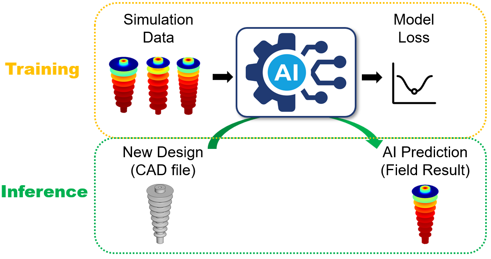

<!-- Begin Toc -->

## Table of Contents
&#8195;[Load Data](#TMP_86c4)
 
&#8195;[Preprocess Data](#TMP_9f5c)
 
&#8195;[Define Network Architecture](#TMP_4ab6)
 
&#8195;[Define the Model Loss Function](#TMP_4a5f)
 
&#8195;[Set the Training Options and Train the Network](#TMP_344f)
 
&#8195;[Fine\-Tune with Gradient Regularization](#TMP_91a0)
 
&#8195;[Test the Network](#TMP_5a47)
 
&#8195;[Make Inference on New Design](#TMP_06a8)
 
&#8195;[Derive the Electric Field from the Predicted Potential](#TMP_3fe1)
 
&#8195;[Helper Functions](#TMP_82d9)
 
<!-- End Toc -->

**Experiment Settings** 

The function [`canUseGPU`](https://www.mathworks.com/help/releases/R2026a/matlab/ref/canusegpu.html) is used here to detect and enable GPU acceleration for training and inference. Set `doTrain` to `true` to train a new model; otherwise, specify the name of a pretrained model to load. Set `doFinetune` to `true` to fine\-tune the trained model with gradient regularization. 

```matlab
useGpu = canUseGPU; % use GPU if one is available
doTrain = true; % set to true to train the model, else load in a pre-trained network
doFinetune = true; % fine-tune with autodiff gradient regularizer
if doTrain
    ts = string(datetime("now",Format="uuuuMMdd'T'HHmmss")); % specify timestamp to uniquely name results file
else
    loadFile = "TransolverFinetune_XXXXXXXXXXXXXXX"; % name of results file (if loading a pretrained model)
end
projectRoot = findProjectRoot("startup.m");
outdir = fullfile(projectRoot,"results");
```

<a id="TMP_86c4"></a>

# Load Data

Load simulation data generated using PDE Toolbox. The simulation data was generated by varying a parameterized geometry inspired by the one in the documentation example [Electrostatic Analysis of Transformer Bushing Insulator](https://www.mathworks.com/help/pde/ug/electrostatic-analysis-of-transformer-bushing-insulator.html). Data files are expected to be located in the `data/` subdirectory within the parent directory of this script. 

Each file contains a struct with FEA data for that particular observation. The struct includes the following fields:

- `Coord`: 3 x $N$ array of node coordinates in the FEA mesh. Used as model input.
- `Epsilon`: $N$ x 1 array of relative permittivity values at each node (1 for air, 5 for bushing insulator). Used as model input.
- `Potential`: $N$ x 1 array of electric potential values at each node. Used as training targets.
- `ElectricField`: 3 x $N$ array of electric field components ( $E_x$, $E_y$, $E_z$ ) at each node. Used as training targets during the optional fine\-tuning step.
- `Mesh`: [`FEMesh`](https://www.mathworks.com/help/pde/ug/pde.femesh.html) object representing the FEA mesh. Used for visualization.

Note that $N$ (number of nodes) varies between samples, as each simulation uses a different geometry and therefore mesh.  

```matlab
if doTrain
    datadir = fullfile("data");
    data = io.loadAllData(datadir);
else
    % Skip data loading when loading a pretrained model
end
```

<a id="TMP_9f5c"></a>

# Preprocess Data

Extract input features and targets from the raw simulation data. The helper function `preprocessData` subsamples every 10th node in each mesh and extracts the node coordinates and relative permittivity, resulting in 4 input features per node. This subsampling reduces computational cost while preserving the geometric and material structure of the problem. 

```matlab
if doTrain
    [inputs,targets,efieldTargets] = transolver.preprocessData(data,10); % efieldTargets only used for fine-tuning step
    clear data % free memory once raw data is no longer needed
```

After preprocessing, `inputs` is  a $S$ x 1 cell array, where the $i$ th cell contains a 4 x $N_i$ matrix of input features for sample $i$, and `targets` is a $S$ x 1 cell array, where the $i$ th cell contains a 1 x $N_i$ vector of electric potential values. Here $S$ is the number of samples, and $N_i$ is the (subsampled) number of nodes for sample $i$.

Split the dataset into 80% training and 20% validation subsets. 

```matlab
    numObs = numel(inputs);
    [idxTrain,idxVal] = utils.trainTestSplit(numObs,0.8);
    inputsTrain = inputs(idxTrain); inputsVal = inputs(idxVal);
    targetsTrain = targets(idxTrain); targetsVal = targets(idxVal);
    cfg.IdxVal = idxVal; % Save validation indices for later evaluation
```

Normalize inputs and targets. Apply feature\-wise min\-max scaling to map values to \[\-1,1\]. 

For the coordinate features $(x,y,z)$, the coordinates are first zero\-centered and then scaled using a single uniform scale factor. This preserves the aspect ratio of the geometry and avoids mesh distortion. 

Relative permittivity and target potential values are scaled independently. 

```matlab
    [inputOffset,inputScale] = utils.computeScaleStats(inputsTrain, '[-1,1]', CoordIdx=1:3, CoordPolicy='zero-center-uniform');
    [outputOffset,outputScale] = utils.computeScaleStats(targetsTrain, '[-1,1]');
    normalizedInputsTrain = utils.applyScale(inputsTrain,inputOffset,inputScale);
    normalizedInputsVal = utils.applyScale(inputsVal,inputOffset,inputScale);
    normalizedTargetsTrain = utils.applyScale(targetsTrain,outputOffset,outputScale);
    normalizedTargetsVal = utils.applyScale(targetsVal,outputOffset,outputScale);
```

Save the normalization parameters (`inputOffset`, `inputScale`, `outputOffset`, `outputScale`) for use during inference.  

```matlab
    cfg.InputOffset = inputOffset; cfg.InputScale = inputScale;
    cfg.OutputOffset = outputOffset; cfg.OutputScale = outputScale;
```

Pad variable\-size samples and create datastores. To enable batch processing, all samples are padded to the same number of nodes. Dummy nodes are added where necessary. A corresponding mask is created so that padded nodes are ignored during training and loss computation. The training datastore also applies random data augmentation (rotation around the Z\-axis and reflection across X) to exploit the axial symmetry of the bushing insulator geometry and increase the effective training set size.

```matlab
    [cds,cdsV] = transolver.padAndCreateDatastores(...
        normalizedInputsTrain,normalizedInputsVal,...
        normalizedTargetsTrain,normalizedTargetsVal);
else
    % Skip preprocessing when loading a pretrained model
end
```

<a id="TMP_4ab6"></a>

# Define Network Architecture

Construct a Transolver model (implemented in `transolver.m` and `transolverLayer.m`).

In other transformer\-based PDE surrogate architectures, each mesh node is assigned its own token, and standard self\-attention is applied across all tokens. This scales quadratically: if $N$ is the number of mesh nodes, global attention has $\mathcal{O}(N^2 )$ complexity, which becomes prohibitive for large 3D meshes.

Transolver reduces this cost by introducing physics "slices":

1. Project $N$ node representations into $S$ slices ( $S\ll N$ ),
2. Apply attention over the slice representations,
3. Map the updated slice information back to the original $N$ nodes.

This reduces the dominant attention cost from $\mathcal{O}(N^2 )$ to approximately $\mathcal{O}(NS+S^2 )$, enabling scalability to large, irregular meshes. 

The key hyperparameters of Transolver are: 

- `NumLayers`: number of transformer blocks,
- `HiddenSize`: feature dimension/width of the model,
- `NumSlices`: number of slices,
- `NumHeads`: number of attention heads.

```matlab
if doTrain
    cfg.ModelName = "Transolver"; % save relevant information in configuration struct
    numLayers = 4; cfg.NumLayers = numLayers;
    inputSize = size(normalizedInputsTrain{1},1); cfg.InputSize = inputSize;
    outputSize = 1; cfg.OutputSize = outputSize;
    hiddenSize = 128; cfg.HiddenSize = hiddenSize;
    numSlices = 8; cfg.NumSlices = numSlices;
    numHeads = 4; cfg.NumHeads = numHeads; 
    cfg.Notes = "Predict 3D electric potential from electrostatic FEA data. Geometry varies across samples; other simulation settings (e.g. boundary conditions) are held fixed.";
    
    net = transolver.transolver(NumLayers=numLayers,...
        NumHeads=numHeads,...
        HiddenSize=hiddenSize,...
        NumSlices=numSlices,...
        OutputSize=outputSize,...
        IncludeTemperature=true,...
        Dropout=0.1,...
        Rezero=false,...
        NormalizationLayer=@layerNormalizationLayer);
```

Initialize the network. 

```matlab
    sz = size(normalizedInputsTrain{1});
    net = initialize(net, ...
        networkDataLayout(sz, "CS"), networkDataLayout([1, sz(2)],"CS"));
else
    % Skip network construction when loading a pretrained model
end
```

<a id="TMP_4a5f"></a>

# Define the Model Loss Function

Define custom loss functions for training the model. Different loss formulations can be used depending on the desired tradeoff between point\-wise accuracy and global field characteristics. 

Mean squared error (MSE) loss: The function `modelLoss` computes the MSE between the predicted and true electric potential values. Padded nodes are ignored using a binary mask.

```matlab
function loss = modelLoss(Ypred,Y,mask)
    totalNonPadding = sum(mask,"all");
    loss = sum(((Ypred - Y).*mask).^2,"all") / totalNonPadding;
end
```

Weighted loss with variance penalty: In addition to minimizing point\-wise prediction error, the variance term penalizes differences between the predicted and true variance of the electric potential field.

```matlab
function loss = weightedLoss(Ypred,Y,mask)
    alpha = 0.05; % variance penalty weight
    totalNonPadding = sum(mask,"all");
    mseLoss = sum(((Ypred - Y).*mask).^2,"all") / totalNonPadding;
    Ypred_mean = sum(Ypred.*mask,"all") / totalNonPadding;
    Y_mean = sum(Y.*mask,"all") / totalNonPadding;
    Ypred_var = sum(((Ypred - Ypred_mean).*mask).^2,"all") / totalNonPadding;
    Y_var = sum(((Y - Y_mean).*mask).^2,"all") / totalNonPadding;
    variance_loss = (Ypred_var - Y_var)^2;
    loss = (1-alpha)*mseLoss + alpha*variance_loss;
end
```

<a id="TMP_344f"></a>

# Set the Training Options and Train the Network

Train the Transolver model using the Adam optimizer and selected loss function. 

Configure training options using `trainingOptions`:

- `Optimizer`: `"adam"` for adaptive learning rate optimization
- `MaxEpochs`: `3000` training epochs (number of passes through the training data)
- `MiniBatchSize`: `6` samples per mini\-batch
- `ValidationData`: `cdsV` (validation datastore).
- `Plots`: `"training-progress"` to visualize training and validation metrics
- `InputDataFormats: ["CSB","CSB"]` (channel\-spatial\-batch)
- `TargetDataFormats`: `["CSB","CSB"]` (channel\-spatial\-batch)
- `ExecutionEnvironment`: `"gpu"` or `"cpu"`, based on `useGpu`
- `OutputNetwork`: `"best-validation"` to save the model with the lowest validation loss
- `LearnRateSchedule`: `"cosine"` learning rate decay

```matlab
if doTrain
    % Select execution environment
    if useGpu
        exEnv = "gpu";
    else
        exEnv = "cpu";
    end
    opts = trainingOptions("adam",...
        MaxEpochs=3000,...
        Plots="training-progress",...
        ValidationData=cdsV,...
        InputDataFormats=["CSB","CSB"],...
        TargetDataFormats=["CSB","CSB"],...
        MiniBatchSize=6,...
        ExecutionEnvironment=exEnv,...
        OutputNetwork="best-validation",...
        LearnRateSchedule="cosine");
    myFun = @weightedLoss; cfg.LossName = "WeightedMSEVariance";
    [net,info] = trainnet(cds,net,myFun,opts);
    cfg.TrainingInfo = info;
    % Save trained model and configuration
    mName = cfg.ModelName;
    baseName = strjoin([mName, ts], "_");
    outpath = fullfile(outdir,baseName + ".mat");
    save(outpath,"net","cfg");
else
    % Skip training when loading a pretrained model
end
```

```matlabTextOutput
    Iteration    Epoch    TimeElapsed    LearnRate    TrainingLoss    ValidationLoss
    _________    _____    ___________    _________    ____________    ______________
            0        0       00:00:04        0.001                            0.8641
            1        1       00:00:04        0.001          1.0057                  
           50        5       00:00:23        0.001         0.18358           0.17868
          100       10       00:00:38   0.00099998        0.046259          0.032392
          150       15       00:00:54   0.00099995        0.039501          0.028247
          200       20       00:01:09    0.0009999        0.034234          0.025484
          250       25       00:01:25   0.00099984        0.031304          0.024029
          300       30       00:01:40   0.00099977        0.029805          0.023745
          350       35       00:01:56   0.00099968        0.029051          0.023927
          400       40       00:02:12   0.00099958        0.028234          0.023845
          450       45       00:02:28   0.00099947        0.027786          0.023544
          500       50       00:02:43   0.00099934        0.027524           0.02337
          550       55       00:02:59    0.0009992        0.027175          0.023223
          600       60       00:03:15   0.00099905        0.026688           0.02306
          650       65       00:03:30   0.00099888        0.026607          0.022838
          700       70       00:03:46   0.00099869        0.026256          0.022718
          750       75       00:04:01    0.0009985        0.025787          0.022637
          800       80       00:04:17   0.00099829        0.026074          0.022532
          850       85       00:04:33   0.00099807        0.025555          0.022523
          900       90       00:04:48   0.00099783         0.02557          0.022466
          950       95       00:05:04   0.00099758        0.025465          0.022452
         1000      100       00:05:20   0.00099731        0.025523          0.022514
         1050      105       00:05:35   0.00099704        0.025474          0.022449
         1100      110       00:05:51   0.00099674        0.025126          0.022467
         1150      115       00:06:07   0.00099644         0.02525          0.022425
         1200      120       00:06:22   0.00099612        0.025018          0.022545
         1250      125       00:06:38   0.00099579        0.025051          0.022347
         1300      130       00:06:54   0.00099544        0.024846           0.02235
         1350      135       00:07:09   0.00099508        0.024801          0.022228
         1400      140       00:07:25   0.00099471        0.024677          0.022391
         1450      145       00:07:40   0.00099432        0.024685          0.022267
         1500      150       00:07:56   0.00099392        0.024664          0.021987
         1550      155       00:08:12   0.00099351        0.024409          0.021519
         1600      160       00:08:27   0.00099308        0.023848          0.021653
         1650      165       00:08:43   0.00099264        0.023978          0.021357
         1700      170       00:08:58   0.00099219        0.023724          0.020857
         1750      175       00:09:14   0.00099172        0.023756           0.02083
         1800      180       00:09:30   0.00099124        0.023382          0.019927
         1850      185       00:09:45   0.00099074        0.023754          0.019284
         1900      190       00:10:01   0.00099023        0.023658          0.017162
         1950      195       00:10:17   0.00098971        0.021858          0.014447
         2000      200       00:10:32   0.00098918        0.023062          0.014413
         2050      205       00:10:48   0.00098863        0.016667          0.019562
         2100      210       00:11:03   0.00098806        0.017817          0.013884
         2150      215       00:11:19   0.00098749        0.013461          0.012159
         2200      220       00:11:34    0.0009869        0.012407          0.011151
         2250      225       00:11:50    0.0009863        0.011914          0.010897
         2300      230       00:12:05   0.00098568        0.012094          0.011447
         2350      235       00:12:21   0.00098505        0.012403          0.012983
         2400      240       00:12:37   0.00098441        0.011863          0.010779
         2450      245       00:12:52   0.00098376        0.011736          0.010943
         2500      250       00:13:08   0.00098309        0.012341          0.013512
         2550      255       00:13:23   0.00098241        0.011818          0.014085
         2600      260       00:13:39   0.00098171        0.011599          0.010518
         2650      265       00:13:55     0.000981        0.013797           0.01211
         2700      270       00:14:10   0.00098028        0.011736          0.010943
         2750      275       00:14:26   0.00097954        0.011773           0.01074
         2800      280       00:14:41    0.0009788        0.011806          0.011529
         2850      285       00:15:01   0.00097804        0.013498          0.017845
         2900      290       00:15:16   0.00097726        0.015635          0.011739
         2950      295       00:15:32   0.00097647        0.015469          0.012332
         3000      300       00:15:47   0.00097567        0.013075           0.01188
         3050      305       00:16:03   0.00097486        0.012547           0.01048
         3100      310       00:16:18   0.00097403        0.012402          0.010937
         3150      315       00:16:34   0.00097319        0.011256          0.010809
         3200      320       00:16:49   0.00097234        0.011095          0.010203
         3250      325       00:17:05   0.00097148        0.014276          0.015333
         3300      330       00:17:20    0.0009706        0.011081          0.011284
         3350      335       00:17:36   0.00096971        0.010818          0.010908
         3400      340       00:17:51    0.0009688        0.014645          0.014554
         3450      345       00:18:07   0.00096789        0.012358          0.016823
         3500      350       00:18:22   0.00096696        0.011328          0.011683
         3550      355       00:18:38   0.00096601        0.010835           0.01056
         3600      360       00:18:53   0.00096506           0.013          0.014451
         3650      365       00:19:09   0.00096409        0.013144          0.010792
         3700      370       00:19:24   0.00096311        0.013493          0.013569
         3750      375       00:19:40   0.00096212        0.012964          0.012741
         3800      380       00:19:55   0.00096111        0.010593          0.010798
         3850      385       00:20:10   0.00096009        0.010195          0.010825
         3900      390       00:20:26   0.00095906        0.010957          0.012233
         3950      395       00:20:41   0.00095801        0.011773          0.013495
         4000      400       00:20:57   0.00095696       0.0095422          0.011027
         4050      405       00:21:12   0.00095589        0.010316          0.011294
         4100      410       00:21:28   0.00095481       0.0096185          0.008988
         4150      415       00:21:43   0.00095371        0.012751          0.012763
         4200      420       00:21:59   0.00095261       0.0091142         0.0095776
         4250      425       00:22:14   0.00095149        0.009287         0.0086816
         4300      430       00:22:30   0.00095035        0.011615          0.009973
         4350      435       00:22:45   0.00094921       0.0098641          0.010227
         4400      440       00:23:01   0.00094805        0.012169          0.011243
         4450      445       00:23:16   0.00094689       0.0082828         0.0082376
         4500      450       00:23:32   0.00094571       0.0089179         0.0091716
         4550      455       00:23:47   0.00094451       0.0089333         0.0084023
         4600      460       00:24:03   0.00094331        0.007815         0.0087017
         4650      465       00:24:18   0.00094209        0.011177          0.010054
         4700      470       00:24:34   0.00094086       0.0090667          0.010204
         4750      475       00:24:49   0.00093962       0.0070031         0.0082151
         4800      480       00:25:05   0.00093837        0.006895         0.0092023
         4850      485       00:25:20    0.0009371       0.0087184         0.0090327
         4900      490       00:25:36   0.00093582       0.0071912         0.0065055
         4950      495       00:25:51   0.00093453       0.0093862          0.018092
         5000      500       00:26:07   0.00093323       0.0084042          0.009523
         5050      505       00:26:22   0.00093192       0.0065816         0.0072109
         5100      510       00:26:38   0.00093059       0.0085271         0.0077448
         5150      515       00:26:53   0.00092926        0.006702         0.0072406
         5200      520       00:27:09   0.00092791       0.0077569         0.0098281
         5250      525       00:27:24   0.00092655       0.0065537         0.0061519
         5300      530       00:27:40   0.00092517       0.0063353         0.0073275
         5350      535       00:27:55   0.00092379        0.015452          0.012401
         5400      540       00:28:11   0.00092239       0.0086239         0.0055275
         5450      545       00:28:27   0.00092099        0.011424         0.0055557
         5500      550       00:28:42   0.00091957       0.0062264         0.0059035
         5550      555       00:28:58   0.00091814       0.0081577         0.0081625
         5600      560       00:29:13    0.0009167       0.0087789         0.0061737
         5650      565       00:29:29   0.00091524       0.0068302         0.0069394
         5700      570       00:29:44   0.00091378       0.0081886         0.0062035
         5750      575       00:30:00    0.0009123       0.0082499         0.0062724
         5800      580       00:30:16   0.00091082       0.0066968         0.0062787
         5850      585       00:30:32   0.00090932       0.0068112         0.0064778
         5900      590       00:30:48   0.00090781       0.0095535         0.0085045
         5950      595       00:31:04   0.00090629       0.0059705         0.0059136
         6000      600       00:31:20   0.00090476       0.0063758         0.0078358
         6050      605       00:31:36   0.00090321        0.005601         0.0053154
         6100      610       00:31:52   0.00090166       0.0061005         0.0069498
         6150      615       00:32:08   0.00090009       0.0070097         0.0069178
         6200      620       00:32:24   0.00089852       0.0097288         0.0097095
         6250      625       00:32:40   0.00089693       0.0054692         0.0053901
         6300      630       00:32:55   0.00089533       0.0084084         0.0086272
         6350      635       00:33:11   0.00089372       0.0059256         0.0058983
         6400      640       00:33:27    0.0008921       0.0077387         0.0087663
         6450      645       00:33:43   0.00089047       0.0060383         0.0054145
         6500      650       00:33:59   0.00088883       0.0059485         0.0076511
         6550      655       00:34:15   0.00088718       0.0067045         0.0075349
         6600      660       00:34:31   0.00088552       0.0058125         0.0055066
         6650      665       00:34:47   0.00088385       0.0067766          0.006873
         6700      670       00:35:03   0.00088216       0.0068555         0.0085167
         6750      675       00:35:19   0.00088047       0.0058325         0.0056718
         6800      680       00:35:35   0.00087876       0.0066163         0.0057625
         6850      685       00:35:50   0.00087705       0.0054057         0.0063899
         6900      690       00:36:06   0.00087532       0.0060242         0.0077561
         6950      695       00:36:22   0.00087359       0.0078927         0.0082319
         7000      700       00:36:38   0.00087184       0.0060943         0.0053026
         7050      705       00:36:54   0.00087009       0.0064059         0.0056959
         7100      710       00:37:10   0.00086832       0.0061713         0.0074147
         7150      715       00:37:26   0.00086654       0.0062149          0.006763
         7200      720       00:37:42   0.00086476       0.0051645         0.0049459
         7250      725       00:37:58   0.00086296       0.0085941         0.0063174
         7300      730       00:38:14   0.00086116       0.0050023         0.0053915
         7350      735       00:38:30   0.00085934       0.0049581          0.006383
         7400      740       00:38:46   0.00085751       0.0052173          0.004874
         7450      745       00:39:01   0.00085568       0.0051945         0.0043461
         7500      750       00:39:17   0.00085383       0.0053168         0.0072798
         7550      755       00:39:33   0.00085198       0.0052003         0.0047035
         7600      760       00:39:49   0.00085011       0.0047887         0.0054121
         7650      765       00:40:05   0.00084824       0.0064361         0.0050864
         7700      770       00:40:21   0.00084635       0.0048274         0.0052752
         7750      775       00:40:37   0.00084446       0.0056569         0.0063247
         7800      780       00:40:53   0.00084256       0.0046624         0.0045618
         7850      785       00:41:09   0.00084065       0.0048522         0.0050385
         7900      790       00:41:25   0.00083872       0.0050696         0.0059915
         7950      795       00:41:41   0.00083679       0.0061549         0.0054478
         8000      800       00:41:57   0.00083485       0.0062461         0.0046517
         8050      805       00:42:13    0.0008329       0.0062869         0.0044078
         8100      810       00:42:29   0.00083094       0.0047935         0.0042977
         8150      815       00:42:45   0.00082898       0.0056394         0.0045981
         8200      820       00:43:01     0.000827       0.0068088         0.0053592
         8250      825       00:43:17   0.00082501       0.0047475         0.0053531
         8300      830       00:43:33   0.00082302       0.0063541         0.0052936
         8350      835       00:43:49   0.00082102       0.0044934         0.0044086
         8400      840       00:44:05     0.000819       0.0042048         0.0044732
         8450      845       00:44:21   0.00081698       0.0040283         0.0046519
         8500      850       00:44:37   0.00081495       0.0040599         0.0064072
         8550      855       00:44:53   0.00081292       0.0043192         0.0040858
         8600      860       00:45:09   0.00081087       0.0041443         0.0042541
         8650      865       00:45:24   0.00080881       0.0046126          0.006429
         8700      870       00:45:40   0.00080675       0.0052411         0.0040136
         8750      875       00:45:56   0.00080468       0.0042144         0.0055315
         8800      880       00:46:12    0.0008026       0.0040535         0.0038102
         8850      885       00:46:28   0.00080051       0.0038047         0.0049905
         8900      890       00:46:44   0.00079841       0.0052055         0.0062948
         8950      895       00:47:00    0.0007963       0.0039927         0.0044481
         9000      900       00:47:16   0.00079419       0.0039317         0.0046134
         9050      905       00:47:32   0.00079207       0.0036886         0.0036194
         9100      910       00:47:48   0.00078994       0.0045894         0.0045133
         9150      915       00:48:04    0.0007878       0.0039448         0.0037831
         9200      920       00:48:20   0.00078566       0.0036084         0.0034195
         9250      925       00:48:36    0.0007835       0.0048239          0.005734
         9300      930       00:48:52   0.00078134       0.0038397         0.0036154
         9350      935       00:49:08   0.00077917       0.0039968         0.0043042
         9400      940       00:49:24     0.000777       0.0036057         0.0040988
         9450      945       00:49:40   0.00077481       0.0055798         0.0040157
         9500      950       00:49:56   0.00077262        0.005316         0.0034046
         9550      955       00:50:12   0.00077042       0.0048613         0.0031826
         9600      960       00:50:28   0.00076822       0.0046209         0.0046535
         9650      965       00:50:44     0.000766       0.0042702         0.0070814
         9700      970       00:51:00   0.00076378       0.0028866         0.0031442
         9750      975       00:51:16   0.00076155        0.003109         0.0033589
         9800      980       00:51:32   0.00075932       0.0032501         0.0032099
         9850      985       00:51:48   0.00075707       0.0030503          0.003223
         9900      990       00:52:04   0.00075483        0.002811         0.0046857
         9950      995       00:52:20   0.00075257       0.0030388         0.0037791
        10000     1000       00:52:36    0.0007503       0.0037056         0.0031482
        10050     1005       00:52:52   0.00074803       0.0026506         0.0031978
        10100     1010       00:53:08   0.00074576       0.0024784         0.0028794
        10150     1015       00:53:24   0.00074347       0.0034958         0.0034462
        10200     1020       00:53:40   0.00074118       0.0025269         0.0030562
        10250     1025       00:53:56   0.00073888       0.0027473         0.0036803
        10300     1030       00:54:12   0.00073658       0.0028621         0.0030814
        10350     1035       00:54:28   0.00073427       0.0031095         0.0021902
        10400     1040       00:54:44   0.00073195       0.0029946         0.0035428
        10450     1045       00:55:00   0.00072963       0.0026707         0.0031266
        10500     1050       00:55:16    0.0007273       0.0029126         0.0023953
        10550     1055       00:55:32   0.00072497       0.0021614         0.0027946
        10600     1060       00:55:48   0.00072262       0.0032055         0.0034411
        10650     1065       00:56:04   0.00072028       0.0025963         0.0025546
        10700     1070       00:56:20   0.00071792       0.0029571         0.0034346
        10750     1075       00:56:36   0.00071556       0.0026377         0.0031612
        10800     1080       00:56:52    0.0007132       0.0023568         0.0028712
        10850     1085       00:57:08   0.00071082       0.0022323         0.0030361
        10900     1090       00:57:24   0.00070845        0.002433         0.0029169
        10950     1095       00:57:40   0.00070606       0.0026361         0.0030457
        11000     1100       00:57:56   0.00070367       0.0025743         0.0027106
        11050     1105       00:58:12   0.00070128       0.0054939         0.0027221
        11100     1110       00:58:28   0.00069888       0.0023053         0.0028323
        11150     1115       00:58:44   0.00069647       0.0030638         0.0039619
        11200     1120       00:59:00   0.00069406       0.0021272         0.0034332
        11250     1125       00:59:16   0.00069165       0.0032257         0.0028605
        11300     1130       00:59:32   0.00068923       0.0026998          0.002786
        11350     1135       00:59:48    0.0006868        0.002349         0.0033932
        11400     1140       01:00:04   0.00068437       0.0024726         0.0038569
        11450     1145       01:00:20   0.00068193       0.0021615         0.0031552
        11500     1150       01:00:36   0.00067949       0.0020876         0.0026508
        11550     1155       01:00:52   0.00067704       0.0024662         0.0023897
        11600     1160       01:01:08   0.00067459       0.0020017         0.0024203
        11650     1165       01:01:24   0.00067213       0.0022404         0.0025954
        11700     1170       01:01:40   0.00066967       0.0029461         0.0020102
        11750     1175       01:01:56   0.00066721       0.0021257         0.0041509
        11800     1180       01:02:12   0.00066474         0.00229         0.0026472
        11850     1185       01:02:28   0.00066226       0.0025374         0.0026332
        11900     1190       01:02:44   0.00065978       0.0021453         0.0027612
        11950     1195       01:03:00    0.0006573       0.0022691         0.0027813
        12000     1200       01:03:16   0.00065481       0.0023873         0.0026034
        12050     1205       01:03:32   0.00065232       0.0024548         0.0030672
        12100     1210       01:03:48   0.00064982       0.0028361          0.003714
        12150     1215       01:04:04   0.00064732       0.0022495         0.0026284
        12200     1220       01:04:20   0.00064482       0.0021187         0.0038155
        12250     1225       01:04:36   0.00064231       0.0021783         0.0024608
        12300     1230       01:04:52    0.0006398       0.0022455         0.0027035
        12350     1235       01:05:08   0.00063728        0.002342         0.0021228
        12400     1240       01:05:24   0.00063476       0.0021471         0.0024213
        12450     1245       01:05:40   0.00063224       0.0020683         0.0029241
        12500     1250       01:05:56   0.00062971       0.0020834         0.0020658
        12550     1255       01:06:12   0.00062718       0.0031044         0.0037576
        12600     1260       01:06:28   0.00062464       0.0026255         0.0032252
        12650     1265       01:06:44   0.00062211        0.002041         0.0021648
        12700     1270       01:07:00   0.00061956       0.0021084          0.003686
        12750     1275       01:07:16   0.00061702       0.0021969         0.0029639
        12800     1280       01:07:32   0.00061447        0.002249         0.0031241
        12850     1285       01:07:48   0.00061192         0.00244         0.0023013
        12900     1290       01:08:04   0.00060937       0.0023925         0.0022925
        12950     1295       01:08:20   0.00060681        0.002856         0.0034456
        13000     1300       01:08:36   0.00060425       0.0028025         0.0025975
        13050     1305       01:08:52   0.00060169       0.0021048         0.0018367
        13100     1310       01:09:08   0.00059912       0.0019493         0.0021189
        13150     1315       01:09:24   0.00059655       0.0020659         0.0022836
        13200     1320       01:09:40   0.00059398       0.0019947         0.0027278
        13250     1325       01:09:56   0.00059141       0.0021062         0.0024234
        13300     1330       01:10:12   0.00058883       0.0017516         0.0025194
        13350     1335       01:10:28   0.00058626       0.0021857         0.0025718
        13400     1340       01:10:44   0.00058367       0.0020874         0.0029131
        13450     1345       01:11:00   0.00058109       0.0022741          0.002449
        13500     1350       01:11:16   0.00057851       0.0020277          0.003294
        13550     1355       01:11:32   0.00057592       0.0027412         0.0026126
        13600     1360       01:11:48   0.00057333       0.0016066         0.0023317
        13650     1365       01:12:05   0.00057074       0.0019897         0.0032557
        13700     1370       01:12:20   0.00056814       0.0021644         0.0027634
        13750     1375       01:12:37   0.00056555       0.0020115         0.0020817
        13800     1380       01:12:53   0.00056295       0.0020026         0.0022431
        13850     1385       01:13:09   0.00056035       0.0019667         0.0026013
        13900     1390       01:13:25   0.00055775       0.0016694         0.0024656
        13950     1395       01:13:41   0.00055515        0.001729         0.0031378
        14000     1400       01:13:57   0.00055255       0.0021263         0.0029858
        14050     1405       01:14:13   0.00054994       0.0023363         0.0025838
        14100     1410       01:14:29   0.00054734       0.0018443         0.0021834
        14150     1415       01:14:45   0.00054473       0.0017418         0.0023037
        14200     1420       01:15:01   0.00054212       0.0027345         0.0026583
        14250     1425       01:15:17   0.00053951        0.001837         0.0026537
        14300     1430       01:15:33    0.0005369       0.0018602         0.0024828
        14350     1435       01:15:49   0.00053428       0.0020003         0.0023746
        14400     1440       01:16:05   0.00053167       0.0021004         0.0030399
        14450     1445       01:16:21   0.00052906        0.001697         0.0028326
        14500     1450       01:16:37   0.00052644        0.001782         0.0027563
        14550     1455       01:16:53   0.00052383       0.0018179         0.0021725
        14600     1460       01:17:10   0.00052121       0.0017951         0.0023296
        14650     1465       01:17:26   0.00051859       0.0016025         0.0023709
        14700     1470       01:17:42   0.00051598       0.0027345         0.0031629
        14750     1475       01:17:58   0.00051336       0.0015954         0.0024857
        14800     1480       01:18:14   0.00051074       0.0017852         0.0029012
        14850     1485       01:18:30   0.00050812       0.0017514         0.0026738
        14900     1490       01:18:46    0.0005055       0.0015201         0.0023805
        14950     1495       01:19:02   0.00050289       0.0018113         0.0024279
        15000     1500       01:19:18   0.00050027       0.0016366         0.0026208
        15050     1505       01:19:34   0.00049765       0.0022222         0.0030568
        15100     1510       01:19:50   0.00049503       0.0021572          0.002356
        15150     1515       01:20:06   0.00049241       0.0022763         0.0036881
        15200     1520       01:20:22   0.00048979       0.0021401         0.0025897
        15250     1525       01:20:38   0.00048717       0.0022776         0.0022092
        15300     1530       01:20:54   0.00048456       0.0018786         0.0021764
        15350     1535       01:21:10   0.00048194       0.0018066         0.0016468
        15400     1540       01:21:26   0.00047932       0.0018577         0.0016957
        15450     1545       01:21:43   0.00047671       0.0016235         0.0019651
        15500     1550       01:21:59   0.00047409       0.0020395         0.0023918
        15550     1555       01:22:15   0.00047148       0.0017087          0.002023
        15600     1560       01:22:31   0.00046886        0.001628         0.0022732
        15650     1565       01:22:47   0.00046625       0.0016506         0.0021371
        15700     1570       01:23:03   0.00046364       0.0017275         0.0021996
        15750     1575       01:23:19   0.00046102       0.0026451         0.0028609
        15800     1580       01:23:35   0.00045841        0.002788         0.0020499
        15850     1585       01:23:51    0.0004558       0.0040824          0.003473
        15900     1590       01:24:06    0.0004532       0.0016423         0.0025589
        15950     1595       01:24:22   0.00045059       0.0017866          0.002646
        16000     1600       01:24:38   0.00044798       0.0021176         0.0036517
        16050     1605       01:24:54   0.00044538       0.0032128         0.0039766
        16100     1610       01:25:11   0.00044278       0.0024041          0.002711
        16150     1615       01:25:27   0.00044018       0.0021574         0.0027829
        16200     1620       01:25:43   0.00043758       0.0019144         0.0021685
        16250     1625       01:25:59   0.00043498       0.0019858         0.0018922
        16300     1630       01:26:15   0.00043238       0.0019833         0.0022488
        16350     1635       01:26:31   0.00042979       0.0020166         0.0022879
        16400     1640       01:26:47    0.0004272       0.0018761         0.0021364
        16450     1645       01:27:03   0.00042461       0.0018617         0.0023143
        16500     1650       01:27:19   0.00042202       0.0018081         0.0022441
        16550     1655       01:27:35   0.00041944       0.0019587         0.0026376
        16600     1660       01:27:51   0.00041685       0.0017312         0.0024834
        16650     1665       01:28:07   0.00041427       0.0018109         0.0020409
        16700     1670       01:28:22   0.00041169        0.001615         0.0022005
        16750     1675       01:28:39   0.00040912       0.0018642         0.0019236
        16800     1680       01:28:55   0.00040654       0.0018204         0.0021713
        16850     1685       01:29:11   0.00040397       0.0018005         0.0021067
        16900     1690       01:29:27    0.0004014       0.0016739         0.0022078
        16950     1695       01:29:43   0.00039884       0.0015365         0.0017443
        17000     1700       01:29:59   0.00039627       0.0016695         0.0024143
        17050     1705       01:30:15   0.00039371       0.0019337         0.0023614
        17100     1710       01:30:31   0.00039115       0.0016085         0.0018719
        17150     1715       01:30:47    0.0003886       0.0029839         0.0020613
        17200     1720       01:31:03   0.00038605       0.0021822          0.001965
        17250     1725       01:31:19    0.0003835        0.002355         0.0029472
        17300     1730       01:31:35   0.00038095       0.0015627         0.0017846
        17350     1735       01:31:51   0.00037841       0.0013718         0.0016907
        17400     1740       01:32:07   0.00037587       0.0014573         0.0015151
        17450     1745       01:32:23   0.00037334       0.0017053         0.0021884
        17500     1750       01:32:39   0.00037081       0.0016724         0.0020601
        17550     1755       01:32:55   0.00036828       0.0014671         0.0018353
        17600     1760       01:33:11   0.00036575       0.0016462         0.0016916
        17650     1765       01:33:27   0.00036323       0.0015472         0.0016747
        17700     1770       01:33:43   0.00036072       0.0018633          0.001649
        17750     1775       01:33:59    0.0003582       0.0025974         0.0020588
        17800     1780       01:34:15   0.00035569        0.002356         0.0023926
        17850     1785       01:34:31   0.00035319       0.0018696         0.0022794
        17900     1790       01:34:47   0.00035069       0.0014419         0.0016805
        17950     1795       01:35:03   0.00034819       0.0013786         0.0015304
        18000     1800       01:35:19    0.0003457       0.0014951          0.001383
        18050     1805       01:35:35   0.00034321       0.0014986         0.0018211
        18100     1810       01:35:51   0.00034072       0.0012721         0.0017414
        18150     1815       01:36:07   0.00033824       0.0020776         0.0018284
        18200     1820       01:36:23   0.00033577       0.0013199         0.0013384
        18250     1825       01:36:39    0.0003333       0.0013481         0.0015085
        18300     1830       01:36:55   0.00033083       0.0013924         0.0015471
        18350     1835       01:37:11   0.00032837       0.0015559         0.0015356
        18400     1840       01:37:27   0.00032591       0.0015095         0.0015076
        18450     1845       01:37:44   0.00032346       0.0016296         0.0014499
        18500     1850       01:38:00   0.00032101       0.0013478          0.001694
        18550     1855       01:38:16   0.00031857       0.0012833         0.0017312
        18600     1860       01:38:32   0.00031613       0.0013092         0.0016675
        18650     1865       01:38:48    0.0003137       0.0015068         0.0017694
        18700     1870       01:39:04   0.00031127       0.0013057         0.0018385
        18750     1875       01:39:20   0.00030885        0.001497         0.0019182
        18800     1880       01:39:36   0.00030643       0.0012058         0.0014288
        18850     1885       01:39:52   0.00030402        0.001238         0.0016571
        18900     1890       01:40:08   0.00030161       0.0013303         0.0017283
        18950     1895       01:40:24   0.00029921       0.0012873         0.0020364
        19000     1900       01:40:40   0.00029681       0.0026647         0.0020157
        19050     1905       01:40:56   0.00029442       0.0018135         0.0022697
        19100     1910       01:41:12   0.00029204       0.0012852         0.0015388
        19150     1915       01:41:28   0.00028966       0.0018375         0.0014238
        19200     1920       01:41:44   0.00028729       0.0013132         0.0016411
        19250     1925       01:42:00   0.00028492       0.0017705         0.0016317
        19300     1930       01:42:16   0.00028256       0.0016894         0.0021083
        19350     1935       01:42:32    0.0002802       0.0016904         0.0015283
        19400     1940       01:42:48   0.00027786       0.0015774         0.0014632
        19450     1945       01:43:04   0.00027551       0.0012766         0.0015901
        19500     1950       01:43:20   0.00027318       0.0010416          0.001245
        19550     1955       01:43:36   0.00027084       0.0010556         0.0011244
        19600     1960       01:43:52   0.00026852       0.0010909        0.00094426
        19650     1965       01:44:08    0.0002662      0.00097145           0.00109
        19700     1970       01:44:24   0.00026389      0.00095441         0.0011452
        19750     1975       01:44:40   0.00026159       0.0010913         0.0011513
        19800     1980       01:44:56   0.00025929       0.0009123         0.0010749
        19850     1985       01:45:12   0.00025699         0.00107         0.0011298
        19900     1990       01:45:28   0.00025471       0.0010332         0.0013017
        19950     1995       01:45:44   0.00025243       0.0012376         0.0011547
        20000     2000       01:46:00   0.00025016      0.00096726        0.00098116
        20050     2005       01:46:16   0.00024789       0.0010202         0.0010052
        20100     2010       01:46:32   0.00024564      0.00094221         0.0010229
        20150     2015       01:46:49   0.00024338      0.00085431         0.0010943
        20200     2020       01:47:05   0.00024114       0.0011372         0.0010772
        20250     2025       01:47:21    0.0002389       0.0010034        0.00098106
        20300     2030       01:47:37   0.00023667      0.00095551        0.00097051
        20350     2035       01:47:53   0.00023445      0.00098049         0.0016128
        20400     2040       01:48:09   0.00023224       0.0011153         0.0011304
        20450     2045       01:48:25   0.00023003       0.0021347          0.001687
        20500     2050       01:48:41   0.00022783       0.0015434         0.0016615
        20550     2055       01:48:57   0.00022563       0.0015185         0.0016536
        20600     2060       01:49:13   0.00022345      0.00091351         0.0011983
        20650     2065       01:49:29   0.00022127       0.0010078         0.0012009
        20700     2070       01:49:45    0.0002191      0.00092273         0.0009209
        20750     2075       01:50:01   0.00021694       0.0010393        0.00094644
        20800     2080       01:50:17   0.00021478       0.0009314        0.00099959
        20850     2085       01:50:33   0.00021264       0.0011772         0.0012051
        20900     2090       01:50:49    0.0002105       0.0010429         0.0010475
        20950     2095       01:51:05   0.00020837       0.0012619         0.0011346
        21000     2100       01:51:21   0.00020624       0.0014028         0.0015166
        21050     2105       01:51:37   0.00020413        0.002182         0.0017179
        21100     2110       01:51:53   0.00020202       0.0010472         0.0010081
        21150     2115       01:52:09   0.00019992       0.0010738         0.0010961
        21200     2120       01:52:25   0.00019783       0.0010998         0.0010807
        21250     2125       01:52:41   0.00019575       0.0010799         0.0011845
        21300     2130       01:52:58   0.00019367       0.0011378         0.0010161
        21350     2135       01:53:14   0.00019161       0.0010385        0.00094433
        21400     2140       01:53:30   0.00018955       0.0010601         0.0010589
        21450     2145       01:53:46    0.0001875      0.00098625         0.0011407
        21500     2150       01:54:02   0.00018546       0.0018647         0.0018763
        21550     2155       01:54:18   0.00018343      0.00098855         0.0011061
        21600     2160       01:54:34   0.00018141      0.00091989         0.0010024
        21650     2165       01:54:50    0.0001794      0.00091874        0.00099932
        21700     2170       01:55:06   0.00017739      0.00092038        0.00091465
        21750     2175       01:55:22   0.00017539      0.00088197         0.0010527
        21800     2180       01:55:38   0.00017341       0.0010255         0.0010631
        21850     2185       01:55:54   0.00017143      0.00085444        0.00090728
        21900     2190       01:56:10   0.00016946      0.00084727         0.0010766
        21950     2195       01:56:26    0.0001675      0.00088647         0.0010296
        22000     2200       01:56:42   0.00016555      0.00084739         0.0010236
        22050     2205       01:56:58    0.0001636      0.00090044          0.001109
        22100     2210       01:57:14   0.00016167      0.00092583          0.001217
        22150     2215       01:57:30   0.00015975      0.00087582        0.00094238
        22200     2220       01:57:46   0.00015783        0.000863         0.0011632
        22250     2225       01:58:02   0.00015593       0.0010102         0.0010763
        22300     2230       01:58:18   0.00015403      0.00099515         0.0010094
        22350     2235       01:58:34   0.00015215      0.00093626         0.0010619
        22400     2240       01:58:50   0.00015027      0.00091844         0.0009811
        22450     2245       01:59:06    0.0001484       0.0011521        0.00096817
        22500     2250       01:59:22   0.00014655      0.00088231         0.0010092
        22550     2255       01:59:38    0.0001447       0.0010246         0.0010228
        22600     2260       01:59:54   0.00014286       0.0010971         0.0011736
        22650     2265       02:00:10   0.00014103       0.0042712         0.0051264
        22700     2270       02:00:26   0.00013922       0.0014129         0.0013977
        22750     2275       02:00:42   0.00013741       0.0011759         0.0012689
        22800     2280       02:00:58   0.00013561       0.0012122         0.0012862
        22850     2285       02:01:15   0.00013382      0.00099445         0.0011123
        22900     2290       02:01:31   0.00013204      0.00093522        0.00097945
        22950     2295       02:01:47   0.00013028      0.00085753         0.0009903
        23000     2300       02:02:02   0.00012852      0.00087358        0.00094513
        23050     2305       02:02:18   0.00012677      0.00099145        0.00094497
        23100     2310       02:02:35   0.00012503      0.00088152         0.0009134
        23150     2315       02:02:51   0.00012331      0.00092086        0.00099135
        23200     2320       02:03:07   0.00012159      0.00092854        0.00091853
        23250     2325       02:03:23   0.00011988      0.00092683         0.0010603
        23300     2330       02:03:39   0.00011819       0.0012571         0.0010679
        23350     2335       02:03:55    0.0001165      0.00088566         0.0010385
        23400     2340       02:04:11   0.00011483        0.001005        0.00092071
        23450     2345       02:04:27   0.00011316      0.00098361        0.00092014
        23500     2350       02:04:43   0.00011151       0.0012323         0.0013903
        23550     2355       02:04:59   0.00010986       0.0012213         0.0011035
        23600     2360       02:05:15   0.00010823       0.0013001         0.0012856
        23650     2365       02:05:31   0.00010661       0.0014167         0.0014498
        23700     2370       02:05:47     0.000105       0.0024125         0.0038592
        23750     2375       02:06:03    0.0001034       0.0017876         0.0018078
        23800     2380       02:06:19   0.00010181       0.0015193          0.001909
        23850     2385       02:06:35   0.00010023       0.0010862         0.0011527
        23900     2390       02:06:51   9.8664e-05       0.0013709        0.00094224
        23950     2395       02:07:07   9.7107e-05       0.0013856        0.00088534
        24000     2400       02:07:23   9.5562e-05       0.0011348        0.00088116
        24050     2405       02:07:39   9.4028e-05       0.0010557        0.00086249
        24100     2410       02:07:55   9.2505e-05       0.0012366        0.00090103
        24150     2415       02:08:11   9.0993e-05       0.0010839        0.00077987
        24200     2420       02:08:27   8.9492e-05        0.001122        0.00079427
        24250     2425       02:08:44   8.8003e-05       0.0010429        0.00077344
        24300     2430       02:09:00   8.6525e-05       0.0010395        0.00090613
        24350     2435       02:09:16   8.5058e-05      0.00095784        0.00077051
        24400     2440       02:09:32   8.3603e-05       0.0010223          0.000771
        24450     2445       02:09:48   8.2159e-05       0.0010814        0.00074239
        24500     2450       02:10:04   8.0726e-05      0.00097704        0.00074942
        24550     2455       02:10:20   7.9305e-05      0.00099932        0.00073714
        24600     2460       02:10:36   7.7896e-05       0.0010589        0.00076202
        24650     2465       02:10:52   7.6498e-05       0.0010034        0.00077246
        24700     2470       02:11:08   7.5112e-05      0.00097715        0.00074769
        24750     2475       02:11:24   7.3737e-05       0.0012611         0.0008424
        24800     2480       02:11:40   7.2374e-05      0.00093554        0.00072949
        24850     2485       02:11:56   7.1023e-05       0.0010296        0.00071859
        24900     2490       02:12:12   6.9684e-05      0.00092649        0.00076156
        24950     2495       02:12:28   6.8356e-05       0.0010038        0.00072601
        25000     2500       02:12:44    6.704e-05      0.00096368        0.00072476
        25050     2505       02:13:00   6.5736e-05      0.00098903        0.00074766
        25100     2510       02:13:16   6.4444e-05       0.0010097        0.00072006
        25150     2515       02:13:32   6.3164e-05      0.00094253        0.00072841
        25200     2520       02:13:48   6.1896e-05       0.0010246        0.00074081
        25250     2525       02:14:04    6.064e-05      0.00089725        0.00073981
        25300     2530       02:14:20   5.9396e-05      0.00097605        0.00077159
        25350     2535       02:14:36   5.8165e-05       0.0010684        0.00074877
        25400     2540       02:14:52   5.6945e-05       0.0010021        0.00083028
        25450     2545       02:15:08   5.5737e-05       0.0010762        0.00079952
        25500     2550       02:15:24   5.4542e-05      0.00095972        0.00087132
        25550     2555       02:15:40   5.3359e-05       0.0012367         0.0008153
        25600     2560       02:15:57   5.2188e-05       0.0010316        0.00081752
        25650     2565       02:16:13   5.1029e-05       0.0011539        0.00082998
        25700     2570       02:16:29   4.9883e-05       0.0010823         0.0010713
        25750     2575       02:16:45   4.8749e-05        0.001038         0.0008421
        25800     2580       02:17:01   4.7627e-05       0.0011896        0.00095383
        25850     2585       02:17:17   4.6518e-05       0.0010405        0.00092353
        25900     2590       02:17:33   4.5421e-05       0.0010727        0.00090705
        25950     2595       02:17:49   4.4337e-05       0.0011211        0.00099545
        26000     2600       02:18:05   4.3265e-05       0.0012394         0.0012794
        26050     2605       02:18:21   4.2206e-05       0.0015267         0.0014068
        26100     2610       02:18:37   4.1159e-05       0.0014255         0.0010372
        26150     2615       02:18:53   4.0125e-05       0.0015816         0.0011535
        26200     2620       02:19:09   3.9104e-05       0.0013712         0.0011619
        26250     2625       02:19:25   3.8095e-05       0.0014794          0.001187
        26300     2630       02:19:41   3.7099e-05       0.0013275         0.0011328
        26350     2635       02:19:57   3.6115e-05       0.0014279         0.0012803
        26400     2640       02:20:13   3.5145e-05       0.0012899         0.0010859
        26450     2645       02:20:29   3.4187e-05         0.00149         0.0012144
        26500     2650       02:20:45   3.3241e-05       0.0014024         0.0013736
        26550     2655       02:21:01   3.2309e-05       0.0014844         0.0012479
        26600     2660       02:21:18   3.1389e-05       0.0015835         0.0016185
        26650     2665       02:21:34   3.0483e-05       0.0058991         0.0060732
        26700     2670       02:21:50   2.9589e-05       0.0041194         0.0036974
        26750     2675       02:22:06   2.8708e-05       0.0019904         0.0017468
        26800     2680       02:22:22    2.784e-05       0.0013358         0.0012805
        26850     2685       02:22:38   2.6985e-05       0.0011744         0.0011167
        26900     2690       02:22:54   2.6143e-05       0.0010823        0.00099406
        26950     2695       02:23:10   2.5314e-05       0.0010501        0.00090623
        27000     2700       02:23:26   2.4498e-05       0.0010592        0.00090321
        27050     2705       02:23:42   2.3695e-05       0.0011382        0.00087822
        27100     2710       02:23:58   2.2905e-05      0.00094988        0.00085277
        27150     2715       02:24:14   2.2128e-05        0.000997        0.00086328
        27200     2720       02:24:30   2.1364e-05       0.0010763        0.00085394
        27250     2725       02:24:46   2.0614e-05      0.00096375         0.0008247
        27300     2730       02:25:02   1.9876e-05      0.00096438        0.00083616
        27350     2735       02:25:19   1.9152e-05       0.0009698        0.00085386
        27400     2740       02:25:35   1.8441e-05      0.00097542        0.00082172
        27450     2745       02:25:51   1.7743e-05      0.00093997        0.00084637
        27500     2750       02:26:07   1.7058e-05       0.0009962        0.00086072
        27550     2755       02:26:23   1.6387e-05      0.00092882        0.00084878
        27600     2760       02:26:39   1.5729e-05      0.00093525        0.00085172
        27650     2765       02:26:55   1.5084e-05       0.0011558        0.00086144
        27700     2770       02:27:11   1.4452e-05      0.00096671        0.00087266
        27750     2775       02:27:27   1.3834e-05       0.0010529        0.00085203
        27800     2780       02:27:44   1.3229e-05      0.00093961        0.00089148
        27850     2785       02:28:00   1.2638e-05       0.0010011        0.00084165
        27900     2790       02:28:16   1.2059e-05      0.00095072        0.00083931
        27950     2795       02:28:32   1.1495e-05       0.0011275        0.00085928
        28000     2800       02:28:48   1.0943e-05       0.0010559        0.00083574
        28050     2805       02:29:04   1.0405e-05      0.00095486        0.00086766
        28100     2810       02:29:20   9.8809e-06        0.001031        0.00090354
        28150     2815       02:29:36   9.3698e-06      0.00098583        0.00088427
        28200     2820       02:29:52   8.8722e-06      0.00097426        0.00087277
        28250     2825       02:30:08    8.388e-06      0.00098936        0.00086164
        28300     2830       02:30:24   7.9174e-06       0.0010206          0.000891
        28350     2835       02:30:40   7.4602e-06       0.0010582        0.00088516
        28400     2840       02:30:56   7.0166e-06       0.0010947         0.0009366
        28450     2845       02:31:12   6.5865e-06       0.0010767        0.00089407
        28500     2850       02:31:28   6.1699e-06       0.0011903        0.00090544
        28550     2855       02:31:44   5.7668e-06       0.0010079        0.00090236
        28600     2860       02:32:00   5.3774e-06       0.0010096        0.00088854
        28650     2865       02:32:16   5.0014e-06      0.00099521        0.00090043
        28700     2870       02:32:32   4.6391e-06       0.0011222        0.00088661
        28750     2875       02:32:48   4.2904e-06       0.0011128        0.00089644
        28800     2880       02:33:04   3.9552e-06       0.0011693        0.00092828
        28850     2885       02:33:20   3.6337e-06        0.001071        0.00091526
        28900     2890       02:33:36   3.3258e-06       0.0010639        0.00094324
        28950     2895       02:33:52   3.0315e-06       0.0011189        0.00092664
        29000     2900       02:34:08   2.7509e-06       0.0010719        0.00094841
        29050     2905       02:34:25   2.4838e-06       0.0011975        0.00095103
        29100     2910       02:34:41   2.2305e-06       0.0011187        0.00094303
        29150     2915       02:34:57   1.9908e-06       0.0011262        0.00093658
        29200     2920       02:35:13   1.7647e-06       0.0011177         0.0009395
        29250     2925       02:35:29   1.5523e-06       0.0011116        0.00094363
        29300     2930       02:35:45   1.3536e-06       0.0010867        0.00096602
        29350     2935       02:36:01   1.1686e-06       0.0011155        0.00094136
        29400     2940       02:36:17   9.9728e-07       0.0010685        0.00095303
        29450     2945       02:36:33   8.3964e-07       0.0011687        0.00095275
        29500     2950       02:36:49   6.9568e-07       0.0010902        0.00095546
        29550     2955       02:37:05   5.6543e-07       0.0011249         0.0009563
        29600     2960       02:37:21   4.4887e-07       0.0010921        0.00095011
        29650     2965       02:37:37   3.4602e-07       0.0010889        0.00095198
        29700     2970       02:37:53   2.5688e-07       0.0011085        0.00095074
        29750     2975       02:38:10   1.8145e-07       0.0010358        0.00095092
        29800     2980       02:38:26   1.1973e-07       0.0010591        0.00095221
        29850     2985       02:38:42   7.1724e-08       0.0011161        0.00095279
        29900     2990       02:38:57   3.7433e-08         0.00108        0.00095213
        29950     2995       02:39:13   1.6858e-08       0.0010591        0.00095227
        30000     3000       02:39:28        1e-08       0.0011262        0.00095234
Training stopped: Max epochs completed
```

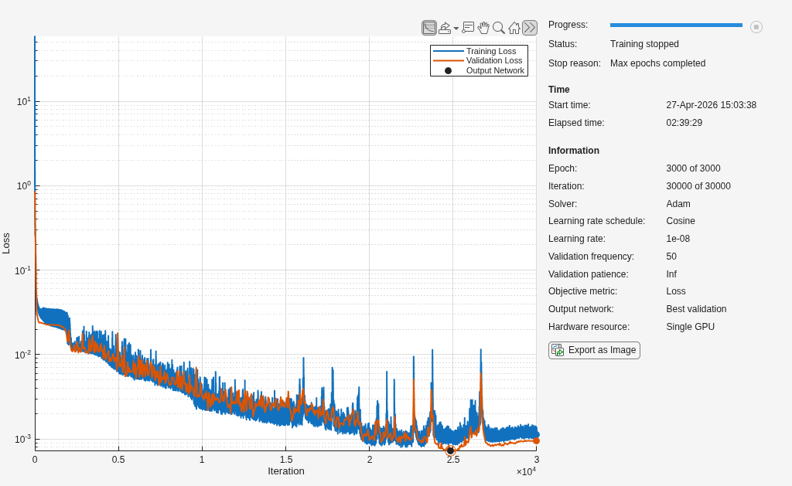

<a id="TMP_91a0"></a>

# Fine\-Tune with Gradient Regularization

Fine\-tune the trained (or loaded) model using a custom training loop with a gradient regularizer. The regularizer penalizes discrepancies between an approximate spatial gradient $-\nabla V$ (computed via [`dlgradient`](https://www.mathworks.com/help/deeplearning/ref/dlarray.dlgradient.html)) and the reference electric field. This approximation arises because `dlgradient(sum(V),X)` sums contributions from all nodes rather than computing a the true $\nabla V$ at each node. However, in practice, this encourages the model to produce spatially smooth potential predictions whose derived electric field matches the FEA results.

Use a low learning rate and small weight $\beta$ to gently regularize without degrading the pretrained potential accuracy.

```matlab
if ~doTrain
    fName = fullfile(outdir, loadFile + ".mat");
    S = load(fName,"net","cfg");
    net = S.net; cfg = S.cfg;
    fprintf("Loaded pretrained model: %s (OutputSize=%d)\n",loadFile,cfg.OutputSize);
end
if doFinetune
    beta = 0.001;                % gradient regularizer weight 
    finetuneEpochs = 500;        % fewer epochs needed for fine-tuning
    finetuneLearnRate = 1e-4;    % lower than training from scratch
    gradClipThreshold = 1;       % element-wise gradient clipping
    miniBatchSize = 6;
```

Load and preprocess data for fine\-tuning. If the model was just trained, the electric field targets are already in the workspace. Otherwise, reload the data and extract the electric field targets.

```matlab
    if ~doTrain
        datadir = fullfile("data");
        data = io.loadAllData(datadir);
        [inputs,targets,efieldTargets] = transolver.preprocessData(data,10);
        clear data


        numObs = numel(inputs);
        idxVal = cfg.IdxVal;
        idxTrain = setdiff(1:numObs,idxVal);


        inputOffset = cfg.InputOffset; inputScale = cfg.InputScale;
        outputOffset = cfg.OutputOffset; outputScale = cfg.OutputScale;
        normalizedInputsTrain = utils.applyScale(inputs(idxTrain),inputOffset,inputScale);
        normalizedInputsVal = utils.applyScale(inputs(idxVal),inputOffset,inputScale);
        normalizedTargetsTrain = utils.applyScale(targets(idxTrain),outputOffset,outputScale);
        normalizedTargetsVal = utils.applyScale(targets(idxVal),outputOffset,outputScale);
    end
```

Normalize E\-field targets to the same normalized coordinate/potential space. Pad to 4 channels with zeros in the 4th channel to match the input shape.

```matlab
    coordScale = inputScale(1:3);
    normalizedEfieldTrain = cellfun(@(E) [E .* coordScale ./ outputScale; zeros(1,size(E,2))], efieldTargets(idxTrain), UniformOutput=false);
    normalizedEfieldVal = cellfun(@(E) [E .* coordScale ./ outputScale; zeros(1,size(E,2))], efieldTargets(idxVal), UniformOutput=false);
```

Pad variable\-size samples for batch processing.

```matlab
    [paddedInputsTrain,maskTrain] = padsequences(normalizedInputsTrain,2);
    [paddedInputsVal,maskVal] = padsequences(normalizedInputsVal,2);
    paddedTargetsTrain = padsequences(normalizedTargetsTrain,2);
    paddedTargetsVal = padsequences(normalizedTargetsVal,2);
    paddedEfieldTrain = padsequences(normalizedEfieldTrain,2);
    paddedEfieldVal = padsequences(normalizedEfieldVal,2);
    maskTrain = maskTrain(1,:,:);
    maskVal = maskVal(1,:,:);


    % Cast to single before training loop
    paddedInputsTrain = single(paddedInputsTrain);
    maskTrain = single(maskTrain);
    paddedTargetsTrain = single(paddedTargetsTrain);
    paddedEfieldTrain = single(paddedEfieldTrain);
    paddedInputsVal = single(paddedInputsVal);
    maskVal = single(maskVal);
    paddedTargetsVal = single(paddedTargetsVal);
    paddedEfieldVal = single(paddedEfieldVal);
```

Fine\-tuning uses a [custom training loop](https://www.mathworks.com/help/deeplearning/custom-training-loops.html) because the gradient regularization loss requires calling `dlgradient` to differentiate the predicted potential with respect to the network inputs (*x,y,z*). This autodiff operation is not supported by `trainnet`, which only differentiates with respect to the learnable parameters. The loss function computes: $\mathcal{L}=(1-\beta ){\mathcal{L}}_V +\beta {\mathcal{L}}_E$, where ${\mathcal{L}}_V$ is the MSE on predicted potential and ${\mathcal{L}}_E$ is the MSE between the autodiff\-approximated $-\nabla V$ and the reference electric field.

The custom loss function `gradRegularizedLoss` used in the fine\-tuning step is defined at the end of the script. 

```matlab
    if useGpu
        net = dlupdate(@gpuArray,net);
    end


    numTrain = size(paddedInputsTrain,3);
    numVal = size(paddedInputsVal,3);
    numIterationsPerEpoch = ceil(numTrain / miniBatchSize);
    numIterations = finetuneEpochs * numIterationsPerEpoch;


    % Prepare validation data
    XVal = dlarray(paddedInputsVal,"CSB");
    mVal = dlarray(maskVal,"CSB");
    VVal = dlarray(paddedTargetsVal,"CSB");
    EVal = dlarray(paddedEfieldVal,"CSB");
    if useGpu
        XVal = gpuArray(XVal); mVal = gpuArray(mVal);
        VVal = gpuArray(VVal); EVal = gpuArray(EVal);
    end
    validationFrequency = 25;


    % Initialize Adam optimizer state
    avgGrad = [];
    avgSqGrad = [];


    % Training progress
    lossHistory = zeros(numIterations,1);
    valLossHistory = nan(numIterations,1);
    monitor = trainingProgressMonitor(Metrics=["TrainingLoss","ValidationLoss"],Info="Epoch");
    groupSubPlot(monitor,"Loss",["TrainingLoss","ValidationLoss"]);


    % Track best validation network
    bestValLoss = Inf;
    bestNet = [];


    iteration = 0;
    for epoch = 1:finetuneEpochs
        shuffleIdx = randperm(numTrain);


        for batch = 1:numIterationsPerEpoch
            iteration = iteration + 1;


            s = (batch-1)*miniBatchSize + 1;
            e = min(batch*miniBatchSize, numTrain);
            bIdx = shuffleIdx(s:e);


            XBatch = dlarray(paddedInputsTrain(:,:,bIdx),"CSB");
            mBatch = dlarray(maskTrain(:,:,bIdx),"CSB");
            VBatch = dlarray(paddedTargetsTrain(:,:,bIdx),"CSB");
            EBatch = dlarray(paddedEfieldTrain(:,:,bIdx),"CSB");


            if useGpu
                XBatch = gpuArray(XBatch);
                mBatch = gpuArray(mBatch);
                VBatch = gpuArray(VBatch);
                EBatch = gpuArray(EBatch);
            end


            [loss,gradients] = dlfeval(@gradRegularizedLoss,net,XBatch,mBatch,VBatch,EBatch,beta);


            % Clip gradients
            gradients = dlupdate(@(g) min(max(g,-gradClipThreshold),gradClipThreshold),gradients);


            % Cosine learning rate schedule
            lr = finetuneLearnRate * 0.5 * (1 + cos(pi * iteration / numIterations));


            [net,avgGrad,avgSqGrad] = adamupdate(net,gradients,avgGrad,avgSqGrad,iteration,lr);


            lossHistory(iteration) = extractdata(loss);
            recordMetrics(monitor,iteration,TrainingLoss=lossHistory(iteration));
        end


        % Validation loss (potential-only MSE)
        if mod(epoch,validationFrequency) == 0
            valLoss = 0;
            numValBatches = ceil(numVal / miniBatchSize);
            for vb = 1:numValBatches
                vs = (vb-1)*miniBatchSize + 1;
                ve = min(vb*miniBatchSize, numVal);
                vIdx = vs:ve;
                Vpred = predict(net,XVal(:,:,vIdx),mVal(:,:,vIdx),InputDataFormats=["CSB","CSB"]);
                batchMask = mVal(:,:,vIdx);
                batchTarget = VVal(:,:,vIdx);
                nNonPad = sum(batchMask,"all");
                valLoss = valLoss + double(extractdata(sum(((Vpred - batchTarget).*batchMask).^2,"all") / nNonPad)) * numel(vIdx);
            end
            valLoss = valLoss / numVal;
            valLossHistory(iteration) = valLoss;
            recordMetrics(monitor,iteration,ValidationLoss=valLoss);


            if valLoss < bestValLoss
                bestValLoss = valLoss;
                bestNet = net.Learnables;
            end
        end


        updateInfo(monitor,Epoch=epoch + " of " + finetuneEpochs);


        if monitor.Stop
            break;
        end
    end


    % Restore best validation network
    if ~isempty(bestNet)
        net.Learnables = bestNet;
    end


    % Save fine-tuned model
    if ~doTrain
        ts = string(datetime("now",Format="uuuuMMdd'T'HHmmss"));
    end
    cfg.Beta = beta;
    cfg.LossName = "GradRegularizedMSE";
    cfg.Notes = cfg.Notes + " Fine-tuned with autodiff gradient regularizer (beta=" + beta + ").";
    % Replace the original trainnet TrainingInfo with the fine-tuning loss history
    iters = (1:iteration)';
    epochs = ceil(iters / numIterationsPerEpoch);
    lrs = finetuneLearnRate * 0.5 .* (1 + cos(pi * iters / numIterations));
    trainHist = table(iters,epochs,lrs,lossHistory(1:iteration), ...
        VariableNames=["Iteration","Epoch","LearnRate","Loss"]);
    valIdx = find(~isnan(valLossHistory(1:iteration)));
    valHist = table(valIdx,valLossHistory(valIdx), ...
        VariableNames=["Iteration","Loss"]);
    cfg.TrainingInfo = struct("TrainingHistory",trainHist,"ValidationHistory",valHist);
    baseName = strjoin(["TransolverFinetune",ts],"_");
    outpath = fullfile(outdir,baseName + ".mat");
    if useGpu
        net = dlupdate(@gather,net);
    end
    save(outpath,"net","cfg");
    fprintf("Saved fine-tuned model: %s\n",outpath);
end
```

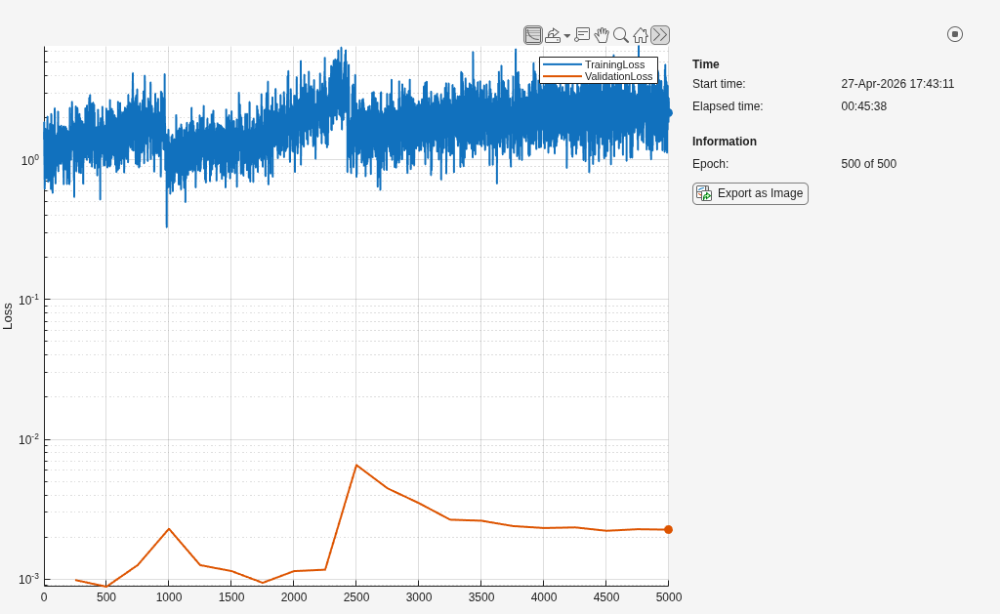

```matlabTextOutput
Saved fine-tuned model: /home/mmarkows/Documents/geometric-deep-learning-to-publish-realistic-geoms-and-finetuning-5/results/TransolverFinetune_20260427T150324.mat
```

<a id="TMP_5a47"></a>

# Test the Network

Evaluate the trained model on randomly selected samples from the validation set and compare predictions against the original FEA solutions.

Tip: To view the training progress plot on a logarithmic scale, open the Training Progress Monitor, hover over the plot and click the "Log scale y\-axis" widget, like so:

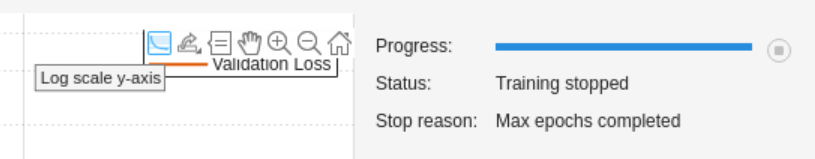

Choose a small number of random samples from the validation set to view the results and compare against FEA. 

```matlab
numTests = 3; % Must be less than numel(idxVal)
idxTest = randi([1,numel(cfg.IdxVal)],numTests,1);
for i=1:numTests
    % Load the corresponding FEA results for the selected sample
    fileIdx = cfg.IdxVal(idxTest(i));
    testFileName = sprintf("EM_results_%03d.mat",fileIdx);
    load(testFileName)
    % Prepare network inputs
    U = [D.Coord; D.Epsilon'];
    % Normalize inputs using training-set statistics 
    normU = utils.applyScale(U,cfg.InputOffset,cfg.InputScale);
    % Predict electric potential
    normUdl = dlarray(normU);
    mask = ones(1,size(normU,2));
    if useGpu
        normUdl = gpuArray(normUdl);
        mask = gpuArray(mask);
    end
    V = predict(net,normUdl,mask,InputDataFormats=["CS","CS"]);
    V = gather(extractdata(V));
    % Rescale predictions back to physical units
    V = utils.applyInverseScale(V,cfg.OutputOffset,cfg.OutputScale);


    % Visualization and error analysis
    % Plot results on the transformer bushing only (exclude surrounding air)
    elemsBushing = findElements(D.Mesh,"Region",Cell=2); 
    nodesBushing = findNodes(D.Mesh,"Region",Cell=2);
    clims = [min(D.Potential), max(D.Potential)];
    figure();
    tiledlayout(1,3); 
    % FEA solution
    nexttile;
    pdeplot3D(D.Mesh.Nodes, ...
        D.Mesh.Elements(:,elemsBushing), ...
        ColorMapData=D.Potential);
    title('FEA Solution'); 
    clim(clims);
    % AI prediction
    nexttile;
    pdeplot3D(D.Mesh.Nodes, ...
        D.Mesh.Elements(:,elemsBushing), ...
        ColorMapData=V)
    % Compute the relative L2 error on the bushing nodes
    relErrorL2 = norm(V(nodesBushing)-D.Potential(nodesBushing))/norm(D.Potential(nodesBushing));
    title(sprintf('AI Prediction: Relative L2 error = %0.1e', relErrorL2)); 
    clim(clims);
    % Plot the relative error
    nexttile;
    absError = abs(V-D.Potential);
    relError = absError./max(D.Potential(nodesBushing));
    pdeplot3D(D.Mesh.Nodes, ...
        D.Mesh.Elements(:,elemsBushing), ...
        ColorMapData=relError);
    title('Relative Error')
    clim([min(relError(nodesBushing)) max(relError(nodesBushing))])
end
```

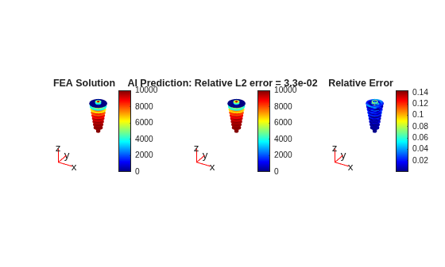

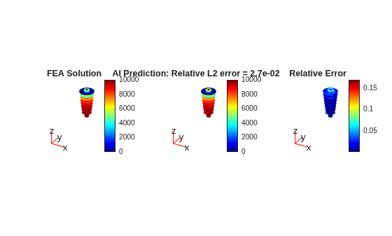

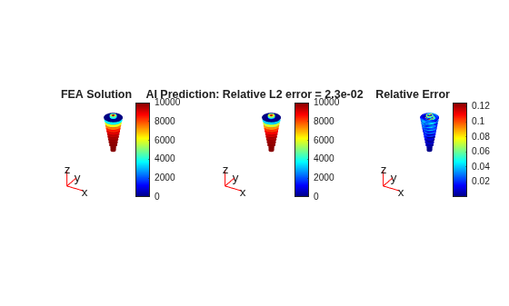

<a id="TMP_06a8"></a>

# Make Inference on New Design

This section demonstrates how to use the trained Transolver model to make predictions on a new design for which no high\-fidelity simulation data is available. Given a new geometry defined in an STL file, the model predicts the electric potential field directly from geometry and material properties. This enables rapid evaluation of new designs without running a full electrostatic simulation.

Load the STL file representing the transformer bushing insulator geometry. The STL file is assumed to be located in the `STL/` subdirectory. 

```matlab
gmBushing = fegeometry("STL/TEST_bushing.stl");
```

Visualize the bushing insulator geometry. 

```matlab
figure(); 
pdegplot(gmBushing);
title("New Bushing Insulator Geometry");
```

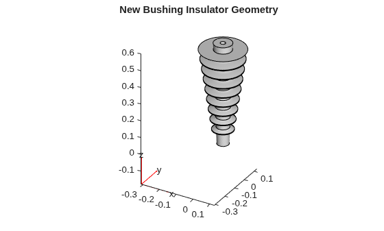

Define the simulation domain. In this example, the surrounding air is modeled as a cuboid domain. 

```matlab
gmAir = multicuboid(0.4,0.4,1);
gmAir = translate(gmAir,[0 0 -0.2]);
gmAir = fegeometry(gmAir);
% Combine air and bushing into a single geometry
gmModel = addCell(gmAir,gmBushing);
```

Visualize the combined geometry and inspect the cell labels. 

```matlab
figure();
pdegplot(gmModel,FaceAlpha=0.3,CellLabels="on");
title("Bushing Embedded in Air Domain")
```

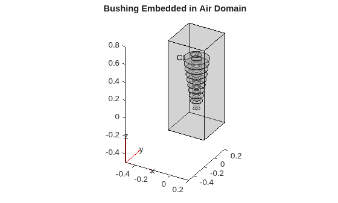

Create an electrostatic FEA model and assign relative permittivity values based on the cell labels.

```matlab
model = femodel(AnalysisType="electrostatic",Geometry=gmModel);
```

From the cell labels:

- Cell 1: air
- Cell 2: bushing insulator

```matlab
cellAir = 1; cellBushing = 2;
model.MaterialProperties(cellAir) = materialProperties(RelativePermittivity=1);
model.MaterialProperties(cellBushing) = materialProperties(RelativePermittivity=5);
model.VacuumPermittivity = 8.8541878128E-12;
```

Define points in the domain at which predictions are made. Do this by generating a mesh.  

```matlab
model = generateMesh(model,Hmax=0.025);
```

Prepare the inputs. 

Extract node coordinates and assign relative permittivity values to each node based on its region. 

```matlab
elemsBushing = findElements(model.Mesh,"Region",Cell=cellBushing); 
nodesBushing = findNodes(model.Mesh,"Region",Cell=cellBushing);
nodesAir = findNodes(model.Mesh,"Region",Cell=cellAir);
coord = model.Mesh.Nodes;
relPermVec = zeros(size(model.Mesh.Nodes,2),1);
relPermVec(nodesAir) = model.MaterialProperties(cellAir).RelativePermittivity;
relPermVec(nodesBushing) = model.MaterialProperties(cellBushing).RelativePermittivity;
```

Concatenate coordinates and material properties. 

```matlab
U = [coord; relPermVec'];
```

Normalize inputs using training\-set statistics. 

```matlab
normU = utils.applyScale(U,cfg.InputOffset,cfg.InputScale);
```

Predict electric potential.

```matlab
if useGpu
    V = predict(net,dlarray(gpuArray(normU)),gpuArray(ones(1,size(normU,2))),InputDataFormats=["CS","CS"]);
    V = extractdata(V);
    V = gather(V);
else
    V = predict(net,dlarray(normU),ones(1,size(normU,2)),InputDataFormats=["CS","CS"]);
    V = extractdata(V);
end
```

Rescale predictions back to physical units.

```matlab
V = utils.applyInverseScale(V,cfg.OutputOffset,cfg.OutputScale);
```

Visualize predicted electric potential on the bushing insulator.

```matlab
figure();
pdeplot3D(model.Mesh.Nodes, ...
          model.Mesh.Elements(:,elemsBushing), ...
          ColorMapData=V);
        clim([min(V(nodesBushing)) max(V(nodesBushing))]);
        title('AI Predicted Electric Potential')
```

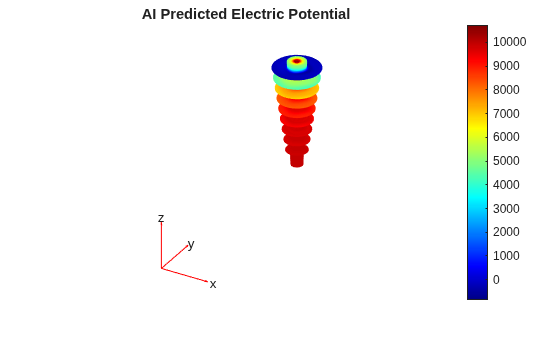

<a id="TMP_3fe1"></a>

# Derive the Electric Field from the Predicted Potential

In the FEA workflow, the electric field is derived from the potential: $\mathbf{E}=-\nabla V$. We follow the same approach here, computing the gradient of the AI\-predicted potential using FEA shape function derivatives on the tetrahedral mesh (see the helper function `electricFieldFromTetrahedra.m` in `src/+utils`). The gradient regularization applied during fine\-tuning encourages the model to produce spatially smooth potential fields, which improves the quality of the derived electric field.

```matlab
out = utils.electricFieldFromTetrahedra(model.Mesh.Nodes,model.Mesh.Elements,V);
```

Visualize the derived electric field magnitude on the bushing insulator.

```matlab
figure();
pdeplot3D(model.Mesh.Nodes, ...
            model.Mesh.Elements(:,elemsBushing), ...
            ColorMapData=out.Emag_node);
clim([min(out.Emag_node(nodesBushing)) max(out.Emag_node(nodesBushing))]);
title('Electric field magnitude derived from AI-predicted potential')
```

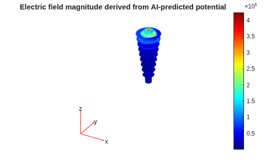

<a id="TMP_82d9"></a>

# Helper Functions
```matlab
function [loss,gradients] = gradRegularizedLoss(net,X,mask,Vtarget,Etarget,beta)
%gradRegularizedLoss Combined potential + E-field gradient loss.
%   Computes MSE on predicted potential (weighted by 1-beta) plus MSE on
%   the autodiff-approximated spatial gradient vs. reference E-field (weighted
%   by beta).


    V = forward(net,X,mask);
    totalNonPadding = sum(mask,"all");


    potLoss = sum(((V - Vtarget) .* mask).^2,"all") / totalNonPadding;


    dVdX = dlgradient(sum(V .* mask,"all"),X);
    coordW = dlarray(single([1;1;1;0]),"C");
    gradLoss = sum(((-dVdX - Etarget) .* coordW .* mask).^2,"all") / (3 * totalNonPadding);


    loss = (1-beta) * potLoss + beta * gradLoss;
    gradients = dlgradient(loss,net.Learnables);
end
```

<a id="M_07b5"></a>
**References**

<a id="M_99d2"></a>
1. Wu, Haixu, Huakun Luo, Haowen Wang, Jianmin Wang, and Mingsheng Long. "Transolver: A Fast Transformer Solver for PDEs on General Geometries." arXiv, June 1, 2024. [https://arxiv.org/abs/2402.02366](https://arxiv.org/abs/2402.02366).